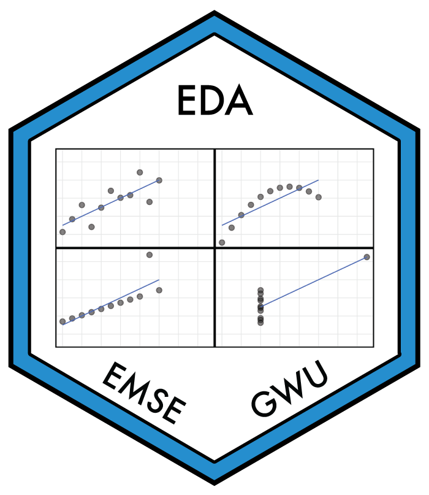

---
output:
  github_document:
    html_preview: false
---

<!-- README.md is generated from README.Rmd. Please edit that file -->

```{r child = here::here("fragments", "setup.qmd")}
```

## `r settings$title` <a href='`r settings$repo`'></a>

<!-- badges: start -->

[](https://creativecommons.org/licenses/by-sa/4.0/)
<!-- badges: end -->

### Description

```{r child = here::here("fragments", "description.qmd")}
```

For more details, please see the [course website](`r settings$site_url`).

### Acknowledgments

This course was inspired by many other courses / resources that cover similar material - see the course [about page](`r paste0(settings$site_url, 'about.html')`) for more details.
