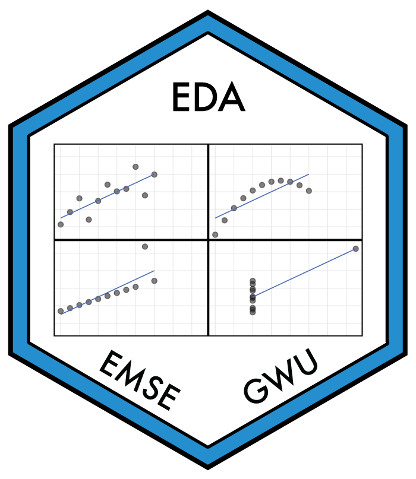

<!-- README.md is generated from README.Rmd. Please edit that file -->

## EMSE 4572: Exploratory Data Analysis (Fall 2022) 

<!-- badges: start -->

<!-- badges: end -->

### Description

This course provides students with a foundation in exploring data using
the [R programming language](https://www.r-project.org/). Students will
learn how to source, manage, transform, and explore a wide variety of
data types. Students will also master the fundamental concepts for
visualizing and communicating information contained in raw data,
including the human psychology of visual information processing. All
analyses will be conducted to support reproducibility from raw data to
results using [RMarkdown](https://bookdown.org/yihui/rmarkdown/).
Teaching will involve interactive lectures with plenty of class time
spent working on examples and coding. Students will be assessed through
in-class quizzes, reading reflections, and exploratory projects.
Throughout the semester, students will work on a research project of
their own design to demonstrate mastery of the course’s topics. At the
end of the semester, students will submit a final, reproducible report
of their project along with a 10-minute video presentation of their
findings.

For more details, please see the [course
website](https://eda.seas.gwu.edu/2022-Fall/).

### Acknowledgments

This course was inspired by many other courses / resources that cover
similar material - see the course [about
page](https://eda.seas.gwu.edu/2022-Fall/about.html) for more details.

