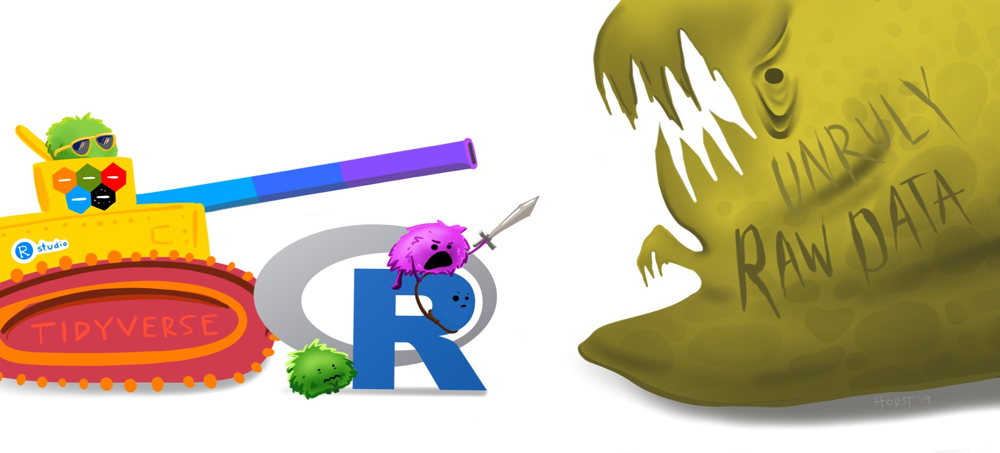

```{r setup, include=FALSE}
library(knitr)
library(tidyverse)
library(here)
library(fontawesome)
library(cowplot)
library(ggrepel)
library(readxl)
library(countdown)
library(metathis)
options(
    htmltools.dir.version = FALSE,
    knitr.table.format = "html",
    knitr.kable.NA = '',
    dplyr.width = Inf,
    width = 250
)
knitr::opts_chunk$set(
    warning = FALSE,
    message = FALSE,
    fig.path = "figs/",
    fig.width = 7.252,
    fig.height = 4,
    comment = "#>",
    fig.retina = 3
)
xaringanExtra::use_tile_view()
xaringanExtra::use_panelset()
xaringanExtra::use_clipboard()
xaringanExtra::use_share_again()
xaringanExtra::style_share_again(share_buttons = "none")
xaringanExtra::use_extra_styles(
  hover_code_line = TRUE,
  mute_unhighlighted_code = FALSE
)
# Set up website metadata
meta() %>%
  meta_general(
    description = rmarkdown::metadata$subtitle,
    generator = "xaringan and remark.js"
  ) %>%
  meta_name("github-repo" = "emse-eda-gwu/2022-Fall") %>%
  meta_social(
    title = rmarkdown::metadata$title,
    url = "https://eda.seas.gwu.edu/2022-Fall/",
    og_type = "website",
    og_author = "John Paul Helveston",
    twitter_card_type = "summary_large_image",
    twitter_creator = "@johnhelveston"
  )

# Read in data sets for class
milk_production <- read_csv(here('data', 'milk_production.csv')) 
lotr <- read_csv(here('data', 'lotr_words.csv'))
bearPath <- here('data', 'north_america_bear_killings.txt')
bears <- read.table(bearPath, header = TRUE)
usptoPath <- here('data', 'uspto_clean_energy_patents.xlsx')
patents <- read_excel(usptoPath, sheet = "Figure 6-45", skip = 3)
```

class: middle, inverse

.leftcol30[

<center>

</center>

]

.rightcol70[

# Week `r rmarkdown::metadata$week`: .fancy[`r rmarkdown::metadata$title`]

### `r fontawesome::fa(name = "building-columns", fill = "white")` `r rmarkdown::metadata$subtitle`
### `r fontawesome::fa(name = "user", fill = "white")` `r rmarkdown::metadata$author`
### `r fontawesome::fa(name = "calendar", fill = "white")` `r rmarkdown::metadata$date`

]

---

```{r child="topics/0.Rmd"}
```

---

```{r child="topics/1.Rmd"}
```

---

## Course 1: [Intro to Programming for Analytics](https://p4a.seas.gwu.edu/)

**"Computational Literacy"**

- Programming: Conditionals (if/else), loops, functions, testing, data types.
- Analytics: Data structures, import / export, basic data manipulation & visualization.

--

## Course 2: [Exploratory Data Analysis](https://eda.seas.gwu.edu/)

**"Data Literacy"**

- Strategies for conducting an exploratory data analysis.
- Design principles for visualizing and communicating _information_ extracted from data.
- Reproducibility: Reports that contain code, equations, visualizations, and narrative text.

---

class: center, inverse, middle

# **Class goal**: translate _data_ into _information_

---

class: center

# **Class goal**: translate _data_ into _information_

--

.leftcol[

**Data**

Average student engagement scores

 Class       | Type | City | County
 ------------|-------------|------|-------
 Special Ed. | Charter     | 643  | 793
 Special Ed. | Public      | 735  | 928
 General Ed. | Charter     | 590  | 724
 General Ed. | Public      | 863  | 662

]

--

.rightcol[

**Information**

```{r student-engagement-final, echo=FALSE, fig.width=6, fig.height=5}
engagement <- data.frame(
    City   = c(643, 735, 590, 863),
    County = c(793, 928, 724, 662),
    School = c('Special Ed., Charter', 'Special Ed., Public',
               'General Ed., Charter', 'General Ed., Public'),
    Highlight = c(0, 0, 0, 1)) %>%
    gather(Location, Engagement, City:County) %>%
    mutate(
      Location = fct_relevel(Location, c('City', 'County')),
      Highlight = as.factor(Highlight),
      x = ifelse(Location == 'County', 1, 0))
engagement_plot <- engagement %>%
    ggplot(aes(x = x, y = Engagement, group = School, color = Highlight)) +
    geom_point() +
    geom_line() +
    scale_color_manual(values = c('#757575', '#ed573e')) +
    labs(x = 'Sex', y = 'Engagement',
         title = paste0('Students in public, general education classes\n',
                        'in county schools have surprisingly low engagement')) +
    scale_x_continuous(limits = c(-1.2, 1.2), labels = c('City', 'County'),
                       breaks = c(0, 1)) +
    geom_text_repel(aes(label = Engagement, color = as.factor(Highlight)),
                    data          = subset(engagement, Location == 'County'),
                    size          = 5,
                    nudge_x       = 0.1,
                    segment.color = NA) +
    geom_text_repel(aes(label = Engagement, color = as.factor(Highlight)),
                    data          = subset(engagement, Location == 'City'),
                    size          = 5,
                    nudge_x       = -0.1,
                    segment.color = NA) +
    geom_text_repel(aes(label = School, color = as.factor(Highlight)),
                    data          = subset(engagement, Location == 'City'),
                    size          = 5,
                    nudge_x       = -0.25,
                    hjust         = 1,
                    segment.color = NA) +
    theme_cowplot() +
    background_grid(major = 'x') +
    theme(axis.line = element_blank(),
          axis.title.x = element_blank(),
          axis.title.y = element_blank(),
          axis.text.y = element_blank(),
          axis.ticks = element_blank(),
          legend.position = 'none')
engagement_plot
```

]

---

# Data exploration: an iterative process

--

.leftcol[

Encode data:

.code60[

```{r}
engagement_data <- data.frame(
    City   = c(643, 735, 590, 863),
    County = c(793, 928, 724, 662),
    School = c('Special Ed., Charter', 'Special Ed., Public',
               'General Ed., Charter', 'General Ed., Public'))
engagement_data
```

]]

--

.rightcol[

Re-format data for plotting:

.code60[

```{r}
engagement_data <- engagement_data %>%
    gather(Location, Engagement, City:County) %>%
    mutate(Location = fct_relevel(
      Location, c('City', 'County')))
engagement_data
```

]]

---

# Data exploration: an iterative process

.leftcol[

Initial exploratory plotting:

.code60[

```{r student-engagement-bars1, fig.width=6, fig.height=3}
engagement_data %>%
    ggplot() +
    geom_col(aes(x = Engagement, y = School,
                 fill = Location),
             position = 'dodge')
```

]]

--

.rightcol[

More exploratory plotting:<br>highlight difference

```{r student-engagement-bars2, echo=FALSE, fig.width=6, fig.height=5}
engagement %>%
    mutate(Highlight = as.factor(Highlight)) %>%
    ggplot(aes(x=x, y=Engagement, group=School, color=School)) +
    geom_point() +
    geom_line() +
    labs(x='Sex', y='Engagement')
```

]

---

# Data exploration: an iterative process

.leftcol[

Directly label figure:

```{r student-engagement-bars3, echo=FALSE, fig.width=6, fig.height=5}
engagement %>%
    mutate(Highlight = as.factor(Highlight)) %>%
    ggplot(aes(x=x, y=Engagement, group=School, color=School)) +
    geom_point() +
    geom_line() +
    labs(x='Location', y='Engagement') +
    theme_cowplot() +
    scale_x_continuous(limits = c(-0.2, 2), labels = c('City', 'County'),
                       breaks = c(0, 1)) +
    theme(legend.position = 'none') +
    geom_text_repel(aes(label = School, color = as.factor(School)),
                    data          = subset(engagement, Location == 'County'),
                    size          = 5,
                    nudge_x       = 0.2,
                    hjust         = 0,
                    segment.color = NA)
```

]

--

.rightcol[

Remove unnecessary axes, change colors, fix labels:

```{r, ref.label='student-engagement-final', echo=FALSE, fig.width=6, fig.height=5}
```

]

---

**A fully reproducible analysis**

.panelset[

.panel[.panel-name[Code]

.code40[.leftcol[

```{r, eval=FALSE}
data <- data.frame(
    City   = c(643, 735, 590, 863),
    County = c(793, 928, 724, 662),
    School = c('Special Ed., Charter', 'Special Ed., Public',
               'General Ed., Charter', 'General Ed., Public'),
    Highlight = c(0, 0, 0, 1)) %>%
    gather(Location, Engagement, City:County) %>%
    mutate(
      Location = fct_relevel(Location, c('City', 'County')),
      Highlight = as.factor(Highlight),
      x = ifelse(Location == 'County', 1, 0))
```

]

.rightcol[

```{r, eval=FALSE}
plot <- ggplot(data, aes(x = x, y = Engagement, group = School, color = Highlight)) +
    geom_point() +
    geom_line() +
    scale_color_manual(values = c('#757575', '#ed573e')) +
    labs(x = 'Sex', y = 'Engagement',
         title = paste0('Students in public, general education classes\n',
                        'in county schools have surprisingly low engagement')) +
    scale_x_continuous(limits = c(-1.2, 1.2), labels = c('City', 'County'),
                       breaks = c(0, 1)) +
    geom_text_repel(aes(label = Engagement, color = as.factor(Highlight)),
                    data          = subset(engagement, Location == 'County'),
                    size          = 5,
                    nudge_x       = 0.1,
                    segment.color = NA) +
    geom_text_repel(aes(label = Engagement, color = as.factor(Highlight)),
                    data          = subset(engagement, Location == 'City'),
                    size          = 5,
                    nudge_x       = -0.1,
                    segment.color = NA) +
    geom_text_repel(aes(label = School, color = as.factor(Highlight)),
                    data          = subset(engagement, Location == 'City'),
                    size          = 5,
                    nudge_x       = -0.25,
                    hjust         = 1,
                    segment.color = NA) +
    theme_cowplot() +
    background_grid(major = 'x') +
    theme(axis.line = element_blank(),
          axis.title.x = element_blank(),
          axis.title.y = element_blank(),
          axis.text.y = element_blank(),
          axis.ticks = element_blank(),
          legend.position = 'none')
```

]]]

.panel[.panel-name[Plot]

```{r, ref.label='student-engagement-final', echo=FALSE, fig.width=6, fig.height=5}
```

]]

---

```{r child="topics/2.Rmd"}
```

---

# Meet your instructor!

.leftcol30[.circle[


]]

.rightcol70[

### John Helveston, Ph.D.

.font80[

- 2018 - Present Assistant Professor, Engineering Management & Systems Engineering
- 2016-2018 Postdoc at [Institute for Sustainable Energy](https://www.bu.edu/ise/), Boston University
- 2016 PhD in Engineering & Public Policy at Carnegie Mellon University
- 2015 MS in Engineering & Public Policy at Carnegie Mellon University
- 2010 BS in Engineering Science & Mechanics at Virginia Tech
- Website: [www.jhelvy.com](http://www.jhelvy.com/)

]]

---

# Meet your tutors!

.leftcol30[.circle[


]]

.rightcol70[

### **Michael Rossetti** 

- Graduate Assistant (GA)
- PhD student in EMSE

]

---

# Meet your tutors!

.leftcol30[.circle[


]]

.rightcol70[

### **Eliese Ottinger**

- Learning Assistant (LA)
- EMSE Senior & P4A / EDA alumni

]

---

# Prerequisites

## [EMSE 4574: Intro to Programming for Analytics](https://p4a.seas.gwu.edu/2020-Fall/)

You should be able to:

- Use RStudio to write basic R commands.
- Know the distinctions between different R operators and data types, including numeric, string, and logical data.
- Use **tidyverse** functions to wrangle and manipulate data in R.
- Use the **ggplot2** library to create plots in R.

--

> [`r fontawesome::fa(name = "building-columns")` Check out R for Analytics Primer](http://jhelvy.github.io/r4aPrimer/)

---

# Course website

## `r fa('globe')` Everything you need will be on the course website:<br>https://eda.seas.gwu.edu/2022-Fall/

--

## `r fa('calendar')` The [schedule](https://emse-eda-gwu.github.io/2022-Fall/schedule.html) is the best starting point

---

# **Quizzes** (8% of grade)

--

## `r fa('calendar')` At the start of class every other week-ish, unscheduled. Make ups only for excused absences (i.e. don't be late). 

--

## `r fa('calendar')` 5 total, lowest dropped

--

## `r fa('clock')` ~5 - 10 minutes

--

> **Why quiz at all?** The "retrieval effect" - basically, you have to _practice_ remembering things, otherwise your brain won't remember them (see the book ["Make It Stick: The Science of Successful Learning"](https://www.hup.harvard.edu/catalog.php?isbn=9780674729018))

---

## Assignments

--

## 1) `r fa("book")` Weekly Homework / Readings: [HW1](https://eda.seas.gwu.edu/2022-Fall/hw/1-tidy-data.html)

--

## 2) `r fa("pen-ruler")` 3 Mini Projects (due 2 weeks from date assigned)

--

## 3) `r fa("pen-ruler")` [Final Project](https://eda.seas.gwu.edu/2022-Fall/project-final/0-overview.html) (Teams of 2 - 3 students)

Item            | Due Date
----------------|---------------
Proposal        | March 12
Progress Report | April 16
Final Report    | April 30
Presentation    | May 03
Interview       | Exam week

---

background-color: #FFF

# .center[Grades]

<center>

</center>

---

# .center[Grades]

Item                           | Weight | Notes
-------------------------------|--------|-------------------------------------
Weekly HW                      | 12 %   |
Quizzes                        | 8 %    | 5 quizzes, lowest dropped
Mini Project 1                 | 8 %    | Individual assignments
Mini Project 2                 | 8 %    |
Mini Project 3                 | 8 %    |
Final Project: Proposal        | 9 %    | Teams of 2-3 students
Final Project: Progress Report | 12 %   |
Final Project: Report          | 16 %   |
Final Project: Presentation    | 9 %    |
Final Interview                | 10 %   | Individual interview

---

# Course policies

--

.leftcol35[

- ## BE NICE
- ## BE HONEST
- ## DON'T CHEAT

]

--

.rightcol65[

## Copying is good, stealing is bad

> "Plagiarism is trying to pass someone else’s work off as your own. Copying is about reverse-engineering."
>
> .right[-- Austin Kleon, from [Steal Like An Artist](https://austinkleon.com/steal/)&ensp;]

]

---

# Late submissions

## - **5** late days - use them anytime, no questions asked
## - No more than **2** late days on any one assignment
## - Contact me for special cases

---

# How to succeed in this class

--

## `r fa("users")` Participate during class!

--

## `r fa("pen-ruler")` Start assignments early and **read carefully**!

--

## `r fa("book")` Actually read (before class)!

--

## `r fa("bed")` Get sleep and take breaks often!

--

## `r fa("people-carry-box")` Ask for help!

---

# [Getting Help](https://eda.seas.gwu.edu/2022-Fall/help/getting-help.html)

--

## `r fa('slack')` Use [Slack](https://emse-eda-f22.slack.com/) to ask questions.

--

## `r fa('person-chalkboard')` Meet with your tutors

--

## `r fa('user-clock')` [Schedule a meeting](https://jhelvy.appointlet.com/b/professor-helveston) w/Prof. Helveston:

- Mondays from 8:00-5:00pm
- Wednesdays from 3:20-5:00pm
- Thursdays from 12:00-5:00pm

--

## `r fa('code')` [GW Coders](http://gwcoders.github.io/)

---

# `r fa('hard-drive')` [Course Software](https://eda.seas.gwu.edu/2022-Fall/help/course-software.html)

--

## `r fa('slack')` [Slack](https://emse-eda-f22.slack.com/): See bb for link to join;<br>install on phone and **turn notifications on**!

--

## `r fa('r-project')` [R](https://cloud.r-project.org/) & [RStudio](https://rstudio.com/products/rstudio/download/) (Install both)

--

## `r fa('cloud')` [RStudio Cloud](https://rstudio.cloud/) (Register for free!)

---

class: inverse, center

<br>
# .fancy[Break]

# Install Stuff

```{r, echo=FALSE}
countdown(
    minutes = 5,
    warn_when = 30,
    update_every = 1,
    left = 0, right = 0, top = 1, bottom = 0,
    margin = "5%",
    font_size = "8em"
)
```

---

```{r child="topics/4.Rmd"}
```

---

## Workflow for reading in data

1) Use R Projects (.Rproj files) to organize your analysis - **don't double-click .R files**!


--

2) Use the `here` package to create file paths

```{r, eval=FALSE}
path <- here::here("folder", "file.csv")
```

--

3) Import data with these functions:

File type  | Function       | Library
-----------|----------------|----------
`.csv`     | `read_csv()`   | **readr**
`.txt`     | `read.table()` | **utils**
`.xlsx`    | `read_excel()` | **readxl**

---

# Importing Comma Separated Values (.csv)

Read in `.csv` files with `read_csv()`:

```{r}
library(tidyverse)
library(here)

csvPath <- here('data', 'milk_production.csv')
milk_production <- read_csv(csvPath) #<<

head(milk_production)
```

---

# Importing Text Files (.txt)

Read in `.txt` files with `read.table()`:

```{r}
txtPath <- here('data', 'nasa_global_temps.txt')
global_temps <- read.table(txtPath, skip = 5, header = FALSE) #<<

head(global_temps)
```

---

# Importing Text Files (.txt)

Read in `.txt` files with `read.table()`:

```{r}
txtPath <- here('data', 'nasa_global_temps.txt')
global_temps <- read.table(txtPath, skip = 5, header = FALSE)
names(global_temps) <- c('year', 'no_smoothing', 'loess') # Add header #<<

head(global_temps)
```

---

# Importing Excel Files (.xlsx)

Read in `.xlsx` files with `read_excel()`:

```{r}
library(readxl)

xlsxPath <- here('data', 'pv_cell_production.xlsx')
pv_cells <- read_excel(xlsxPath, sheet = 'Cell Prod by Country', skip = 2) #<<
```
.code70[
```{r}
glimpse(pv_cells)
```
]

---

# Importing Excel Files (.xlsx)

Read in `.xlsx` files with `read_excel()`:

```{r}
library(readxl)

xlsxPath <- here('data', 'pv_cell_production.xlsx')
pv_cells <- read_excel(xlsxPath, sheet = 'Cell Prod by Country', skip = 2) %>%
  mutate(Year = as.numeric(Year)) %>% # Convert "non-years" to NA #<<
  filter(!is.na(Year)) # Drop NA rows in Year #<<
```
.code60[
```{r}
glimpse(pv_cells)
```
]

---

class: inverse

```{r, echo=FALSE}
countdown(minutes = 10,
          warn_when = 30,
          update_every = 1,
          top = 0,
          right = 0,
          font_size = '2em')
```

# Your turn

Open the `practice.Rmd` file.

Write code to import the following data files from the "data" folder:

- For `lotr_words.csv`, call the data frame `lotr`
- For `north_america_bear_killings.txt`, call the data frame `bears`
- For `uspto_clean_energy_patents.xlsx`, call the data frame `patents`

---

```{r child="topics/5.Rmd"}
```

---

.leftcol[

# .center[The data frame...<br>in .darkgreen[Excel]]

<center>

</center>

]

.rightcol[

# .center[The data frame...<br>in `r fontawesome::fa(name = "r-project", fill = "blue")`]

```{r}
lotr
```

]

---

## **Columns**: _Vectors_ of values (must be same data type)

Extract a column using `$`

```{r}
lotr$race
```

---

## **Columns**: _Vectors_ of values (must be same data type)

Can also use brackets:

```{r}
lotr$race
lotr[,2]
```

---

## **Rows**: Information about individual observations

Information about the first row:

```{r}
lotr[1,]
```

--

Information about rows 1 & 2:

```{r}
lotr[1:2,]
```

---

class: inverse

## Quick Practice

Read in the `data.csv` file in the "data" folder:

```{r, eval=FALSE}
data <- read_csv(here('data', 'data.csv'))
```

Now answer these questions:

- How many rows and columns are in the data frame?
- What type of data is each column?
- Preview the different columns - what do you think this data is about? What might one row represent?
- How many unique airlines are in the data frame? 
- What is the shortest and longest air time for any one flight in the data frame?

---

class: center

### The tidyverse: `stringr` + `dplyr` + `readr` +  `ggplot2` + ...

<center>

</center>Art by [Allison Horst](https://www.allisonhorst.com/)

---

# .center[The main `dplyr` "verbs"]

<br>

"Verb"        | What it does
--------------|--------------------
`select()`    | Select columns by name
`filter()`    | Keep rows that match criteria
`arrange()`   | Sort rows based on column(s)
`mutate()`    | Create new columns 
`summarize()` | Create summary values 

---

# .center[Core `tidyverse` concept:<br>**Chain functions together with "pipes"**]

# .center[`%>%`]

--

## Think of the words "...and then..."

```{r, eval=FALSE}
data %>% 
  do_something() %>% 
  do_something_else()
```

---

class: center, middle, inverse

# Select columns with `select()`

<br>
<center>

</center>

---

# Select columns with `select()`

Select the columns `film` & `race`

```{r}
lotr %>% 
  select(film, race)
```

---

# Select columns with `select()`

Use the `-` sign to drop columns

```{r}
lotr %>% 
  select(-film)
```

---

class: center, middle, inverse

# Filter for rows with `filter()`

<br>
<center>

</center>

---

# Filter for rows with `filter()`

Keep only the rows with Elf characters

```{r}
lotr %>% 
    filter(race == "Elf")
```

---

# Filter for rows with `filter()`

Keep only the rows with Elf or Hobbit characters

```{r}
lotr %>% 
    filter((race == "Elf") | (race  == "Hobbit"))
```

---

# Filter for rows with `filter()`

Keep only the rows with Elf or Hobbit characters

```{r}
lotr %>% 
    filter(race %in% c("Elf", "Hobbit"))
```

---

# .center[Logic operators for `filter()`]

<br>

Description | Example
------------|------------
Values greater than 1 | `value > 1`
Values greater than or equal to 1 | `value >= 1`
Values less than 1 | `value < 1`
Values less than or equal to 1 | `value <= 1`
Values equal to 1 | `value == 1`
Values not equal to 1 | `value != 1`
Values in the set c(1, 4) | `value %in% c(1, 4)`

---

# Combine `filter()` and `select()`

Keep only the rows with Elf characters that spoke more than 1000 words, then select everything but the race column

```{r}
lotr %>% 
  filter((race == "Elf") & (word_count > 1000)) %>% 
  select(-race)
```

---

class: center, middle, inverse

## Create new variables with `mutate()`

<br>
<center>

</center>

---

# Create new variables with `mutate()`

Create a new variable, `word1000` which is `TRUE` if the character spoke 1,000 or more words

```{r}
lotr %>%
    mutate(word1000 = word_count >= 1000)
```

---

# .center[Handling if/else conditions]

### .center[`ifelse(<condition>, <if TRUE>, <else>)`]

--

```{r}
lotr %>%
    mutate(word1000 = ifelse(word_count >= 1000, TRUE, FALSE))
```

---

# Sort data frame with `arrange()`

Sort the `lotr` data frame by `word_count`

```{r}
lotr %>%
    arrange(word_count)
```

---

# Sort data frame with `arrange()`

Use the `desc()` function to sort in descending order

```{r}
lotr %>%
    arrange(desc(word_count))
```

---

class: inverse

```{r, echo=FALSE}
countdown(
    minutes = 10,
    warn_when = 30,
    update_every = 1,
    top = 0,
    right = 0,
    font_size = '2em'
)
```

# Your turn

Read in the `data.csv` file in the "data" folder:

```{r, eval=FALSE}
data <- read_csv(here('data', 'data.csv'))
```

Now answer these questions:

.font80[

- Create a new data frame, `flights_fall`, that contains only flights that departed in the fall semester.
- Create a new data frame, `flights_dc`, that contains only flights that flew to DC airports (Reagan or Dulles).
- Create a new data frame, `flights_dc_carrier`, that contains only flights that flew to DC airports (Reagan or Dulles) and only the columns about the month and airline.
- How many unique airlines were flying to DC airports in July?
- Create a new variable, `speed`, in miles per hour using the `time` (minutes) and `distance` (miles) variables. 
- Which flight flew the fastest?
- Remove rows that have `NA` for `air_time` and re-arrange the resulting data frame based on the longest air time and longest flight distance.

]

---

```{r child="topics/6.Rmd"}
```

---

.leftcol[


]

.rightcol[

# "Grammar of Graphics"

Concept developed by Leland Wilkinson (1999)

**ggplot2** package developed by Hadley Wickham (2005)

]

---

# Making plot layers with ggplot2

<br>

### 1. The data 
### 2. The aesthetic mapping (what goes on the axes?)
### 3. The geometries (points? bars? etc.)
### 4. The annotations / labels
### 5. The theme

---

# Layer 1: The data

```{r}
head(mpg)
```

---

# Layer 1: The data

The `ggplot()` function initializes the plot with whatever data you're using

.leftcol[

```{r ggblank, fig.show='hide'}
mpg %>% 
  ggplot()
```

]

.rightcol[.blackborder[

```{r ref.label='ggblank', echo=FALSE, fig.height=5, fig.width=7}
```

]]

---

# Layer 2: The aesthetic mapping

The `aes()` function determines which variables will be _mapped_ to the geometries<br>(e.g. the axes)

.leftcol[

```{r ggaes, fig.show='hide'}
mpg %>% 
  ggplot(aes(x = displ, y = hwy)) #<<
```

]

.rightcol[.blackborder[

```{r ref.label='ggaes', echo=FALSE, fig.height=5, fig.width=7}
```

]]

---

# Layer 3: The geometries

Use `+` to add geometries, e.g. `geom_points()` for points

.leftcol[

```{r ggpoint, fig.show='hide'}
mpg %>% 
  ggplot(aes(x = displ, y = hwy)) +
  geom_point() #<<
```

]

.rightcol[.blackborder[

```{r ref.label='ggpoint', echo=FALSE, fig.height=5, fig.width=7}
```

]]

---

# Layer 4: The annotations / labels

Use `labs()` to modify most labels

.leftcol[

```{r gglabs, fig.show='hide'}
mpg %>% 
  ggplot(aes(x = displ, y = hwy)) +
  geom_point() +
  labs( #<<
    x = "Engine displacement (liters)",  #<<
    y = "Highway fuel economy (mpg)",  #<<
    title = "Most larger engine vehicles are less fuel efficient" #<<
  ) #<<
```

]

.rightcol[.blackborder[

```{r ref.label='gglabs', echo=FALSE, fig.height=5, fig.width=7}
```

]]

---

# Layer 5: The theme

.leftcol[

```{r ggtheme_bw, fig.show='hide'}
mpg %>% 
  ggplot(aes(x = displ, y = hwy)) +
  geom_point() +
  labs(
    x = "Engine displacement (liters)",  
    y = "Highway fuel economy (mpg)", 
    title = "Most larger engine vehicles are less fuel efficient"
  ) + 
  theme_bw() #<<
```

]

.rightcol[.blackborder[

```{r ref.label='ggtheme_bw', echo=FALSE, fig.height=5, fig.width=7}
```

]]

---

### Common themes

.leftcol[

`theme_bw()`

```{r, fig.height=4, fig.width=6}
mpg %>% 
  ggplot(aes(x = displ, y = hwy)) +
  geom_point() +
  theme_bw() #<<
```

]

.rightcol[

`theme_minimal()`

```{r, fig.height=4, fig.width=6}
mpg %>% 
  ggplot(aes(x = displ, y = hwy)) +
  geom_point() +
  theme_minimal() #<<
```

]

---

### Common themes

.leftcol[

`theme_classic()`

```{r, fig.height=4, fig.width=6}
mpg %>% 
  ggplot(aes(x = displ, y = hwy)) +
  geom_point() +
  theme_classic() #<<
```

]

.rightcol[

`theme_void()`

```{r, fig.height=4, fig.width=6}
mpg %>% 
  ggplot(aes(x = displ, y = hwy)) +
  geom_point() +
  theme_void() #<<
```

]

---

class: middle, inverse 

.leftcol[

```{r, echo=FALSE}
mpg %>% 
  ggplot() +
  geom_smooth(aes(x = displ, y = hwy, color = drv))
```

```{r, echo=FALSE}
mpg %>% 
  count(class, drv) %>% 
  ggplot() +
  geom_col(aes(x = drv, y = n, fill = class), width = 0.7)
```

]

.rightcol[

```{r, echo=FALSE}
countdown(
    minutes = 15,
    warn_when = 15,
    update_every = 1,
    top = 0,
    right = 0,
    font_size = '2em'
)
```

## Your turn

Open `practice.Rmd`

Use the `mpg` data frame and ggplot to create these charts

```{r, echo=FALSE}
mpg %>% 
  ggplot(aes(x = displ, y = hwy)) +
  geom_point(aes(color = class)) + 
  geom_smooth(se = FALSE)
```
]

---

class: inverse

# Extra practice

.leftcol[

```{r, ggbar_p1, echo=FALSE, fig.height=5, fig.width=7}
lotr %>%
  ggplot() +
  geom_col(aes(x = word_count, y = film, fill = gender)) +
  labs(
    x     = "Number of words spoken by characters",
    y     = 'Film',
    fill  = "Gender of character",
    title = "Male characters had far more speakings roles in the LOTR series films"
  ) +
  theme_bw()
```

]

.rightcol[

```{r, fig.height=4, fig.width=6, echo=FALSE}
mpg %>%
    mutate(manufacturer = str_to_title(manufacturer)) %>%
    group_by(manufacturer) %>%
    summarise(mean_hwy = mean(hwy)) %>%
    ggplot() +
    geom_col(
      aes(x = mean_hwy, y = reorder(manufacturer, mean_hwy)), 
      width = 0.9) +
    labs(
      x = 'Highway fuel economy (mpg)',
      y = 'Vehicle manufacturer', 
      title = 'Mean fuel economy by automaker'
    ) + 
    theme_minimal()
```

]
