```{r setup, include=FALSE}
library(hrbrthemes)
library(knitr)
library(cowplot)
library(viridis)
library(lubridate)
library(tidyverse)
library(here)
library(fontawesome)
library(countdown)
library(metathis)
options(
    htmltools.dir.version = FALSE,
    knitr.table.format = "html",
    knitr.kable.NA = '',
    dplyr.width = Inf,
    width = 250
)
knitr::opts_chunk$set(
    cache = FALSE,
    warning = FALSE,
    message = FALSE,
    fig.path = "figs/",
    fig.width = 7.252,
    fig.height = 4,
    comment = "#>",
    fig.retina = 3
)

# Setup xaringanExtra options
xaringanExtra::use_xaringan_extra(c(
  "tile_view", "panelset", "clipboard", "share_again"))
xaringanExtra::style_share_again(share_buttons = "none")
xaringanExtra::use_extra_styles(
  hover_code_line = TRUE,
  mute_unhighlighted_code = FALSE
)
xaringanExtra::use_freezeframe(responsive = FALSE)

# Set up website metadata
meta() %>%
  meta_general(
    description = rmarkdown::metadata$subtitle,
    generator = "xaringan and remark.js"
  ) %>%
  meta_name("github-repo" = "emse-eda-gwu/2022-Fall") %>%
  meta_social(
    title = rmarkdown::metadata$title,
    url = "https://eda.seas.gwu.edu/2022-Fall/",
    og_type = "website",
    og_author = "John Paul Helveston",
    twitter_card_type = "summary_large_image",
    twitter_creator = "@johnhelveston"
  )

# Read in data
wildlife_impacts <- read_csv(here::here('data', 'wildlife_impacts.csv'))
federal_spending <- read_csv(here::here('data', 'federal_spending_long.csv'))
lotr_words       <- read_csv(here::here('data', 'lotr_words.csv'))
milk_production  <- read_csv(here::here('data', 'milk_production.csv'))
msleep           <- read_csv(here::here('data', 'msleep.csv'))
us_gdp <- read_csv(here::here('data', 'total_gdp_us_inflation_adjusted.csv'))
transit_cost <- read_csv('http://eda.seas.gwu.edu/2022-Fall/data/transit_cost.csv')

# Make data summaries
lotr_summary <- lotr_words %>%
    gather(key = 'gender', value = 'wordCount', Female:Male) %>%
    group_by(Race, gender) %>%
    summarise(wordCount = sum(wordCount)) %>%
    ungroup() %>%
    mutate(Race = fct_reorder(Race, desc(wordCount)))

us_gdp <- us_gdp %>%
    gather(key = year, value = gdp, `1960`:`2017`) %>%
    filter(country == 'United States') %>%
    mutate(gdp = gdp / 10^12,
           year = as.numeric(year))

federal_spending_2017 <- federal_spending %>%
    filter(year == 2017) %>%
    mutate(rd_budget = rd_budget / 10^3) %>%
    mutate(department = fct_reorder(
        department, rd_budget))

federal_spending_summary <- federal_spending %>%
    mutate(department = fct_other(
        department, keep = 'DOD')) %>%
    group_by(department, year) %>%
    summarise(rd_budget = sum(rd_budget) / 10^3) %>%
    ungroup() %>%
    mutate(department = fct_relevel(
        department, c('Other', 'DOD')))

arrivals <- c('approach', 'arrival', 'descent', 'landing roll')
departures <- c('climb', 'departure', 'take-off run')
wildlife_impacts_2016 <- wildlife_impacts %>%
  filter(incident_year == 2016) %>%
  mutate(
    phase_of_flt = str_to_lower(phase_of_flt),
    phase_of_flt = case_when(
      phase_of_flt %in% arrivals ~ 'arrival',
      phase_of_flt %in% departures ~ 'departure',
      TRUE ~ 'other'),
    phase_of_flt = str_to_title(phase_of_flt))

wildlife_costs <- wildlife_impacts %>%
    rename(cost = cost_repairs_infl_adj) %>%
    filter(! is.na(cost)) %>%
    mutate(cost = cost / 10^6,
           incident_date = as.Date(incident_date))

milk_region <- milk_production %>%
    filter(region %in% c(
        'Pacific', 'Northeast', 'Lake States', 'Mountain')) %>%
    group_by(year, region) %>%
    summarise(milk_produced = sum(milk_produced)) %>%
    ungroup() %>%
    mutate(label = ifelse(year == max(year), region, NA))

milk_top10states <- milk_production %>%
  filter(year == 2017) %>%
  arrange(desc(milk_produced)) %>%
  slice(1:10) %>%
  mutate(
    milk_produced = milk_produced / 10^9,
    state = fct_reorder(state, milk_produced))

milk_summary_dumbbell <- milk_production %>%
  filter(
    year %in% c(1970, 2017),
    state %in% milk_top10states$state) %>%
  mutate(
    # Reorder state variables to follow top 10 states
    state = fct_relevel(state, levels(milk_top10states$state)),
    # Convert year to discrete variable
    year = as.factor(year),
    # Modify the units
    milk_produced = milk_produced / 10^9)
```

class: middle, inverse

.leftcol30[

<center>

</center>

]

.rightcol70[

# Week `r rmarkdown::metadata$week`: .fancy[`r rmarkdown::metadata$title`]

### `r fontawesome::fa(name = "building-columns", fill = "white")` `r rmarkdown::metadata$subtitle`
### `r fontawesome::fa(name = "user", fill = "white")` `r rmarkdown::metadata$author`
### `r fontawesome::fa(name = "calendar", fill = "white")` `r rmarkdown::metadata$date`

]

---

class: inverse

# .center[.fancy[.blue[Tip of the week]]]

### .center[Ever wondered what colors look like _before_ you plot them?]

--

Use `scales::show_col()` to preview them

.leftcol60[.code60[

Example:

```{r colors, fig.show='hide'}
colors <- c('lightblue', 'sienna', 'forestgreen', '#eae9ea')
scales::show_col(colors)
```

]]

--

.rightcol40[

```{r, ref.label='colors', echo=FALSE, fig.height=4, fig.width=5, fig.align='center'}
```

]

---

## Today's data

```{r, eval=FALSE}
wildlife_impacts <- read_csv(here::here('data', 'wildlife_impacts.csv'))
federal_spending <- read_csv(here::here('data', 'federal_spending_long.csv'))
milk_production  <- read_csv(here::here('data', 'milk_production.csv'))
lotr_words       <- read_csv(here::here('data', 'lotr_words.csv'))
msleep           <- read_csv(here::here('data', 'msleep.csv'))
```

## New (?) package:

```{r, eval=FALSE}
install.packages('hrbrthemes')
```

---

```{r child="topics/0.Rmd"}
```

---

```{r child="topics/1.Rmd"}
```

<!--
Much of the content on adjusting the y axis came from Andrew Heiss's
course slides: https://datavizf17.classes.andrewheiss.com/class/06-class/
-->

---

## When is it okay to to truncate an axis?

.leftcol[

- **When small movements matter**

]

--

.rightcol[

```{r, echo=FALSE}
us_gdp_plot <- ggplot(us_gdp %>% filter(year >= 2007, year <= 2010)) +
    geom_line(aes(x = year, y = gdp),
              size = 1) +
    scale_y_continuous(
        limits = c(0, 16),
        labels = scales::dollar,
        expand = expand_scale(mult = c(0, 0.05))) +
    theme_minimal_hgrid(font_family = 'Roboto Condensed') +
    labs(x = NULL, y = 'GDP ($ Trillion)',
         title = 'U.S. GDP During 2008 Financial Crisis')
```

```{r us_gdp, echo=FALSE, fig.height=3.3, fig.width=5, fig.align='center'}
us_gdp_plot
```

```{r us_gdp_trimmed, echo=FALSE,  fig.height=3.3, fig.width=5, fig.align='center'}
us_gdp_plot +
    scale_y_continuous(
        limits = c(14.5, 15.5),
        labels = scales::dollar,
        expand = expand_scale(mult = c(0, 0.05)))
```

]

---

## When is it okay to to truncate an axis?

.leftcol[

- When small movements matter
- **When zero values are impossible**

]

--

.rightcol[

```{r, echo=FALSE}
mpg_plot <- ggplot(mtcars) +
    geom_point(aes(x = mpg, y = hp)) +
    theme_minimal_grid(font_family = 'Source Sans Pro', #<<
                       font_size = 15) +
    theme(plot.title = element_text(family = "Roboto Condensed", #<<
                                    size = 20)) +
    labs(x = "Fuel efficiency (mpg)",
         y = "Power (hp)",
         title = "Vehicle fuel efficiency vs. power",
         caption = "Source: 1974 Motor Trend U.S. magazine.")
```

```{r us_mpg0, echo=FALSE, fig.height=3.3, fig.width=5, fig.align='center'}
mpg_plot +
    scale_x_continuous(limits = c(0, 35)) +
    scale_y_continuous(limits = c(0, 325))
```

```{r us_mpg, echo=FALSE, fig.height=3.3, fig.width=5, fig.align='center'}
mpg_plot
```

]

---

## When is it okay to to truncate an axis?

.leftcol[

- When small movements matter
- When zero values are impossible
- **When it's normal / a convention**

]

--

.rightcol[

<center>
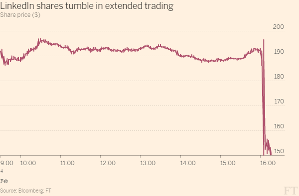
</center>

]

---

## When is it okay to to truncate an axis?

.leftcol[

- When small movements matter
- When zero values are impossible
- When it's normal / a convention
- **.red[Never on a bar chart]**

]

.rightcol[

<center>
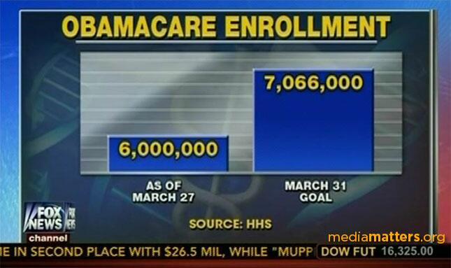
</center>

]

---

class: inverse, middle, center

# You are most sensitive to changes<br>in angles close to 45 degrees

---

class: center

## You are most sensitive to changes<br>in angles close to 45 degrees

.cols3[
```{r, fig.height=5, fig.width=6, fig.align='center', echo=FALSE}
df <- data.frame(
    ct = c(980, 1000, 1020),
    dt = as.Date(c("2016-06-01","2016-06-02", "2016-06-03")))

aspect45 <- ggplot(df, aes(dt, ct)) +
    geom_line(group = 1) +
    geom_point() +
    scale_x_date(date_labels = "%b-%d") +
    theme_minimal_grid(font_size = 20) +
    labs(y = NULL)

aspect45
```

]

.cols3[
```{r, fig.height=5, fig.width=6, fig.align='center', echo=FALSE}
aspect45 +
    expand_limits(y = c(800, 1200))
```

]

.cols3[
```{r, fig.height=5, fig.width=6, fig.align='center', echo=FALSE}
aspect45 +
    expand_limits(x = as.Date(c("2016-05-01", "2016-07-01")))
```

]

---

## You are most sensitive to changes<br>in angles close to 45 degrees

.leftcol30[

Bad

```{r, echo=FALSE, fig.height=4, fig.width=4}
delta <- wildlife_impacts %>%
    filter(
        incident_year == 2016,
        operator == 'DELTA AIR LINES') %>%
    count(operator, incident_date) %>%
    mutate(incident_date = as.Date(incident_date)) %>%
    ggplot() +
    geom_line(aes(x = incident_date, y = n)) +
    scale_x_date(
        date_breaks = '1 month',
        date_labels = '%b') +
    scale_y_continuous(
        limits = c(0, 12),
        breaks = seq(0, 12, 4)) +
    theme_minimal_grid(font_size = 16) +
    panel_border() +
    theme(legend.position = 'none') +
    labs(x = 'Incident date',
         y = 'Number of incidents',
         title = 'Delta Airlines wildlife impacts, 2016')

delta
```

]

.rightcol70[

Better
```{r, echo=FALSE, fig.height=2.5, fig.width=10.5}
delta
```

Set image dimensions in R chunk header:

` ```{r, fig.width = 5, fig.height = 3.1}`

]

---

class: inverse
background-color: #000000

### .center[Consider setting dimensions to "Golden Ratio" (1 : 1.618)]

<br>

.leftcol[

<center>

</center>

]

--

.rightcol[.center[

Approx. to golden ratio:

width  |  height
-------|---------
5      | 3.1 or 3
6      | 3.7 or 4
7      | 4.3

<br>

[Also check out Donald Duck in Mathemagic Land](https://youtu.be/U_ZHsk0-eF0?t=512)
]]

---

## Adjust axes with `scale_*` functions

.leftcol35[

Continous variables

```{r, eval=FALSE}
scale_x_continuous()
scale_y_continuous()
```

Discrete variables

```{r, eval=FALSE}
scale_x_discrete()
scale_y_discrete()
```

Others

```{r, eval=FALSE}
scale_x_log10()
scale_y_log10()
scale_x_date()
```

]

--

.rightcol65[

Common arguments for **continuous** variables

```{r, eval=FALSE}
scale_y_continuous(
  # Set the lower & upper boundaries
  limits = c(lower, upper),

  # Explicitly set the break points
  breaks = c(break1, break2, etc.)

  # Adjust the axis so bars start at 0
  expand = expand_scale(mult = c(0, 0.05))
)
```

]

---

## Adjusting **continuous** scales

.leftcol55[.code70[

```{r milk_top10, fig.show='hide'}
milk_bars <- milk_production %>%
  filter(year == 2017) %>%
  arrange(desc(milk_produced)) %>%
  slice(1:10) %>%
  mutate(
      milk_produced = milk_produced / 10^9,
      state = fct_reorder(state, milk_produced)) %>%
  ggplot() +
  geom_col(aes(x = milk_produced, y = state)) +
  theme_minimal_vgrid(font_size = 18) +
  labs(x = 'Milk produced (billions of lbs)',
       y = 'State')

milk_bars
```

]]

.rightcol45[

```{r, ref.label='milk_top10', echo=FALSE, fig.height=5, fig.width=6, fig.align='center'}
```

]

---

## Adjusting **continuous** scales

.leftcol55[.code70[

```{r milk_top10_y, fig.show='hide'}
milk_bars +
  scale_x_continuous( #<<
    breaks = c(0, 15, 30, 45), #<<
    limits = c(0 , 45), #<<
    expand = expand_scale(mult = c(0, 0.05))) #<<
```

]]

.rightcol45[

```{r, ref.label='milk_top10_y', echo=FALSE, fig.height=5, fig.width=6, fig.align='center'}
```

]

---

## Adjusting **discrete** scales

.leftcol55[.code70[

```{r milk_top10_discrete, fig.show='hide'}
milk_bars +
  scale_y_discrete( #<<
    breaks = c('California', 'Wisconsin', 'Idaho')) #<<
```

]]

.rightcol45[

```{r, ref.label='milk_top10_discrete', echo=FALSE, fig.height=5, fig.width=6, fig.align='center'}
```

]

---

.leftcol[.code70[

## Adjusting **log** scales

Regular scaling
```{r msleep, fig.show='hide'}
plot <- ggplot(msleep) +
  geom_point(aes(x = brainwt, y = bodywt)) +
  theme_half_open(font_size = 20) +
  labs(x = 'Brain weight (kg)',
       y = 'Body weight (kg)')

plot
```

]]

.rightcol[

```{r, ref.label='msleep', echo=FALSE, fig.height=4, fig.width=5, fig.align='center'}
```

]

---

.leftcol[.code70[

## Adjusting **log** scales

Log scaling
```{r msleep_log, fig.show='hide'}
plot +
  scale_x_log10() + #<<
  scale_y_log10() + #<<
  labs(x = 'Log brain weight (kg)',
       y = 'Log body weight (kg)')
```

]

Log-log relationship:

$$y = x^n$$

$$\log(y) = n\log(x)$$

]

.rightcol[

```{r, ref.label='msleep', echo=FALSE, fig.height=4, fig.width=5, fig.align='center'}
```

```{r, ref.label='msleep_log', echo=FALSE, fig.height=4, fig.width=5, fig.align='center'}
```

]

---

.leftcol[.code70[

## Example from Mini Project 2

Regular scaling
```{r transit_cost, fig.show='hide'}
plot <- transit_cost %>%
  filter(!is.na(length)) %>%
  filter(length < 2500) %>%
  mutate(cost = as.numeric(real_cost)) %>%
  ggplot(aes(x = length, y = cost)) + #<<
  geom_point() +
  geom_smooth(method = 'lm', se = FALSE) +
  theme_half_open(font_size = 20) +
  labs(x = "Length of Proposed Line",
       y = "Real Cost in Millions USD")

plot
```

]]

.rightcol[

```{r, ref.label='transit_cost', echo=FALSE, fig.height=4, fig.width=5, fig.align='center'}
```

]

---

.leftcol[

## Example from Mini Project 2

Log scaling

.code70[
```{r transit_cost_log, fig.show='hide'}
plot +
  scale_x_log10() + #<<
  scale_y_log10() + #<<
  labs(x = 'Log length of proposed line',
       y = 'Log cost')
```

]

Log-log relationship:

$$y = x^n$$

$$\log(y) = n\log(x)$$

]

.rightcol[

```{r, ref.label='transit_cost', echo=FALSE, fig.height=4, fig.width=5, fig.align='center'}
```

```{r, ref.label='transit_cost_log', echo=FALSE, fig.height=4, fig.width=5, fig.align='center'}
```

]

---

class: inverse, center, middle

# Date scales can be confusing

---

class: center

# What's wrong with this chart?

<center>
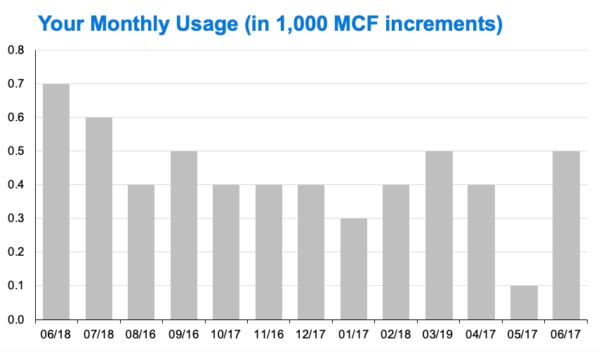
</center>

---

class: center

# What's wrong with this chart?

<center>
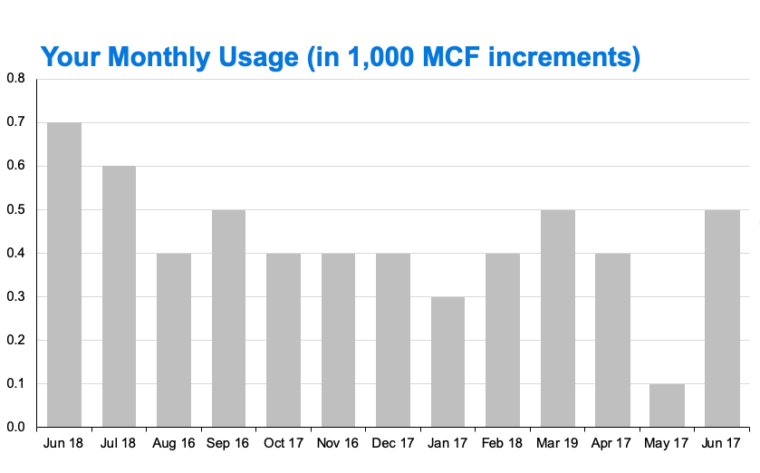
</center>

---

class: center

# What's wrong with this chart?

<center>
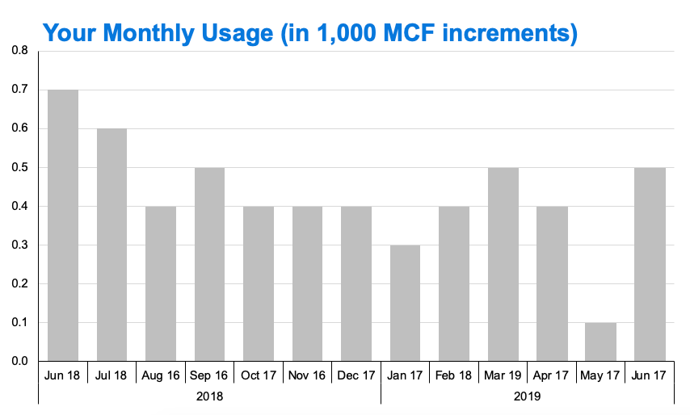
</center>

---

class: center

# What's wrong with this chart?

<center>
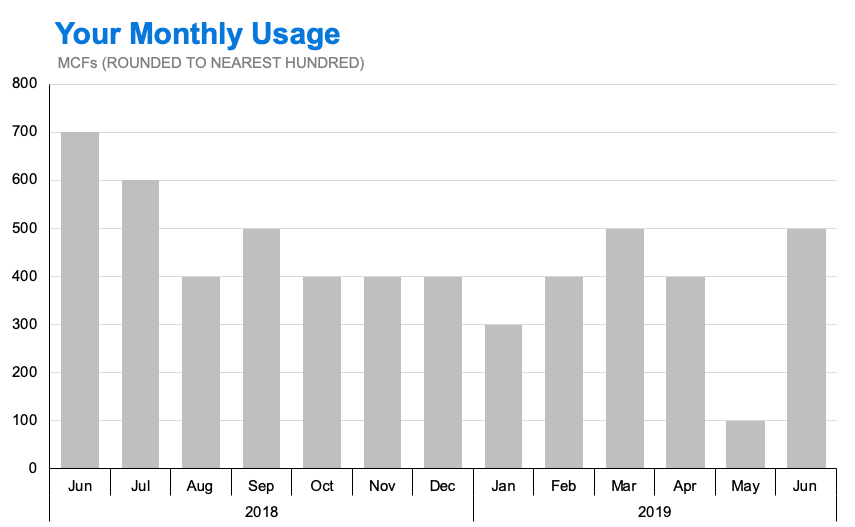
</center>

---

.leftcol[.code70[

## Adjusting **date** scales

Summarise the data
```{r wildlife, fig.show='hide'}
library(lubridate) #<<

plot <- wildlife_impacts %>%
  filter(incident_year == 2016) %>%
  count(operator, incident_date) %>%
  mutate(incident_date = ymd(incident_date)) %>% #<<
  ggplot() +
  geom_col(
    aes(x = incident_date, y = n,
        color = operator)) +
  facet_wrap(~operator, ncol = 1) +
  theme_minimal_grid(font_size = 16) +
  panel_border() +
  theme(legend.position = 'none') +
  labs(x = 'Incident date (2016)',
       y = 'Number of incidents')

plot
```

]]

.rightcol[

<br>

```{r, ref.label='wildlife', echo=FALSE, fig.height=8, fig.width=7, fig.align='center'}
```

]

---

.leftcol[.code70[

## Adjusting **date** scales

```{r wildlife_date, fig.show='hide'}
plot +
  scale_x_date( #<<
    date_breaks = '1 month', #<<
    date_labels = '%b') #<<
```

]]

.rightcol[

<br>

```{r, ref.label='wildlife_date', echo=FALSE, fig.height=8, fig.width=7, fig.align='center'}
```

]

---

## Adjusting **date** scales

```{r, eval=FALSE}
scale_x_date(
  date_breaks = '1 month',
  date_labels = '%b')
```

.leftcol[

```{r, eval=FALSE}
date_breaks = '1 month'
```

- '1 day'
- '10 days'
- '1 month'
- '3 months'
- '1 year'
- '3 years'

]

.rightcol[

```{r, eval=FALSE}
date_labels = '%b'
```

Example date: March 04, 2020

- `%Y` = 2020
- `%y` = 20
- `%B` = March
- `%b` = Mar
- `%D` = 03/04/2020
- `%d` = 03

]

---

class: inverse, center, middle

## Use **scales** library to modify scale **text**

---

## `scales` converts numbers to formatted characters

```{r}
scales::comma(200000)
scales::dollar(200000)
scales::percent(0.5)
```

---

## Use **scales** library to modify scale text

.leftcol[.code70[

```{r fed_spending_2017, fig.show='hide'}
federal_spending %>%
  filter(year == 2017) %>%
  mutate(
    department = fct_reorder(
      department, rd_budget)) %>%
  ggplot() +
  geom_col(aes(x = rd_budget, y = department)) +
  scale_x_continuous(
    expand = expand_scale(mult = c(0, 0.05))) +
  theme_minimal_vgrid(font_size = 16) +
  labs(x = 'Department',
       y = 'R&D spending ($ Millions)')
```

]]

.rightcol[

```{r, ref.label='fed_spending_2017', echo=FALSE, fig.height=5, fig.width=6, fig.align='center'}
```

]

---

## Use **scales** library to modify scale text

.leftcol[.code70[

```{r fed_spending_2017_comma, fig.show='hide'}
federal_spending %>%
  filter(year == 2017) %>%
  mutate(
    department = fct_reorder(
      department, rd_budget)) %>%
  ggplot() +
  geom_col(aes(x = rd_budget, y = department)) +
  scale_x_continuous(
    labels = scales::comma, #<<
    expand = expand_scale(mult = c(0, 0.05))) +
  theme_minimal_vgrid(font_size = 16) +
  labs(x = 'Department',
       y = 'R&D spending ($ Millions)')
```

]]

.rightcol[

```{r, ref.label='fed_spending_2017_comma', echo=FALSE, fig.height=5, fig.width=6, fig.align='center'}
```

]

---

## Use **scales** library to modify scale text

.leftcol[.code70[

```{r fed_spending_2017_dollar, fig.show='hide'}
federal_spending %>%
  filter(year == 2017) %>%
  mutate(
    department = fct_reorder(
      department, rd_budget)) %>%
  ggplot() +
  geom_col(aes(x = rd_budget, y = department)) +
  scale_x_continuous(
    labels = scales::dollar, #<<
    expand = expand_scale(mult = c(0, 0.05))) +
  theme_minimal_vgrid(font_size = 16) +
  labs(x = 'Department',
       y = 'R&D spending ($ Millions)')
```

]]

.rightcol[

```{r, ref.label='fed_spending_2017_dollar', echo=FALSE, fig.height=5, fig.width=6, fig.align='center'}
```

]

---

class: middle, center

# Check out this guide to scales: https://ggplot2tor.com/scales

---

class: inverse

```{r, echo=FALSE}
countdown(
    minutes = 15,
    warn_when = 30,
    update_every = 1,
    top = 0,
    right = 0,
    font_size = '2em'
)
```

## Your turn

.leftcol40[

Adjust the scales in the code chunk provided to match the chart on the slides.

]

.rightcol60[

```{r wildlife_costs, echo=FALSE, fig.height=5, fig.width=7, fig.align='center'}
ggplot(wildlife_costs) +
  geom_point(aes(x = incident_date, y = cost)) +
  scale_x_date(
    date_breaks = '3 years',
    date_labels = "'%y") +
  scale_y_continuous(
    breaks = seq(0, 16, 4),
    labels = scales::dollar) +
  theme_minimal_grid(font_size = 16) +
  labs(
    x = 'Year',
    y = 'Cost of incident repairs ($ millions)',
    title = 'Repair costs of aircraft impacts with wildlife',
    subtitle = 'Top 4 airlines',
    caption = 'Source: https://wildlife.faa.gov/home')
```

]

---

```{r child="topics/2.Rmd"}
```

<!--
Most of this content came from this presentation:
https://designing-ggplots.netlify.com/#1
-->

---

class: center, middle, inverse

# Text is usually the single most important component on your chart

---

class: middle

<center>

</center>

.font80[Michelle Borkin, et al. (2015) [Beyond Memorability: Visualization Recognition and Recall](https://ieeexplore.ieee.org/document/7192646)]

---

class: center

.leftcol60[

<center>
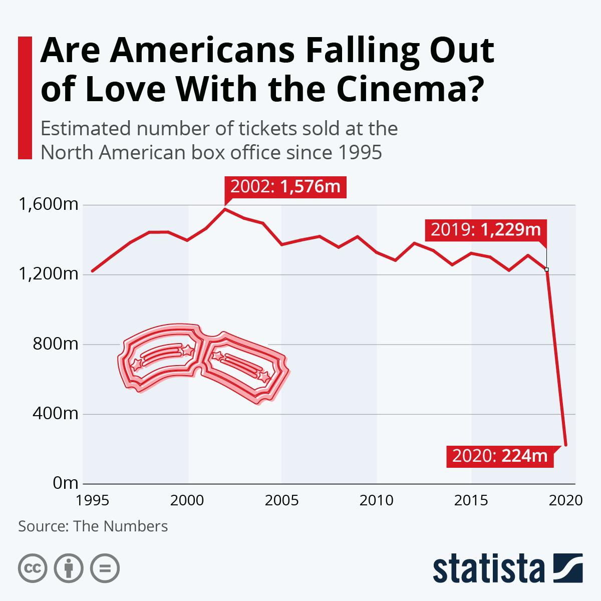
</center>

]

.rightcol40[

## Titles matter

<br><br><br><br><br><br><br><br><br><br><br>

Source: https://www.reddit.com/r/dataisugly/comments/odk65x/this_was_not_the_right_headline_to_go_along_with

]

---

.leftcol60[

<center>
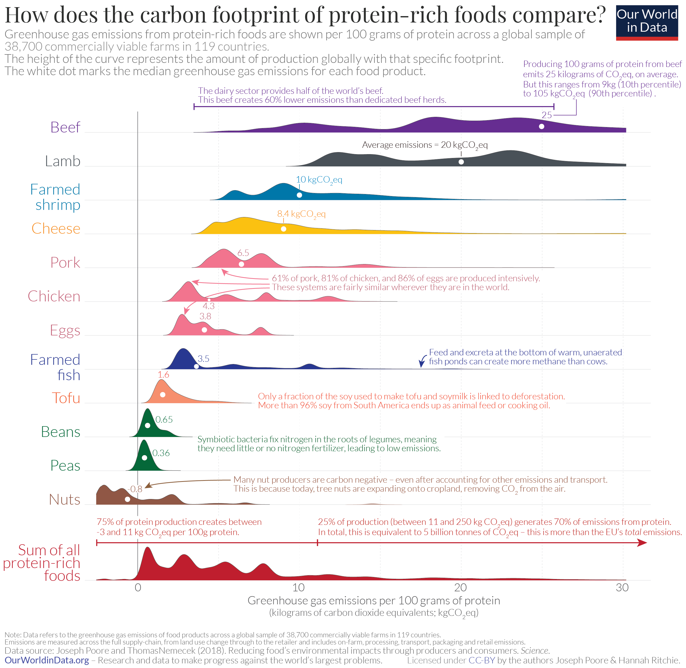
</center>

]

.rightcol40[

## Good annotations should tell a story

<br><br><br><br><br><br><br><br><br><br>

Source: https://ourworldindata.org/less-meat-or-sustainable-meat

]

---

```{r, eval=FALSE}
labs(
  x = 'Year',
  y = 'Cost of incident repairs ($ millions)',
  title = 'Repair costs of aircraft impacts with wildlife',
  subtitle = 'Top 4 airlines',
  caption = 'Source: https://wildlife.faa.gov/home')
```

```{r, ref.label='wildlife_costs', echo=FALSE, fig.height=5, fig.width=7, fig.align='center'}
```

---

Use mapped variables in `aes()` in `labs()`

.leftcol60[.code70[

```{r milk_bars, fig.show='hide'}
milk_production %>%
  filter(year %in% c(1970, 2017)) %>%
  group_by(year, region) %>%
  summarise(milk_produced = sum(milk_produced) / 10^9) %>%
  ungroup() %>%
  mutate(
    region = fct_reorder2(region, year, desc(milk_produced))) %>%
  ggplot() +
  geom_col(
    aes(x = milk_produced, #<<
        y = region, #<<
        fill = as.factor(year)),
    position = "dodge") +
  scale_x_continuous(expand = expansion(mult = c(0, 0.05))) +
  theme_minimal_vgrid() +
  labs(
    x = 'Milk produced (billions lbs)', #<<
    y = 'Region', #<<
    title = 'Milk production by region',
    subtitle = '1970 & 2017')
```

]]

.rightcol40[

```{r, ref.label="milk_bars", fig.height=5, fig.width=7, fig.align='center', echo=FALSE}
```

]

---

Use mapped variables in `aes()` in `labs()`

.leftcol60[.code70[

```{r milk_bars2, fig.show='hide'}
milk_production %>%
  filter(year %in% c(1970, 2017)) %>%
  group_by(year, region) %>%
  summarise(milk_produced = sum(milk_produced) / 10^9) %>%
  ungroup() %>%
  mutate(
    region = fct_reorder2(region, year, desc(milk_produced))) %>%
  ggplot() +
  geom_col(
    aes(x = milk_produced,
        y = region,
        fill = as.factor(year)),  #<<
    position = "dodge") +
  scale_x_continuous(expand = expansion(mult = c(0, 0.05))) +
  theme_minimal_vgrid() +
  labs(
    x = 'Milk produced (billions lbs)',
    y = 'Region',
    title = 'Milk production by region',
    subtitle = '1970 & 2017',
    fill = "Year") #<<
```

]]

.rightcol40[

```{r, ref.label="milk_bars2", fig.height=5, fig.width=7, fig.align='center', echo=FALSE}
```

]

---

class: center, middle, inverse

# Legends suck

---

class: center

# Legends suck

.leftcol[

### Legends require look-up task

```{r milk_region_line, echo=FALSE, fig.height=5, fig.width=7.5, fig.align='center'}
ggplot(milk_region,
    aes(x = year, y = milk_produced,
        color = region)) +
    geom_line(size = 1) +
    scale_color_manual(values = c(
        'sienna', 'forestgreen', 'dodgerblue', 'orange')) +
    theme_half_open(font_size = 18) +
    labs(x = 'Year',
         y = 'Milk produced (lbs)',
         color = 'Region',
         title = 'Milk production in four US regions')
```

]

--

.rightcol[

### Direct labeling is much better

```{r milk_region_line_label, echo=FALSE, fig.height=5, fig.width=7, fig.align='center'}
ggplot(milk_region,
    aes(x = year, y = milk_produced,
        color = region)) +
    geom_line(size = 1) +
    geom_text(aes(label = label),
              hjust = 0, nudge_x = 1,
              size = 6) +
    scale_color_manual(values = c(
        'sienna', 'forestgreen', 'dodgerblue', 'orange')) +
    coord_cartesian(clip = 'off') +
    theme_half_open(font_size = 18) +
    theme(legend.position = 'none',
          plot.margin = margin(0.1, 2.7, 0.1, 0.1, "cm")) +
    labs(x = 'Year',
         y = 'Milk produced (lbs)',
         title = 'Milk production in four US regions')
```

]

---

class: center

# Legends suck

.leftcol[

### Legends require look-up task

```{r fed_spending_legend, echo=FALSE, fig.height=5, fig.width=7, fig.align='center'}
ggplot(federal_spending_summary) +
  geom_area(
    aes(x = year, y = rd_budget, fill = department)) +
  scale_y_continuous(
    expand = expand_scale(mult = c(0, 0.05))) +
  scale_fill_manual(values = c('grey', 'sienna')) +
  theme_minimal_hgrid() +
  labs(
    x = NULL,
    y = 'R&D Budget ($ Billions)',
    fill = 'Department',
    title = 'Federal R&D spending, 1976 - 2017',
    subtitle = 'Source: AAAS Historical Trends')
```

]

--

.rightcol[

### Direct labeling is much better

```{r, fed_spending_annotate, echo=FALSE, fig.height=5, fig.width=7, fig.align='center'}
dod_spending <- ggplot(federal_spending_summary) +
    geom_area(aes(x = year, y = rd_budget,
                  fill = department)) +
    annotate(geom = 'text', x = 1995, y = 85,  #<<
             label = 'Other', size = 6, color = 'black') + #<<
    annotate(geom = 'text', x = 1995, y = 25, #<<
             label = 'DOD', size = 6, color = 'white') + #<<
    scale_y_continuous(
        expand = expand_scale(mult = c(0, 0.05))) +
    scale_fill_manual(values = c('grey', 'sienna')) +
    theme_minimal_hgrid() +
    theme(legend.position = 'none') +
    labs(x = NULL,
         y = 'R&D Budget ($ Billions)',
         title = 'Federal R&D spending, 1976 - 2017',
         subtitle = 'Source: AAAS Historical Trends')

dod_spending
```

]

---

## Use `annotate()` to add text to chart

.leftcol60[.code70[

```{r, eval=FALSE}
dod_spending <- ggplot(federal_spending_summary) +
    geom_area(aes(x = year, y = rd_budget,
                  fill = department)) +
    annotate(geom = 'text', x = 1995, y = 85,  #<<
             label = 'Other', size = 6, color = 'black') + #<<
    annotate(geom = 'text', x = 1995, y = 25, #<<
             label = 'DOD', size = 6, color = 'white') + #<<
    scale_y_continuous(
        expand = expand_scale(mult = c(0, 0.05))) +
    scale_fill_manual(values = c('grey', 'sienna')) +
    theme_minimal_hgrid() +
    theme(legend.position = 'none') +
    labs(x = NULL,
         y = 'R&D Budget ($ Billions)',
         title = 'Federal R&D spending, 1976 - 2017',
         subtitle = 'Source: AAAS Historical Trends')

dod_spending
```

]]

.rightcol40[

<br>

```{r, ref.label='fed_spending_annotate', echo=FALSE, fig.height=5, fig.width=7, fig.align='center'}
```

]

---

## Use `geom_text()` to add text to chart

.leftcol60[.code70[

```{r, fed_spending_geom_text, fig.show='hide'}
dod_spending <- ggplot(federal_spending_summary) +
    geom_area(aes(x = year, y = rd_budget,
                  fill = department)) +
    geom_text( #<<
      data = data.frame(x = 1995, y = 85, label = 'Other'), #<<
      aes(x = x, y = y, label = label), #<<
      size = 6, color = 'black') + #<<
    geom_text( #<<
      data = data.frame(x = 1995, y = 25, label = 'DOD'), #<<
      aes(x = x, y = y, label = label), #<<
      size = 6, color = 'white') + #<<
    scale_y_continuous(
        expand = expand_scale(mult = c(0, 0.05))) +
    scale_fill_manual(values = c('grey', 'sienna')) +
    theme_minimal_hgrid() +
    theme(legend.position = 'none') +
    labs(x = NULL,
         y = 'R&D Budget ($ Billions)',
         title = 'Federal R&D spending, 1976 - 2017',
         subtitle = 'Source: AAAS Historical Trends')

dod_spending
```

]]

.rightcol40[

<br>

```{r, ref.label='fed_spending_geom_text', echo=FALSE, fig.height=5, fig.width=7, fig.align='center'}
```

]

---

### Use `geom_label()` to add text to chart **with a background**

.leftcol60[.code70[

```{r, fed_spending_geom_label, fig.show='hide'}
dod_spending <- ggplot(federal_spending_summary) +
    geom_area(aes(x = year, y = rd_budget,
                  fill = department)) +
    geom_label( #<<
      data = data.frame(x = 1995, y = 85, label = 'Other'),
      aes(x = x, y = y, label = label),
      size = 6) +
    geom_label( #<<
      data = data.frame(x = 1995, y = 25, label = 'DOD'),
      aes(x = x, y = y, label = label),
      size = 6, fill = "black", color = "white") + #<<
    scale_y_continuous(
        expand = expand_scale(mult = c(0, 0.05))) +
    scale_fill_manual(values = c('grey', 'sienna')) +
    theme_minimal_hgrid() +
    theme(legend.position = 'none') +
    labs(x = NULL,
         y = 'R&D Budget ($ Billions)',
         title = 'Federal R&D spending, 1976 - 2017',
         subtitle = 'Source: AAAS Historical Trends')

dod_spending
```

]]

.rightcol40[

<br>

```{r ref.label='fed_spending_geom_label', echo=FALSE, fig.height=5, fig.width=7, fig.align='center'}
```

]

---

### Use `geom_curve()` + `geom_label()` to direct attention

.leftcol60[.code70[

```{r fed_spending_curve, fig.show='hide'}
label <- "The Dept. of Defense R&D Budget
has made up nearly half of all
federal R&D spending"

dod_spending +
  geom_curve( #<<
    data = data.frame( #<<
      x = 1981, xend = 1987, y = 160, yend = 25), #<<
    mapping = aes(x = x, xend = xend, y = y, yend = yend), #<<
    color = 'grey75', size = 0.5, curvature = 0.1, #<<
    arrow = arrow(length = unit(0.01, "npc"), #<<
                  type = "closed")) + #<<
  geom_label(
    data = data.frame(x = 1977, y = 160, label = label),
    mapping = aes(x = x, y = y, label = label),
    hjust = 0, lineheight = 0.8)
```

]]

.rightcol40[

```{r, ref.label='fed_spending_curve', echo=FALSE, fig.height=5, fig.width=7, fig.align='center'}
```

]

---

## Use `annotate()` to direct attention

Use `geom = "rect"` for box, `geom = "text"` for label

.leftcol60[.code70[

```{r mpg_box, fig.show='hide'}
ggplot(mpg, aes(x = displ, y = hwy)) +
  geom_point(
    aes(fill = as.factor(cyl)),
    color = 'white', alpha = 0.8,
    size = 3.5, shape = 21) +
  annotate(geom = "rect", #<<
    xmin = 5, xmax = 7.5,
    ymin = 21, ymax = 28,
    fill = "grey55", alpha = 0.2) +
  annotate(geom = "text", #<<
    x = 5, y = 29, label = "Hybrid vehicles",
    hjust = 0, size = 5) +
  theme_half_open(font_size = 15) +
  labs(x = "Engine displacement",
       y = "Fuel efficiency (mpg)",
       fill = '# cylinders',
       title = "Vehicle fuel efficiency vs. engine displacement",
       caption = "Source: U.S. EPA.")
```

]]

.rightcol40[

```{r, ref.label='mpg_box', echo=FALSE, fig.height=6, fig.width=7, fig.align='center'}
```

]

---

## Find where to put annotations with [`ggannotate`](https://github.com/MattCowgill/ggannotate)

.leftcol65[

Install:
```{r, eval=FALSE}
remotes::install_github("mattcowgill/ggannotate")
```

Use:

```{r, eval=FALSE}
library(ggannotate)

plot <- ggplot(mpg) +
  geom_point(aes(x = displ, y = hwy, color = as.factor(cyl))) +
  theme_half_open()

ggannotate(plot) #<<
```

]

---

class: inverse

```{r, echo=FALSE}
countdown(
    minutes = 20,
    warn_when = 30,
    update_every = 1,
    top = 0,
    right = 0,
    font_size = '2em'
)
```

## Your turn

.leftcol[

Use the `lotr_summary` data frame to create the following chart.

Hints:
- For the `geom_label()`, use these points:
    - `x = 0.6`
    - `y = 2100`
- For the `geom_curve()`, use these points:
    - `x = 1.2`
    - `xend = 1`
    - `y = 1300`
    - `yend = 200`

]

.rightcol[

```{r lotr_bars, echo=FALSE, fig.height=6, fig.width=7.5, fig.align='center'}
label <- "Across 3 films,
only 16 words were
spoken by a
female hobbit."

ggplot(lotr_summary) +
  geom_col(
    aes(x = Race, y = wordCount, fill = gender),
    width = 0.7, color = 'white') +
  facet_wrap(~gender) +
  geom_curve(
    data = data.frame(
      x = 1.2, xend = 1, y = 1300, yend = 200, gender = 'Female'),
    mapping = aes(x = x, y = y, xend = xend, yend = yend),
    color = 'grey75', size = 0.5, curvature = 0.1,
    arrow = arrow(length = unit(0.01, 'npc'), type = 'closed')) +
  geom_label(
    data = data.frame(
      x = 0.6, y = 2100, label = label, gender = 'Female'),
    mapping = aes(x = x, y = y, label = label),
    hjust = 0, lineheight = .8) +
  scale_y_continuous(
    labels = scales::comma,
    expand = expand_scale(mult = c(0, 0.05))) +
  theme_minimal_hgrid(font_size = 18) +
  theme(legend.position = 'none') +
  panel_border() +
  labs(
    x = 'Race of character',
    y = 'Number of words spoken',
    title = 'Speaking roles in the LOTR film trilogy was\nheavily biased towards male characters')
```

]

---

class: inverse, center

```{r, echo=FALSE}
countdown(
    minutes = 5,
    warn_when = 30,
    update_every = 1,
    left = 0, right = 0, top = 1, bottom = 0,
    margin = "5%",
    font_size = "8em"
)
```

# Intermission

---

```{r child="topics/3.Rmd"}
```

<!--
Source of a lot of the slide content:
https://resources.rstudio.com/rstudio-conf-2020/the-glamour-of-graphics-william-chase
-->

---

class: inverse, center, middle

# Color is hard

---

## How do I know what colors look good together?

--

### .red[Use the color wheel]

.rightcol45[

<center>
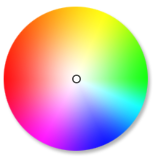
</center>

.center[Image from [this color wheel tool](https://www.sessions.edu/color-calculator/)]

]

---

## How do I know what colors look good together?

### .red[Use the color wheel]

.leftcol55[

### 1. **Complementary**: High contrast

]

.rightcol45[

<center>
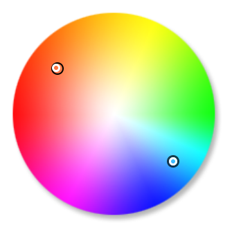
</center>

.center[Image from [this color wheel tool](https://www.sessions.edu/color-calculator/)]

]

---

## How do I know what colors look good together?

### .red[Use the color wheel]

.leftcol55[

### 1. Complementary: High contrast
### 2. **Analogous**: Calm, harmonious

]

.rightcol45[

<center>
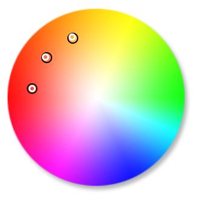
</center>

.center[Image from [this color wheel tool](https://www.sessions.edu/color-calculator/)]

]

---

## How do I know what colors look good together?

### .red[Use the color wheel]

.leftcol55[

### 1. Complementary: High contrast
### 2. Analogous: Calm, harmonious
### 3. **Triadic**: Vibrant, contrast

]

.rightcol45[

<center>
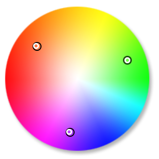
</center>

.center[Image from [this color wheel tool](https://www.sessions.edu/color-calculator/)]

]

---

class: center, middle

# [Artists use color theory too!](https://twitter.com/emeldraws/status/1151835561415495681?s=19)

---

class: center

# Steal colors with the [eye dropper tool](https://chrome.google.com/webstore/detail/eye-dropper/hmdcmlfkchdmnmnmheododdhjedfccka?hl=en)

.noborder[

<center>

</center>

]

---

## Using your own colors

.leftcol60[.code70[

Map color to variable

```{r, fig.show='hide'}
mpg_plot <- ggplot(mtcars, aes(x = mpg, y = hp)) +
  geom_point(
    aes(color = as.factor(cyl)), #<<
    alpha = 0.8, size = 3) +
  theme_half_open(font_size = 16) +
  labs(x = "Fuel efficiency (mpg)",
       y = "Power (hp)",
       color = '# cylinders',
       title = "Vehicle fuel efficiency vs. power",
       caption = "Source: 1974 Motor Trend U.S. magazine.")
```

]]

<br>

.rightcol40[

```{r, echo=FALSE, fig.height=5, fig.width=6, fig.align='center'}
mpg_plot
```

]

---

## Using your own colors

.leftcol60[.code70[

Map color to variable
```{r, eval=FALSE}
mpg_plot <- ggplot(mtcars, aes(x = mpg, y = hp)) +
  geom_point(
    aes(color = as.factor(cyl)), #<<
    alpha = 0.8, size = 3) +
  theme_half_open(font_size = 16) +
  labs(x = "Fuel efficiency (mpg)",
       y = "Power (hp)",
       color = '# cylinders',
       title = "Vehicle fuel efficiency vs. power",
       caption = "Source: 1974 Motor Trend U.S. magazine.")
```

Manually change colors
```{r, mpg_colors_manual, fig.show='hide'}
mpg_plot +
    scale_color_manual(values = c( #<<
        '#a0522d', '#522da0', '#2da052')) #<<
```

]]

<br>

.rightcol40[

```{r, ref.label='mpg_colors_manual', echo=FALSE, fig.height=5, fig.width=6, fig.align='center'}
```

]

---

## Consider color blind friendly colors

.leftcol45[.code70[

Manually change colors

```{r}
mpg_plot_mycolors <- mpg_plot +
    theme_half_open(font_size = 10) +
    scale_color_manual(values = c( #<<
        '#a0522d', '#522da0', '#2da052')) #<<
```

Simulate color blindness with [colorblindr](https://github.com/clauswilke/colorblindr)

```{r, mpg_plot_mycolors, fig.show='hide'}
library(colorblindr)

cvd_grid(mpg_plot_mycolors)
```

]]

.rightcol55[

```{r, ref.label='mpg_plot_mycolors', echo=FALSE, fig.height=7, fig.width=8, fig.align='center'}
```

]

---

class:center

.leftcol[

# Use palettes

### [Viridis](https://cran.r-project.org/web/packages/viridis/vignettes/intro-to-viridis.html)

<center>

</center>

]

.rightcol[

### [ColorBrewer](https://www.datanovia.com/en/blog/the-a-z-of-rcolorbrewer-palette/)

<center>

</center>

]

---

.leftcol35[

### 3 types of palettes

### 1. Sequential
### 2. Diverging
### 3. Categorical

]

---

.leftcol35[

### 3 types of palettes

### 1. **Sequential**
### 2. Diverging
### 3. Categorical

]

.rightcol65[

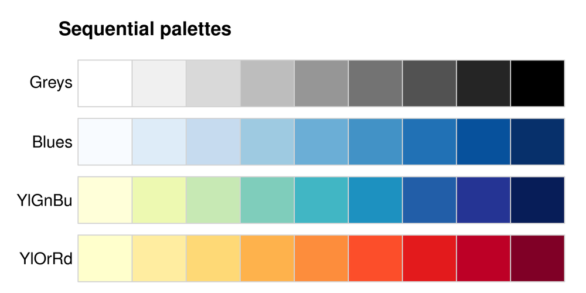
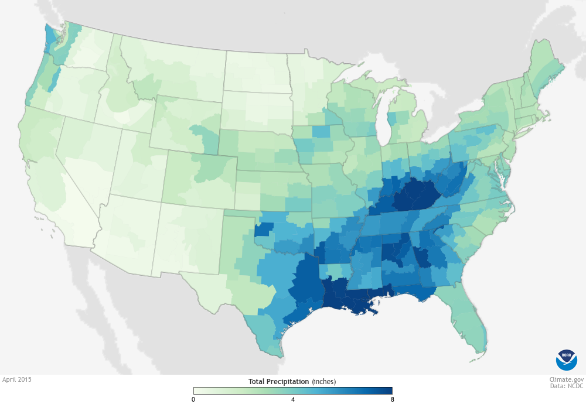

Image from [betterfigures.org](https://betterfigures.org/2015/06/23/picking-a-colour-scale-for-scientific-graphics/)

]

---

.leftcol35[

### 3 types of palettes

### 1. Sequential
### 2. **Diverging**
### 3. Categorical

]

.rightcol65[

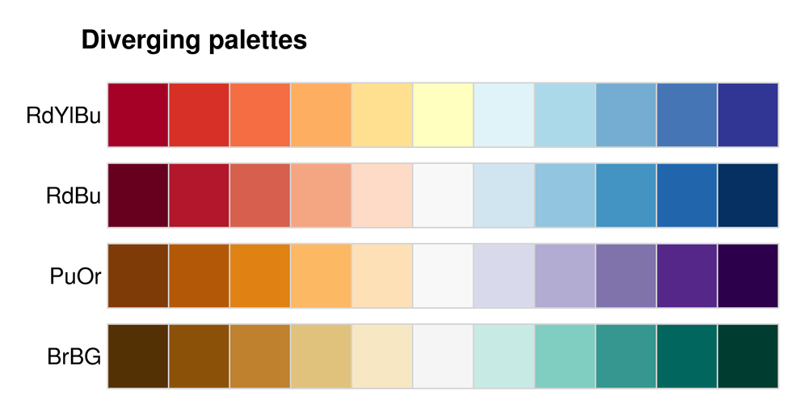
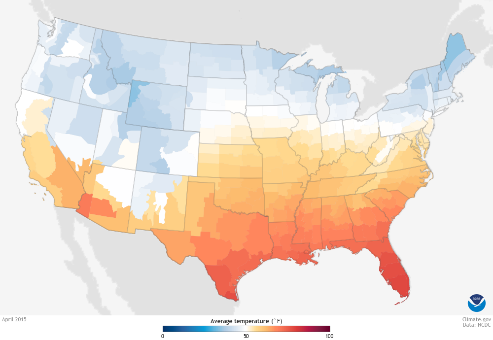

Image from [betterfigures.org](https://betterfigures.org/2015/06/23/picking-a-colour-scale-for-scientific-graphics/)

]

---

.leftcol35[

### 3 types of palettes

### 1. Sequential
### 2. Diverging
### 3. **Categorical**

]

.rightcol65[

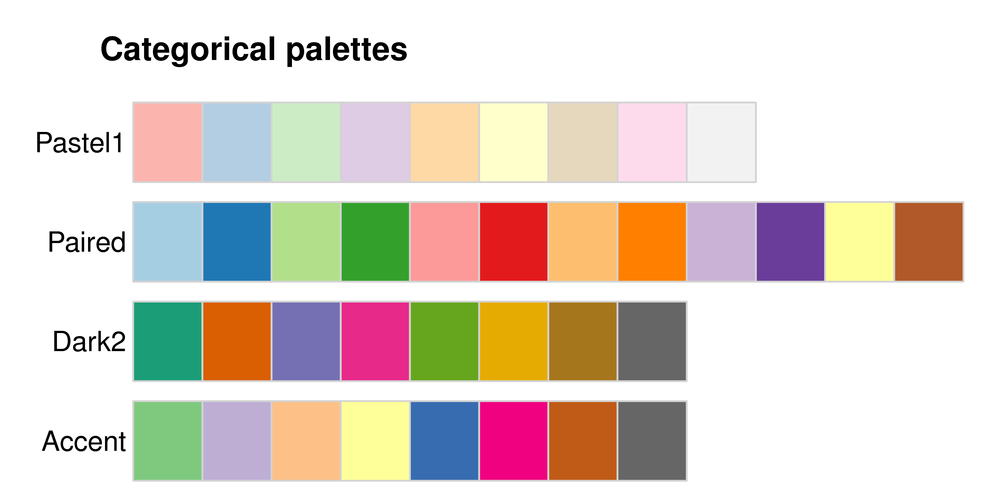
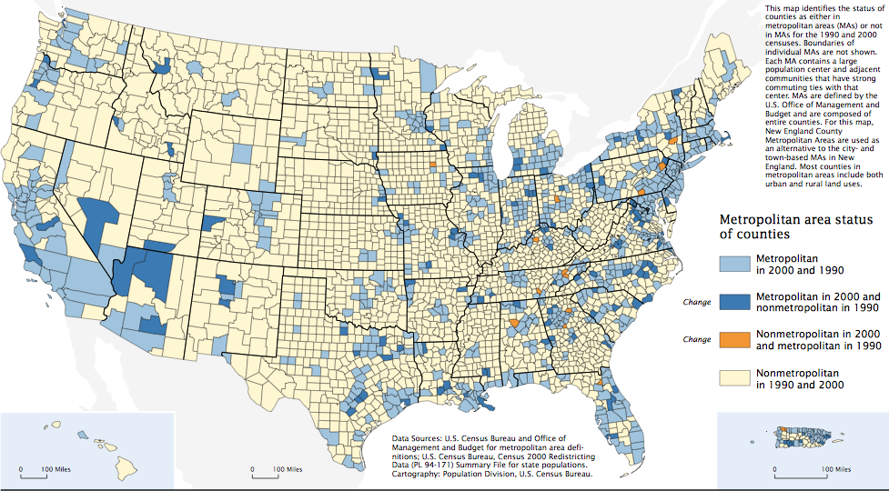

Image from [betterfigures.org](https://betterfigures.org/2015/06/23/picking-a-colour-scale-for-scientific-graphics/)

]

---

## **ColorBrewer** palettes

.leftcol60[.code70[

Map color to variable

```{r, eval=FALSE}
mpg_plot <- ggplot(mtcars, aes(x = mpg, y = hp)) +
    geom_point(aes(color = as.factor(cyl)), #<<
               alpha = 0.8, size = 3) +
    theme_half_open(font_size = 16) +
    labs(x = "Fuel efficiency (mpg)",
         y = "Power (hp)",
         color = '# cylinders',
         title = "Vehicle fuel efficiency vs. power",
         caption = "Source: 1974 Motor Trend U.S. magazine.")
```

Use "Dark2" palette

```{r, mpg_colors_dark2, fig.show='hide'}
mpg_plot +
    scale_color_brewer(palette = 'Dark2') #<<
```

]]

<br>

.rightcol40[

```{r, ref.label='mpg_colors_dark2', echo=FALSE, fig.height=5, fig.width=6, fig.align='center'}
```

]

---

## **ColorBrewer** palettes

.cols3[.code70[

```{r, fig.height=5, fig.width=6, fig.align='center'}
mpg_plot +
    scale_color_brewer(
        palette = 'Set1') #<<
```

]]

.cols3[.code70[

```{r, fig.height=5, fig.width=6, fig.align='center'}
mpg_plot +
    scale_color_brewer(
        palette = 'Set2') #<<
```

]]

.cols3[.code70[

```{r, fig.height=5, fig.width=6, fig.align='center'}
mpg_plot +
    scale_color_brewer(
        palette = 'Accent') #<<
```

]]

---

## **viridis** palettes

.leftcol60[.code70[

Map color to variable
```{r, eval=FALSE}
mpg_plot <- ggplot(mtcars, aes(x = mpg, y = hp)) +
    geom_point(aes(color = as.factor(cyl)), #<<
               alpha = 0.8, size = 3) +
    theme_half_open(font_size = 16) +
    labs(x = "Fuel efficiency (mpg)",
         y = "Power (hp)",
         color = '# cylinders',
         title = "Vehicle fuel efficiency vs. power",
         caption = "Source: 1974 Motor Trend U.S. magazine.")
```

Use viridis colors

```{r, mpg_colors_viridis, fig.show='hide'}
mpg_plot +
    scale_color_viridis(discrete = TRUE) #<<
```

]]

<br>

.rightcol40[

```{r, ref.label='mpg_colors_viridis', echo=FALSE, fig.height=5, fig.width=6, fig.align='center'}
```

]

---

## **viridis** palettes

.cols3[.code70[

```{r, fig.height=5, fig.width=6, fig.align='center'}
mpg_plot +
    scale_color_viridis(
        discrete = TRUE,
        option = 'viridis') #<<
```

]]

.cols3[.code70[

```{r, fig.height=5, fig.width=6, fig.align='center'}
mpg_plot +
    scale_color_viridis(
        discrete = TRUE,
        option = 'inferno') #<<
```

]]

.cols3[.code70[

```{r, fig.height=5, fig.width=6, fig.align='center'}
mpg_plot +
    scale_color_viridis(
        discrete = TRUE,
        option = 'plasma') #<<
```

]]

---

class: center

Fun custom palettes

.leftcol[

[Inauguration palette](https://github.com/ciannabp/inauguration)

<center>

<br>
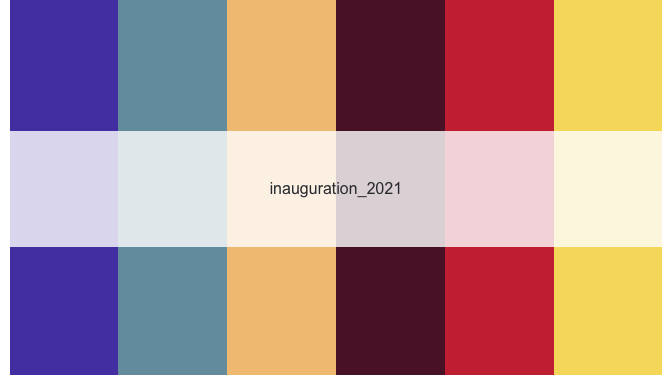
</center>

]

--

.rightcol[

[PNWColors](https://github.com/jakelawlor/PNWColors)
<center>
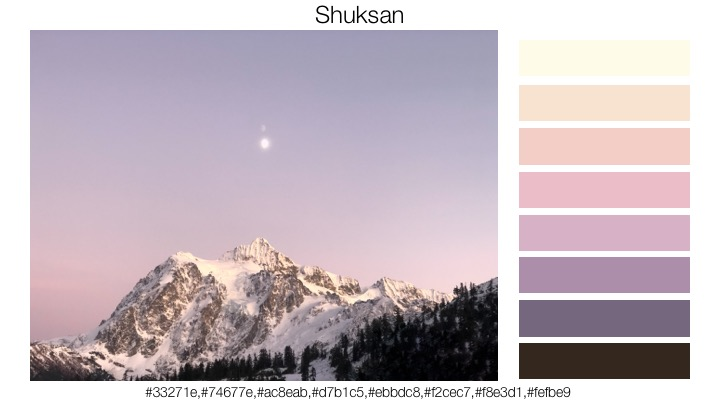

]

---

## Consider using `color` + `fill` for points

.leftcol60[.code70[

```{r, mpg_colors_polished, fig.show='hide'}
ggplot(mtcars, aes(x = mpg, y = hp)) +
  geom_point(
    aes(fill = as.factor(cyl)), #<<
    color = 'white', shape = 21, #<<
    size = 3.5, alpha = 0.8) +
  scale_fill_brewer(palette = 'Dark2') + #<<
  theme_half_open(font_size = 15) +
  labs(
    x = "Fuel efficiency (mpg)",
    y = "Power (hp)",
    fill = '# cylinders',
    title = "Vehicle fuel efficiency vs. power",
    caption = "Source: 1974 Motor Trend U.S. magazine.")
```

]]

.rightcol40[

```{r, ref.label='mpg_colors_polished', echo=FALSE, fig.height=5, fig.width=6, fig.align='center'}
```

]

---

## .center[`grey` = "Other"]

.leftcol[.code70[

```{r dod_spending_grey, fig.show='hide'}
dod_spending_plot <- federal_spending %>%
  mutate(department = fct_other(
    department, keep = 'DOD')) %>%
  group_by(department, year) %>%
  summarise(rd_budget = sum(rd_budget) / 10^3) %>%
  ungroup() %>%
  mutate(department = fct_relevel(
  department, c('Other', 'DOD'))) %>%
  ggplot() +
  geom_area(aes(x = year, y = rd_budget,
                fill = department)) +
  scale_y_continuous(
      expand = expand_scale(mult = c(0, 0.05))) +
  scale_fill_manual( #<<
    values = c('grey', 'sienna')) + #<<
  theme_minimal_hgrid() +
  labs(x = NULL,
       y = 'R&D Budget ($ Billions)',
       fill = 'Department',
       caption = 'Source: AAAS')

dod_spending_plot
```

]]

.rightcol[

```{r, ref.label="dod_spending_grey", echo=FALSE, fig.height=4, fig.width=6, fig.align='center'}
```

]

---

# .center[`grey` = "Other"]

.cols3[.code60[

```{r, fig.height=5, fig.width=6, fig.align='center'}
dod_spending_plot +
    scale_fill_manual(
        values = c('grey40', 'sienna')) #<<
```

]]

.cols3[.code60[

```{r, fig.height=5, fig.width=6, fig.align='center'}
dod_spending_plot +
    scale_fill_manual(
        values = c('grey60', 'sienna')) #<<
```

]]

.cols3[.code60[

```{r, fig.height=5, fig.width=6, fig.align='center'}
dod_spending_plot +
    scale_fill_manual(
        values = c('grey80', 'sienna')) #<<
```

]]

---

class: inverse

```{r, echo=FALSE}
countdown(
    minutes = 20,
    warn_when = 30,
    update_every = 1,
    top = 0,
    right = 0,
    font_size = '2em'
)
```

# Your turn

.leftcol[

Make 3 different versions of this chart:

1. Change the colors to the `"RdYlBu"` ColorBrewer palette.
2. Change the colors to the `"inferno"` palette from the **viridis** library.
3. Change the colors to your custom triadic palette:

    - Use the ["eye dropper"](https://chrome.google.com/webstore/detail/eye-dropper/hmdcmlfkchdmnmnmheododdhjedfccka?hl=en) tool in Google Chrome to select a color from a website, then
    - Use your color and the [color wheel tool](https://www.sessions.edu/color-calculator/) to find a triadic color palette.

]

.rightcol[

```{r, echo=FALSE, fig.width=7, fig.height=5, fig.align='center'}
ggplot(wildlife_impacts_2016) +
  geom_point(
    aes(x = speed, y = height, color = phase_of_flt),
    alpha = 0.7, size = 2) +
  scale_y_continuous(labels = scales::comma) +
  theme_minimal_grid(font_size = 15) +
  labs(x = 'Speed (mph)',
       y = 'Height (ft)',
       color = 'Phase of flight',
       title = 'Wildlife impacts in 2016')
```

]

---

```{r child="topics/4.Rmd"}
```

<!--
Source of the content on how to change fonts in ggplot2:

https://www.andrewheiss.com/blog/2017/09/27/working-with-r-cairo-graphics-custom-fonts-and-ggplot/

Source of a lot of the slide content on choosing good fonts:
https://resources.rstudio.com/rstudio-conf-2020/the-glamour-of-graphics-william-chase
-->

---

class: inverse, center, middle

# Fonts matter

.leftcol[

<center>
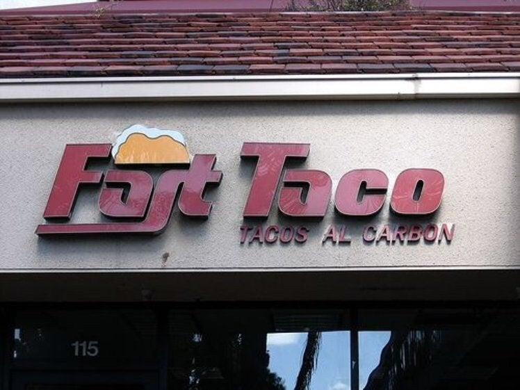
</center>

"Fast Taco"

]

.rightcol[

<center>
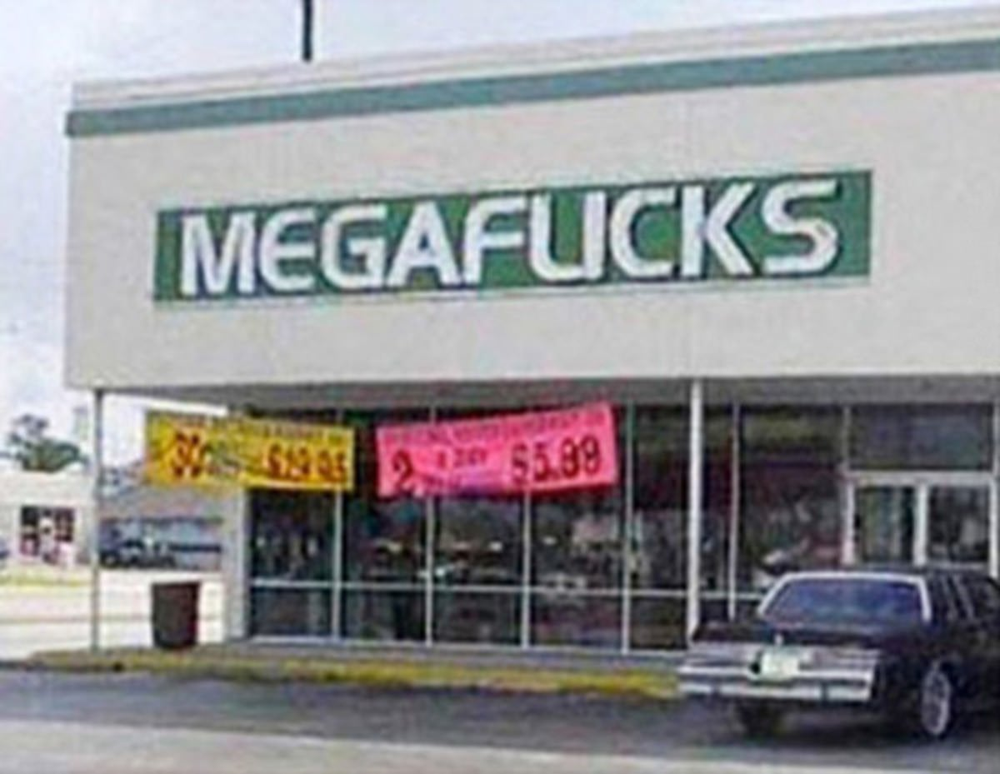
</center>

"Mega Flicks"

]

---

class: inverse, center, middle

<center>
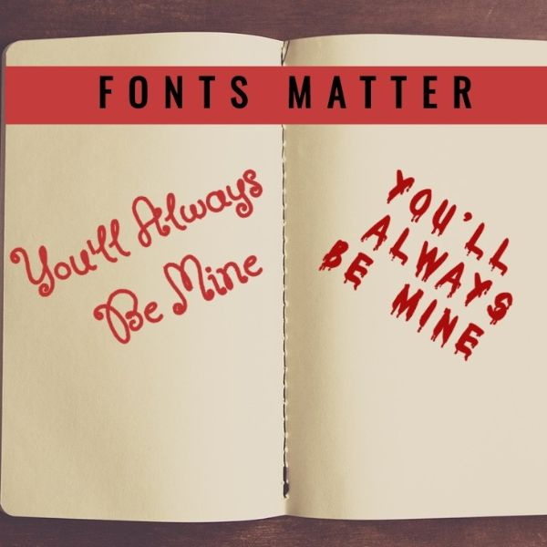
</center>

---

class: center, middle

## Best resource on fonts:

## [practicaltypography.com](https://practicaltypography.com/)

---

## .center[Font families you should consider using]

.leftcol30[.font120[

<p style="font-family: Roboto;">Roboto</p>

<p style="font-family: Source Code Pro;">Source</p>

<p style="font-family: Fira Sans;">Fira</p>

<p style="font-family: Alegreya;">Alegreya</p>

<p style="font-family: Lato;">Lato</p>

]]

.rightcol70[

Download:

- Individually from https://fonts.google.com/
- All of these with [this zip file](https://github.com/emse-eda-gwu/2022-Fall/raw/main/content/fonts.zip)

]

---

## Use fonts to create **hierarchy**

.leftcol[

```
# Hierarchy

## Hierarchy

### Hierarchy

#### Hierarchy
```

]

.rightcol[

# Hierarchy

## Hierarchy

### Hierarchy

#### Hierarchy

]

---

.leftcol[

Title<br>This is some text that goes into detail and explains a lot more about the topic described in the title. Here's some random Latin words: Lorem ipsum dolor sit amet, consectetur adipiscing elit, sed do eiusmod tempor incididunt ut labore et dolore magna aliqua.

]

---

.leftcol[

# Size

This is some text that goes into detail and explains a lot more about the topic described in the title. Here's some random Latin words: Lorem ipsum dolor sit amet, consectetur adipiscing elit, sed do eiusmod tempor incididunt ut labore et dolore magna aliqua.

]

---

.leftcol[

**Weight**

This is some text that goes into detail and explains a lot more about the topic described in the title. Here's some random Latin words: Lorem ipsum dolor sit amet, consectetur adipiscing elit, sed do eiusmod tempor incididunt ut labore et dolore magna aliqua.

]

---

.leftcol[

.red[Color]

This is some text that goes into detail and explains a lot more about the topic described in the title. Here's some random Latin words: Lorem ipsum dolor sit amet, consectetur adipiscing elit, sed do eiusmod tempor incididunt ut labore et dolore magna aliqua.

]

---

.leftcol[

Spacing

<br>

This is some text that goes into detail and explains a lot more about the topic described in the title. Here's some random Latin words: Lorem ipsum dolor sit amet, consectetur adipiscing elit, sed do eiusmod tempor incididunt ut labore et dolore magna aliqua.

]

---

.leftcol[

Typeface

<p style="font-family: Alegreya;">
This is some text that goes into detail and explains a lot more about the topic described in the title. Here's some random Latin words: Lorem ipsum dolor sit amet, consectetur adipiscing elit, sed do eiusmod tempor incididunt ut labore et dolore magna aliqua.
</p>

]

---

.leftcol[

<h2 style="font-family: Roboto Condensed; color: #a5442b;">Title</h2>
<h3 style="font-family: Alegreya;">Subtitle</h3>

<p style="font-family: Roboto;">
This is some text that goes into detail and explains a lot more about the topic described in the title. Here's some random Latin words: Lorem ipsum dolor sit amet, consectetur adipiscing elit, sed do eiusmod tempor incididunt ut labore et dolore magna aliqua.
</p>

]

---

# .center[Use fonts with **same-height** numbers]

<br>

.leftcol35[.right[

## "Oldstyle" (bad)

<br>

## Lining (good)

]]

.rightcol65[

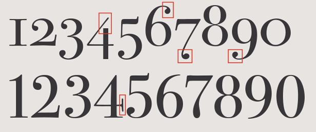

]

---

# .center[Use fonts with **same-width** numbers]

<br>

.leftcol40[.right[

## "Proportional" (bad)

<br>

## "Tabular" (good)

]]

.rightcol60[

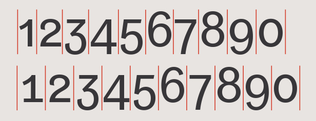

]

---

class: inverse, center, middle

# How to customize fonts in **ggplot**

---

## 1. Change the whole theme

For "Base R" themes, use `base_family`:

```{r, eval=FALSE}
theme_minimal(base_family = "Roboto Condensed")
```
```{r, eval=FALSE}
theme_bw(base_family = "Roboto Condensed")
```

<br>

For "cowplot" themes, use `font_family`:

```{r, eval=FALSE}
theme_half_open(font_family = "Roboto Condensed")
```
```{r, eval=FALSE}
theme_minimal_grid(font_family = "Roboto Condensed")
```

---

## 1. Change the whole theme font

Make the base plot

.leftcol60[.code70[

```{r mpg}
mpg_plot <- ggplot(mtcars) +
  geom_point(aes(x = mpg, y = hp)) +
  theme_minimal(base_size = 15) + #<<
  labs(
    x = "Fuel efficiency (mpg)",
    y = "Power (hp)",
    title = "Vehicle fuel efficiency vs. power",
    subtitle = "Select makes and models",
    caption = "Source: 1974 Motor Trend U.S. magazine.")
```

]]

.rightcol40[

```{r, echo=FALSE, fig.height=5, fig.width=6, fig.align='center'}
mpg_plot
```

]

---

## 1. Change the whole theme font

Use `base_family` with base themes

.leftcol60[.code70[

```{r mpg_base}
mpg_plot <- ggplot(mtcars) +
  geom_point(aes(x = mpg, y = hp)) +
  theme_minimal( #<<
    base_family = 'Source Sans Pro', #<<
    base_size = 15) +
  labs(
    x = "Fuel efficiency (mpg)",
    y = "Power (hp)",
    title = "Vehicle fuel efficiency vs. power",
    subtitle = "Select makes and models",
    caption = "Source: 1974 Motor Trend U.S. magazine.")
```

]]

.rightcol40[

```{r, echo=FALSE, fig.height=5, fig.width=6, fig.align='center'}
mpg_plot
```

]

---

## 1. Change the whole theme font

Use `font_family` with cowplot themes

.leftcol60[.code70[

```{r mpg_cowplot}
mpg_plot <- ggplot(mtcars) +
  geom_point(aes(x = mpg, y = hp)) +
  theme_minimal_grid( #<<
    font_family = 'Source Sans Pro', #<<
    font_size = 15) +
  labs(
    x = "Fuel efficiency (mpg)",
    y = "Power (hp)",
    title = "Vehicle fuel efficiency vs. power",
    subtitle = "Select makes and models",
    caption = "Source: 1974 Motor Trend U.S. magazine.")
```

]]

.rightcol40[

```{r, echo=FALSE, fig.height=5, fig.width=6, fig.align='center'}
mpg_plot
```

]

---

## 2. Adjust theme elements with `element_text()`

.leftcol60[.code70[

```{r mpg_cowplot_title, fig.show='hide'}
mpg_plot <- ggplot(mtcars) +
  geom_point(aes(x = mpg, y = hp)) +
  theme_minimal_grid(
    font_family = 'Source Sans Pro',
    font_size = 15) +
  theme(
    plot.title = element_text( #<<
      family = "Roboto Condensed", #<<
      size = 20)) + #<<
  labs(
    x = "Fuel efficiency (mpg)",
    y = "Power (hp)",
    title = "Vehicle fuel efficiency vs. power",
    subtitle = "Select makes and models",
    caption = "Source: 1974 Motor Trend U.S. magazine.")
```

]

See theme components [here](https://ggplot2.tidyverse.org/reference/theme.html)

]

.rightcol40[

```{r, echo=FALSE, fig.height=5, fig.width=6, fig.align='center'}
mpg_plot
```

]

---

### 3. Adjust annotations:

### `geom_text()`, `geom_label()`, and `annotate()`

.leftcol60[.code70[

```{r mpg_cowplot_annotate, fig.show='hide'}
label <- "Higher power engines,
often come at the expense,
of fuel economy."

mpg_plot +
    geom_label(
      data = data.frame(
        x = 17, y = 270, label = label),
      aes(x = x, y = y, label = label),
      lineheight = .8, hjust = 0,
      family = 'Roboto Condensed') #<<
```

]]

.rightcol40[

```{r ref.label='mpg_cowplot_annotate', echo=FALSE, fig.height=5, fig.width=6, fig.align='center'}
```

]

---

## The [hrbrthemes](https://github.com/hrbrmstr/hrbrthemes) package:

### Great themes + great fonts

.leftcol60[

```{r mpg_ipsum, fig.show='hide'}
library(hrbrthemes) #<<

mpg_plot <- ggplot(mtcars) +
  geom_point(aes(x = mpg, y = hp)) +
  labs(
    x = "Fuel efficiency (mpg)",
    y = "Power (hp)",
    title = "Vehicle fuel efficiency vs. power",
    subtitle = "Select makes and models",
    caption = "Source: 1974 Motor Trend U.S. magazine.")

mpg_plot +
  theme_ipsum() #<<
```

]

.rightcol40[

```{r ref.label='mpg_ipsum', echo=FALSE, fig.height=5, fig.width=6, fig.align='center'}
```

]

---

## The [hrbrthemes](https://github.com/hrbrmstr/hrbrthemes) package:

### Great themes + great fonts

.cols3[

```{r, eval=FALSE}
mpg_plot +
  theme_ipsum()
```

```{r ref.label='mpg_ipsum', echo=FALSE, fig.height=5, fig.width=6, fig.align='center'}
```

]

.cols3[

```{r mpg_ipsum_rc, fig.show='hide'}
mpg_plot +
  theme_ipsum_rc()
```

```{r ref.label='mpg_ipsum_rc', echo=FALSE, fig.height=5, fig.width=6, fig.align='center'}
```

]

.cols3[

```{r mpg_ft_rc, fig.show='hide'}
mpg_plot +
  theme_ft_rc()
```

```{r ref.label='mpg_ft_rc', echo=FALSE, fig.height=5, fig.width=6, fig.align='center'}
```

]

---

class: inverse

```{r, echo=FALSE}
countdown(
    minutes = 15,
    warn_when = 30,
    update_every = 15,
    top = 0,
    font_size = '2em'
)
```

## Your turn

.leftcol[.font80[

Modify the fonts and annotations in the dumbbell chart to match the chart shown here. The main font is `'Roboto Condensed'`.

Once you've recreated the plot, try other fonts and themes, such as:

- The `'Source Sans Pro'` font.
- The `'Lato'` font.
- The `theme_ipsum()` theme from the `hrbrthemes` library.

Hint: Use `annotate()` to insert the year labels at the top:

  - 1970: `x = 9`, `y = 10.5`
  - 2017: `x = 40`, `y = 10.5`

]]

.rightcol[

```{r milk_dumbbell, echo=FALSE, fig.height=6, fig.width=7, fig.align='center'}
milk_summary_dumbbell %>%
  ggplot(aes(x = milk_produced, y = state)) +
  geom_line(
    aes(group = state),
    color = 'lightblue', size = 1) +
  geom_point(
    aes(color = year), size = 2.5) +
  annotate(geom = "text",
    x = 8, y = 10.5, label = '1970',
    color = 'lightblue', size = 5,
    family = 'Roboto Condensed') +
  annotate(geom = "text",
    x = 42, y = 10.5, label = '2017',
    color = 'steelblue', size = 5,
    family = 'Roboto Condensed') +
  scale_color_manual(values = c('lightblue', 'steelblue')) +
  coord_cartesian(clip = 'off') +
  theme_minimal_vgrid(font_family = 'Roboto Condensed') +
  theme(
    axis.line.y = element_blank(),
    axis.ticks = element_blank(),
    legend.position = 'none',
    plot.margin = margin(0.1, 1, 0.1, 0.1, "cm")) +
  labs(
    x = 'Milk produced (billion lbs)',
    y = 'State',
    color = 'Year',
    title = 'Top 10 milk producing states\n')
```

]

---

```{r child="topics/5.Rmd"}
```

---

## .center[Use themes to change global "look"]

.leftcol[

### Default "bootstrap" themes

Change theme in YAML header:

```
title: "your title"
output:
    html_document:
        theme: united
        highlight: tango
```

[Preview themes here](https://bootswatch.com/)

]

--

.rightcol[

### [rmdformats package](https://github.com/juba/rmdformats)

```{r, eval=FALSE}
install.packages("rmdformats")
```

```
title: "your title"
output: rmdformats::<template name>
```

]

---

# Set a global chart theme

```{r, eval=FALSE}
theme_set(theme_minimal_grid())
```

--

# Check out [Pimp my RMD](https://holtzy.github.io/Pimp-my-rmd/), by Yan Holtz
