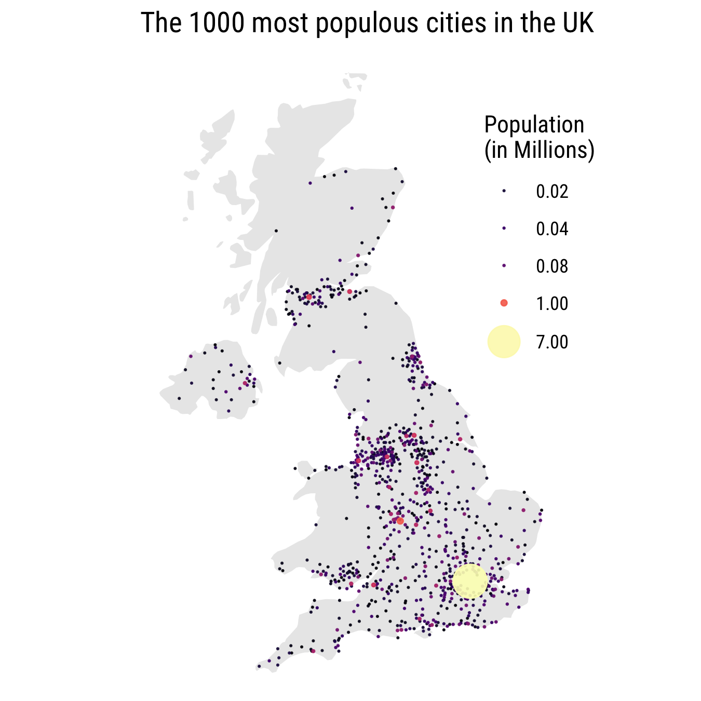

```{r setup, include=FALSE}
source('setup.R')

options(
  htmltools.dir.version = FALSE,
  knitr.table.format = "html",
  knitr.kable.NA = '',
  dplyr.width = Inf,
  width = 250
)

knitr::opts_chunk$set(
  cache = FALSE,
  warning = FALSE,
  message = FALSE,
  fig.path = "figs/",
  fig.width = 7.252,
  fig.height = 4,
  comment = "#>",
  fig.retina = 3
)

# Setup xaringanExtra options
xaringanExtra::use_xaringan_extra(c(
  "tile_view", "panelset", "clipboard", "share_again"))
xaringanExtra::style_share_again(share_buttons = "none")
xaringanExtra::use_extra_styles(
  hover_code_line = TRUE,
  mute_unhighlighted_code = FALSE
)
xaringanExtra::use_freezeframe(responsive = FALSE)

# Set up website metadata
meta() %>%
  meta_general(
    description = rmarkdown::metadata$subtitle,
    generator = "xaringan and remark.js"
  ) %>%
  meta_name("github-repo" = "emse-eda-gwu/2022-Fall") %>%
  meta_social(
    title = rmarkdown::metadata$title,
    url = "https://eda.seas.gwu.edu/2022-Fall/",
    og_type = "website",
    og_author = "John Paul Helveston",
    twitter_card_type = "summary_large_image",
    twitter_creator = "@johnhelveston"
  )

# Set global theme
theme_set(theme_minimal(base_size = 18))
```

class: middle, inverse

.leftcol30[

<center>

</center>

]

.rightcol70[

# Week `r rmarkdown::metadata$week`: .fancy[`r rmarkdown::metadata$title`]

### `r fontawesome::fa(name = "building-columns", fill = "white")` `r rmarkdown::metadata$subtitle`
### `r fontawesome::fa(name = "user", fill = "white")` `r rmarkdown::metadata$author`
### `r fontawesome::fa(name = "calendar", fill = "white")` `r rmarkdown::metadata$date`

]

---

## Today's data

```{r, eval=FALSE}
milk_production <- read_csv(here::here('data', 'milk_production.csv'))
us_coffee_shops <- read_csv(here::here('data', 'us_coffee_shops.csv'))
```

## New packages:
```{r, eval=FALSE}
install.packages('maps')
install.packages('mapproj')
install.packages('sf')
install.packages('rgeos')
install.packages('rnaturalearth')
devtools::install_github("ropensci/rnaturalearthhires")
devtools::install_github("ropensci/rnaturalearthdata")
```

---

```{r child="topics/0.Rmd"}
```

---

```{r child="topics/1.Rmd"}
```

<!--
How to do it:
https://www.r-graph-gallery.com/map.html
-->

---

# How to make a map

#### Step 1: Load a shape file

a. Use a library

b. Read in a shape file

--

#### Step 2: Plot the shape file

a. Polygon data: `geom_polygon()`

b. Simple Features data: `geom_sf()`

---

## Polygon maps

.leftcol60[.code70[

Get the "World" shape file
```{r}
library(ggplot2)

world <- map_data("world") #<<
head(world)
```

]]

---

## Polygon maps

.leftcol60[.code70[

Get the "World" shape file

```{r}
library(ggplot2)

world <- map_data("world") #<<
```

Make the plot with `geom_polygon()`

```{r, eval=FALSE}
ggplot(world) +
    geom_polygon(aes(x = long, y = lat, group = group), #<<
                 fill = "grey90", color = "grey60")
```

]]

.rightcol40[

<br>
<center>

<center>

]

---

## Polygon maps

.leftcol60[.code70[

Get the "US States" shape file

```{r}
library(ggplot2)

us_states <- map_data("state") #<<
```

Make the plot with `geom_polygon()`

```{r, eval=FALSE}
ggplot(us_states) +
    geom_polygon(aes(x = long, y = lat, group = group), #<<
                 fill = "grey90", color = "grey60")
```

]]

.rightcol40[

<br>
<center>

<center>

]

---

### Simple Features (sf) maps

.leftcol40[.code70[

Library data from [Natural Earth](http://www.naturalearthdata.com/downloads/50m-cultural-vectors/)

```{r, eval=FALSE}
library(rnaturalearth)
library(rnaturalearthdata)

world <- ne_countries( #<<
  scale = "medium", #<<
  returnclass = "sf") #<<

world %>%
    select(name, geometry) %>%
    head()
```

]]

--

.rightcol60[.code70[

```{r, echo=FALSE}
library(rnaturalearth) #<<
library(rnaturalearthdata) #<<

world <- ne_countries(scale = "medium", #<<
                      returnclass = "sf") #<<
world %>%
    select(name, geometry) %>%
    head()
```

]]

---

## Simple Features (sf) maps

.leftcol60[.code70[

Get the "World" shape file

```{r}
library(rnaturalearth)
library(rnaturalearthdata)

world <- ne_countries(
  scale = "medium",
  returnclass = "sf")
```

Make the plot with `geom_sf()`

```{r, eval=FALSE}
library(sf)

ggplot(data = world) +
    geom_sf(fill = "grey90", color = "grey60") #<<
```

]]

.rightcol40[

<br>
<center>

<center>

]

---

## Simple Features (sf) maps

.leftcol[.code70[

Get the "US States" shape file
```{r}
library(rnaturalearth)
library(rnaturalearthdata)

us_states <- ne_states( #<<
    country = 'united states of america', #<<
    returnclass = 'sf')
```

]]

---

## Simple Features (sf) maps

.leftcol[.code70[

Get the "US States" shape file

```{r}
library(rnaturalearth)
library(rnaturalearthdata)

us_states <- ne_states(
    country = 'united states of america',
    returnclass = 'sf')
```

Make the plot with `geom_sf()`

```{r, eval=FALSE}
library(sf)

ggplot(data = us_states) +
    geom_sf(fill = "grey90", color = "grey60") #<<
```

]]

.rightcol[

<br>
<center>

<center>

]

---

## Simple Features (sf) maps

.leftcol60[.code70[

Get the **Continental** "US States" shape file

```{r}
library(rnaturalearth)
library(rnaturalearthdata)

us_states_cont <- ne_states(
    country = 'united states of america',
    returnclass = 'sf') %>%
    filter(! name %in% c('Alaska', 'Hawaii')) #<<
```

Make the plot with `geom_sf()`

```{r, eval=FALSE}
library(sf)

ggplot(data = us_states_cont) +
    geom_sf(fill = "grey90", color = "grey60") #<<
```

]]

.rightcol40[

<br>
<center>

<center>

]

---

## The `maps` package

.leftcol60[.code70[

Includes data on:
- World: world, world.cities, lakes
- US: states, county, state, usa
- France: france
- Italy: italy
- New zealand: nz

Example:

```{r, eval=FALSE}
library(maps)

us_counties <- st_as_sf( #<<
    map("county", plot = FALSE, fill = TRUE)) #<<

ggplot(data = us_counties) +
    geom_sf(fill = 'grey90', color = 'grey60') #<<
```

]]

.rightcol40[

<br>
<center>

<center>

]

---

## Simple Features (sf) maps: `st_read()`

.leftcol60[.code70[

Read in the "World" shape file from [Natural Earth](http://www.naturalearthdata.com/downloads/50m-cultural-vectors/)

```{r, message=FALSE}
library(sf)

world <- st_read(here::here( #<<
    'data', 'natural_earth_countries',
    'ne_50m_admin_0_countries.shp')) %>%
    clean_names()
```

]]

---

## Simple Features (sf) maps: `st_read()`

.leftcol60[.code70[

Read in the "World" shape file

```{r, message=FALSE}
library(sf)

world <- st_read(here::here( #<<
    'data', 'natural_earth_countries',
    'ne_50m_admin_0_countries.shp')) %>%
    clean_names()
```

```{r, eval=FALSE}
ggplot(data = world) +
    geom_sf(fill = "grey90", color = "grey60") #<<
```

]]

.rightcol40[

<br>
<center>

<center>

]

---

## Simple Features (sf) maps: `st_read()`

.leftcol60[.code70[

Read in the "Central Park" shape file [[source]](https://github.com/malcolmbarrett/designing_ggplots)

```{r, message=FALSE}
library(sf)

central_park <- st_read(here::here(
    'data', 'central_park', 'CentralPark.shp'))
```

```{r, eval=FALSE}
ggplot(data = central_park) +
    geom_sf(color = 'grey75')
```

]]

.rightcol40[

<br>
<center>

<center>

]

---

class: inverse

```{r, echo=FALSE}
countdown(
  minutes = 10,
  warn_when = 30,
  update_every = 15,
  top = 0,
  font_size = '2em'
)
```

## Your turn

Use the **rnaturalearth** library to extract and plot the shape files for China and Africa:

<br>

.leftcol[

<center>

</center>

]

.rightcol[

<center>

</center>

]

---

```{r child="topics/2.Rmd"}
```

<!--
Squirrels and dogs plots:
https://designing-ggplots.netlify.com/#71

Hexmaps:
- Use https://www.r-graph-gallery.com/hexbin-map.html
- https://www.r-graph-gallery.com/328-hexbin-map-of-the-usa.html
- Practice with wind data?
-->

---

class: inverse, center, middle

# First rule of adding data to maps:

# .red[Do you need to make a map?]

---

class: center, middle
background-color: #FFF

<center>

</center>

.left[https://xkcd.com/1138/]

---

class: inverse, center, middle

# 1. .orange[Choropleth maps]
# 2. Point maps

---

background-color: #f7fcfd

[Choropleth](https://en.wikipedia.org/wiki/Choropleth_map) - from Greek:

- χῶρος "choros" (area/region)
- πλῆθος "plethos" (multitude)

<center>

</center>

.font70[From reddit: [r/dataisbeautiful by u/GaudyAudi](https://www.reddit.com/r/dataisbeautiful/comments/fgq3d3/oc_us_state_abbreviation_conventions/)]

---

class: inverse, center, middle

# Choropleth maps are easily misleading

---

class: center, middle
background-color: #fff

## Number of events != Number of events **per capita**

<center>

</center>

---

class: center
background-color: #fff

## Manipulating fill scale produces wildly different maps

<center>

</center>

---

class: center
background-color: #fff

## Manipulating fill scale produces wildly different maps

<br>

.leftcol[

<center>

</center>

<br><br>
.left[.font70[Source: [New York Times](https://www.nytimes.com/interactive/2020/04/02/us/coronavirus-social-distancing.html)]]

]

.rightcol[

<center>

</center>

]

---

class: center
background-color: #fff

### Land doesn't vote - people vote

<center>

</center>

By [David Zumbach](https://twitter.com/DavidZumbach/status/1344547411985911808?s=19)

---

class: center
background-color: #fff

# Land doesn't vote - people vote

Election maps from: http://www-personal.umich.edu/~mejn/election/2016/

.cols3[

<center>

</center>

]

.cols3[

<center>

</center>

]

.cols3[

<center>

</center>

]

---

class: middle 

<center>

</center>

.left[.font70[https://xkcd.com/2439/]]

---

class: center
background-color: #fff

## Easy to lie with fake news

<center>

</center>

--

Bottom map is actually [this map](http://www-personal.umich.edu/~mejn/election/2012/countymaprb1024.png) of the 2012 election

---

class: center, middle
background-color: #fff

## (here is what actual crime rates look like)

.leftcol[

2016 Election map [[source]](http://www-personal.umich.edu/~mejn/election/2016/)

<center>

</center>
]

.rightcol[

2014 Crime map [[source]](https://www.washingtonpost.com/graphics/national/crime-rates-by-county/)

<center>

</center>

]

---

class: center
background-color: #fff

# A choropleth alternative: hex maps

.leftcol[

1994 Simpson Diversity Index in US Schools

<center>

</center>
.font80[https://github.com/malcolmbarrett/designing_ggplots]

]

.rightcol[

2016 Electoral College

<center>

</center>
https://fivethirtyeight.com/

]

---

class: center

## How to make a choropleth map

<center>

<center>

---

## How to make a choropleth map

.leftcol60[.code70[

Get the "fill" data

```{r}
milk_2017 <- milk_production %>%
    filter(year == 2017) %>%
    select(name = state, milk_produced) %>%
    mutate(milk_produced = milk_produced / 10^9)
```

Get the "map" data

```{r}
us_states <- ne_states(
    country = 'united states of america',
    returnclass = 'sf') %>%
    filter(! name %in% c('Alaska', 'Hawaii')) %>%
    left_join(milk_2017, by = 'name') #<<
```

]]

--

.rightcol40[

```{r}
us_states %>%
    select(name, milk_produced) %>%
    head()
```

]

---

## How to make a choropleth map

.leftcol60[.code70[

```{r, eval=FALSE}
ggplot(us_states) +
  geom_sf(aes(fill = milk_produced)) + #<<
  scale_fill_viridis(
    option = "plasma",
    limits = c(0, 40)) +
  theme_void(base_size = 15) +
  theme(legend.position = 'bottom') +
  labs(fill = 'Milk produced\n(billions lbs)',
       title = 'Milk Production by State in 2017')
```

]]

.rightcol40[

<br>
<center>

<center>

]

---

## How to make a choropleth map

.leftcol60[.code70[

```{r, eval=FALSE}
ggplot(us_states) +
  geom_sf(aes(fill = milk_produced)) +
  scale_fill_viridis(
    trans = 'sqrt', #<<
    option = "plasma",
    limits = c(0, 40)) +
  theme_void(base_size = 15) +
  theme(legend.position = 'bottom') +
  labs(fill = 'Milk produced\n(billions lbs)',
       title = 'Milk Production by State in 2017')
```

]]

.rightcol40[

Non-linear scale:
<center>

<center>

]

---

class: inverse, center, middle

# 1. Choropleth maps
# 2. .orange[Point maps]

---

class: center

# Points as locations

<center>

</center>

---

class: center

# Points encoding a variable

<center>

</center>

---

class: center

# For point size, use **area**, not radius

# $Area = \pi r^2$

.leftcol[

## Radius

]

.rightcol[

## Area

]

<center>

</center>

---

class: center

.leftcol[

## Radius

<center>

</center>

]

.rightcol[

## Area

<center>

</center>

]

---

class: center

## How to add points to a map

<center>

<center>

---

## How to add points to a map

.leftcol[.code70[

Load the continental US shape file

```{r, eval=FALSE}
us_states_cont <- ne_states(
    country = 'united states of america',
    returnclass = 'sf') %>%
    filter(! name %in% c('Alaska', 'Hawaii'))
```

Read in the coffee shop data

```{r}
us_coffee_shops  <- read_csv(here::here(
    'data', 'us_coffee_shops.csv'))

# Only keep data in continental US
us_coffee_shops <- us_coffee_shops %>%
    filter(lat > 22,    lat < 50,
           long > -150, long < -66)
```

]]

--

.rightcol[

```{r}
head(us_coffee_shops)
```

]

---

## How to add points to a map

.leftcol60[.code70[

Plot coffee shop locations over map

```{r, eval=FALSE}
ggplot() +
  geom_sf(data = us_states_cont) +
  geom_point( #<<
    data = us_coffee_shops, #<<
    aes(x = long, y = lat, color = name), #<<
    size = 0.3) +  #<<
  theme_void(base_size = 15) +
  theme(legend.position = 'bottom') +
  guides(color = guide_legend(
    # Move legend title to top
    title.position = "top",
    # Increase legend point size
    override.aes = list(size = 3))) +
  labs(color = 'Coffee shop',
       title = 'Coffee Shops in the US')
```

]]

.rightcol40[

<br>
<center>

<center>

]

---

class: inverse

```{r, echo=FALSE}
countdown(
  minutes = 15,
  warn_when = 30,
  update_every = 15,
  top = 0,
  font_size = '2em'
)
```

## Your turn

.font90[

Create this map of squirrels in NYC's Central Park using this data from the [Squirrel Census](https://www.thesquirrelcensus.com/):

- The `CentralPark.shp` file in the `data/central_park` folder.
- The `nyc_squirrels.csv` file in the `data` folder.

Hint: The color is mapped to the `primary_fur_color` variable

(More about the Squirrel Census [here](https://www.nytimes.com/interactive/2020/01/08/nyregion/central-park-squirrel-census.html))

]

<center>

<center>

---

class: inverse, center

```{r, echo=FALSE}
countdown(
  minutes = 5,
  warn_when = 30,
  update_every = 1,
  top = 0,
  right = 0,
  font_size = '2em'
)
```

### Intermission

<center>

</center>

---

class: inverse

# Quiz 4

```{r, echo=FALSE}
countdown(
    minutes = 10,
    warn_when = 30,
    update_every = 1,
    bottom = 0,
    left = 0,
    font_size = '4em'
)
```

.leftcol[

### Link is in the #class channel

]

.rightcol[

<center>

</center>

]

---

```{r child="topics/3.Rmd"}
```

<!--
Content from Andrew's slides:
https://datavizf17.classes.andrewheiss.com/class/07-class/

Centroids with labels:
https://www.r-spatial.org/r/2018/10/25/ggplot2-sf-2.html
-->

---

class: center

## What's a map projection?

<center>
<iframe width="700" height="394" src="https://www.youtube.com/embed/kIID5FDi2JQ?start=52" frameborder="0" allow="accelerometer; autoplay; encrypted-media; gyroscope; picture-in-picture" allowfullscreen></iframe>
</center>

---

# What is the best projection?...it depends

<br>

# 1. [Compare projections](http://metrocosm.com/compare-map-projections.html)

<br>

# 2. [Compare country sizes](https://thetruesize.com/)

---

## Using projections

To modify the projection of a map, use `coord_sf(crs = st_crs(XXXX))`

```{r, eval=FALSE}
world <- ne_countries(scale = "medium", returnclass = "sf")
```

--

.cols3[.code60[

.center[Default (long-lat)]

```{r, eval=FALSE}
ggplot(data = world) +
    geom_sf()
```

<center>

<center>

]]

--

.cols3[.code60[

.center[Robinson projection]

```{r, eval=FALSE}
ggplot(data = world) +
    geom_sf() +
    coord_sf(crs = "ESRI:54030") #<<
```

<center>

<center>

]]

--

.cols3[.code60[

.center[Mollweide projection]

```{r, eval=FALSE}
ggplot(data = world) +
    geom_sf() +
    coord_sf(crs = "ESRI:54009") #<<
```

<center>

<center>

]]

---

## Common Projections

ggplot layer:

```{r, eval=FALSE}
coord_sf(crs = "ESRI:XXXX")
```

.leftcol[

**World**

Code  | Projection
------|---------------------------------------------------
**`"ESRI:54030"`** | **Robinson**
`"ESRI:54002"` | Equidistant cylindrical
`"ESRI:54004"` | Mercator
`"ESRI:54008"` | Sinusoidal
`"ESRI:54009"` | Mollweide

]

.rightcol[

**United States**

Code   | Projection
-------|---------------------------------------------------
**`"ESRI:102003"`** | **Albers**
`"ESRI:102004"` | Lambert Conformal Conic
`4269`          | NAD 83

]

---

## US projections

```{r, eval=FALSE}
us_states_cont <- ne_states(country = 'united states of america',
    returnclass = 'sf') %>%
    filter(! name %in% c('Alaska', 'Hawaii'))
```

.cols3[.code70[

NAD 83 projection

```{r, eval=FALSE}
ggplot(data = world) +
    geom_sf() +
    coord_sf(crs = 4269) #<<
```

<center>

<center>

]]

.cols3[.code70[

Mercator


```{r, eval=FALSE}
ggplot(data = world) +
    geom_sf() +
    coord_sf(crs = "ESRI:54004") #<<
```

<center>

<center>

]]

.cols3[.code70[

Albers

```{r, eval=FALSE}
ggplot(data = us_states_cont) +
    geom_sf() +
    coord_sf(crs = "ESRI:102003") #<<
```

<center>

<center>

]]

---

## Mapping data to projections - choropleth map

.leftcol60[.code70[

```{r, eval=FALSE}
milk_2017 <- milk_production %>%
  filter(year == 2017) %>%
  select(name = state, milk_produced) %>%
  mutate(milk_produced = milk_produced / 10^9)

us_states <- ne_states(
  country = 'united states of america',
  returnclass = 'sf') %>%
  filter(! name %in% c('Alaska', 'Hawaii')) %>%
  left_join(milk_2017, by = 'name') #<<

ggplot(us_states) +
  geom_sf(aes(fill = milk_produced)) + #<<
  scale_fill_viridis(
    option = "plasma",
    limits = c(0, 40)) +
  theme_void(base_size = 15) +
  theme(legend.position = 'bottom') +
  labs(fill = 'Milk produced\n(billions lbs)',
       title = 'Milk Production by State in 2017')
```

]]

.rightcol40[

<br>
<center>

<center>

]

---

## Mapping data to projections - choropleth map

.leftcol60[.code70[

```{r, eval=FALSE}
milk_2017 <- milk_production %>%
  filter(year == 2017) %>%
  select(name = state, milk_produced) %>%
  mutate(milk_produced = milk_produced / 10^9)

us_states <- ne_states(
  country = 'united states of america',
  returnclass = 'sf') %>%
  filter(! name %in% c('Alaska', 'Hawaii')) %>%
  left_join(milk_2017, by = 'name')

ggplot(us_states) +
  geom_sf(aes(fill = milk_produced)) +
  scale_fill_viridis(
    option = "plasma",
    limits = c(0, 40)) +
  theme_void(base_size = 15) +
  theme(legend.position = 'bottom') +
  labs(fill = 'Milk produced\n(billions lbs)',
       title = 'Milk Production by State in 2017') +
  coord_sf(crs = "ESRI:102003") #<<
```

]]

.rightcol40[

<center>
Albers Projection


<center>

]

---

**Mapping data to projections - points**

.leftcol60[.code60[

```{r, eval=FALSE}
us_states_cont <- ne_states(
  country = 'united states of america',
  returnclass = 'sf') %>%
  filter(! name %in% c('Alaska', 'Hawaii'))

us_coffee_shops <- us_coffee_shops %>%
  filter(lat > 22,    lat < 50,
         long > -150, long < -66)

ggplot() +
  geom_sf(data = us_states_cont) +
  geom_point( #<<
    data = us_coffee_shops, #<<
    aes(x = long, y = lat, color = name), #<<
    size = 0.3) + #<<
  theme_void(base_size = 15) +
  theme(legend.position = 'bottom') +
  guides(color = guide_legend(
    # Move legend title to top
    title.position = "top",
    # Increase legend point size
    override.aes = list(size = 3))) +
  labs(color = 'Coffee shop',
       title = 'Coffee Shops in the US')
```

]]

.rightcol40[

<center>

<center>

]

---

**Mapping data to projections - points**

.leftcol60[.code60[

```{r, eval=FALSE}
us_states_cont <- ne_states(
  country = 'united states of america',
  returnclass = 'sf') %>%
  filter(! name %in% c('Alaska', 'Hawaii'))

us_coffee_shops <- us_coffee_shops %>%
  filter(lat > 22,    lat < 50,
         long > -150, long < -66)

ggplot() +
  geom_sf(data = us_states_cont) +
  geom_point(
    data = us_coffee_shops,
    aes(x = long, y = lat, color = name),
    size = 0.3) +
  theme_void(base_size = 15) +
  theme(legend.position = 'bottom') +
  guides(color = guide_legend(
    # Move legend title to top
    title.position = "top",
    # Increase legend point size
    override.aes = list(size = 3))) +
  labs(color = 'Coffee shop',
       title = 'Coffee Shops in the US') +
  coord_sf(crs = "ESRI:102003") #<<
```

]]

.rightcol40[

### .center[.red[Fail!]]

<center>

<center>

]

---

## Mapping data to projections - points

First match `us_coffee_shops` crs to `us_states_cont`

.leftcol60[.code70[

```{r}
us_states_cont <- ne_states(
    country = 'united states of america',
    returnclass = 'sf') %>%
    filter(! name %in% c('Alaska', 'Hawaii'))

us_coffee_shops <- us_coffee_shops %>%
    filter(lat > 22,    lat < 50,
           long > -150, long < -66)

us_coffee_shops_sf <- st_as_sf(us_coffee_shops, #<<
    coords = c("long", "lat"), #<<
    crs = st_crs(us_states_cont)) #<<
```

]]

.rightcol40[

```{r}
head(us_coffee_shops_sf)
```

]

---

## Mapping data to projections - points

Plot coffee shop locations over map with `geom_sf()`

.leftcol60[.code70[

```{r, eval=FALSE}
ggplot() +
  geom_sf(data = us_states_cont) +
  geom_sf( #<<
    data = us_coffee_shops_sf, #<<
    aes(color = name), #<<
    size = 0.3) + #<<
  theme_void(base_size = 15) +
  theme(legend.position = 'bottom') +
  guides(color = guide_legend(
    # Move legend title to top
    title.position = "top",
    # Increase legend point size
    override.aes = list(size = 3))) +
  labs(fill = 'Coffee shop',
       title = 'Coffee Shops in the US')
```

]]

.rightcol40[

<center>

<center>

]

---

## Mapping data to projections - points

Plot coffee shop locations over map with `geom_sf()`

.leftcol60[.code70[

```{r, eval=FALSE}
ggplot() +
  geom_sf(data = us_states_cont) +
  geom_sf(
    data = us_coffee_shops_sf,
    aes(color = name),
    size = 0.3) +
  theme_void(base_size = 15) +
  theme(legend.position = 'bottom') +
  guides(color = guide_legend(
    # Move legend title to top
    title.position = "top",
    # Increase legend point size
    override.aes = list(size = 3))) +
  labs(fill = 'Coffee shop',
       title = 'Coffee Shops in the US') +
  coord_sf(crs = "ESRI:102003") #<<
```

]]

.rightcol40[

<center>
Albers Projection


<center>

]

---

## Mapping data to projections - points

Plot coffee shop locations over map with `geom_sf()`

.leftcol60[.code70[

```{r, eval=FALSE}
ggplot() +
  geom_sf(data = us_states_cont) +
  geom_sf(
    data = us_coffee_shops_sf,
    aes(color = name),
    size = 0.3) +
  theme_void(base_size = 15) +
  theme(legend.position = 'bottom') +
  guides(color = guide_legend(
    # Move legend title to top
    title.position = "top",
    # Increase legend point size
    override.aes = list(size = 3))) +
  labs(fill = 'Coffee shop',
       title = 'Coffee Shops in the US') +
  coord_sf(crs = "ESRI:102004") #<<
```

]]

.rightcol40[

<center>
LCC Projection


<center>

]

---

class: inverse

```{r, echo=FALSE}
countdown(
  minutes = 20,
  warn_when = 30,
  update_every = 15,
  top = 0,
  left = 0,
  font_size = '2em'
)
```

.leftcol60[.font80[

## .center[Your turn]

Use the `internet_users_country.csv` data and the `world` data frame from the **rnaturalearth** library to create these two versions of internet access by country in 2015.

Hints:

- The `iso_a3` variable in the `worlds` data frame corresponds with the `code` variable in the `internet_users_country.csv` data frame (use this for joining).
- Use `scale_fill_gradient()` to fill the color:

```{r, eval=FALSE}
scale_fill_gradient(
    low = "#e7e1ef",
    high = "#dd1c77",
    na.value = "grey70",
    limits = c(0, 100))
```

]]

.rightcol40[

<center>
Robinson Projection


Mercator Projection

<center>

]

---

class: inverse, middle, center

# Extra practice

---

class: inverse

## Your turn

```{r, echo=FALSE}
countdown(
  minutes = 15,
  warn_when = 30,
  update_every = 15,
  top = 0,
  font_size = '2em'
)
```

Use the `us_states_cont` data frame and the `state_abbs` data frame to create a labeled map of the U.S.:


