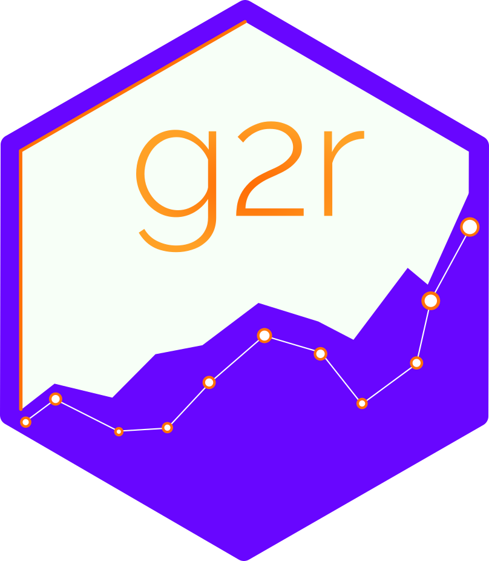

```{r install, echo=FALSE, message=FALSE, warning=FALSE}
# These packages are needed
# Use these commands to install them if you have not already
# install.packages('plotly')
# install.packages('htmlwidgets')
# install.packages('htmltools')
# install.packages('leaflet')
# install.packages('DT')
# install.packages('reactable')
# install.packages('reactablefmtr')
# install.packages('sparkline')

# Install these for maps (in case you didn't last week)
# install.packages('maps')
# install.packages('sf')
# install.packages('rgeos')
# install.packages('devtools')
# install.packages('rnaturalearth')
# devtools::install_github("ropensci/rnaturalearthhires")
# devtools::install_github("ropensci/rnaturalearthdata")
```

```{r setup, include=FALSE}
library(knitr)
library(tidyverse)
library(fontawesome)
library(countdown)
library(metathis)
library(viridis)
library(cowplot)
library(rnaturalearth)
library(rnaturalearthhires)
library(rnaturalearthdata)

# New
library(leaflet)
library(plotly)
library(DT)
library(reactable)
library(reactablefmtr)
library(sparkline)

options(
    htmltools.dir.version = FALSE,
    knitr.table.format = "html",
    knitr.kable.NA = '',
    dplyr.width = Inf,
    width = 250
)

knitr::opts_chunk$set(
    cache = FALSE,
    warning = FALSE,
    message = FALSE,
    fig.path = "figs/",
    fig.width = 7.252,
    fig.height = 4,
    comment = "#>",
    fig.retina = 3
)

# Setup xaringanExtra options
xaringanExtra::use_xaringan_extra(c(
  "tile_view", "panelset", "clipboard", "share_again"))
xaringanExtra::style_share_again(share_buttons = "none")
xaringanExtra::use_extra_styles(
  hover_code_line = TRUE,
  mute_unhighlighted_code = FALSE
)
# xaringanExtra::use_freezeframe()

# Set up website metadata
meta() %>%
  meta_general(
    description = rmarkdown::metadata$subtitle,
    generator = "xaringan and remark.js"
  ) %>%
  meta_name("github-repo" = "emse-eda-gwu/2022-Fall") %>%
  meta_social(
    title = rmarkdown::metadata$title,
    url = "https://eda.seas.gwu.edu/2022-Fall/",
    og_type = "website",
    og_author = "John Paul Helveston",
    twitter_card_type = "summary_large_image",
    twitter_creator = "@johnhelveston"
  )

# Read in data sets for class
gapminder <- read_csv(here::here("data", "gapminder.csv"))
coffee_shops <- read_csv(here::here("data", "us_coffee_shops.csv"))
milk_production <- read_csv(here::here('data', 'milk_production.csv'))
internet_users <- read_csv(here::here('data', 'internet_users_country.csv'))

# Process
dc_coffee_shops <- coffee_shops %>%
  filter(state == "District of Columbia")
milk_2017 <- milk_production %>%
  filter(year == 2017) %>%
  select(name = state, milk_produced) %>%
  mutate(milk_produced = milk_produced / 10^9)
state_milk <- ne_states(
  country = 'united states of america',
  returnclass = 'sf') %>%
  left_join(milk_2017, by = 'name') %>%
  mutate(label = paste(
    name, ": ", round(milk_produced, 2), " B lbs", sep = ""))
world_internet_2015 <- ne_countries(
  scale = "medium", returnclass = "sf") %>%
  select(code = iso_a3) %>%
  left_join(internet_users, by = "code") %>%
  filter(year == 2015)
```

class: middle, inverse

.leftcol30[

<center>

</center>

]

.rightcol70[

# Week `r rmarkdown::metadata$week`: .fancy[`r rmarkdown::metadata$title`]

### `r fontawesome::fa(name = "building-columns", fill = "white")` `r rmarkdown::metadata$subtitle`
### `r fontawesome::fa(name = "user", fill = "white")` `r rmarkdown::metadata$author`
### `r fontawesome::fa(name = "calendar", fill = "white")` `r rmarkdown::metadata$date`

]

---

```{r child="topics/0.Rmd"}
```

---

```{r child="topics/1.Rmd"}
```

---

## [Plotly](https://plotly.com/graphing-libraries/) uses JavaScript to create interactive charts

--

### But you don't have to know JavaScript to use it! `r emo::ji("tada")`

---

### Turn any ggplot into an interactive chart with `ggplotly()`

.leftcol[

```{r gapminder, fig.show='hide'}
plot <- gapminder %>%
  filter(year == 2007) %>%
  ggplot(aes(x = gdpPercap, y = lifeExp,
             size = pop, color = continent,
             label = country)) + #<<
  geom_point(alpha = 0.7) +
  scale_color_brewer(palette = 'Set2') +
  scale_size_area(
    guide = FALSE, max_size = 25) +
  scale_x_log10() +
  theme_bw(base_size = 16) +
  labs(x = 'GDP per capita',
       y = 'Life expectancy',
       color = 'Continent')

plot
```

]

.rightcol[

```{r gapminder-2, ref.label="gapminder", fig.width=7, fig.height=5, echo=FALSE}
```

]

---

### Turn any ggplot into an interactive chart with `ggplotly()`

.leftcol[

```{r, eval=FALSE}
ggplotly(plot)
```

]

.rightcol[

```{r gapminder_plotly, echo=FALSE}
# Embedding as a iframe since direct rendering produces poor results, see
# https://github.com/rstudio/htmltools/issues/90
htmltools::tags$iframe(
  src         = file.path('figs', 'gapminder.html'),
  width       = "100%",
  height      = "400",
  scrolling   = "no",
  seamless    = "seamless",
  frameBorder = "0"
)
```

]

---

### Modify the data shown with `tooltip` argument

.leftcol[

```{r, eval=FALSE}
ggplotly(
  plot,
  tooltip = c("country", "pop") #<<
)
```

]

.rightcol[

```{r gapminder_plotly_tooltip, echo=FALSE}
htmltools::tags$iframe(
  src         = file.path('figs', 'gapminder_tooltip.html'),
  width       = "100%",
  height      = "400",
  scrolling   = "no",
  seamless    = "seamless",
  frameBorder = "0"
)
```

]

---

### Modify other features by piping on `plotly` [functions](https://plotly.com/r/plotly-fundamentals/)

.leftcol[

```{r, eval=FALSE}
ggplotly(
  plot,
  tooltip = c("country", "pop")
) %>%
  layout(legend = list( #<<
    orientation = "h", x = 0, y = -0.3)) #<<
```

]

.rightcol[

```{r gapminder_plotly_legend, echo=FALSE}
htmltools::tags$iframe(
  src         = file.path('figs', 'gapminder_legend.html'),
  width       = "100%",
  height      = "500",
  scrolling   = "no",
  seamless    = "seamless",
  frameBorder = "0"
)
```

]

---

class: center, middle

## Reference guide: https://plotly.com/ggplot2/

---

## Make interactive charts with `plot_ly()`


### (More examples here: https://plotly.com/r/)

.leftcol[

```{r, eval=FALSE}
plot_ly( #<<
  data = gapminder %>% filter(year == 2007),
  type = 'scatter',
  x = ~gdpPercap,
  y = ~lifeExp,
  size = ~pop,
  color = ~continent,
  text = ~country,
  mode = "markers",
  sizes = c(10, 1000),
  marker = list(opacity = 0.5),
  hoverinfo = "text"
  ) %>%
  layout(xaxis = list(type = "log"))
```

]

.rightcol[

```{r plot_ly, echo=FALSE}
htmltools::tags$iframe(
  src         = file.path('figs', 'gapminder_plot_ly.html'),
  width       = "100%",
  height      = "400",
  scrolling   = "no",
  seamless    = "seamless",
  frameBorder = "0"
)
```

]

---

## Animation is relatively easy with `plot_ly()`

.leftcol[

```{r, eval=FALSE}
plot_ly(
  data = gapminder, #<<
  type = 'scatter',
  x = ~gdpPercap,
  y = ~lifeExp,
  size = ~pop,
  color = ~continent,
  text = ~country,
  frame = ~year, #<<
  mode = "markers",
  sizes = c(10, 1000),
  marker = list(opacity = 0.5),
  hoverinfo = "text"
  ) %>%
  layout(xaxis = list(type = "log"))
```

]

.rightcol[

```{r plot_ly_anim, echo=FALSE}
htmltools::tags$iframe(
  src         = file.path('figs', 'gapminder_plot_ly_anim.html'),
  width       = "100%",
  height      = "400",
  scrolling   = "no",
  seamless    = "seamless",
  frameBorder = "0"
)
```

]

---

### Save as html page

```{r, eval=FALSE}
htmlwidgets::saveWidget(
  ggplotly(plot),
  file = here::here('figs', 'gapminder.html')
)
```

--

### Insert using iframe

```{r, eval=FALSE}
htmltools::tags$iframe(
  src         = here::here('figs', 'gapminder.html'),
  width       = "100%",
  height      = "400",
  scrolling   = "no",
  seamless    = "seamless",
  frameBorder = "0"
)
```

---

class: center

## One more option: https://g2r.opifex.org/index.html

<center>

</center>

---

class: inverse

```{r, echo=FALSE}
countdown(
  minutes = 10,
  warn_when = 30,
  update_every = 15,
  top = 0,
  font_size = '2em'
)
```

## Your Turn: Interactive Charts

1. Open your reflection from this past week
2. Take turns sharing your interactive chart
3. With a classmate, go back to a chart we made in a previous class and make it interactive using either `ggplotly()` or `plot_ly()`

When 10 minutes is up, we will share 3 examples.

---

```{r child="topics/2.Rmd"}
```

---

# Make pretty static tables with `kable()`

.font70[
```{r}
library(knitr)

gapminder %>%
  kable() #<<
```

]

---

# Behind the scenes:

`kable()` generates the code to make a pretty table

```{r, eval=FALSE}
gapminder %>%
  kable(format = "pipe") #<<
```
```{r, results='asis', echo=FALSE}
cat(knitr::kable(gapminder, format = "pipe"))
```

---

# Behind the scenes:

`kable()` generates the code to make a pretty table

```{r, eval=FALSE}
gapminder %>%
  kable(format = "html") #<<
```
```{r, echo=FALSE}
cat(kable(gapminder, format = "html"))
```

---

class: inverse, middle, center

# Make _interactive_ tables with:

## `DT::datatable()`

---

## Make _interactive_ tables with `datatable()`

.leftcol40[

```{r, eval=FALSE}
library(DT)

gapminder %>%
  datatable() #<<
```

]

.rightcol60[

```{r gapminder_dt, echo=FALSE}
htmltools::tags$iframe(
  src         = file.path('figs', 'gapminder_dt.html'),
  width       = "100%",
  height      = "500",
  scrolling   = "yes",
  seamless    = "seamless",
  frameBorder = "0"
)
```

]

---

## Make _interactive_ tables with `datatable()`

.leftcol40[

```{r, eval=FALSE}
gapminder %>%
  datatable(
    options = list( #<<
      pageLength = 5, #<<
      lengthMenu = c(5, 10, 15, 20)) #<<
  )
```

]

.rightcol60[

```{r gapminder_dt_pages, echo=FALSE}
htmltools::tags$iframe(
  src         = file.path('figs', 'gapminder_dt_pages.html'),
  width       = "100%",
  height      = "500",
  scrolling   = "yes",
  seamless    = "seamless",
  frameBorder = "0"
)
```

]

---

## Modify features by piping on [functions](https://rstudio.github.io/DT/functions.html)

.leftcol40[

```{r, eval=FALSE}
gapminder %>%
  datatable() %>%
  formatCurrency('gdpPercap') %>%  #<<
  formatStyle( #<<
    'country',  #<<
    color = 'red',  #<<
    backgroundColor = 'black',  #<<
    fontWeight = 'bold') #<<
```

]

.rightcol60[

```{r gapminder_dt_style, echo=FALSE}
htmltools::tags$iframe(
  src         = file.path('figs', 'gapminder_dt_style.html'),
  width       = "100%",
  height      = "500",
  scrolling   = "yes",
  seamless    = "seamless",
  frameBorder = "0"
)
```

]

---

## Modify features by piping on [functions](https://rstudio.github.io/DT/functions.html)

.leftcol40[

```{r, eval=FALSE}
gapminder %>%
  datatable() %>%
  formatCurrency('gdpPercap') %>%
  formatStyle(
    'country',
    color = 'red',
    backgroundColor = 'black',
    fontWeight = 'bold') %>%
  formatStyle( #<<
    'lifeExp',  #<<
    background = styleColorBar( #<<
      gapminder$lifeExp, 'dodgerblue'), #<<
    backgroundSize = '100% 90%',  #<<
    backgroundRepeat = 'no-repeat', #<<
    backgroundPosition = 'center')  #<<
```

]

.rightcol60[

```{r gapminder_dt_bars, echo=FALSE}
htmltools::tags$iframe(
  src         = file.path('figs', 'gapminder_dt_bars.html'),
  width       = "100%",
  height      = "500",
  scrolling   = "yes",
  seamless    = "seamless",
  frameBorder = "0"
)
```

]

---

class: inverse, middle, center

# Make _interactive_ tables with:

## `reactable::reactable()`

---

## Make _interactive_ tables with `reactable()`

.leftcol40[

```{r, eval=FALSE}
library(reactable)

gapminder %>%
  reactable() #<<
```

]

.rightcol60[

```{r gapminder_reactable, echo=FALSE}
htmltools::tags$iframe(
  src         = file.path('figs', 'gapminder_reactable.html'),
  width       = "100%",
  height      = "500",
  scrolling   = "yes",
  seamless    = "seamless",
  frameBorder = "0"
)
```

]

---

## `reactable()` has some nice [options](https://glin.github.io/reactable/articles/examples.html)!

.leftcol40[

```{r, eval=FALSE}
library(reactable)

gapminder %>%
  reactable(
    searchable = TRUE, #<<
    highlight = TRUE, #<<
    filterable = TRUE, #<<
    defaultPageSize = 5, #<<
    showPageSizeOptions = TRUE, #<<
    pageSizeOptions = c(5, 10, 15) #<<
  )
```

]

.rightcol60[

```{r gapminder_reactable_options, echo=FALSE}
htmltools::tags$iframe(
  src         = file.path('figs', 'gapminder_reactable_options.html'),
  width       = "100%",
  height      = "500",
  scrolling   = "yes",
  seamless    = "seamless",
  frameBorder = "0"
)
```

]

---

## Add more features with  [`reactablefmtr`](https://kcuilla.github.io/reactablefmtr/index.html) library

.leftcol40[

```{r, eval=FALSE}
library(reactable)
library(reactablefmtr) #<<

gapminder %>%
  reactable(
    searchable = TRUE,
    highlight = TRUE,
    filterable = TRUE,
    defaultPageSize = 5,
    showPageSizeOptions = TRUE,
    pageSizeOptions = c(5, 10, 15)
    columns = list( #<<
      lifeExp = colDef(cell = data_bars_pos_neg( #<<
        gapminder, #<<
        colors = c("#d7191c", "#ffffbf", "#1a9641")), #<<
      align = "center")) ## align column header #<<
  ) #<<
```

]

.rightcol60[

```{r gapminder_reactable_bars, echo=FALSE}
htmltools::tags$iframe(
  src         = file.path('figs', 'gapminder_reactable_bars.html'),
  width       = "100%",
  height      = "500",
  scrolling   = "yes",
  seamless    = "seamless",
  frameBorder = "0"
)
```

]

---

## Add more features with `sparkline` library [(example)](https://glin.github.io/reactable/articles/examples.html#embedding-html-widgets)

.leftcol40[.code60[

```{r, eval=FALSE}
library(reactable)
library(sparkline) #<<

gapminder_summary <- gapminder %>%
  group_by(country) %>%
  summarise(lifeExp = list(lifeExp)) %>%
  mutate(leftExpTrend = NA)

gapminder_reactable_sparkline <- gapminder_summary %>%
  reactable(
    searchable = TRUE,
    highlight = TRUE,
    filterable = TRUE,
    defaultPageSize = 5,
    showPageSizeOptions = TRUE,
    columns = list( #<<
      lifeExp = colDef( #<<
        cell = function(values) { #<<
          sparkline( #<<
            values, type = "bar", chartRangeMin = 0,  #<<
            chartRangeMax = max(gapminder$lifeExp)) #<<
        }), #<<
      leftExpTrend = colDef( #<<
        cell = function(value, index) { #<<
          sparkline(gapminder_summary$lifeExp[[index]]) #<<
        }) #<<
  )) #<<
```

]]

.rightcol60[

```{r gapminder_reactable_sparkline, echo=FALSE}
htmltools::tags$iframe(
  src         = file.path('figs', 'gapminder_reactable_sparkline.html'),
  width       = "100%",
  height      = "500",
  scrolling   = "yes",
  seamless    = "seamless",
  frameBorder = "0"
)
```

]

---

# References:

## - https://rstudio.github.io/DT/
## - https://glin.github.io/reactable/
## - https://kcuilla.github.io/reactablefmtr/

---

class: inverse

```{r, echo=FALSE}
countdown(
  minutes = 20,
  warn_when = 30,
  update_every = 15,
  top = 0,
  font_size = '2em'
)
```

## Your Turn: Interactive Tables

.leftcol40[

Use `reactable()` to make the following interactive table

Read [this example](https://kcuilla.github.io/reactablefmtr/articles/reactablefmtr_cookbook.html#embed-images) on how to embed images in table cells, then use the `gapminder_flags` data frame to make the interactive table.
]

.rightcol60[

```{r gapminder_reactable_flags, echo=FALSE}
htmltools::tags$iframe(
  src         = file.path('figs', 'gapminder_reactable_flags.html'),
  width       = "100%",
  height      = "500",
  scrolling   = "yes",
  seamless    = "seamless",
  frameBorder = "0"
)
```

]


---

class: inverse, center

```{r, echo=FALSE}
countdown(
  minutes = 5,
  warn_when = 30,
  update_every = 1,
  left = 0, right = 0, top = 1, bottom = 0,
  margin = "5%",
  font_size = "8em"
)
```

# Intermission

---

```{r child="topics/3.Rmd"}
```

---

## Make interactive maps with `leaflet`

.leftcol[

```{r, eval=FALSE}
library(leaflet)

# Default tiles: OpenStreetMap
leaflet() %>%
  addTiles() #<<
```

]

.rightcol[

```{r map_blank, echo=FALSE, fig.width=8, fig.height=6, fig.align='center'}
leaflet() %>%
  addTiles()
```

]

---

## Use `setView()` to set a start location

.leftcol[

```{r, eval=FALSE}
leaflet() %>%
  addTiles() %>%
  setView( #<<
    lat = 38.900671142379586,  #<<
    lng = -77.05094820047492, #<<
    zoom = 16) #<<
```

Coordinates from [Google Maps](https://www.google.com/maps)

]

.rightcol[

```{r map_gw, echo=FALSE, fig.width=8, fig.height=6, fig.align='center'}
leaflet() %>%
  addTiles() %>%
  setView( #<<
    lat = 38.900671142379586,  #<<
    lng = -77.05094820047492, #<<
    zoom = 16) #<<
```

]

---

## Use `addMarkers()` to add markers

.leftcol[

```{r, eval=FALSE}
leaflet() %>%
  addTiles() %>%
  setView(
    lat = 38.900671142379586,
    lng = -77.05094820047492,
    zoom = 16) %>%
  addMarkers( #<<
    lat = 38.900671142379586,  #<<
    lng = -77.05094820047492, #<<
    popup = "GWU!!!") #<<
```

]

.rightcol[

```{r map_gw_popup, echo=FALSE, fig.width=8, fig.height=6, fig.align='center'}
leaflet() %>%
  addTiles() %>%
  setView(
    lat = 38.900671142379586,
    lng = -77.05094820047492,
    zoom = 16) %>%
  addMarkers( #<<
    lat = 38.900671142379586,  #<<
    lng = -77.05094820047492, #<<
    popup = "GWU!!!") #<<
```

]

---

## Change the tiles with `addProviderTiles()`

.leftcol[

```{r, eval=FALSE}
leaflet() %>%
  # addTiles() %>%
  addProviderTiles(providers$OpenTopoMap) %>%  #<<
  setView(
    lat = 38.900671142379586,
    lng = -77.05094820047492,
    zoom = 16) %>%
  addMarkers(
    lat = 38.900671142379586,
    lng = -77.05094820047492,
    popup = "GWU!!!")
```

Go [here](https://leaflet-extras.github.io/leaflet-providers/preview/) to get other tiles

]

.rightcol[

```{r map_gw_tiles, echo=FALSE, fig.width=8, fig.height=6, fig.align='center'}
leaflet() %>%
  addProviderTiles(providers$OpenTopoMap) %>%
  setView(
    lat = 38.900671142379586,
    lng = -77.05094820047492,
    zoom = 16) %>%
  addMarkers(
    lat = 38.900671142379586,
    lng = -77.05094820047492,
    popup = "GWU!!!")
```

]

---

class: middle, inverse

# Overlaying data with leaflet

## - .orange[Points]
## - Choropleth maps

---

## Points example: coffee data

```{r}
coffee_shops <- read_csv(here::here("data", "us_coffee_shops.csv"))

# Let's just look at MD
dc_coffee_shops <- coffee_shops %>%
  filter(state == "District of Columbia")

head(dc_coffee_shops)
```

---

## Overlay points with `addCircleMarkers()`

.leftcol[
```{r, eval=FALSE}
leaflet(data = dc_coffee_shops) %>% #<<
  addTiles() %>%
  addCircleMarkers( #<<
    lng = ~long,  #<<
    lat = ~lat,  #<<
    popup = ~name, #<<
    radius = 2) #<<
```

]

.rightcol[

```{r map_coffee_base, echo=FALSE, fig.width=8, fig.height=6, fig.align='center'}
leaflet(data = dc_coffee_shops) %>%
  addTiles() %>%
  addCircleMarkers(
    lng = ~long,
    lat = ~lat,
    popup = ~name,
    radius = 2)
```

]

---

## Make a color pallete with `colorFactor()`

.leftcol[

Make the palette

```{r}
pal <- colorFactor(
  palette = "Set2",
  levels  = c(
    "Starbucks",
    "Dunkin' Donuts",
    "Peet's Coffee & Tea",
    "Baskin Robbins",
    "The Coffee Bean & Tea Leaf"))
```

]

--

.rightcol[

`pal()` links the shop _name_ to a _color_:

```{r}
pal("Starbucks")
pal("Dunkin' Donuts")
pal("Baskin Robbins")
```

]

---

## Use `pal()` to color the points

.leftcol[

```{r, eval=FALSE}
leaflet(data = dc_coffee_shops) %>%
  addTiles() %>%
  addCircleMarkers(
    lng = ~long,
    lat = ~lat,
    popup = ~name,
    color = ~pal(name),  #<<
    radius = 2)
```

]

.rightcol[

```{r map_coffee_color, echo=FALSE, fig.width=8, fig.height=6, fig.align='center'}
leaflet(data = dc_coffee_shops) %>%
  addTiles() %>%
  addCircleMarkers(
    lng = ~long,
    lat = ~lat,
    popup = ~name,
    color = ~pal(name),  #<<
    radius = 2)
```

]

---

## Use a dark tile scheme to make colors pop

.leftcol[.code60[

```{r, eval=FALSE}
leaflet(data = dc_coffee_shops) %>%
  # addTiles() %>%
  addProviderTiles(providers$CartoDB.DarkMatter) %>%  #<<
  addCircleMarkers(
    lng = ~long,
    lat = ~lat,
    popup = ~name,
    color = ~pal(name),
    radius = 2)
```

]]

.rightcol[

```{r map_coffee_color_dark, echo=FALSE, fig.width=8, fig.height=6, fig.align='center'}
leaflet(data = dc_coffee_shops) %>%
  addProviderTiles(providers$CartoDB.DarkMatter) %>%
  addCircleMarkers(
    lng = ~long,
    lat = ~lat,
    popup = ~name,
    color = ~pal(name),
    radius = 2)
```

]

---

## Add a legend with `addLegend()`

.leftcol[.code60[

```{r, eval=FALSE}
leaflet(data = dc_coffee_shops) %>%
  addProviderTiles(providers$CartoDB.DarkMatter) %>%
  addCircleMarkers(
    lng = ~long,
    lat = ~lat,
    popup = ~name,
    color = ~pal(name),
    radius = 2) %>%
  addLegend( #<<
    position = "bottomright", #<<
    pal = pal, #<<
    values = ~name, #<<
    title = "Coffee Shop", #<<
    opacity = 1) #<<
```

]]

.rightcol[

```{r map_coffee_color_legend, echo=FALSE, fig.width=8, fig.height=6, fig.align='center'}
htmltools::tags$iframe(
  src         = file.path('figs', 'coffee_map.html'),
  width       = "100%",
  height      = "400",
  scrolling   = "no",
  seamless    = "seamless",
  frameBorder = "0"
)
```

]

---

class: middle, inverse

# Overlaying data with leaflet

## - Points
## - .orange[Choropleth maps]

---

## How to make a choropleth `leaflet` map

.leftcol60[.code70[

Get the "fill" data

```{r}
milk_production <- read_csv(here::here(
  'data', 'milk_production.csv'))

milk_2017 <- milk_production %>%
  filter(year == 2017) %>%
  select(name = state, milk_produced) %>%
  mutate(milk_produced = milk_produced / 10^9)
```

Join to my "map" data

```{r}
library(rnaturalearth)

state_milk <- ne_states(
  country = 'united states of america',
  returnclass = 'sf') %>%
  left_join(milk_2017, by = 'name') #<<
```

]]

--

.rightcol40[

```{r}
state_milk %>%
  select(name, milk_produced) %>%
  head()
```

]

---

## Add state shapes with `addPolygons()`

.leftcol[

Notice that I didn't include `addTiles()`

```{r, eval=FALSE}
leaflet(data = state_milk) %>%
  setView(-96, 37.8, 4) %>%
  addPolygons() #<<
```

]

.rightcol[

```{r state_milk, echo=FALSE, fig.width=8, fig.height=6, fig.align='center'}
leaflet(data = state_milk) %>%
  setView(-96, 37.8, 4) %>%
  addPolygons() #<<
```

]

---

## Make a color pallete with `colorBin()`

.leftcol[

Make the palette

```{r}
pal <- colorBin(
  palette = "YlOrRd",
  domain = state_milk$milk_produced)
```

]

--

.rightcol[

`pal()` links the milk produced color:

```{r}
pal(1)
pal(10)
pal(20)
```

]

---

## Use `pal()` to fill the polygons

.leftcol[

```{r, eval=FALSE}
pal <- colorBin(
  palette = "YlOrRd",
  domain = state_milk$milk_produced)

leaflet(data = state_milk) %>%
  setView(-96, 37.8, 4) %>%
  addPolygons(
    fillColor = ~pal(milk_produced), #<<
    weight = 2,
    opacity = 1,
    color = "white",
    dashArray = "3",
    fillOpacity = 0.7)
```

]

.rightcol[

```{r state_milk_fill, echo=FALSE, fig.width=8, fig.height=6, fig.align='center'}
leaflet(data = state_milk) %>%
  setView(-96, 37.8, 4) %>%
  addPolygons(
    fillColor = ~pal(milk_produced), #<<
    weight = 2,
    opacity = 1,
    color = "white",
    dashArray = "3",
    fillOpacity = 0.7)
```

]

---

## Manually set bins in `pal()`

.leftcol[

```{r, eval=FALSE}
pal <- colorBin(
  palette = "YlOrRd",
  bins = round(seq(0, sqrt(40), length.out = 8)^2, 1), #<<
  domain = state_milk$milk_produced)

leaflet(data = state_milk) %>%
  setView(-96, 37.8, 4) %>%
  addPolygons(
    fillColor = ~pal(milk_produced),
    weight = 2,
    opacity = 1,
    color = "white",
    dashArray = "3",
    fillOpacity = 0.7)
```

]

.rightcol[

```{r state_milk_fill_bins, echo=FALSE, fig.width=8, fig.height=6, fig.align='center'}
pal <- colorBin(
  palette = "YlOrRd",
  bins = round(seq(0, sqrt(40), length.out = 8)^2, 1), #<<
  domain = state_milk$milk_produced)

leaflet(data = state_milk) %>%
  setView(-96, 37.8, 4) %>%
  addPolygons(
    fillColor = ~pal(milk_produced), #<<
    weight = 2,
    opacity = 1,
    color = "white",
    dashArray = "3",
    fillOpacity = 0.7)
```

]

---

## Make it interactive with `highlight` argument

.leftcol[

```{r, eval=FALSE}
leaflet(data = state_milk) %>%
  setView(-96, 37.8, 4) %>%
  addPolygons(
    fillColor = ~pal(milk_produced),
    weight = 2,
    opacity = 1,
    color = "white",
    dashArray = "3",
    fillOpacity = 0.7,
    highlight = highlightOptions( #<<
      weight = 5,
      color = "#666",
      dashArray = "",
      fillOpacity = 0.7,
      bringToFront = TRUE))
```

]

.rightcol[

```{r state_milk_fill_highlight, echo=FALSE, fig.width=8, fig.height=6, fig.align='center'}
leaflet(data = state_milk) %>%
  setView(-96, 37.8, 4) %>%
  addPolygons(
    fillColor = ~pal(milk_produced),
    weight = 2,
    opacity = 1,
    color = "white",
    dashArray = "3",
    fillOpacity = 0.7,
    highlight = highlightOptions(
      weight = 5,
      color = "#666",
      dashArray = "",
      fillOpacity = 0.7,
      bringToFront = TRUE))
```

]

---

### Add labels

.leftcol[.code60[

```{r, eval=FALSE}
state_milk <- state_milk %>%
  mutate(label = paste(name, ": ", #<<
    round(milk_produced, 2), " B lbs", sep = ""))  #<<

leaflet(data = state_milk) %>%
  setView(-96, 37.8, 4) %>%
  addPolygons(
    fillColor = ~pal(milk_produced),
    weight = 2,
    opacity = 1,
    color = "white",
    dashArray = "3",
    fillOpacity = 0.7,
    highlight = highlightOptions(
      weight = 5,
      color = "#666",
      dashArray = "",
      fillOpacity = 0.7,
      bringToFront = TRUE),
    label = state_milk$label) #<<
```

]]

.rightcol[

```{r state_milk_fill_labels, echo=FALSE, fig.width=8, fig.height=6, fig.align='center'}
htmltools::tags$iframe(
  src         = file.path('figs', 'state_milk_label.html'),
  width       = "100%",
  height      = "400",
  scrolling   = "no",
  seamless    = "seamless",
  frameBorder = "0"
)
```

]

---

## Add a legend with `addLegend()`

.leftcol[.code60[

```{r, eval=FALSE}
leaflet(data = state_milk) %>%
  setView(-96, 37.8, 4) %>%
  addPolygons(
    fillColor = ~pal(milk_produced),
    weight = 2,
    opacity = 1,
    color = "white",
    dashArray = "3",
    fillOpacity = 0.7,
    highlight = highlightOptions(
      weight = 5,
      color = "#666",
      dashArray = "",
      fillOpacity = 0.7,
      bringToFront = TRUE),
    label = state_milk$label) %>%
  addLegend( #<<
    pal = pal, values = ~milk_produced, opacity = 0.7, #<<
    title = "Billions lbs milk",  #<<
    position = "bottomright") #<<
```

]]

.rightcol[

```{r state_milk_fill_legend, echo=FALSE, fig.width=8, fig.height=6, fig.align='center'}
htmltools::tags$iframe(
  src         = file.path('figs', 'state_milk_legend.html'),
  width       = "100%",
  height      = "400",
  scrolling   = "no",
  seamless    = "seamless",
  frameBorder = "0"
)
```

]

---

class: center, middle

# Reference guide: https://rstudio.github.io/leaflet/

---

class: inverse

```{r, echo=FALSE}
countdown(
  minutes = 20,
  warn_when = 30,
  update_every = 15,
  top = 0,
  font_size = '2em'
)
```

## Your Turn: Interactive Maps

.leftcol40[.font80[

Use the `world_internet_2015` data frame to create this interactive leaflet map of internet access by country in 2015.

**Note**: I've already created the `world_internet_2015` data frame by joining the `internet_users` data frame to the `world` data frame from the **rnaturalearth** library.

]]

.rightcol60[

```{r world_internet_legend, echo=FALSE, fig.width=8, fig.height=6, fig.align='center'}
htmltools::tags$iframe(
  src         = file.path('figs', 'world_internet_legend.html'),
  width       = "100%",
  height      = "400",
  scrolling   = "no",
  seamless    = "seamless",
  frameBorder = "0"
)
```

]
