```{r install, echo=FALSE, message=FALSE, warning=FALSE}
# These packages are needed
# Use these commands to install them if you have not already
# install.packages('shiny')
# install.packages('shinyWidgets')
# install.packages('rsconnect')
```

```{r setup, include=FALSE}
library(knitr)
library(tidyverse)
library(fontawesome)
library(countdown)
library(metathis)

options(
  htmltools.dir.version = FALSE,
  knitr.table.format = "html",
  knitr.kable.NA = '',
  dplyr.width = Inf,
  width = 250
)

knitr::opts_chunk$set(
  cache = FALSE,
  warning = FALSE,
  message = FALSE,
  fig.path = "figs/",
  fig.width = 7.252,
  fig.height = 4,
  comment = "#>",
  fig.retina = 3
)

# Setup xaringanExtra options
xaringanExtra::use_xaringan_extra(c(
  "tile_view", "panelset", "clipboard", "share_again"))
xaringanExtra::style_share_again(share_buttons = "none")
xaringanExtra::use_extra_styles(
  hover_code_line = TRUE,
  mute_unhighlighted_code = FALSE
)


# Set up website metadata
meta() %>%
  meta_general(
    description = rmarkdown::metadata$subtitle,
    generator = "xaringan and remark.js"
  ) %>%
  meta_name("github-repo" = "emse-eda-gwu/2022-Fall") %>%
  meta_social(
    title = rmarkdown::metadata$title,
    url = "https://eda.seas.gwu.edu/2022-Fall/",
    og_type = "website",
    og_author = "John Paul Helveston",
    twitter_card_type = "summary_large_image",
    twitter_creator = "@johnhelveston"
  )
```

class: middle, inverse

.leftcol30[

<center>

</center>

]

.rightcol70[

# Week `r rmarkdown::metadata$week`: .fancy[`r rmarkdown::metadata$title`]

### `r fontawesome::fa(name = "building-columns", fill = "white")` `r rmarkdown::metadata$subtitle`
### `r fontawesome::fa(name = "user", fill = "white")` `r rmarkdown::metadata$author`
### `r fontawesome::fa(name = "calendar", fill = "white")` `r rmarkdown::metadata$date`

]

---

class: middle, center

<center>
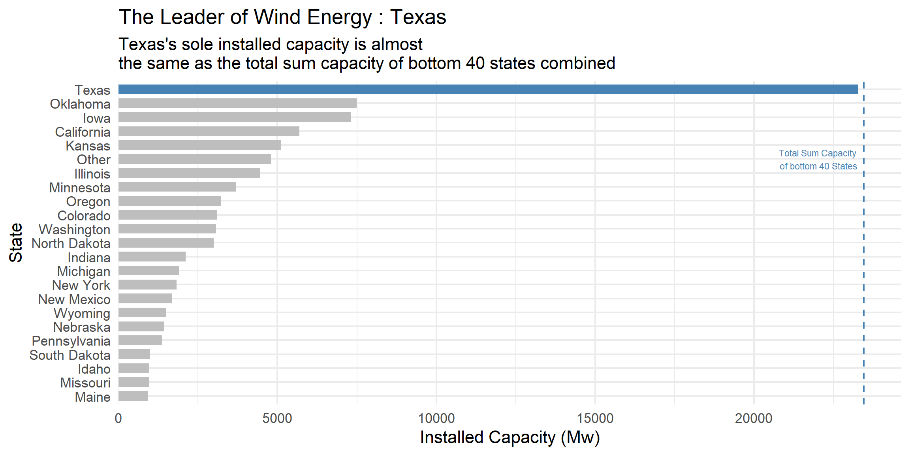
</center>

---

class: middle, center

<center>
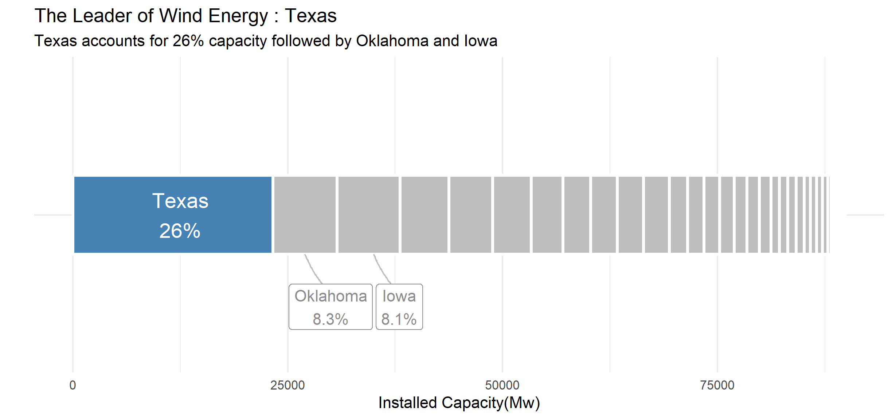
</center>

---

class: middle, center

<center>
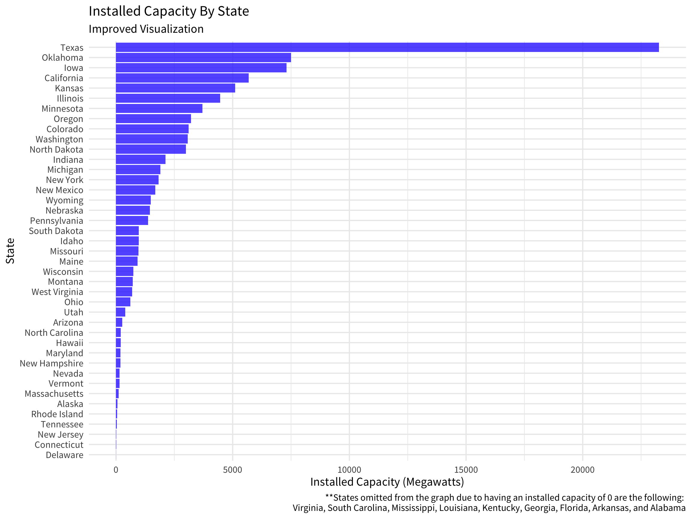
</center>

---

class: middle, center

<center>
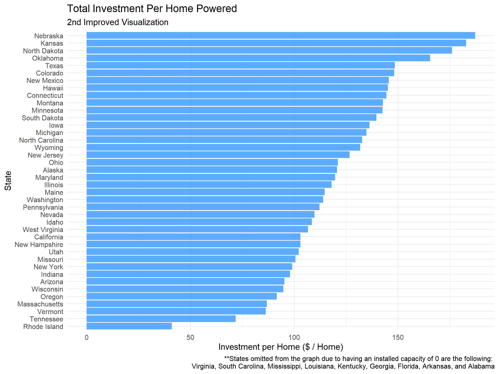
</center>

---

class: inverse

# Quiz 5

```{r, echo=FALSE}
countdown(
  minutes = 10,
  warn_when = 30,
  update_every = 1,
  bottom = 0,
  left = 0,
  font_size = '4em'
)
```

.leftcol[

### Instructions will be posted in the #class channel on slack

]

.rightcol[

<center>

</center>

]

---

class: middle, center 

# License

## These slides were modified from [Florencia D'Andrea](https://florencia.netlify.app/)'s [RLadies Shiny Meetup Slides](https://github.com/flor14/rladies_shiny_meetup_2020)

This work is licensed under a</br>[Creative Commons Attribution-ShareAlike 4.0](http://creativecommons.org/licenses/by-sa/4.0/) International License

---

# New libraries to install

```{r, eval=FALSE}
install.packages('shiny')
install.packages('shinyWidgets')
install.packages('rsconnect')
```

---

class: center, middle

.leftcol40[

<center>

</center>

]

.rightcol60[

</br>

# Interactive Webapps in R

## Check out the [Shiny Gallery](https://shiny.rstudio.com/gallery/)

]

---

```{r child="topics/0.Rmd"}
```

---

```{r child="topics/1.Rmd"}
```

---

# Anatomy of a Shiny App

A Shiny app is a web page (UI) connected to a computer running a live R session (Server)

```{r init, echo=FALSE, fig.align="center", out.width='80%'}
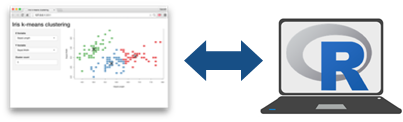
```

---

# `app.R`

.leftcol45[

You can insert all the code at once with the shinyapp snippet!

Just start typing `shiny`...

```{r init2, echo=FALSE, fig.align="center", out.width='80%'}
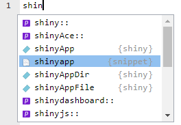
```

]

.rightcol55[

```{r eval=FALSE, tidy=FALSE}
library(shiny)

ui <- fluidPage(
  
)

server <- function(input, output, session) {
  
}

shinyApp(ui, server)
```

]

---

# Building a shiny app

```{r shiny, echo=FALSE, fig.align="center", out.width='50%'}

```

.pull-left[

**`ui`**

1. Pick a layout function

2. Add inputs widgets

3. Add `*Output()` functions

]

.pull-right[

**`server`**

1. Use `render*()` functions to make outputs

2. Link outputs with `output$<id>` 

3. Link inputs with `input$<id>`

]

---

# Run the app 🎬

- **Option 1**: Click the "Run App" button in the toolbar:

```{r run_app1, echo=FALSE, fig.align="center", out.width='25%'}
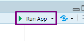
```

- **Option 2**: Use a keyboard shortcut: Cmd/Ctrl + Shift + Enter.

- **Option 3**: `shiny::runApp()` with the path to the **app.R** file.

---

class: inverse

.leftcol40[

## Your Turn

### `hello_shiny.app`

File -> New File -> Shiny Web App...

]

.rightcol60[.code50[

```{r, eval=FALSE}
library(shiny) #<<

# Define UI for application that draws a histogram
ui <- fluidPage( #<<

    # Application title
    titlePanel("Old Faithful Geyser Data"),

    # Sidebar with a slider input for number of bins 
    sidebarLayout(
        sidebarPanel(
            sliderInput("bins",
                        "Number of bins:",
                        min = 1,
                        max = 50,
                        value = 30)
        ),

        # Show a plot of the generated distribution
        mainPanel(
           plotOutput("distPlot")
        )
    )
)

# Define server logic required to draw a histogram
server <- function(input, output) { #<<

    output$distPlot <- renderPlot({
        # generate bins based on input$bins from ui.R
        x    <- faithful[, 2]
        bins <- seq(min(x), max(x), length.out = input$bins + 1)

        # draw the histogram with the specified number of bins
        hist(x, breaks = bins, col = 'darkgray', border = 'white')
    })
}

# Run the application 
shinyApp(ui = ui, server = server) #<<
```

]]

---

```{r child="topics/2.Rmd"}
```

---

background-color: #fff
class: center

## User Interface (UI)

```{r mamus, echo=FALSE, fig.align="center", out.width='70%'}

```

[Matryoshka Dolls](https://en.wikipedia.org/wiki/Matryoshka_doll)

---

background-color: #fff

### Organize panels and elements into a layout with a **layout function**

### Top level is usually `fluidPage()`

```{r init3, echo=FALSE, fig.align="center", out.width='80%'}
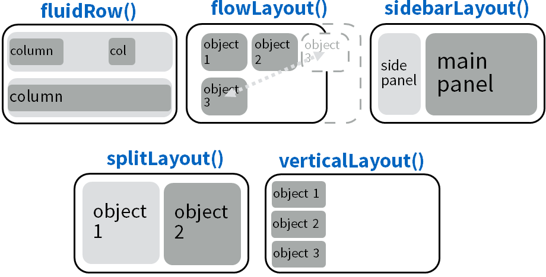
```

---

background-color: #fff

```{r, echo=FALSE, fig.align="center", out.width='100%'}
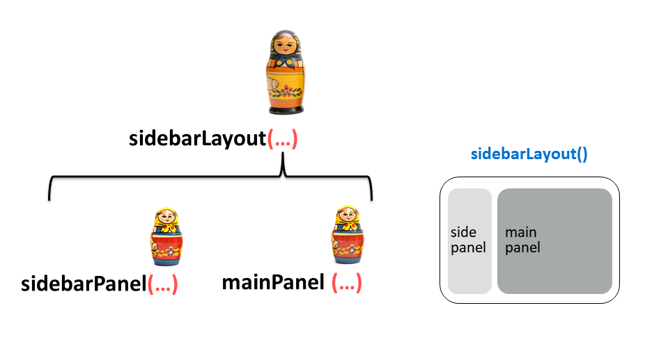
```

---

### `sidebarLayout()`

.leftcol40[

```{r, eval=FALSE}
ui <- fluidPage(

  titlePanel("Hello Shiny!"),

  sidebarLayout( #<<

    sidebarPanel( #<<
      sliderInput( 
        "bins", label = "Number of bins:",
        min = 1, value = 30, max = 50
      )
    ),

    mainPanel( #<<
      plotOutput("distPlot")
    )
  )
)
```

]

.rightcol60[

```{r init5, echo=FALSE, fig.align="center", out.width='100%'}
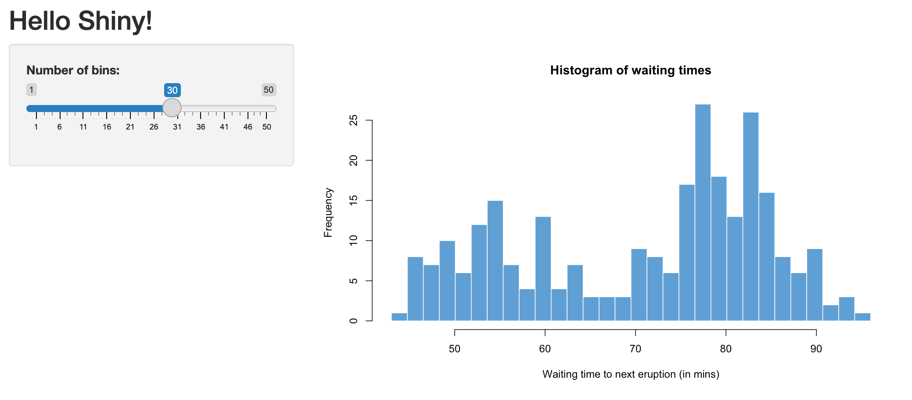
```

]

---

### `navbarPage()`: An alternative to `fluidPage()`

Think of each `tabPanel()` as it's own `fluidPage()`

.leftcol40[

```{r, eval=FALSE}
ui <- navbarPage("My Application", #<<
  tabPanel("Component 1"),
  tabPanel("Component 2"),
  tabPanel("Component 3")
)
```

]

.rightcol60[

```{r, echo=FALSE, fig.align="center", out.width='100%'}
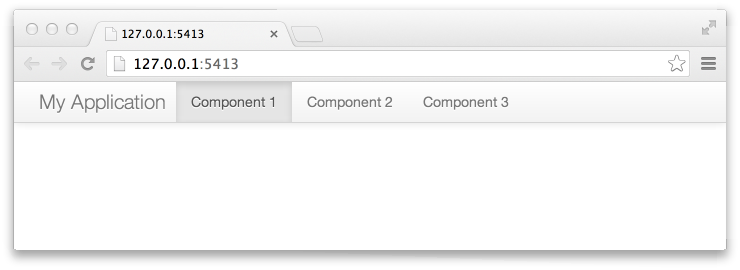
```

]

---

### `navbarPage()`: An alternative to `fluidPage()`

Use `navbarMenu()` to create a nested menu item

.leftcol40[

```{r, eval=FALSE}
ui <- navbarPage("My Application",
  tabPanel("Component 1"),
  tabPanel("Component 2"),
  navbarMenu("More", #<<
    tabPanel("Sub-Component A"), #<<
    tabPanel("Sub-Component B")) #<<
)
```

]

.rightcol60[

```{r, echo=FALSE, fig.align="center", out.width='100%'}
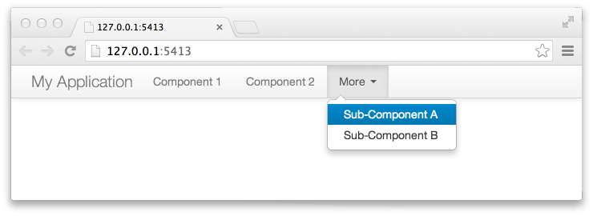
```

]

---

class: middle, inverse

# The UI defines the "what" and "where" for:

## 1. **.orange[Inputs]**: collect values from the user
## 2. **Output**: display something to the user

---

background-color: #fff

# **Inputs**: collect values from the user

```{r init4, echo=FALSE, fig.align="center", out.width='100%'}
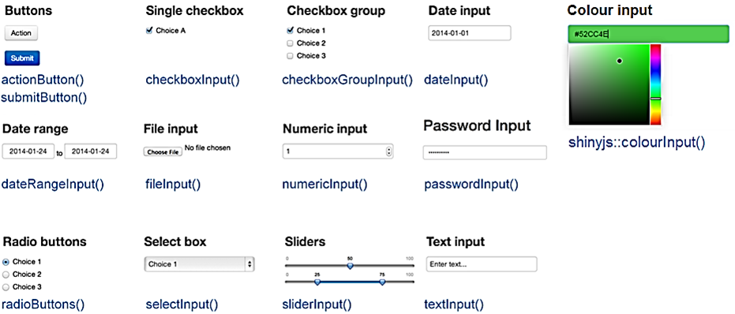
```

---

## Example Input: Radio buttons in the sidebar

.leftcol30[

```{r, eval=FALSE}
ui <- fluidPage(
  sidebarLayout(
    sidebarPanel(
      radioButtons(…) #<<
    ), 
    mainPanel(…)
  )
)
```

]

.rightcol70[

```{r radiobut, echo=FALSE, fig.align="center", out.width='100%'}
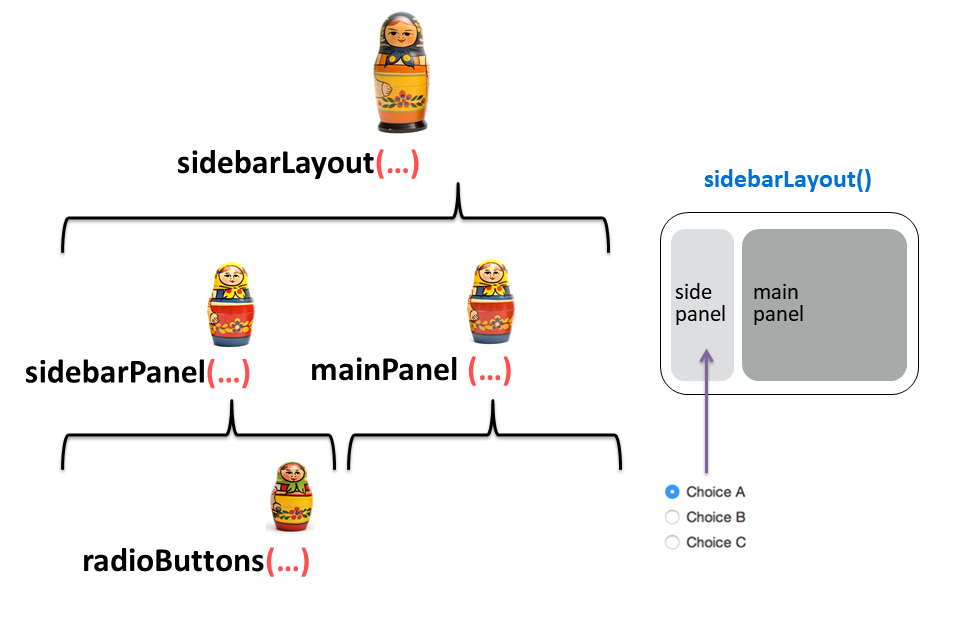
```

]

---

class: inverse 

## Quick practice

Open the `widgets.R` app and click the "Run App" button

---

background-color: #fff
class: center, middle

```{r init7, echo=FALSE, fig.align="center", out.width='70%'}
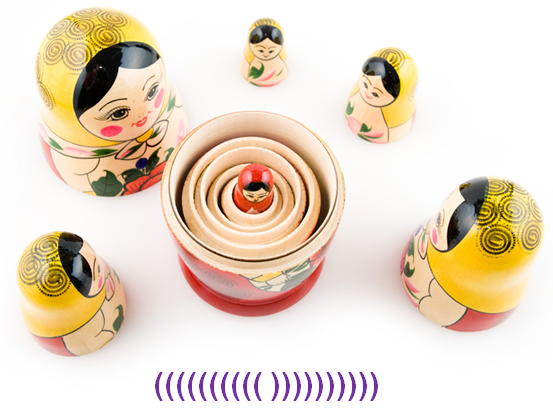
```

---

background-color: #fff
class: center, middle

```{r ini3, echo=FALSE, fig.align="center", out.width='90%'}
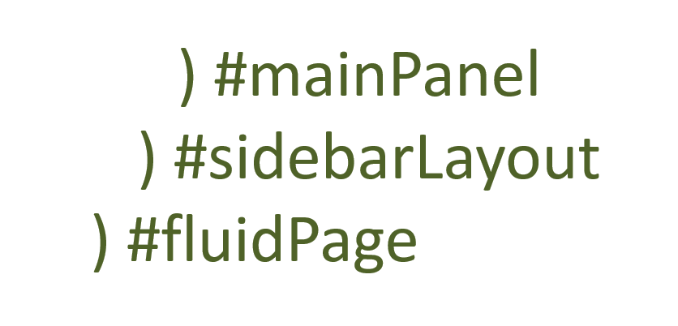
```

---

class: inverse

```{r, echo=FALSE}
countdown(
  minutes = 10,
  warn_when = 30,
  update_every = 15,
  top = 0,
  font_size = '2em'
)
```

## Your Turn

.leftcol80[

1. Open the `widgets.R` file.
2. Go to the [Shiny Widgets Gallery](https://shiny.rstudio.com/gallery/widget-gallery.html) and pick a new widget. 
3. Look at the code for the widget and try to add that widget to the sidebar in the `widgets.R` file below all the other widgets.
4. Debug together! (ask each other questions)

]

---

class: middle, inverse

# The UI defines the "what" and "where" for:

## 1. **Inputs**: collect values from the user
## 2. **.orange[Output]**: display something to the user

---

## Example Output: Put a plot in the main panel

.leftcol30[

```{r, eval=FALSE}
ui <- fluidPage(
  sidebarLayout(
    sidebarPanel(
      radioButtons(…) 
    ), 
    mainPanel(
      plotOutput(…) #<<
    )
  )
)
```

]

.rightcol70[

```{r, echo=FALSE, fig.align="center", out.width='100%'}
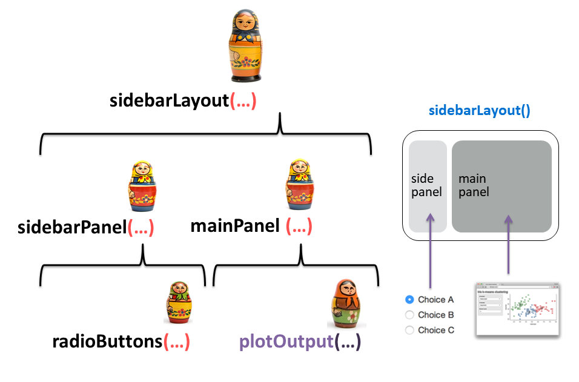
```

]

---

# **Output**: display something to the user

Output function  | Description
-----------------| ---------------
`plotOutput()`   | Display a reactive _plot_
`dataTableOutput()` | Display a `DT::datatable()`
`textOutput()`   | Display reactive _text_
`imageOutput()`  | Display an image

---

```{r child="topics/3.Rmd"}
```

---

# Building a shiny app

```{r, echo=FALSE, fig.align="center", out.width='50%'}

```

.pull-left[

**`ui`**

1. Pick a layout function, e.g. `sidebarLayout()` 

2. Add inputs widgets

3. Add `*Output()` functions

]

.pull-right[

**`server`**

1. Use `render*()` functions to make outputs

2. Link outputs with `output$<id>` 

3. Link inputs with `input$<id>`

]

---

background-color: #fff

```{r out, echo=FALSE, fig.align="center", out.width='90%'}
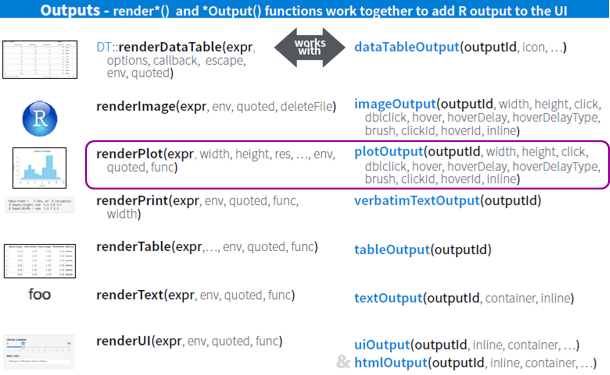
```

---

# Using `renderPlot()`: make a plot

.leftcol[

```{r mpg, echo=TRUE, fig.show='hide', fig.width=7, fig.height=5, fig.align = "center" }
library(ggplot2)

ggplot(mpg) +
  geom_point(
    aes(x = displ, y = hwy, color = class))
```

]

.rightcol[

```{r, ref.label="mpg", echo=FALSE, fig.width=7, fig.height=5, fig.align = "center" }
```

]

---

## Link plot to output with `output$<id>`

.leftcol45[

`ui`
```{r, eval=FALSE}
ui <- fluidPage(
  sidebarLayout(
    sidebarPanel(
      radioButtons(…) 
    ), 
    mainPanel(
      plotOutput( #<<
        outputId = "mpg_plot" #<<
      ) #<<
    )
  )
)
```

]

.rightcol55[

`server`
```{r, eval=FALSE}
server <- function(input, output, session) {
  output$mpg_plot <- renderPlot({ #<<
    ggplot(mpg) +
      geom_point(
        aes(x = displ, y = hwy, color = class))
  })
}
```

]

---

## Link user inputs to plot with `input$<id>`

.leftcol[.code60[

`ui`
```{r, eval=FALSE}
ui <- fluidPage(
  sidebarLayout(
    sidebarPanel(
      radioButtons(
        inputId = "xvar", #<<
        label = "Select the x-axis variable:",
        selected = "displ",
        choices = c(
          "Highway miles per gallon" = "hwy", #<<
          "City miles per gallon" = "cty", #<<
          "Engine displacement, in litres" = "displ") #<<
      ),
    ), 
    mainPanel(
      plotOutput(
        outputId = "mpg_plot" 
      ) 
    )
  )
)
```

]]

.rightcol[.code60[

`server`
```{r, eval=FALSE}
server <- function(input, output, session) {
  output$mpg_plot <- renderPlot({ 
    ggplot(mpg) +
      geom_point(
        aes_string( #<<
          x = input$xvar,  #<<
          y = "hwy", 
          color = "class")) 
  })
}
```

**Note**: I switched the ggplot code from</br>`aes()` to `aes_string()`

]]

---

class: inverse 

## Quick practice

Open the `mpg.R` app and click the "Run App" button

---

class: inverse

```{r, echo=FALSE}
countdown(
  minutes = 10,
  warn_when = 30,
  update_every = 15,
  top = 0,
  font_size = '2em'
)
```

## Your Turn

.leftcol[

1. Open the `caseConverter.R` file.
2. In the `server`: Write code in the provided `renderText()` to convert the input text to lower case.
3. Run the app and test that it's working.
4. In the `ui` main panel: Add two more `textOutput()` functions for also displaying the input text in "upper" case and "title" case.
3. In the `server`: Define two more outputs to convert the input text to "upper" case and "title" case.

]

.rightcol[

<center>
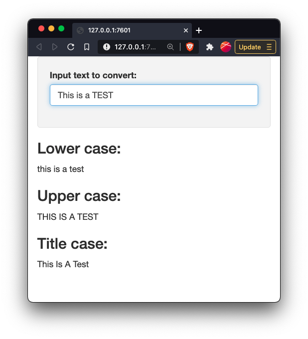
</center>

]

---

background-color: #fff
class: center

```{r, echo=FALSE}
countdown(
  minutes = 5,
  warn_when = 30,
  update_every = 1,
  left = 0, right = 0, top = 1, bottom = 0,
  margin = "5%",
  font_size = "8em"
)
```

# Intermission

<center>

</center>

---

```{r child="topics/4.Rmd"}
```

---

# Use html functions to add text

.leftcol60[

See example in `html.R` app
```{r, eval=FALSE}
ui <- fluidPage(
  h1("Header 1"),
  h2("Header 2"),
  h3("Header 3"),
  h4("Header 4"),
  p("Some text"),
  br(),
  p(strong("Some bold text")),
  p(em("Some italic text")),  
  p(code("Some code")),  
  hr(),
  a(href="https://eda.seas.gwu.edu/2022-Fall/",
    "Class home page"),
  HTML("<p>Raw html</p>")
)
```

]

.rightcol40[

<center>
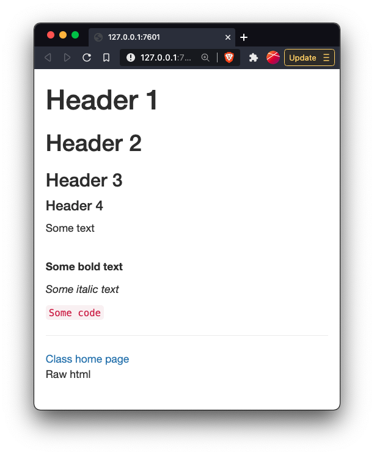
</center>

]

---

# Can also just use plain markdown

.leftcol60[

See example in `markdown.R` app
```{r, eval=FALSE}
ui <- fluidPage(
  markdown("
  # Header 1
  ## Header 2
  ### Header 3
  #### Header 4
  Some text
  **Some bold text**
  _Some italic text_
  `Some code`
  [Class home page](https://eda.seas.gwu.edu/2022-Fall/)
  ")
)
```

]

.rightcol40[

<center>

</center>

]

---

class: inverse 

```{r, echo=FALSE}
countdown(
  minutes = 2,
  warn_when = 30,
  update_every = 15,
  top = 0,
  font_size = '2em'
)
```

# Quick practice

.leftcol80[

Open your `caseConverter.R` app and add html functions or markdown to add the following:

- Give the app a title by inserting a level 1 header in the `fluidPage()` function and before the `sidebarLayout()` function.
- In the main `ui` panel, add a short description of what the app does.  

]

---

background-color: #fff
class: center 

## Add a theme with ["shinythemes"](https://rstudio.github.io/shinythemes/) package

```{r theme, echo=FALSE, fig.align="center", out.width='60%'}
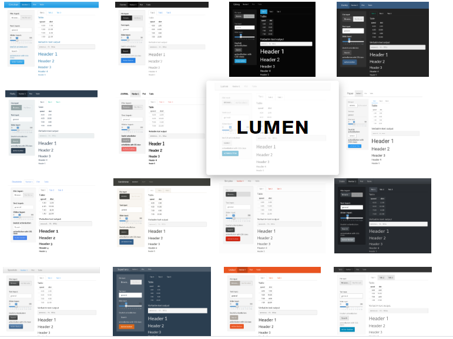
```

---

### .center[Insert theme at top of main `ui` layout function]

.leftcol40[

```{r, eval=FALSE}
library(shinythemes)

ui <- fluidPage(
  theme = shinytheme("sandstone"), #<<
  sidebarLayout(
    sidebarPanel(
      <insert widgets>
    ), 
    mainPanel(
      <insert outputs>
    )
  )
)
```

]

.rightcol60[

```{r, echo=FALSE, fig.align="center", out.width='100%'}
knitr::include_graphics("https://rstudio.github.io/shinythemes/images/sandstone.png")
```

]

---

class: center, middle

## Fancier widgets with ["shinyWidgets"](http://shinyapps.dreamrs.fr/shinyWidgets/) package

### Open the `shinyWidgets.R` app and click the "Run App" button

---

# Common shiny situations

### - Filtering for a single category: `federalSpending.R`
### - Filtering for multiple categories: `federalSpendingCompare.R`

---

### .center[Filtering for a single category: `federalSpending.R`]

.leftcol45[.code70[

```{r, eval=FALSE}
ui <- fluidPage(

  h1("Federal R&D Spending by Department"),

  sidebarLayout(

    sidebarPanel(
      selectInput(
        inputId = "department", #<<
        label = "Choose a department:",
        selected = "DOD",
        choices = c(...)
    ),

    mainPanel(
      plotOutput("spendingPlot")
    )
  )
)
```

]]

.rightcol55[.code70[

```{r, eval=FALSE}
server <- function(input, output){
  output$spendingPlot <- renderPlot({

    # Filter out the data based on the user input
    data <- federal_spending %>% #<<
      filter(department == input$department) #<<

    ggplot(data) +
      geom_col(
        aes(x = year, y = rd_budget),
        fill = "steelblue", width = 0.7, alpha = 0.8) +
      scale_y_continuous(
        labels = scales::dollar,
        expand = expansion(mult = c(0, 0.05))) +
      theme_half_open(font_size = 18) +
      labs(
        x = "Year",
        y = "$USD Millions",
        title = paste("Federal R&D Spending"))

  })
}
```

]]

---

### .center[Filtering for multiple categories: `federalSpendingCompare.R`]

.leftcol45[.code70[

```{r, eval=FALSE}
ui <- fluidPage(

  h1("Federal R&D Spending by Department"),

  sidebarLayout(

    sidebarPanel(
      selectInput(
        inputId = "department",
        label = "Choose a department:",
        selected = "DOD",
        multiple = TRUE, #<<
        choices = c(...)
    ),

    mainPanel(
      plotOutput("spendingPlot")
    )
  )
)
```

]]

.rightcol55[.code70[

```{r, eval=FALSE}
server <- function(input, output){
  output$spendingPlot <- renderPlot({

    # Filter out the data based on the user input
    data <- federal_spending %>% 
      filter(department %in% input$department) #<<

    ggplot(data) +
      geom_col(
        aes(x = year, y = rd_budget),
        fill = "steelblue", width = 0.7, alpha = 0.8) +
      facet_wrap(~department) + #<<
      scale_y_continuous(
        labels = scales::dollar,
        expand = expansion(mult = c(0, 0.05))) +
      theme_half_open(font_size = 18) +
      labs(
        x = "Year",
        y = "$USD Millions",
        title = paste("Federal R&D Spending"))

  })
}
```

]]

---

# If you really want to get good at this:

## 1. Print out this [Cheatsheet](https://shiny.rstudio.com/articles/cheatsheet.html)

## 2. Watch this [2.5 Hour Comprehensive RStudio Tutorial](https://shiny.rstudio.com/tutorial)

## 3. Use this reference manual: [Mastering Shiny](https://mastering-shiny.org/)

---

```{r child="topics/5.Rmd"}
```

---

# You can deploy an app for free on [shinyapps.io](https://www.shinyapps.io/)

### Follow [the RStudio guide](https://shiny.rstudio.com/articles/shinyapps.html)

1. Create a shinyapps.io account
2. Open your tokens, click "Show", copy the code
3. Run the code in RStudio 
4. Deploy your app:

```{r, eval=FALSE}
library(rsconnect)
deployApp()
```

---

class: inverse

```{r, echo=FALSE}
countdown(
  minutes = 15,
  warn_when = 30,
  update_every = 15,
  top = 0,
  font_size = '2em'
)
```

## Your Turn

.leftcol80[

1. Open the `internetUsers.R` file.
2. Modify the server code so that the inputs control the plot.
3. Deploy your app to shinyapps.io

]

---

class: center, middle, inverse

## Fill out course evals: https://gwu.smartevals.com/

### (please be specific!)

<center>

</center>
