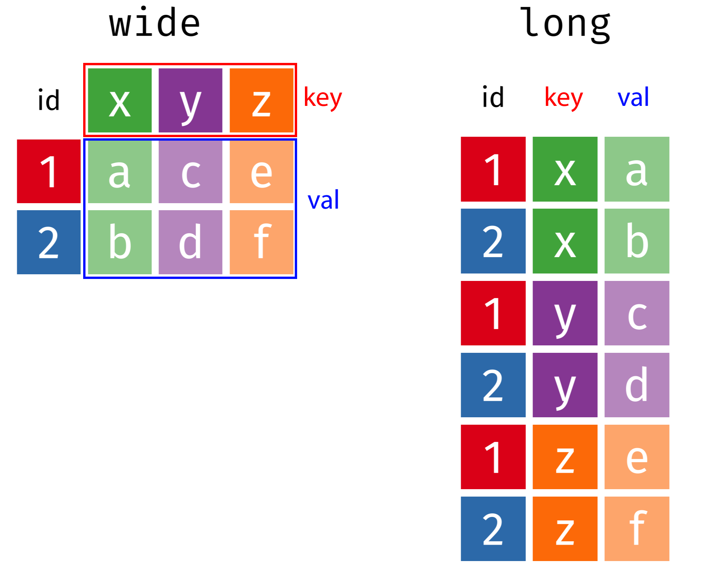

```{r setup, include=FALSE}
library(knitr)
library(tidyverse)
library(here)
library(fontawesome)
library(cowplot)
library(ggrepel)
library(readxl)
library(countdown)
library(metathis)
options(
    htmltools.dir.version = FALSE,
    knitr.table.format = "html",
    knitr.kable.NA = '',
    dplyr.width = Inf,
    width = 250
)
knitr::opts_chunk$set(
    warning = FALSE,
    message = FALSE,
    fig.path = "figs/",
    fig.width = 7.252,
    fig.height = 4,
    comment = "#>",
    fig.retina = 3
)
xaringanExtra::use_tile_view()
xaringanExtra::use_panelset()
xaringanExtra::use_clipboard()
xaringanExtra::use_share_again()
xaringanExtra::style_share_again(share_buttons = "none")
xaringanExtra::use_extra_styles(
  hover_code_line = TRUE,
  mute_unhighlighted_code = FALSE
)
# Set up website metadata
meta() %>%
  meta_general(
    description = rmarkdown::metadata$subtitle,
    generator = "xaringan and remark.js"
  ) %>%
  meta_name("github-repo" = "emse-eda-gwu/2022-Fall") %>%
  meta_social(
    title = rmarkdown::metadata$title,
    url = "https://eda.seas.gwu.edu/2022-Fall/",
    og_type = "website",
    og_author = "John Paul Helveston",
    twitter_card_type = "summary_large_image",
    twitter_creator = "@johnhelveston"
  )

# Read in data sets for class
milk_production <- read_csv(here('data', 'milk_production.csv'))
fed_spend_long <- read_csv(here('data', 'fed_spend_long.csv'))
fed_spend_wide <- read_csv(here('data', 'fed_spend_wide.csv'))
tb_cases <- read_csv(here('data', 'tb_cases.csv'))
lotr_words <- read_csv(here('data', 'lotr_words.csv'))
xlsxPath <- here('data', 'pv_cell_production.xlsx')
pv_cells <- read_excel(xlsxPath, sheet = 'Cell Prod by Country', skip = 2) %>%
  mutate(Year = as.numeric(Year)) %>% 
  filter(!is.na(Year)) 
```

class: middle, inverse

.leftcol30[

<center>

</center>

]

.rightcol70[

# Week `r rmarkdown::metadata$week`: .fancy[`r rmarkdown::metadata$title`]

### `r fontawesome::fa(name = "building-columns", fill = "white")` `r rmarkdown::metadata$subtitle`
### `r fontawesome::fa(name = "user", fill = "white")` `r rmarkdown::metadata$author`
### `r fontawesome::fa(name = "calendar", fill = "white")` `r rmarkdown::metadata$date`

]

---

```{r child="topics/0.Rmd"}
```

---

```{r child="topics/1.Rmd"}
```

---

# .center[Names, Values, and Observations]

- Variable **Name**: The name of something you can measure
- Variable **Value**: One instance of a measured variable
- **Observation**: A set of associated measurements across multiple variables

--

.code100[

```{r}
head(fed_spend_long)
```

]

---

# "Long" format data

- Each **variable** has its own **column**
- Each **observation** has its own **row**

<center>

</center>

---

.leftcol[

# "Long" format data

- Each **variable** has its own **column**
- Each **observation** has its own **row**

]

.rightcol[

```{r, echo=FALSE}
head(fed_spend_long)
```

]

<center>

</center>

---

.leftcol40[.code70[

# "Long" format

```{r, echo=FALSE}
head(fed_spend_long)
```

]]

.rightcol60[.code70[

# "Wide" format

```{r, echo=FALSE}
head(select(fed_spend_wide, year:HHS))
```

]]

---

.center[.font130[**"Long" format: variable names describe the values below them**]]

.leftcol40[.code70[

## "Long" format

```{r, echo=FALSE}
head(fed_spend_long)
```

]]

.rightcol60[.code70[

## "Wide" format

```{r, echo=FALSE}
head(select(fed_spend_wide, year:HHS))
```

]]

---

# **Quick practice 1**: "long" or "wide" format? 

**Description**: Tuberculosis cases in various countries

.code100[
```{r, echo=FALSE}
tb_cases
```
]

---

# **Quick practice 2**: "long" or "wide" format? 

**Description**: Word counts in LOTR trilogy

.code90[
```{r, echo=FALSE}
lotr_words
```
]

---

# **Quick practice 3**: "long" or "wide" format? 

**Description**: Word counts in LOTR trilogy

.code60[
```{r, echo=FALSE}
lotr_words %>% 
    pivot_longer(
        cols = Female:Male, 
        names_to = "Gender", 
        values_to = "Word_Count"
    )
```
]
---


class: inverse, center, middle

# Reshaping data with

## `pivot_longer()` and `pivot_wider()`

---

## .center[From "long" to "wide" with `pivot_wider()`]

<center>

</center>

---

## .center[From "long" to "wide" with `pivot_wider()`]

.leftcol45[

```{r}
head(fed_spend_long)
```

]

.rightcol55[

```{r, eval=FALSE}
fed_spend_wide <- fed_spend_long %>%
    pivot_wider( #<<
        names_from = department,  #<<
        values_from = rd_budget_mil) #<<

head(fed_spend_wide)
```

```{r, echo=FALSE}
head(select(fed_spend_wide, year:EPA))
```

]

---

## .center[From "wide" to "long" with `pivot_longer()`]

<center>

</center>

---

## .center[From "wide" to "long" with `pivot_longer()`]

.leftcol45[

```{r}
names(fed_spend_wide)
```

]

.rightcol55[

```{r}
fed_spend_long <- fed_spend_wide %>%
    pivot_longer( #<<
        cols = DHS:VA, #<<
        names_to = "department", #<<
        values_to = "rd_budget_mil") #<<

head(fed_spend_long)
```

]

---

## Can also set `cols` by selecting which columns _not_ to use

.leftcol45[

```{r}
names(fed_spend_wide)
```

]

.rightcol55[

```{r}
fed_spend_long <- fed_spend_wide %>%
    pivot_longer(
        cols = -year, #<<
        names_to = "department",
        values_to = "rd_budget_mil")

head(fed_spend_long)
```

]

---

class: inverse

```{r, echo=FALSE}
countdown(
    minutes = 15,
    warn_when = 15,
    update_every = 1,
    top = 0,
    right = 0,
    font_size = '2em'
)
```

# Your turn: Long <--> Wide

Open the `practice.Rmd` file. 

Run the code chunk to read in the following two data files:

- `pv_cells.csv`: Data on solar photovoltaic cell production by country
- `milk_production.csv`: Data on milk production by state

Now modify the format of each:

- If the data are in "wide" format, convert it to "long" with `pivot_longer()`
- If the data are in "long" format, convert it to "wide" with `pivot_wider()`

---

class: center, middle, inverse

# Why do we need tidy data?

(a quick explanation with cute graphics, by [Allison Horst](https://github.com/allisonhorst/stats-illustrations))

---

class: center
background-image: url("images/horst_tidydata_1.jpg")
background-size: contain

---

class: center
background-image: url("images/horst_tidydata_2.jpg")
background-size: contain

---

class: center
background-image: url("images/horst_tidydata_3.jpg")
background-size: contain

---

class: center
background-image: url("images/horst_tidydata_4.jpg")
background-size: contain

---

# Some tidy examples: data wrangling

Compute the total R&D spending by department in each year

```{r}
head(fed_spend_wide)
```

---

# Some tidy examples: data wrangling

Compute the total R&D spending by department in each year

Approach 1:

```{r}
fed_spend_wide %>%
  mutate(total = DHS + DOC + DOD + DOE + DOT + EPA + HHS + Interior + NASA + NIH + NSF + Other + USDA + VA) %>%
  select(year, total)
```

---

# Some tidy examples: data wrangling

Compute the total R&D spending by department in each year

Approach 2: Reshape first

```{r}
fed_spend_wide %>%
    pivot_longer(
        cols = -year, #<<
        names_to = "department",
        values_to = "rd_budget_mil") %>%
    group_by(year) %>%
    summarise(total = sum(rd_budget_mil))
```

---

# Some tidy examples: plotting

Make a bar chart of total R&D spending by agency

.leftcol45[

```{r}
head(fed_spend_long)
```

]

.rightcol55[

```{r fed-spend-bars, fig.width=6, fig.height=3.3}
ggplot(fed_spend_long) +
  geom_col(aes(x = rd_budget_mil, y = reorder(department, rd_budget_mil)), #<<
           width = 0.7, alpha = 0.8) +
  theme_bw(base_size = 15) +
  labs(x = "R&D Spending ($Millions)",
       y = "Federal Agency")
```

]

---

class: inverse

```{r, echo=FALSE}
countdown(
    minutes = 20,
    warn_when = 15,
    update_every = 1,
    top = 0,
    right = 0,
    font_size = '2em'
)
```

# Your turn: Reshaping data for plotting


---

class: inverse, center

# .fancy[Break]

```{r, echo=FALSE}
countdown(
    minutes = 5,
    warn_when = 30,
    update_every = 1,
    left = 0, right = 0, top = 1, bottom = 0,
    margin = "5%",
    font_size = "8em"
)
```

---

### Data provenance - It matters where you get your data

--

**Validity**:

- Is this data trustworthy? Is it authentic?
- Where did the data come from?
- How has the data been changed / managed over time?
- Is the data complete?

--

**Comprehension**:

- Is this data accurate?
- Can you explain your results?
- Is this the _right_ data to answer your question?

--

**Reproducibility**: The data source is the start of the reproducibility chain.

---

## `r fa("magnifying-glass")` **Document your source like a museum curator**

**Example**: View `README.md` file in the `data` folder

--

Whenever you download data, you should **at a minimum** record the following:

  - The name of the file you are describing.
  - The date you downloaded it.
  - The original name of the downloaded file (in case you renamed it).
  - The url to the site you downloaded it from.
  - The source of the _original_ data (sometimes different from the site you downloaded it from).
  - A short description of the data, maybe how they were collected (if available).
  - A dictionary for the data (e.g. a simple markdown table describing each variable).

---
class: inverse

```{r, echo=FALSE}
countdown(minutes = 10,
          warn_when = 30,
          update_every = 1,
          top = 0,
          right = 0,
          font_size = '2em')
```

# Your turn

Documentation in the "data/README.md" file is missing for the following data sets:

- wildlife_impacts.csv: [source](https://github.com/rfordatascience/tidytuesday/tree/master/data/2019/2019-07-23) (Breakout Rooms 1 & 2)
- north_america_bear_killings.txt: [source](https://data.world/makeovermonday/2019w21) (Breakout Rooms 3 & 4)
- uspto_clean_energy_patents.xlsx: [source](https://www.nsf.gov/statistics/2018/nsb20181/report/sections/industry-technology-and-the-global-marketplace/global-trends-in-sustainable-energy-research-and-technologies) (Breakout Rooms 5 & 6)

Go to the above sites and add the following information to the "data/README.md" file:

- The name of the downloaded file.
- The web address to the site you downloaded the data from.
- The source of the _original_ data (if different from the website).
- A short description of the data and how they were collected.
- A dictionary for the data (hint: the site might already have this!).


---

class: center, middle, inverse

# Start thinking about research questions

---

# Writing a research question

Follow [these guidelines](https://writingcenter.gmu.edu/guides/how-to-write-a-research-question) - your question should be:

--

- **Clear**: your audience can easily understand its purpose without additional explanation.

--

- **Focused**: it is narrow enough that it can be addressed thoroughly with the data available and within the limits of the final project report.

--

- **Concise**: it is expressed in the fewest possible words.

--

- **Complex**: it is not answerable with a simple "yes" or "no," but rather requires synthesis and analysis of data.

--

- **Arguable**: its potential answers are open to debate rather than accepted facts (do others care about it?)

---

# Writing a research question

--

**Bad question: Why are social networking sites harmful?**

- Unclear: it does not specify _which_ social networking sites or state what harm is being caused; assumes that "harm" exists.

--

**Improved question: How are online users experiencing or addressing privacy issues on such social networking sites as Facebook and Twitter?**

- Specifies the sites (Facebook and Twitter), type of harm (privacy issues), and who is harmed (online users).

--

**Other good examples**: See the [Example Projects Page](https://eda.seas.gwu.edu/2021-Spring/ref-example-analyses.html) page
