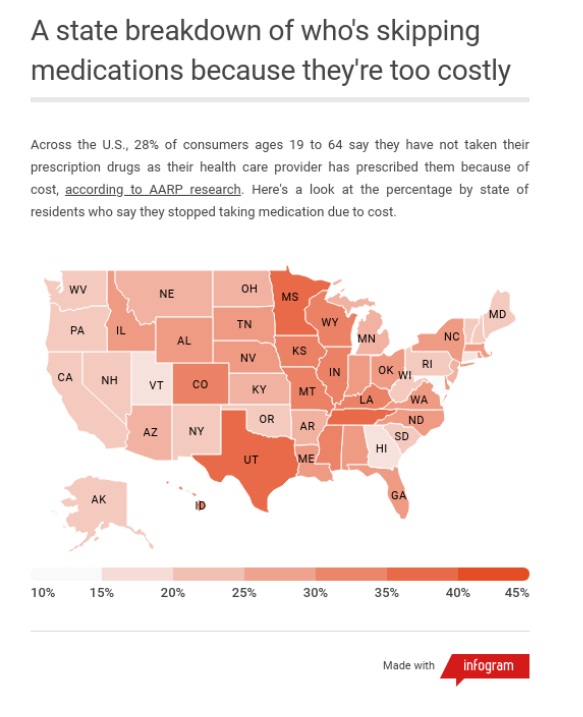
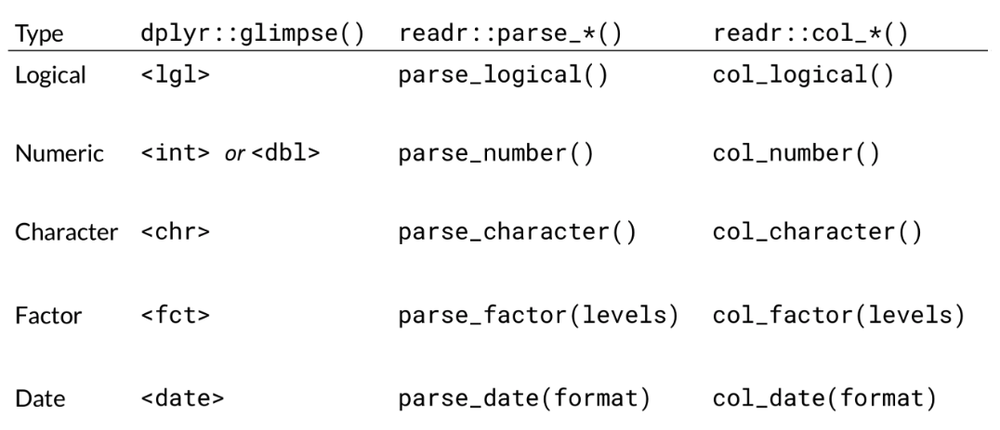
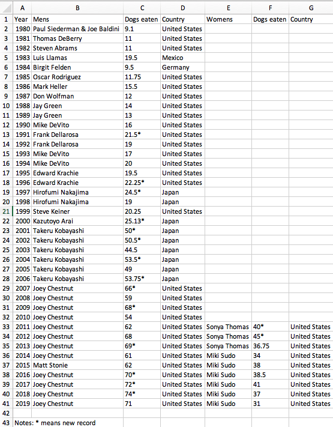
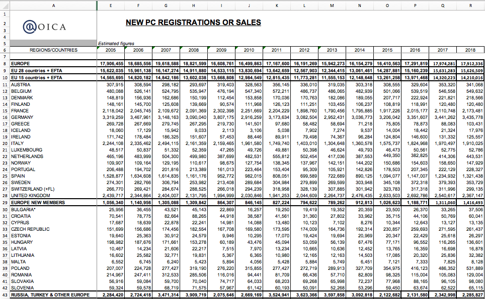

```{r setup, include=FALSE}
library(knitr)
library(tidyverse)
library(cowplot)
library(readxl)
library(lubridate)
library(metathis)
library(janitor)
library(here)
library(countdown)

options(
    htmltools.dir.version = FALSE,
    knitr.table.format = "html",
    knitr.kable.NA = '',
    dplyr.width = Inf,
    width = 250
)
knitr::opts_chunk$set(
    cache   = FALSE,
    warning = FALSE,
    message = FALSE,
    fig.path = "figs/",
    fig.width = 7.252,
    fig.height = 4,
    comment = "#>",
    fig.retina = 3
)

# Setup xaringanExtra options 
xaringanExtra::use_xaringan_extra(c(
  "tile_view", "panelset", "clipboard", "share_again"))
xaringanExtra::style_share_again(share_buttons = "none")
xaringanExtra::use_extra_styles(
  hover_code_line = TRUE,
  mute_unhighlighted_code = FALSE
)

# Set up website metadata
meta() %>%
  meta_general(
    description = rmarkdown::metadata$subtitle,
    generator = "xaringan and remark.js"
  ) %>%
  meta_name("github-repo" = "emse-eda-gwu/2022-Spring") %>%
  meta_social(
    title = rmarkdown::metadata$title,
    url = "https://eda.seas.gwu.edu/2022-Spring/",
    og_type = "website",
    og_author = "John Paul Helveston",
    twitter_card_type = "summary_large_image",
    twitter_creator = "@johnhelveston"
  )

# Read in data
wildlife_impacts <- read_csv(here::here('data', 'wildlife_impacts.csv'))
milk_production  <- read_csv(here::here('data', 'milk_production.csv'))
tb_rates <- table3

# Add new variables
wildlife_impacts_orig <- wildlife_impacts
wildlife_impacts <- wildlife_impacts %>%
    mutate(
        weekday_name = wday(incident_date, label = TRUE),
        phase_of_flt = str_to_lower(phase_of_flt),
        phase_of_flt = case_when(
            phase_of_flt %in% c('approach', 'arrival', 'descent',
                                'landing roll') ~ 'arrival',
            phase_of_flt %in% c('climb', 'departure',
                                'take-off run') ~ 'departure',
            TRUE ~ 'other'))

# Abbreviations: https://www.50states.com/abbreviations.htm
state_abbs <- tibble::tribble(
                  ~state_name,              ~state_abb,
                     "Alabama",             "AL",
                      "Alaska",             "AK",
                     "Arizona",             "AZ",
                    "Arkansas",             "AR",
                  "California",             "CA",
                    "Colorado",             "CO",
                 "Connecticut",             "CT",
                    "Delaware",             "DE",
                     "Florida",             "FL",
                     "Georgia",             "GA",
                      "Hawaii",             "HI",
                       "Idaho",             "ID",
                    "Illinois",             "IL",
                     "Indiana",             "IN",
                        "Iowa",             "IA",
                      "Kansas",             "KS",
                    "Kentucky",             "KY",
                   "Louisiana",             "LA",
                       "Maine",             "ME",
                    "Maryland",             "MD",
               "Massachusetts",             "MA",
                    "Michigan",             "MI",
                   "Minnesota",             "MN",
                 "Mississippi",             "MS",
                    "Missouri",             "MO",
                     "Montana",             "MT",
                    "Nebraska",             "NE",
                      "Nevada",             "NV",
               "New Hampshire",             "NH",
                  "New Jersey",             "NJ",
                  "New Mexico",             "NM",
                    "New York",             "NY",
              "North Carolina",             "NC",
                "North Dakota",             "ND",
                        "Ohio",             "OH",
                    "Oklahoma",             "OK",
                      "Oregon",             "OR",
                "Pennsylvania",             "PA",
                "Rhode Island",             "RI",
              "South Carolina",             "SC",
                "South Dakota",             "SD",
                   "Tennessee",             "TN",
                       "Texas",             "TX",
                        "Utah",             "UT",
                     "Vermont",             "VT",
                    "Virginia",             "VA",
                  "Washington",             "WA",
               "West Virginia",             "WV",
                   "Wisconsin",             "WI",
                     "Wyoming",             "WY",
        "District of Columbia",             "DC",
            "Marshall Islands",             "MH",
         "Armed Forces Africa",             "AE",
       "Armed Forces Americas",             "AA",
         "Armed Forces Canada",             "AE",
         "Armed Forces Europe",             "AE",
    "Armed Forces Middle East",             "AE",
        "Armed Forces Pacific",             "AP"
)

bad_abbs <- c("MH", "AE", "AA", "AE", "AP")

state_abbs_50 <- state_abbs %>% 
  filter(!state_abb %in% bad_abbs)

# # scraping version:
# library(rvest)
# html <- read_html('https://www.50states.com/abbreviations.htm')
# table <- html %>%
#     html_node('#content') %>%
#     html_nodes("table") %>%
#     html_table(fill = T)
# table[[1]]
```

class: middle, inverse

.leftcol30[

<center>

</center>

]

.rightcol70[

# Week `r rmarkdown::metadata$week`: .fancy[`r rmarkdown::metadata$title`]

### `r fontawesome::fa(name = "building-columns", fill = "white")` `r rmarkdown::metadata$subtitle`
### `r fontawesome::fa(name = "user", fill = "white")` `r rmarkdown::metadata$author`
### `r fontawesome::fa(name = "calendar", fill = "white")` `r rmarkdown::metadata$date`

]

---

class: center, middle, inverse

# .fancy[.blue[Tip of the week]]

## Copy-paste magic with [`datapasta`](https://milesmcbain.github.io/datapasta/)

<br>

### **Useful for "small data"**: e.g., [U.S. State Abbreviations](https://www.50states.com/abbreviations.htm)

---

## Today's data

"Clean" data

```{r, eval=FALSE}
wildlife_impacts <- read_csv(here::here('data', 'wildlife_impacts.csv'))
milk_production <- read_csv(here::here('data', 'milk_production.csv'))
msleep <- read_csv(here::here('data', 'msleep.csv'))
```

"Messy" data

```{r, eval=FALSE}
wind <- read_excel(here::here('data', 'US_State_Wind_Energy_Facts_2018.xlsx'))
hot_dogs <- read_excel(here::here('data', 'hot_dog_winners.xlsx'))
```

---

## Plus two new packages:

```{r, eval=FALSE}
# For manipulating dates
install.packages('lubridate')

# For cleaning column names
install.packages('janitor')
```

---

```{r child="topics/0.Rmd"}
```

---

```{r child="topics/1.Rmd"}
```

---

.leftcol[

<center>

</center>

]

.rightcol[

## .center[What's wrong with this map?]

]

---

### Likely culprit: Merging two columns

.leftcol[

```{r, echo=FALSE}
names <- data.frame(state_name = sort(state_abbs_50$state_name))
abbs  <- data.frame(state_abb = sort(state_abbs_50$state_abb))
```
```{r}
head(names)
head(abbs)
```

]

--

.rightcol[

```{r}
result <- bind_cols(names, abbs)
head(result)
```

]

---

## Joins

1. `inner_join()`
2. `left_join()` / `right_join()`
3. `full_join()`

--

Example: `band_members` & `band_instruments`

.leftcol[

```{r}
band_members
```

]

.rightcol[

```{r}
band_instruments
```

]

---

.leftcol[

## `inner_join()`

```{r}
band_members %>%
    inner_join(band_instruments)
```

]

.rightcol[

<br>
<center>

</center>

]

---

.leftcol[

## `full_join()`

```{r}
band_members %>%
    full_join(band_instruments)
```

]

.rightcol[

<br>
<center>

</center>

]

---

.leftcol[

## `left_join()`

```{r}
band_members %>%
    left_join(band_instruments)
```

]

.rightcol[

<br>
<center>

</center>

]

---

.leftcol[

## `right_join()`

```{r}
band_members %>%
    right_join(band_instruments)
```

]

.rightcol[

<br>
<center>

</center>

]

---

## Specify the joining variable name

.leftcol[

```{r, echo=TRUE, message=TRUE}
band_members %>%
    left_join(band_instruments)
```

]

.rightcol[

```{r, echo=TRUE, message=TRUE}
band_members %>%
    left_join(band_instruments,
              by = 'name') #<<
```

]

---

## Specify the joining variable name

If the names differ, use `by = c("left_name" = "joining_name")`

.leftcol[

```{r}
band_members
```
```{r}
band_instruments2
```

]

--

.rightcol[

```{r}
band_members %>%
    left_join(band_instruments2,
              by = c("name" = "artist")) #<<
```

]

---

## Specify the joining variable name

Or just rename the joining variable in a pipe

.leftcol[

```{r}
band_members
```
```{r}
band_instruments2
```

]

.rightcol[

```{r}
band_members %>%
    rename(artist = name) %>% #<<
    left_join(band_instruments2,
              by = "artist") #<<
```

]

---

class: inverse

```{r, echo=FALSE}
countdown(
    minutes      = 15,
    warn_when    = 15,
    update_every = 1,
    top          = 0,
    right        = 0,
    font_size    = '2em'
)
```

## Your turn

.leftcol[.font80[

1) Create a data frame called `state_data` by joining the data frames `states_abbs` and `milk_production` and then selecting the variables `region`, `state_name`, `state_abb`. **Hint**: Use the `distinct()` function to drop repeated rows.

Your result should look like this:

.code70[

```{r, include=FALSE}
state_data <- milk_production %>%
    left_join(state_abbs, by = c('state' = 'state_name')) %>%
    select(region, state_name = state, state_abb) %>%
    distinct()
```
```{r}
head(state_data)
```

]]]

--

.rightcol[.font80[

2) Join the `state_data` data frame to the `wildlife_impacts` data frame, adding the variables `region` and `state_name`

```{r, include=FALSE}
wildlife_impacts2 <- state_data %>%
    right_join(wildlife_impacts, by = c('state_abb' = 'state')) %>%
    mutate(state_abb = ifelse(state_abb == 'N/A', NA, state_abb))
```

.code50[

```{r, eval=FALSE}
glimpse(wildlife_impacts)
```
```{r, echo=FALSE}
glimpse(wildlife_impacts2)
```

]]]

---

```{r child="topics/2.Rmd"}
```

---

## Using the `col_types` argument

- You can change the column type when reading in data
- Different syntax for [`readxl::read_excel()`](https://readxl.tidyverse.org/articles/cell-and-column-types.html) and [`readr::read_csv()`](https://readr.tidyverse.org/)

---

.leftcol35[

### `readxl::read_excel()`

`col_types` must be a vector describing each column type

]

.rightcol65[

<br><br>

```{r}
wind <- read_excel(here::here(
  'data', 'US_State_Wind_Energy_Facts_2018.xlsx'))

glimpse(wind)
```

]

---

.leftcol40[

### `readxl::read_excel()`

`col_types` must be a vector describing each column type

<br>

.font80[

| How it is in Excel | How it will be in R | How to request in `col_types` |
|:--------------------|:-----------------------|:--------------------|
| *anything*          | *non-existent*         | `"skip"`            |
| empty               | `logical`, but all `NA` | *you cannot request this* |
| boolean            | `logical`               | `"logical"`         |
| numeric            | `numeric`               | `"numeric"`         |
| datetime           | `POSIXct`               | `"date"`            |
| text               | `character`             | `"text"`            |
| *anything*         | `list`                  | `"list"`            |

]]

.rightcol60[

```{r}
columns <- c('numeric', 'text', rep('numeric', 5))
columns
wind <- read_excel(here::here(
  'data', 'US_State_Wind_Energy_Facts_2018.xlsx'),
  col_types = columns) #<<

glimpse(wind)
```

]

---

### `readr::read_csv()`

`col_types` describes individual variables by name using `cols()`

.leftcol60[

```{r}
milk <- read_csv(here::here(
  'data', 'milk_production.csv'),
  col_types = cols(year = col_character())) #<<

glimpse(milk)
```

]

---

### `readr::read_csv()`

`col_types` describes individual variables by name using `cols()`

<br>

<center>

</center>

---

## Other option: Edit types **after** reading in the data

.leftcol[

```{r}
wind <- read_excel(here::here(
  'data', 'US_State_Wind_Energy_Facts_2018.xlsx')) %>%
  mutate(
    Ranking = as.numeric(Ranking),#<<
    `Equivalent Homes Powered` = as.numeric(`Equivalent Homes Powered`),#<<
    `Total Investment ($ Millions)` = as.numeric(`Total Investment ($ Millions)`),#<<
    `# of Wind Turbines` = as.numeric(`# of Wind Turbines`)) #<<

glimpse(wind)
```

]

.rightcol[

```{r}
milk <- read_csv(here::here(
  'data', 'milk_production.csv')) %>%
  mutate(year = as.character(year)) #<<

glimpse(milk)
```

]

---

```{r child="topics/3.Rmd"}
```

<!--
got the content on select() from Suzan Baert:
https://suzan.rbind.io/2018/01/dplyr-tutorial-1/
-->

---

## Renaming made easy

.leftcol35[.noborder[.center[

`janitor::clean_names()`

<center>

</center>

]]]

--

.rightcol65[

```{r}
wind <- read_excel(here::here(
  'data', 'US_State_Wind_Energy_Facts_2018.xlsx'))

glimpse(wind)
```

]

---

## Renaming made easy

.leftcol35[.noborder[.center[

`janitor::clean_names()`

<center>

</center>

]]]

.rightcol65[

```{r}
library(janitor) #<<

wind <- read_excel(here::here(
  'data', 'US_State_Wind_Energy_Facts_2018.xlsx')) %>%
  clean_names() #<<

glimpse(wind)
```

]

---

## Renaming made easy

.leftcol35[.noborder[.center[

`janitor::clean_names()`

<center>

</center>

]]]

.rightcol65[

```{r}
library(janitor) #<<

wind <- read_excel(here::here(
  'data', 'US_State_Wind_Energy_Facts_2018.xlsx')) %>%
  clean_names(case = 'lower_camel') #<<

glimpse(wind)
```

]

---

## Renaming made easy

.leftcol35[.noborder[.center[

`janitor::clean_names()`

<center>

</center>

]]]

.rightcol65[

```{r}
library(janitor) #<<

wind <- read_excel(here::here(
  'data', 'US_State_Wind_Energy_Facts_2018.xlsx')) %>%
  clean_names(case = 'screaming_snake') #<<

glimpse(wind)
```

]

---

### `select()`: more powerful than you probably thought

--

.leftcol60[.code70[

Example: data on sleeping patterns of different mammals

```{r}
glimpse(msleep)
```

]]

---

### `select()`: more powerful than you probably thought

.leftcol55[.code70[

Use `select()` to choose which columns to **keep**

```{r}
msleep %>%
  select(name:order, sleep_total:sleep_cycle) %>% #<<
  glimpse()
```

]]

--

.rightcol45[.code70[

Use `select()` to choose which columns to **drop**

```{r}
msleep %>%
  select(-(name:order)) %>%
  glimpse()
```

]]

---

## Select columns based on **partial column names**

--

.leftcol[.code70[

Select columns that start with "sleep":

```{r}
msleep %>%
  select(name, starts_with("sleep")) %>%
  glimpse()
```

]]

--

.rightcol[.code70[

Select columns that contain "eep" and end with "wt":

```{r}
msleep %>%
  select(contains("eep"), ends_with("wt")) %>%
  glimpse()
```

]]

---

## Select columns based on their **data type**

.leftcol[

Select only numeric columns:

```{r}
msleep %>%
    select_if(is.numeric) %>%
    glimpse()
```

]

--

.rightcol[

Select only character columns:

```{r}
msleep %>%
    select_if(is.character) %>%
    glimpse()
```

]

---

## Use `select()` to **reorder** variables

--

.leftcol45[.code70[

```{r}
msleep %>%
    select(everything()) %>%
    glimpse()
```

]]

--

.rightcol55[.code70[

```{r}
msleep %>%
    select(conservation, awake, everything()) %>%
    glimpse()
```

]]

---

## Use `select()` to **rename** variables

--

.leftcol[.code70[

Use `rename()` to just change the name

```{r}
msleep %>%
  rename( #<<
    animal = name,
    extinction_threat = conservation) %>%
  glimpse()
```

]]

--

.rightcol[.code70[

Use `select()` to change the name **and drop everything else**

```{r}
msleep %>%
  select( #<<
    animal = name,
    extinction_threat = conservation) %>%
  glimpse()
```

]]

---

## Use `select()` to **rename** variables

.leftcol[.code70[

Use `rename()` to just change the name

```{r}
msleep %>%
  rename( #<<
    animal = name,
    extinction_threat = conservation) %>%
  glimpse()
```

]]

.rightcol[.code70[

Use `select()` + `everything()` to change names **and keep everything else**

```{r}
msleep %>%
  select( #<<
    animal = name,
    extinction_threat = conservation,
    everything()) %>% #<<
  glimpse()
```

]]

---

class: inverse

```{r, echo=FALSE}
countdown(
    minutes      = 15,
    warn_when    = 15,
    update_every = 1,
    top          = 0,
    right        = 0,
    font_size    = '2em'
)
```

.leftcol40[

## Your turn

Read in the `hot_dog_winners.xlsx` file and adjust the variable names and types to the following:

```{r, echo=FALSE}
hot_dogs <- read_excel(
    here::here('data', 'hot_dog_winners.xlsx'),
    col_types = c(
        'numeric', 'text', 'numeric', 'text',
        'text', 'numeric', 'text')
    ) %>%
    clean_names() %>%
    select(
        year,
        competitor.mens   = mens,
        competitor.womens = womens,
        dogs_eaten.mens   = dogs_eaten_3,
        dogs_eaten.womens = dogs_eaten_6,
        country.mens      = country_4,
        country.womens    = country_7)

glimpse(hot_dogs)
```

]

.rightcol60[

<center>

</center>

]

---

class: inverse

# Quiz 3

```{r, echo=FALSE}
countdown(
    minutes = 10,
    warn_when = 30,
    update_every = 1,
    bottom = 0,
    left = 0,
    font_size = '4em'
)
```

.leftcol[

### Link is in the #class channel

]

.rightcol[

<center>

</center>

]

---

```{r child="topics/4.Rmd"}
```

---

# Recoding with `ifelse()`

.leftcol35[

Example: Create a variable, `cost_high`, that is `TRUE` if the repair costs were greater than the median costs and `FALSE` otherwise.

]

.rightcol65[.code70[

```{r}
wildlife_impacts1 <- wildlife_impacts %>%
  rename(cost = cost_repairs_infl_adj) %>%
  filter(!is.na(cost)) %>%
  mutate(
    cost_median = median(cost),
    cost_high = ifelse(cost > cost_median, TRUE, FALSE)) #<<

wildlife_impacts1 %>%
  select(cost, cost_median, cost_high) %>%
  head()
```

]]

---

## Recoding with **nested** `ifelse()`

.leftcol35[

Create a variable, `season`, based on the `incident_month` variable.

]

.rightcol65[.code70[

```{r}
wildlife_impacts2 <- wildlife_impacts %>%
  mutate(season = ifelse( #<<
    incident_month %in% c(3, 4, 5), 'spring', ifelse( #<<
    incident_month %in% c(6, 7, 8), 'summer', ifelse( #<<
    incident_month %in% c(9, 10, 11), 'fall', 'winter'))) #<<
  ) #<<

wildlife_impacts2 %>%
  distinct(incident_month, season) %>%
  head()
```

]]

---

## Recoding with `case_when()`

.leftcol35[

Create a variable, `season`, based on the `incident_month` variable.

**Note**: If you don't include the final `TRUE ~ 'winter'` condition, you'll get `NA` for those cases.

]

.rightcol65[.code70[

```{r}
wildlife_impacts2 <- wildlife_impacts %>%
  mutate(season = case_when( #<<
    incident_month %in% c(3, 4, 5) ~ 'spring', #<<
    incident_month %in% c(6, 7, 8) ~ 'summer', #<<
    incident_month %in% c(9, 10, 11) ~ 'fall', #<<
    TRUE ~ 'winter') #<<
  ) #<<

wildlife_impacts2 %>%
  distinct(incident_month, season) %>%
  head()
```

]]

---

## Recoding with `case_when()` with `between()`

.leftcol35[

Create a variable, `season`, based on the `incident_month` variable.

]

.rightcol65[.code70[

```{r}
wildlife_impacts2 <- wildlife_impacts %>%
  mutate(season = case_when(
    between(incident_month, 3, 5) ~ 'spring', #<<
    between(incident_month, 6, 8) ~ 'summer', #<<
    between(incident_month, 9, 11) ~ 'fall', #<<
    TRUE ~ 'winter')
  )

wildlife_impacts2 %>%
    distinct(incident_month, season) %>%
    head()
```

]]

---

## `case_when()` is "cleaner" than `ifelse()`

--

Convert the `num_engs` variable into a word of the number.

.leftcol55[.code70[

`ifelse()`

```{r}
wildlife_impacts3 <- wildlife_impacts %>%
  mutate(num_engs = ifelse(
    num_engs == 1, 'one', ifelse(
    num_engs == 2, 'two', ifelse(
    num_engs == 3, 'three', ifelse(
    num_engs == 4, 'four',
    as.character(num_engs)))))
  )

unique(wildlife_impacts3$num_engs)
```

]]

--

.rightcol45[.code70[

`case_when()`

```{r}
wildlife_impacts3 <- wildlife_impacts %>%
  mutate(num_engs = case_when(
    num_engs == 1 ~ 'one',
    num_engs == 2 ~ 'two',
    num_engs == 3 ~ 'three',
    num_engs == 4 ~ 'four')
  )

unique(wildlife_impacts3$num_engs)
```

]]

---

## Break a single variable into two with `separate()`

.leftcol40[

```{r}
tb_rates
```

]

--

.rightcol60[

```{r}
tb_rates %>%
  separate(rate, into = c("cases", "population")) #<<
```

]

---

## Break a single variable into two with `separate()`

.leftcol40[

```{r}
tb_rates
```

]

.rightcol60[

```{r}
tb_rates %>%
  separate(rate, into = c("cases", "population"),
           sep = "/") #<<
```

]

---

## Break a single variable into two with `separate()`

.leftcol40[

```{r}
tb_rates
```

]

.rightcol60[

```{r}
tb_rates %>%
  separate(rate, into = c("cases", "population"),
           sep = "/", 
           convert = TRUE) #<<
```

]

---

## You can also break up a variable by an index

.leftcol40[

```{r}
tb_rates
```

]

.rightcol60[

```{r}
tb_rates %>%
  separate(year, into = c("century", "year"), #<<
           sep = 2) #<<
```

]

---

## `unite()`: The opposite of `separate()`

.leftcol40[

```{r}
tb_rates
```

]

.rightcol60[

```{r}
tb_rates %>%
  separate(year, into = c("century", "year"),
           sep = 2) %>%
  unite(year_new, century, year) #<<
```

]

---

## `unite()`: The opposite of `separate()`

.leftcol40[

```{r}
tb_rates
```

]

.rightcol60[

```{r}
tb_rates %>%
  separate(year, into = c("century", "year"),
           sep = 2) %>%
  unite(year_new, century, year,
        sep = "") #<<
```

]

---

```{r child="topics/5.Rmd"}
```

---

class: inverse, middle, center

<center>

<center>

---

### Create dates from strings - **order is the ONLY thing that matters!**

--

.cols3[

.center[Year-Month-Day]

```{r}
ymd('2020-02-26')
```
]

---

### Create dates from strings - **order is the ONLY thing that matters!**

.cols3[

.center[Year-Month-Day]

```{r}
ymd('2020-02-26')
ymd('2020 Feb 26')
```

]

---

### Create dates from strings - **order is the ONLY thing that matters!**

.cols3[

.center[Year-Month-Day]

```{r}
ymd('2020-02-26')
ymd('2020 Feb 26')
ymd('2020 Feb. 26')
ymd('2020 february 26')
```

]

--

.cols3[

.center[Month-Day-Year]

```{r}
mdy('February 26, 2020')
mdy('Feb. 26, 2020')
mdy('Feb 26 2020')
```

]

--

.cols3[

.center[Day-Month-Year]

```{r}
dmy('26 February 2020')
dmy('26 Feb. 2020')
dmy('26 Feb, 2020')
```

]

---

class: center, middle

# Check out the `lubridate` **[cheat sheet](https://rawgit.com/rstudio/cheatsheets/master/lubridate.pdf)**

---

## Extracting information from dates

.code60[

```{r}
date <- today()
date
```

]

--

.leftcol[.code60[

```{r}
# Get the year
year(date)
```

]]

---

## Extracting information from dates

.code60[

```{r}
date <- today()
date
```

]

.leftcol[.code60[

```{r}
# Get the year
year(date)

# Get the month
month(date)

# Get the month name
month(date, label = TRUE, abbr = FALSE)
```

]]

--

.rightcol[.code60[

```{r}
# Get the day
day(date)

# Get the weekday
wday(date)

# Get the weekday name
wday(date, label = TRUE, abbr = TRUE)
```

]]

---
class: inverse

# Quick practice

On what day of the week were you born?

.leftcol60[

```{r}
wday("2020-02-26", label = TRUE)
```

]

---

## Modifying date elements

```{r}
date <- today()
date
```

--

```{r}
# Change the year
year(date) <- 2016
date
```

--

```{r}
# Change the day
day(date) <- 30
```

--

```{r}
date
```

---

class: inverse

# Quick practice

What do you think will happen if we do this?

```{r}
date <- ymd("2022-02-28")
day(date) <- 30
```

--

```{r}
date
```

---

class: inverse

.leftcol[.font80[

### Your turn

1) Use `case_when()` to modify the `phase_of_flt` variable in the `wildlife_impacts` data:

- The values `'approach'`, `'arrival'`, `'descent'`, and `'landing roll'` should be merged into a single value called `'arrival'`.
- The values `'climb'`, `'departure'`,  and `'take-off run'` should be merged into a single value called `'departure'`.
- All other values should be called `'other'`.

Before:

.code70[

```{r, eval=FALSE}
unique(str_to_lower(wildlife_impacts$phase_of_flt))
```
```{r, echo=FALSE}
unique(str_to_lower(wildlife_impacts_orig$phase_of_flt))
```
After:
```{r, echo=FALSE}
unique(str_to_lower(wildlife_impacts$phase_of_flt))
```

]]]

--

.rightcol[.font80[

```{r, echo=FALSE}
countdown(
    minutes = 20,
    warn_when = 30,
    update_every = 15,
    right = 0,
    font_size = '1.5em',
    style = "position: relative; width: min-content;
             display: block; margin-left: 300px;")
```

2) Use the **lubridate** package to create a new variable, `weekday_name`, from the `incident_date` variable in the `wildlife_impacts` data.

3) Use `weekday_name` and `phase_of_flt` to make this plot of "arrival" and "departure" impacts from **Mar. 2016**.

```{r, echo=FALSE, fig.width=9, fig.height=4.5, fig.align='center'}
wildlife_impacts %>%
    filter(incident_year == 2016,
           incident_month == 3) %>%
    mutate(phase_of_flt = str_to_title(phase_of_flt)) %>%
    count(weekday_name, phase_of_flt) %>%
    ggplot() +
    geom_col(aes(x = weekday_name, y = n), width = 0.8) +
    facet_wrap(~phase_of_flt, nrow = 1) +
    theme_minimal_hgrid() +
    labs(x = 'Day of the week',
         y = 'Number of incidents',
         title = 'Impacts by day of the week & phase of flight in March, 2016')
```
]]

---

```{r child="topics/6.Rmd"}
```

---

.leftcol40[

## When columns are repeated

Example: Winners of Nathan's hot dog eating contest

## Stragies

#### 1. Divide & conquer
#### 2. Gather, separate, spread

]

.rightcol60[.center[

<center>

</center>

]]

---

## Strategy 1: divide & conquer

.leftcol40[

Steps:

1. Read in the data
2. Clean the names
3. Remove `*` note at bottom of table

]

.rightcol60[

```{r}
hot_dogs <- read_excel(
    here::here('data', 'hot_dog_winners.xlsx'),
    sheet = 'hot_dog_winners') %>%
    clean_names() %>%
    dplyr::filter(!is.na(mens))

glimpse(hot_dogs)
```

]

---

## Strategy 1: divide & conquer

.leftcol40[

Steps

1. Read in the data
2. Clean the names
3. Remove `*` note at bottom of table
4. **Split data into two competitions with the same variable names**
5. **Create new variable in each data frame: `competition`**

]

.rightcol60[

```{r}
hot_dogs_m <- hot_dogs %>%
    select(
        year,
        competitor = mens,
        dogs_eaten = dogs_eaten_3,
        country    = country_4) %>%
    mutate(competition = 'Mens') #<<

hot_dogs_w <- hot_dogs %>%
    select(
        year,
        competitor = womens,
        dogs_eaten = dogs_eaten_6,
        country    = country_7) %>%
    mutate(competition = 'Womens') %>% #<<
    dplyr::filter(!is.na(competitor))
```

]

---

## Strategy 1: divide & conquer

.leftcol40[

Steps

1. Read in the data
2. Clean the names
3. Remove `*` note at bottom of table
4. Split data into two competitions with the same variable names
5. Create new variable in each data frame: `competition`
6. **Merge data together with `bind_rows()`**
7. **Clean up final data frame**

]

.rightcol60[

```{r}
hot_dogs <- bind_rows(hot_dogs_m, hot_dogs_w) %>% #<<
    mutate(
        new_record = str_detect(dogs_eaten, "\\*"),
        dogs_eaten = parse_number(dogs_eaten),
        year       = as.numeric(year))

glimpse(hot_dogs)
```

]

---

.leftcol45[


]

.rightcol55[.code50[

```{r}
head(hot_dogs)
```

]]

---

## Strategy 2: gather, separate, spread

.leftcol40[

Steps:

1. Read in the data
2. Clean the names
3. Remove `*` note at bottom of table

]

.rightcol60[

```{r}
hot_dogs <- read_excel(
    here::here('data', 'hot_dog_winners.xlsx'),
    sheet = 'hot_dog_winners') %>%
    clean_names() %>%
    dplyr::filter(!is.na(mens))

glimpse(hot_dogs)
```

]

---

## Strategy 2: gather, separate, spread

.leftcol40[

Steps:

1. Read in the data
2. Clean the names
3. Remove `*` note at bottom of table
4. **Rename variables**
5. **Gather all the "joint" variables**

]

.rightcol60[

```{r}
hot_dogs <- hot_dogs %>%
    select(
        year,
        competitor.mens   = mens,
        competitor.womens = womens,
        dogs_eaten.mens   = dogs_eaten_3,
        dogs_eaten.womens = dogs_eaten_6,
        country.mens      = country_4,
        country.womens    = country_7) %>%
    gather(key = 'variable', value = 'value',  #<<
           competitor.mens:country.womens)  #<<

head(hot_dogs, 3)
```

]

---

## Strategy 2: gather, separate, spread

.leftcol30[

Steps:

1. Read in the data
2. Clean the names
3. Remove `*` note at bottom of table
4. Rename variables
5. Gather all the "joint" variables
6. **Separate "joint" variables into components**

]

.rightcol70[

```{r}
hot_dogs <- hot_dogs %>%
    separate(variable, into = c('variable', 'competition'),  #<<
             sep = '\\.') #<<

head(hot_dogs)
```

]

---

## Strategy 2: gather, separate, spread

.leftcol30[

Steps:

1. Read in the data
2. Clean the names
3. Remove `*` note at bottom of table
4. Rename variables
5. Gather all the "joint" variables
6. Separate "joint" variables into components
7. **Spread variable and value back to columns**
8. **Clean up final data frame**

]

.rightcol70[

```{r}
hot_dogs <- hot_dogs %>%
    spread(key = variable, value = value) %>% #<<
    mutate(
        new_record = str_detect(dogs_eaten, "\\*"),
        dogs_eaten = parse_number(dogs_eaten),
        year       = as.numeric(year))

glimpse(hot_dogs)
```

]

---

.leftcol[.code60[

Divide & conquer

```{r, eval=FALSE}
hot_dogs <- read_excel(
    here::here('data', 'hot_dog_winners.xlsx'),
    sheet = 'hot_dog_winners') %>%
    clean_names() %>%
    dplyr::filter(!is.na(mens))

# Divide #<<
hot_dogs_m <- hot_dogs %>% #<<
    select( #<<
        year, #<<
        competitor = mens, #<<
        dogs_eaten = dogs_eaten_3, #<<
        country    = country_4) %>% #<<
    mutate(competition = 'Mens') #<<
hot_dogs_w <- hot_dogs %>% #<<
    select( #<<
        year, #<<
        competitor = womens, #<<
        dogs_eaten = dogs_eaten_6, #<<
        country    = country_7) %>% #<<
    mutate(competition = 'Womens') %>%  #<<
    dplyr::filter(!is.na(competitor)) #<<

# Merge and finish cleaning
hot_dogs <- bind_rows(hot_dogs_m, hot_dogs_w) %>% #<<
    mutate(
        new_record = str_detect(dogs_eaten, "\\*"),
        dogs_eaten = parse_number(dogs_eaten),
        year       = as.numeric(year))
```

]]

.rightcol[.code60[

Gather, separate, spread

```{r, eval=FALSE}
hot_dogs <- read_excel(
    here::here('data', 'hot_dog_winners.xlsx'),
    sheet = 'hot_dog_winners') %>%
    clean_names() %>%
    dplyr::filter(!is.na(mens)) %>%

    # Rename variables #<<
    select( #<<
        year, #<<
        competitor.mens   = mens, #<<
        competitor.womens = womens, #<<
        dogs_eaten.mens   = dogs_eaten_3, #<<
        dogs_eaten.womens = dogs_eaten_6, #<<
        country.mens      = country_4, #<<
        country.womens    = country_7) %>% #<<
    # Gather "joint" variables #<<
    gather(key = 'variable', value = 'value', #<<
           competitor.mens:country.womens) %>%  #<<
    # Separate "joint" variables #<<
    separate(variable, into = c('variable', 'competition'), #<<
             sep = '\\.') %>%  #<<
    # Spread "joint" variables #<<
    spread(key = variable, value = value) %>% #<<
    # Finish cleaning
    mutate(
        new_record = str_detect(dogs_eaten, "\\*"),
        dogs_eaten = parse_number(dogs_eaten),
        year       = as.numeric(year))
```

]]

---

.leftcol30[

## Strategies for dealing with **sub-headers**

<br>

Example:

OICA passenger car sales data

]

.rightcol70[.center[

<br>
<center>

</center>

]]

---

## Strategies for dealing with sub-headers

.leftcol40[

Steps:

1. Read in the data, skipping first 5 rows
2. Clean the names

]

.rightcol60[

```{r}
pc_sales <- read_excel(
    here::here('data', 'pc_sales_2018.xlsx'),
    sheet = 'pc_sales', skip = 5) %>% #<<
    clean_names() %>%
    rename(country = regions_countries)

glimpse(pc_sales)
```

]

---

## Strategies for dealing with sub-headers

.leftcol30[

Steps:

1. Read in the data, skipping first 5 rows
2. Clean the names
3. **Drop bad columns**
4. **Filter out bad rows**

<br>

Use **datapasta** to get rows to drop

]

.rightcol70[

```{r}
drop <- c(
    'EUROPE', 'EU 28 countries + EFTA',
    'EU 15 countries + EFTA', 'EUROPE NEW MEMBERS',
    'RUSSIA, TURKEY & OTHER EUROPE', 'AMERICA',
    'NAFTA', 'CENTRAL & SOUTH AMERICA',
    'ASIA/OCEANIA/MIDDLE EAST', 'AFRICA', 'ALL COUNTRIES')

pc_sales <- pc_sales %>%
    select(-c(x2:x4)) %>%       # Drop bad columns
    filter(! country %in% drop, # Drop bad rows #<<
           ! is.na(country))

head(pc_sales)
```

]

---

## Strategies for dealing with sub-headers

.leftcol30[

Steps:

1. Read in the data, skipping first 5 rows
2. Clean the names
3. Drop bad columns
4. Filter out bad rows
5. **Gather the year variables**

]

.rightcol70[

```{r}
pc_sales <- pc_sales %>%
    gather(key = 'year', value = 'num_cars', x2005:x2018) #<<

head(pc_sales)
```

]

---

## Strategies for dealing with sub-headers

.leftcol30[

Steps:

1. Read in the data, skipping first 5 rows
2. Clean the names
3. Drop bad columns
4. Filter out bad rows
5. Gather the year variables
6. **Separate the "x" from the year**

]

.rightcol70[

```{r}
pc_sales <- pc_sales %>%
    separate(year, into = c('drop', 'year'), sep = 'x', #<<
             convert = TRUE) #<<

head(pc_sales)
```

]

---

## Strategies for dealing with sub-headers

.leftcol30[

Steps:

1. Read in the data, skipping first 5 rows
2. Clean the names
3. Drop bad columns
4. Filter out bad rows
5. Gather the year variables
6. Separate the "x" from the year
7. **Remove the `drop` column**
8. **Finish cleaning**

]

.rightcol70[

```{r}
pc_sales <- pc_sales %>%
  select(-drop) %>%  #<<
  mutate(country  = str_to_title(country))

head(pc_sales)
```

]

---

class: middle, center

# What if I wanted to keep the continents?

--

### Strategy: Join a new data frame linking country -> continent

---

.code70[

```{r}
drop <- c(
  'EUROPE', 'EU 28 countries + EFTA',
  'EU 15 countries + EFTA', 'EUROPE NEW MEMBERS',
  'RUSSIA, TURKEY & OTHER EUROPE', 'AMERICA',
  'NAFTA', 'CENTRAL & SOUTH AMERICA',
  'ASIA/OCEANIA/MIDDLE EAST', 'AFRICA', 'ALL COUNTRIES')

pc_sales <- read_excel(
  here::here('data', 'pc_sales_2018.xlsx'),
  sheet = 'pc_sales', skip = 5) %>%
  clean_names() %>%
  rename(country = regions_countries) %>% 
  select(-c(x2:x4)) %>%       # Drop bad columns
  filter(! country %in% drop, # Drop bad rows
         ! is.na(country)) %>% 
  gather(key = 'year', value = 'num_cars', x2005:x2018) %>%
  separate(year, into = c('drop', 'year'), sep = 'x',
           convert = TRUE) %>% 
  select(-drop)

head(pc_sales, 3)
```

]

---

## Strategy 1: Find another source

## Strategy 2: Hand-make it

--

.leftcol[

```{r}
pc_regions <- read_csv(here::here(
  "data", "pc_regions.csv"))

head(pc_regions)
```

]

--

.rightcol[

```{r}
pc_sales <- pc_sales %>% 
  left_join(pc_regions) #<<

head(pc_sales)
```

]

---

.leftcol[


]

.rightcol[

.code50[

```{r}
drop <- c(
  'EUROPE', 'EU 28 countries + EFTA',
  'EU 15 countries + EFTA', 'EUROPE NEW MEMBERS',
  'RUSSIA, TURKEY & OTHER EUROPE', 'AMERICA',
  'NAFTA', 'CENTRAL & SOUTH AMERICA',
  'ASIA/OCEANIA/MIDDLE EAST', 'AFRICA', 'ALL COUNTRIES')

pc_regions <- read_csv(here::here("data", "pc_regions.csv"))

pc_sales <- read_excel(
  here::here('data', 'pc_sales_2018.xlsx'),
  sheet = 'pc_sales', skip = 5) %>%
  clean_names() %>%
  rename(country = regions_countries) %>% 
  select(-c(x2:x4)) %>%       # Drop bad columns
  filter(! country %in% drop, # Drop bad rows
         ! is.na(country)) %>% 
  gather(key = 'year', value = 'num_cars', x2005:x2018) %>%
  separate(year, into = c('drop', 'year'), sep = 'x',
           convert = TRUE) %>% 
  select(-drop) %>% 
  left_join(pc_regions) %>% 
  mutate(
    country  = str_to_title(country), 
    region  = str_to_title(region), 
    subregion  = str_to_title(subregion))

head(pc_sales)
```

]]
