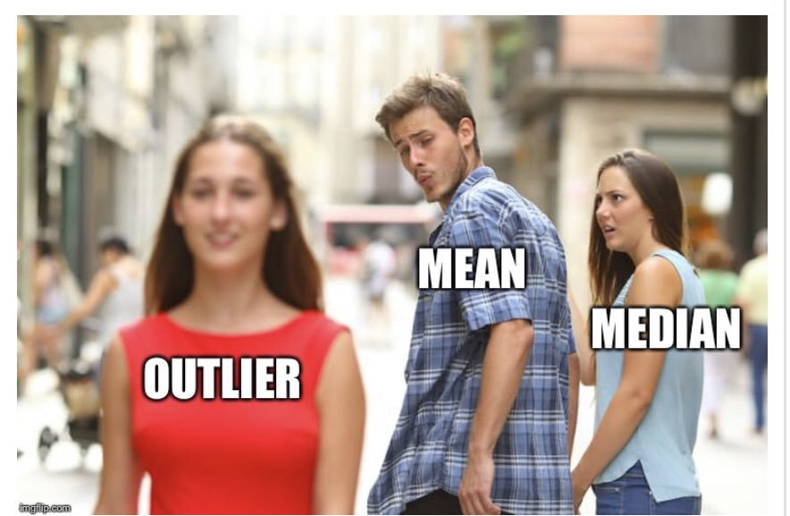

```{r setup, include=FALSE}
library(knitr)
library(tidyverse)
library(fontawesome)
library(cowplot)
library(ggrepel)
library(countdown)
library(metathis)
options(
    htmltools.dir.version = FALSE,
    knitr.table.format = "html",
    knitr.kable.NA = '',
    dplyr.width = Inf,
    width = 250
)
knitr::opts_chunk$set(
    warning = FALSE,
    message = FALSE,
    fig.path = "figs/",
    fig.width = 7.252,
    fig.height = 4,
    comment = "#>",
    fig.retina = 3
)
xaringanExtra::use_tile_view()
xaringanExtra::use_panelset()
xaringanExtra::use_clipboard()
xaringanExtra::use_share_again()
xaringanExtra::style_share_again(share_buttons = "none")
xaringanExtra::use_extra_styles(
  hover_code_line = TRUE,
  mute_unhighlighted_code = FALSE
)
# Set up website metadata
meta() %>%
  meta_general(
    description = rmarkdown::metadata$subtitle,
    generator = "xaringan and remark.js"
  ) %>%
  meta_name("github-repo" = "emse-eda-gwu/2022-Fall") %>%
  meta_social(
    title = rmarkdown::metadata$title,
    url = "https://eda.seas.gwu.edu/2022-Fall/",
    og_type = "website",
    og_author = "John Paul Helveston",
    twitter_card_type = "summary_large_image",
    twitter_creator = "@johnhelveston"
  )

theme_set(theme_bw(base_size = 20)) # Set theme for all ggplots

# Read in data sets for class
milk_production <- read_csv(here::here('data', 'milk_production.csv'))
lotr_words <- read_csv(here::here('data', 'lotr_words.csv'))
marathon <- read_csv(here::here('data', 'marathon.csv'))
tb_cases <- read_csv(here::here('data', 'tb_cases.csv'))
wildlife_impacts <- read_csv(here::here('data', 'wildlife_impacts.csv'))
daysToShip <- data.frame(
    order = seq(12),
    warehouseA = c(3,3,3,4,4,4,5,5,5,5,5,5),
    warehouseB = c(1,1,1,3,3,4,5,5,5,6,7,10))
```

class: middle, inverse

.leftcol30[

<center>

</center>

]

.rightcol70[

# Week `r rmarkdown::metadata$week`: .fancy[`r rmarkdown::metadata$title`]

### `r fontawesome::fa(name = "building-columns", fill = "white")` `r rmarkdown::metadata$subtitle`
### `r fontawesome::fa(name = "user", fill = "white")` `r rmarkdown::metadata$author`
### `r fontawesome::fa(name = "calendar", fill = "white")` `r rmarkdown::metadata$date`

]

---

class: center, middle, inverse

# Quiz solution

---

class: center, middle, inverse

# Tip of the week:

# `theme_set()`

---

# Add "global" settings to all plots

```{r, eval=FALSE}
library(knitr)
library(tidyverse)
library(here)
knitr::opts_chunk$set(
    warning = FALSE,
    message = FALSE,
    comment = "#>",
    fig.path = "figs/", # Plot save path #<<
    fig.width = 7.252, # Plot dimensions #<<
    fig.height = 4, #<<
    fig.retina = 3 # Better plot resolution #<<
)

theme_set(theme_bw(base_size = 20)) # Set theme for all ggplots #<<
```

---

```{r, eval=FALSE}
ggplot(mtcars) +
  geom_point(aes(x = mpg, y = hp))
```

.leftcol[

Default theme

```{r, echo=FALSE}
ggplot(mtcars) +
  geom_point(aes(x = mpg, y = hp)) +
  theme_gray()
```

]

.rightcol[

`theme_bw(base_size = 20)`

```{r, echo=FALSE}
ggplot(mtcars) +
  geom_point(aes(x = mpg, y = hp)) +
  theme_bw(base_size = 20)
```

]

---

```{r child="topics/0.Rmd"}
```

---

```{r child="topics/1.Rmd"}
```

---

class: inverse, center, middle

# 24,901

???

If I walked up to you, and said, "The answer is 24,901,"
you would probably be confused.
By itself, a number means nothing.

---

class: inverse, center, middle

# Earth's circumference at the equator:<br>24,901 miles

???

But if I were to tell you that the circumference of the earth at the equator is 24,901 miles, that would mean something.

To be complete and meaningful, quantitative information consists of both quantitative data (the numbers) and categorical data (the labels that tell us what the numbers measure).

---

# Types of Data

--

.leftcol[

### **Categorical**

Subdivide things into _groups_

- What type?
- Which category?

]

--

.rightcol[

### **Numerical**

Measure things with numbers

- How many?
- How much?

]

---

## Categorical (discrete) variables

--

.leftcol[

### **Nominal**

- Order doesn't matter
- Differ in "name" (nominal) only

e.g. `country` in TB case data:

.code80[

```{r, echo=FALSE}
tb_cases
```

]]

--

.rightcol[

### **Ordinal**

- Order matters
- Distance between units not equal

e.g.: `Placement` 2017 Boston marathon:

.code80[

```{r, echo=FALSE}
marathon %>%
  dplyr::select(Placement = Overall, `Official Time`, Name) %>%
  head()
```

]]

---

## Numerical data

--

.leftcol[

### **Interval**

- Numerical scale with<br>arbitrary starting point
- No "0" point
- Can't say "x" is double "y"

e.g.: `temp` in Beaver data

```{r, echo=FALSE}
beaver1 %>%
    arrange(day) %>%
    head()
```

]

--

.rightcol[

### **Ratio**

- Has a "0" point
- Can be described as percentages
- Can say "x" is double "y"

e.g.: `height` & `speed` in wildlife impacts

```{r, echo=FALSE}
wildlife_impacts %>%
    filter(!is.na(height), ! is.na(speed)) %>%
    dplyr::select(incident_date, height, speed) %>%
    head()
```

]

---

class: inverse, center, middle

# Key Questions

--

.leftcol[

## Categorical

## .orange[Does the order matter?]

| Yes | No |
|---|---|
| Ordinal | Nominal |

]

--

.rightcol[

## Numerical

## .orange[Is there a "baseline"?]

| Yes | No |
|---|---|
| Ratio | Interval |

]

---

class: center, middle

# Be careful of how variables are encoded!

---

## .red[When numbers are categories]

- "Dummy coding": e.g., `passedTest` = `1` or `0`)
- "North", "South", "East", "West" = `1`, `2`, `3`, `4`

--

## .red[When ratio data are discrete (i.e. counts)]

- Number of eggs in a carton, heart beats per minute, etc.
- Continuous variables measured discretely (e.g. age)

--

## .red[Time]

- As _ordinal_ categories: "Jan.", "Feb.", "Mar.", etc.
- As _interval_ scale: "Jan. 1", "Jan. 2", "Jan. 3", etc.
- As _ratio_ scale: "30 sec", "60 sec", "70 sec", etc.

---

# **Quick practice**: What's the data type?

> Decide [here](https://docs.google.com/presentation/d/1J8UtyEwkA5QEcQQ9LCAs4EU1gyhPY7QIoIW_T_gys6o/edit?usp=sharing) (link also in #classroom)

.code70[

```{r}
wildlife_impacts %>%
  filter(!is.na(cost_repairs_infl_adj)) %>%
  select(incident_date, time_of_day, species, cost_repairs_infl_adj) %>% 
    head()
```

]

???

- incident_date:         Interval
- time_of_day:           Ordinal
- species:               Nominal
- cost_repairs_infl_adj: Ratio

---

```{r child="topics/2.Rmd"}
```

---

class: inverse, middle

# .center[.font140[Summary Measures:]]

# This week: .red[Centrality] &  .blue[Variability]

# Next week: .green[Correlation]

---

# .red[Centrality (a.k.a. The "Average" Value)]

--

### A single number representing the _middle_ of a set of numbers

--

### **Mean**: $\frac{\text{Sum of values}}{\text{# of values}}$

--

### **Median**: "Middle" value (50% of data above & below)

--

### **Mode**: Most frequent value (usually for categorical data)

---

# .center[Mean isn't always the "best" choice]

.leftcol40[

```{r}
wildlife_impacts %>%
    filter(! is.na(height)) %>%
    summarise(
      mean = mean(height),
      median = median(height))
```

Percent of data below mean:

```{r, echo=FALSE}
percentiles <- ecdf(wildlife_impacts$height)
meanP <- percentiles(mean(wildlife_impacts$height, na.rm = TRUE))
paste0(round(100*meanP, 1), '%')
```

]

--

.rightcol60[


]

???

On average, where do planes hit birds?
Saying ~1000 ft is misleading
It's much more likely to be under 100 ft

---

class: inverse

# .center[Beware the "flaw of averages"]

--

.leftcol[

### What happened to the statistician that crossed a river with an average depth of 3 feet?

]

--

.rightcol[

### ...he drowned


]

---

# .blue[Variability ("Spread")]

--

### **Standard deviation**: distribution of values relative to the mean
### $s = \sqrt{\frac{\sum_{i=1}^{N}(x_i - \bar{x})^2}{N - 1}}$

--

### **Interquartile range (IQR)**: $Q_3 - Q_1$ (middle 50% of data)

--

### **Range**: max - min

---

# .center[.fancy[Example:] Days to ship]

.leftcol40[

Complaints are coming in about orders shipped from warehouse B, so you collect some data:

.code70[

```{r}
daysToShip
```

]]

--

.rightcol60[

Here, **averages** are misleading:

```{r}
daysToShip %>%
    gather(warehouse, days, warehouseA:warehouseB) %>%
    group_by(warehouse) %>%
    summarise(
        mean   = mean(days), #<<
        median = median(days)) #<<
```

]

---

# .center[.fancy[Example:] Days to ship]

.leftcol40[

Complaints are coming in about orders shipped from warehouse B, so you collect some data:

.code70[

```{r}
daysToShip
```

]]

.rightcol60[

**Variability** reveals difference in days to ship:

```{r}
daysToShip %>%
    gather(warehouse, days, warehouseA:warehouseB) %>%
    group_by(warehouse) %>%
    summarise(
        mean   = mean(days),
        median = median(days),
        range = max(days) - min(days), #<<
        sd    = sd(days)) #<<
```

]

---

# .center[.fancy[Example:] Days to ship]

<center>

</center>

---

class: center

# Interpreting the standard deviation

.leftcol[

### $s = \sqrt{\frac{\sum_{i=1}^{N}(x_i - \bar{x})^2}{N - 1}}$

<center>

</center>

]

--

.rightcol[


]

---

class: inverse, center

# Outliers

<center>

</center>

---

## **Mean** & **Standard Deviation** are sensitive to outliers

**Outliers**: $Q_1 - 1.5 IQR$ or $Q_3 + 1.5 IQR$

**Extreme values**: $Q_1 - 3 IQR$ or $Q_3 + 3 IQR$

--

.leftcol[

```{r}
data1 <- c(3,3,4,5,5,6,6,7,8,9)
```

- Mean: `r mean(data1)`
- Standard Deviation: `r round(sd(data1), 2)`
- Median: `r median(data1)`
- IQR: `r IQR(data1)`

]

--

.rightcol[

```{r}
data2 <- c(3,3,4,5,5,6,6,7,8,20)
```

- .red[Mean: `r mean(data2)`]
- .red[Standard Deviation: `r round(sd(data2), 2)`]
- .blue[Median: `r median(data2)`]
- .blue[IQR: `r IQR(data2)`]

]

---

class: inverse, middle

# .center[Robust statistics for continuous data]
# .center[(less sensitive to outliers)]

## .red[Centrality]: Use _median_ rather than _mean_

## .blue[Variability]: Use _IQR_ rather than _standard deviation_

---

class: inverse

# Practice with summary measurements

### 1) Read in the following data sets:

- `milk_production.csv`
- `lotr_words.csv`

### 2) For each variable in each data set, if possible, summarize its

### 1. .red[Centrality]
### 2. .blue[Variability]

---

class: inverse, center

# Break!

## Stand up, Move around, Stretch!

```{r, echo=FALSE}
countdown(
    minutes = 5,
    warn_when = 30,
    update_every = 1,
    left = 0, right = 0, top = 1, bottom = 0,
    margin = "5%",
    font_size = "8em"
)
```

---

```{r child="topics/3.Rmd"}
```

---

class: center

# "Visualizing data helps us think"

<center>

</center>

.left[.footer-small[Stephen Few (2009, pg. 6)]]

---

class: center

# Anscombe's Quartet

<center>

</center>

.left[.footer-small[Stephen Few (2009, pg. 6)]]

---

class: inverse, center, middle

# The data _type_ determines <br> how to summarize it

---

.cols3[

### **Nominal<br>(Categorical)**

**Measures**:
- Frequency counts /<br>Proportions
<br>
<br>
<br>
<br>

**Charts**:
- Bars

]

--

.cols3[

### **Ordinal<br>(Categorical)**

**Measures**:
- Frequency counts /<br>Proportions
- .red[Centrality]:<br>Median, Mode
- .blue[Variability]: IQR
<br>

**Charts**:
- Bars

]

--

.cols3[

### **Numerical<br>(Continuous)**

**Measures**:
- .red[Centrality]:<br>Mean, median
- .blue[Variability]: Range, standard deviation, IQR
<br>
<br>

**Charts**:
- Histogram
- Boxplot

]

---

## Summarizing **Nominal** data

.leftcol45[

Summarize with counts / percentages

```{r}
wildlife_impacts %>%
    count(operator, sort = TRUE) %>% #<<
    mutate(p = n / sum(n)) #<<
```

]

--

.rightcol55[

Visualize with bars

.code70[

```{r wildlife-operator-bars, fig.width=7, fig.height=3}
wildlife_impacts %>%
    count(operator, sort = TRUE) %>%
    ggplot() + #<<
    geom_col(aes(x = n, y = reorder(operator, n)), #<<
             width = 0.7) + #<<
    labs(x = "Count", y = "Operator")
```

]]

---

## Summarizing **Ordinal** data

.leftcol[

**Summarize**: Counts / percentages

.code70[
```{r}
wildlife_impacts %>%
    count(incident_month, sort = TRUE) %>% #<<
    mutate(p = n / sum(n)) #<<
```

]]

--

.rightcol[

**Visualize**: Bars

.code70[

```{r wildlife-months-bar, fig.width=7, fig.height=3.7}
wildlife_impacts %>%
    count(incident_month, sort = TRUE) %>%
    ggplot() + #<<
    geom_col(aes(x = as.factor(incident_month), #<<
                 y = n), width = 0.7) + #<<
    labs(x = "Incident month")
```

]]

---

## Summarizing **continuous** variables

.leftcol30[

**Histograms**:

- Skewness
- Number of modes

<br>

**Boxplots**:

- Outliers
- Comparing variables

]

.rightcol70[.border[


]]

---

## **Histogram**: Identify Skewness & # of Modes

.leftcol40[

**Summarise**:<br>Mean, median, sd, range, & IQR:

```{r}
summary(wildlife_impacts$height)
```

]

--

.rightcol60[

**Visualize**:<br>Histogram (identify skewness & modes)

```{r wildlife-height-hist, fig.width=7, fig.height=3.7, fig.align='center'}
ggplot(wildlife_impacts) +
  geom_histogram(aes(x = height), bins = 50) + #<<
  labs(x = 'Height (ft)', y = 'Count')
```

]

---

## **Histogram**: Identify Skewness & # of Modes

.leftcol[

**Height**

```{r, ref.label="wildlife-height-hist", fig.width=7, fig.height=3.7, fig.align='center'}
```

]

.rightcol[

**Speed**

```{r wildlife-speed-hist, fig.width=7, fig.height=3.7, fig.align='center'}
ggplot(wildlife_impacts) +
  geom_histogram(aes(x = speed), bins = 50) + #<<
  labs(x = 'speed (mph)', y = 'Count')
```

]

---

## **Boxplot**: Identify outliers

.leftcol[

**Height**

```{r wildlife-height-boxplot, fig.width=7, fig.height=3, fig.align='center'}
ggplot(wildlife_impacts) +
    geom_boxplot(aes(x = height)) + #<<
    labs(x = 'Height (ft)', y = NULL)
```
]

.rightcol[

**Speed**

```{r wildlife-speed-boxplot, fig.width=7, fig.height=3, fig.align='center'}
ggplot(wildlife_impacts) +
    geom_boxplot(aes(x = speed)) + #<<
    labs(x = 'Speed (mph)', y = NULL)
```

]

---

.leftcol[

## Histogram

- Skewness
- Modes

```{r, ref.label="wildlife-speed-hist", echo=FALSE, fig.width=7, fig.height=3.7, fig.align='center'}
```

]

.rightcol[

## Boxplot

- Outliers

<br><br>

```{r, ref.label="wildlife-speed-boxplot", echo=FALSE, fig.width=7, fig.height=3, fig.align='center'}
```

]

---

class: inverse

# Practicing visual summaries

.font90[

1) Read in the following data sets:

- `faithful.csv`
- `marathon.csv`

2) Summarize the following variables using an appropriate chart (bar chart, histogram, and / or boxplot):

- faithful: `eruptions`
- faithful: `waiting`
- marathon: `Age`
- marathon: `State`
- marathon: `Country`
- marathon: `` `Official Time` ``

]

---

```{r child="topics/4.Rmd"}
```

---

## Two **Categorical** Variables

Summarize with a table of counts

.leftcol60[

```{r}
wildlife_impacts %>%
    count(operator, time_of_day) #<<
```

]

---

## Two **Categorical** Variables

Convert to "wide" format with `pivot_wider()` to make it easier to compare values

.leftcol70[

```{r}
wildlife_impacts %>%
    count(operator, time_of_day) %>%
    pivot_wider(names_from = time_of_day, values_from = n) #<<
```

]

---

## Two **Categorical** Variables

.leftcol45[

Visualize with bars:<br>map **fill** to denote 2nd categorical var

```{r wildlife-two-var-bars, fig.width=9, fig.height=6, fig.align='center', fig.show='hide'}
wildlife_impacts %>%
  count(operator, time_of_day) %>%
  ggplot() +
  geom_col(
    aes(
      x = n,
      y = reorder(operator, n),
      fill = reorder(time_of_day, n) #<<
    ), 
    width = 0.7,
    position = 'dodge') + #<<
  theme(legend.position = "bottom") +
  labs(
    fill = "Time of day", 
    y = "Airline"
  )

```
]

.rightcol55[

```{r ref.label="wildlife-two-var-bars", fig.width=9, fig.height=6, fig.align='center', echo=FALSE}
```

]

---

## Two **Continuous** Variables

Visualize with scatterplot - looking for _clustering_ and/or _correlational_ relationship

.leftcol45[

```{r wildlife-scatterplot, fig.width=7, fig.height=4, fig.align='center', fig.show='hide'}
ggplot(wildlife_impacts) +
  geom_point(
    aes(
      x = speed, 
      y = height  
    ),
    size = 0.5) +
  labs(
    x = 'Speed (mph)',
    y = 'Height (f)'
  )
```

]

.rightcol55[

```{r ref.label="wildlife-scatterplot", fig.width=7, fig.height=4, fig.align='center', echo=FALSE}
```

]

---

## One **Continuous**, One **Categorical**

Visualize with **boxplot**

.leftcol45[

```{r wildlife-two-var-boxplot, fig.width=7, fig.height=4, fig.align='center', fig.show='hide'}
ggplot(wildlife_impacts) +
  geom_boxplot(
    aes(
      x = speed, 
      y = operator)
    ) + 
  labs(
    x = 'Speed (mph)',
    y = 'Airline'
  )
```

]

.rightcol55[

```{r ref.label="wildlife-two-var-boxplot", fig.width=7, fig.height=4, fig.align='center', echo=FALSE}
```

]

---

class: inverse

# Practice with visualizing _relationships_

1) Read in the following data sets:

- `marathon.csv`
- `wildlife_impacts.csv`

2) Visualize the _relationships_ between the following variables using an appropriate chart (bar plots, scatterplots, and / or box plots):

- marathon: `Age` & `Official Time`
- marathon: Country & `Official Time`
- wildlife_impacts: `state` & `operator`

---

```{r child="topics/5.Rmd"}
```

---

.leftcol[

# Exploratory Analysis

### Goal: **Form** hypotheses.
### Improves quality of **questions**.
### _(do this in THIS class)_

]

--

.rightcol[

# Confirmatory Analysis

### Goal: **Test** hypotheses.
### Improves quality of **answers**.
### _(do this in your stats classes)_

]

---

class: center, inverse

# Don't be Icarus

<center>

</center>

---

class: inverse, middle

## "Far better an approximate answer to the _right_ question, which is often vague, than an exact answer to the _wrong_ question, which can always be made precise."
## — John Tukey

---

class: center
background-color: #FFFFFF

**EDA is an iterative process to help you<br>_understand_ your data and ask better questions**

<center>

</center>

---

## Visualizing variation

.leftcol30[

Ask yourself:

- What type of **variation** occurs within my variables?
- What type of **covariation** occurs between my variables?

Check out [these guides](https://eda.seas.gwu.edu/2022-Fall/help/visualizing-data.html#choosing-the-right-chart)

]

.rightcol70[

<center>

</center>

]

---

class: inverse

# Practice doing EDA

1) Read in the `candy_rankings.csv` data sets

2) Preview the data, note the data types and what each variable is.

3) Visualize (at least) three _relationships_ between two variables (guided by a question) using an appropriate chart:

- Bar chart
- Scatterplot
- Boxplot

---

class: center, middle, inverse

# Start thinking about research questions

---

# Writing a research question

Follow [these guidelines](https://writingcenter.gmu.edu/guides/how-to-write-a-research-question) - your question should be:

- **Clear**: your audience can easily understand its purpose without additional explanation.
- **Focused**: it is narrow enough that it can be addressed thoroughly with the data available and within the limits of the final project report.
- **Concise**: it is expressed in the fewest possible words.
- **Complex**: it is not answerable with a simple "yes" or "no," but rather requires synthesis and analysis of data.
- **Arguable**: its potential answers are open to debate rather than accepted facts (do others care about it?)

---

# Writing a research question

**Look at examples**: See the [Example Projects Page](https://eda.seas.gwu.edu/2022-Fall/help/example-projects.html) page

---

# Start now! 

## [Mini Project 1](https://eda.seas.gwu.edu/2022-Fall/project-mini/1-data-cleaning.html): Due next week (9/27)

## [Project Proposal](https://eda.seas.gwu.edu/2022-Fall/project-final/1-proposal.html): Due in two weeks (10/04) 

