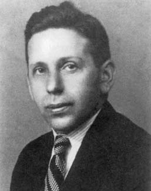
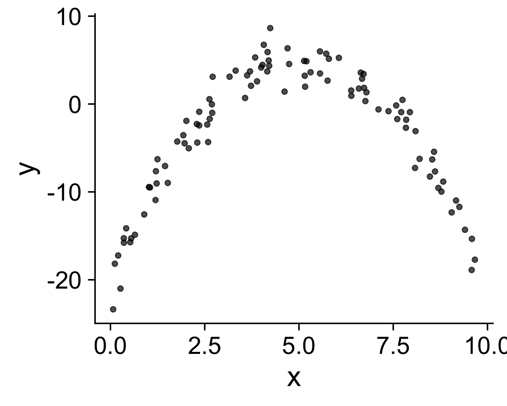
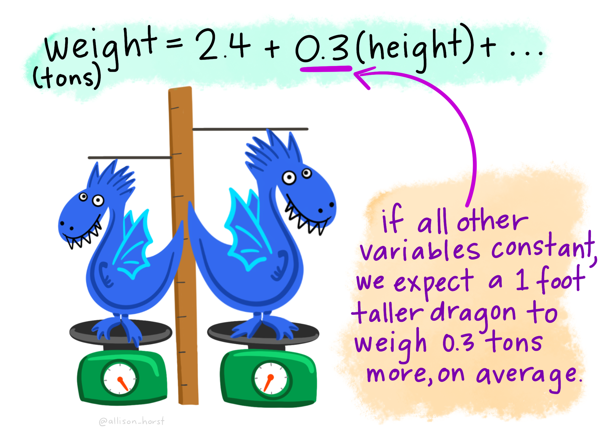

```{r setup, include=FALSE}
library(knitr)
library(tidyverse)
library(fontawesome)
library(countdown)
library(metathis)
library(HistData)
library(palmerpenguins)
options(
    htmltools.dir.version = FALSE,
    knitr.table.format = "html",
    knitr.kable.NA = '',
    dplyr.width = Inf,
    width = 250
)
knitr::opts_chunk$set(
    warning = FALSE,
    message = FALSE,
    fig.path = "figs/",
    fig.width = 7.252,
    fig.height = 4,
    comment = "#>",
    fig.retina = 3
)
xaringanExtra::use_tile_view()
xaringanExtra::use_panelset()
xaringanExtra::use_clipboard()
xaringanExtra::use_share_again()
xaringanExtra::style_share_again(share_buttons = "none")
xaringanExtra::use_extra_styles(
  hover_code_line = TRUE,
  mute_unhighlighted_code = FALSE
)
# Set up website metadata
meta() %>%
  meta_general(
    description = rmarkdown::metadata$subtitle,
    generator = "xaringan and remark.js"
  ) %>%
  meta_name("github-repo" = "emse-eda-gwu/2022-Fall") %>%
  meta_social(
    title = rmarkdown::metadata$title,
    url = "https://eda.seas.gwu.edu/2022-Fall/",
    og_type = "website",
    og_author = "John Paul Helveston",
    twitter_card_type = "summary_large_image",
    twitter_creator = "@johnhelveston"
  )
```

class: middle, inverse

.leftcol30[

<center>

</center>

]

.rightcol70[

# Week `r rmarkdown::metadata$week`: .fancy[`r rmarkdown::metadata$title`]

### `r fontawesome::fa(name = "building-columns", fill = "white")` `r rmarkdown::metadata$subtitle`
### `r fontawesome::fa(name = "user", fill = "white")` `r rmarkdown::metadata$author`
### `r fontawesome::fa(name = "calendar", fill = "white")` `r rmarkdown::metadata$date`

]

---

class: center, middle, inverse

# Quick Rmd updates

---

class: center, middle, inverse

# .fancy[.blue[Tip of the week]]

# All data are biased

---

class: center, middle

<center>

</center>

---

class: middle 

.leftcol40[

<center>

</center>

## [.center[Abraham Wald]](https://en.wikipedia.org/wiki/Abraham_Wald)

]

.rightcol60[

<center>

</center>

]

---

## Today's data

```{r, eval=FALSE}
msleep <- read_csv(here::here('data', 'msleep.csv'))
```

## New packages:

```{r, eval=FALSE}
install.packages('HistData')
install.packages('palmerpenguins')
install.packages('GGally')
```

---

```{r child="topics/0.Rmd"}
```

---

```{r child="topics/1.Rmd"}
```

---

## Some pretty racist origins in [eugenics](https://en.wikipedia.org/wiki/Eugenics) ("well born")

--

.leftcol[

### [Sir Francis Galton](https://en.wikipedia.org/wiki/Francis_Galton) (1822 - 1911)

- Charles Darwin's cousin.
- "Father" of [eugenics](https://en.wikipedia.org/wiki/Eugenics).
- Interested in heredity.

<center>

</center>

]

--

.rightcol[

### [Karl Pearson](https://en.wikipedia.org/wiki/Karl_Pearson) (1857 - 1936)

- Galton's ([hero-worshiping](https://en.wikipedia.org/wiki/Apotheosis)) protégé.
- Defined correlation equation.
- "Father" of mathematical statistics.

<center>

<center>

]

???

The beautiful irony is that human genetics was also the field that conclusively demonstrated the biological falsity of race.

---

.leftcol[

# Galton's family data

Galton, F. (1886). ["Regression towards mediocrity in hereditary stature"](http://www.stat.ucla.edu/~nchristo/statistics100C/history_regression.pdf). _The Journal of the Anthropological Institute of Great Britain and Ireland_ 15: 246-263.

**Galton's question**: Does marriage selection indicate a relationship between the heights of husbands and wives?<br>(He called this "assortative mating")

"midparent height" is just a scaled mean:
```{r, eval=FALSE}
midparentHeight =  (father + 1.08*mother)/2
```

]

--

.rightcol[.code70[

```{r, eval=FALSE}
library(HistData)

galtonScatterplot <- ggplot(GaltonFamilies) +
    geom_point(aes(x = midparentHeight,
                   y = childHeight),
               size = 0.5, alpha = 0.7) +
    theme_classic() +
    labs(x = 'Midparent height (inches)',
         y = 'Child height (inches)')
```

<center>

</center>

]]

---
class: center, middle

# How do you measure correlation?

<br>

# Pearson came up with this:

# $r = \frac{\text{Cov}(x, y)}{\text{sd}(x) * \text{sd}(y)}$

---

# How do you measure correlation?

.leftcol60[

## $r = \frac{\text{Cov}(x, y)}{\text{sd}(x) * \text{sd}(y)}$

.font130[

Assumptions:
1. Variables must be interval or ratio
2. Linear relationship

]]

--

.rightcol40[

<center>

</center>
<br>
<center>

</center>

]

---

# How do you _interpret_ $r$?

.leftcol[

## $r = \frac{\text{Cov}(x, y)}{\text{sd}(x) * \text{sd}(y)}$

Interpretation:
- $-1 \le r \le 1$
- Closer to 1 is stronger correlation
- Closer to 0 is weaker correlation

]

--

.rightcol[.code70[

```{r}
cor(x = GaltonFamilies$midparentHeight,
    y = GaltonFamilies$childHeight,
    method = 'pearson')
```

]

<center>

</center>

]

---

## What does $r$ mean?

.leftcol40[.font120[

- $\pm 0.1 - 0.3$: Weak
- $\pm 0.3 - 0.5$: Moderate
- $\pm 0.5 - 0.8$: Strong
- $\pm 0.8 - 1.0$: Very strong
]]

.rightcol60[

<center>

</center>

]

---

class: center,  middle

# Visualizing correlation is...um...easy, right?

<br>

# [guessthecorrelation.com](http://guessthecorrelation.com/)

# Click [here](https://docs.google.com/presentation/d/1uN5FfQ4QiiaJ1SI1A5SRji58vWzubk2qwGi9Lykz5z0/edit?usp=sharing) to vote!

---

class: middle

.leftcol20[

## The datasaurus

### (More [here](https://www.autodeskresearch.com/publications/samestats))

]

.rightcol80[


]

---

# Coefficient of determination: $r^2$

.leftcol[.font130[

Percent of variance in one variable that is explained by the other variable

<center>

</center>

]]

--

.rightcol[

$r$ | $r^2$
----|------
0.1 | 0.01
0.2 | 0.04
0.3 | 0.09
0.4 | 0.16
0.5 | 0.25
0.6 | 0.36
0.7 | 0.49
0.8 | 0.64
0.9 | 0.81
1.0 | 1.00

]

---

## You should report both $r$ and $r^2$

<br>

### Correlation between parent and child height is 0.32, therefore 10% of the variance in the child height is explained by the parent height.

---

# Correlation != Causation

--

### X causes Y

- Training causes improved performance

--

### Y causes X

- (Good / bad) performance causes people to train harder.

--

### Z causes both X & Y

- Commitment and motivation cause increased training and better performance.

---

class: center

## Be weary of dual axes!

## ([They can cause spurious correlations](https://www.tylervigen.com/spurious-correlations))

--

.leftcol[

.font120[Dual axes]

<center>

</center>

]

--

.rightcol[

.font120[Single axis]

<center>

</center>

]

---

class: inverse, center

# Outliers

<center>

</center>

---

class: middle

<center>

</center>

---

class: middle

<center>

</center>

---

class: middle

<center>

</center>

---

class: center, middle

## Pearson correlation is highly sensitive to outliers

<center>

</center>

---

# Spearman's rank-order correlation

# $r = \frac{\text{Cov}(x, y)}{\text{sd}(x) * \text{sd}(y)}$

--

.font120[

- Separately rank the values of X & Y.
- Use Pearson's correlation on the _ranks_ instead of the $x$ & $y$ values.

]

--

.font120[

Assumptions:

- Variables can be ordinal, interval or ratio
- Relationship must be monotonic (i.e. does not require linearity)

]

---

class: center, middle

## Spearman correlation more robust to outliers

<center>

</center>

---

class: center, middle

## Spearman correlation more robust to outliers

.cols3[

<center>

</center>

]

.cols3[

```{r, echo=FALSE}
tribble(
    ~Pearson, ~Spearman,
    -0.56,    0.53,
    0.39,     0.69,
    0.94,     0.81,
    0.38,     0.76,
    0.81,     0.79,
    0.31,     0.70,
    0.95,     0.81,
    0.51,     0.75,
    -0.56,    0.53) %>%
    kable()
```

]

.cols3[

<center>

</center>

]

---

## Summary of correlation

.font120[

- **Pearson's correlation**: Described the strength of a **linear** relationship between two variables that are interval or ratio in nature.
- **Spearman's rank-order correlation**: Describes the strength of a **monotonic** relationship between two variables that are ordinal, interval, or ratio. **It is more robust to outliers**.
- The **coefficient of determination** ( $r^2$ ) describes the amount of variance in one variable that is explained by the other variable.
- **Correlation != Causation**

]

--

R command (hint: add `use = "complete.obs"` to drop NA values)

```{r, eval=FALSE}
pearson  <- cor(x, y, method = "pearson", use = "complete.obs")
spearman <- cor(x, y, method = "spearman", use = "complete.obs")
```

---

```{r child="topics/2.Rmd"}
```

---

## **Scatterplots**: The correlation workhorse

.leftcol[

```{r, eval=FALSE}
scatterplot <- ggplot(mtcars) +
    geom_point(aes(x = mpg, y = hp), #<<
               size = 2, alpha = 0.7) +
    theme_classic(base_size = 20) +
    labs(x = 'Fuel economy (mpg)',
         y = 'Engine power (hp)')

scatterplot
```

]

.rightcol[

<center>

</center>

]

---

## Adding a correlation label to a chart

.leftcol[
Make the correlation label

```{r, eval=FALSE}
corr <- cor(
    mtcars$mpg, mtcars$hp,
    method = 'pearson')

corrLabel <- paste('r = ', round(corr, 2)) #<<
```

Add label to the chart with `annotate()`

```{r, eval=FALSE}
scatterplot +
    annotate(geom = 'text', #<<
             x = 25, y = 310, #<<
             label = corrLabel, #<<
             hjust = 0, size = 7) #<<
```
]

.rightcol[

<center>

</center>

]

---

class: middle, center
background-color: #FFFFFF

<center>

</center>

---

## Visualize all the correlations: `ggcorr()`

.leftcol[

```{r, eval=FALSE}
library('GGally')
```

```{r, eval=FALSE}
mtcars %>%
    ggcorr() #<<
```

]

.rightcol[

<center>

</center>

]

---

## Visualizing correlations: `ggcorr()`

.leftcol[

```{r, eval=FALSE}
library('GGally')
```

```{r, eval=FALSE}
mtcars %>%
    ggcorr(label = TRUE, #<<
           label_size = 3, #<<
           label_round = 2) #<<
```

]

.rightcol[

<center>

</center>

]

---

## Visualizing correlations: `ggcorr()`

.leftcol[

```{r, eval=FALSE}
ggcor_mtcars_final <- mtcars %>%
    ggcorr(label = TRUE,
           label_size = 3,
           label_round = 2,
           label_color = 'white', #<<
           nbreaks = 5,  #<<
           palette = "RdBu") #<<
```

]

.rightcol[

<center>

</center>

]

---

.leftcol[

## .center[Pearson]

```{r, eval=FALSE}
mtcars %>%
    ggcorr(label = TRUE,
           label_size = 3,
           label_round = 2,
           method = c("pairwise", "pearson")) #<<
```

<center>

</center>

]

.rightcol[

## .center[Spearman]

```{r, eval=FALSE}
mtcars %>%
    ggcorr(label = TRUE,
           label_size = 3,
           label_round = 2,
           method = c("pairwise", "spearman")) #<<
```

<center>

</center>

]

---

## Correlograms: `ggpairs()`

.leftcol40[

```{r, eval=FALSE}
library('GGally')
```
```{r, eval=FALSE}
mtcars %>%
    select(mpg, cyl, disp, hp, wt) %>%
    ggpairs() #<<
```

- Look for linear relationships 
- View distribution of each variable

]

.rightcol60[

<center>

</center>

]

---

## Correlograms: `ggpairs()`

.leftcol40[

```{r, eval=FALSE}
library('GGally')
```
```{r, eval=FALSE}
mtcars %>%
    select(mpg, cyl, disp, hp, wt) %>%
    ggpairs() +
    theme_classic() #<<
```

- Look for linear relationships 
- View distribution of each variable

]

.rightcol60[

<center>

</center>

]

---

class: inverse

## Your turn

```{r, echo=FALSE}
countdown(
    minutes = 15,
    warn_when = 30,
    update_every = 15,
    top = 0,
    font_size = '2em'
)
```

.leftcol[

Using the `penguins` data frame:

1. Find the two variables with the largest correlation in absolute value (i.e. closest to -1 or 1).

2. Create a scatter plot of those two variables. 

3. Add an annotation for the Pearson correlation coefficient.

]

.rightcol[

### .center[[palmerpenguins library](https://allisonhorst.github.io/palmerpenguins/)]

<center>

</center>

.right[Artwork by [@allison_horst](https://twitter.com/allison_horst)]

]

---

## **Simpson's Paradox**: when correlation betrays you 

--

.leftcol[

.center[**Body mass vs. Bill depth**]

<center>

</center>

]

--

.rightcol[

.center[**Body mass vs. Bill depth**]

<center>

</center>

]

---

class: inverse

# Quiz 2

```{r, echo=FALSE}
countdown(
    minutes = 10,
    warn_when = 30,
    update_every = 1,
    bottom = 0,
    left = 0,
    font_size = '4em'
)
```

.leftcol[

### Link is in the #class channel

]

.rightcol[

<center>

</center>

]

---

```{r child="topics/3.Rmd"}
```

---

# Palmer Penguins

.leftcol[

The correlation of 0.87 means that the body mass (g) explains about 75% of the variation in the flipper length (mm).

]

.rightcol[

<center>

</center>

]

---

# Palmer Penguins

.leftcol[

The correlation of 0.87 means that the body mass (g) explains about 75% of the variation in the flipper length (mm).

<br>

**Now let's fit a model to these points!**
]

.rightcol[

<center>

</center>

]

---

## Modeling basics

.leftcol[

Two parts to a model:

1. **Model family**: e.g., $y = ax + b$
<br>

2. **Fitted model**: e.g., $y = 3x + 7$

]

--

.rightcol[

Here is some simulated data

<center>

</center>

]

---

## Modeling basics

.leftcol[

Two parts to a model:
1. **Model family**: linear model: $y = ax + b$

]

--

.rightcol[

There are an infinite number of possible models

<center>

</center>

]

---

## Modeling basics

.leftcol[

Two parts to a model:

1. **Model family**: linear model: $y = ax + b$

<br>

2. **Fitted model**: How to choose the "best" $a$ and $b$?

]

.rightcol[

There are an infinite number of possible models

<center>

</center>

]

---

## Modeling basics

.leftcol[

Two parts to a model:

1. **Model family**: linear model: $y = ax + b$
<br>

2. **Fitted model**: How to choose the "best" $a$ and $b$?

.blue[_We need to come up with some measure of "distance" from the model to the data_]

]

--

.rightcol[

Compute the **.blue["residuals"]**:<br>The distance between the model line and the data<br>

<center>

</center>

]

---

## Residual: $y_i - y_i'$

.leftcol[

### **Residual**: The distance between the model line and the data

]

.rightcol[

<center>

</center>

]

---

## Sum of squared residuals: $\text{SSR} = \sum_{i = 1}^{n} (y_i - y_i')^2$

.leftcol[

### **Residual**: The distance between the model line and the data

]

.rightcol[

<center>

</center>

]

---

## Search algorithm

.cols3[

1): Pick a model ( $a$ and $b$ ):<br>

$y = ax + b$

<br>

<center>

</center>

]

--

.cols3[

2): Compute the SSR:<br>

$\text{SSR} = \sum_{i = 1}^{n} (y_i - y_i')^2$

<center>

</center>

]

--

.cols3[

3): Repeat steps 1 & 2 until the smallest SSR is found
<br><br>

<center>

</center>

]

---

## Fitting a linear model in R

```{r, eval=FALSE}
model <- lm(formula = y ~ x, data = data)
```

--

Penguin data:

```{r}
model <- lm(
  formula = body_mass_g ~ flipper_length_mm,
  data    = penguins)
```

--

Get coefficients ( $a$ & $b$ in $y = ax + b$ )

```{r}
coef(model)
```

---

## Fitting a linear model in R

.leftcol[

```{r, eval=FALSE}
model <- lm(formula = y ~ x,
            data = data)
```

Penguin data:

```{r}
model <- lm(
  formula = body_mass_g ~ flipper_length_mm,
  data    = penguins)
```

Get coefficients

```{r}
coef(model)
```

]

.rightcol[

<center>

</center>

]

---

class: middle, center

## Interpreting results

<center>

</center>

.left[Artwork by [@allison_horst](https://twitter.com/allison_horst)]

---

## Example write up for Penguin data

.leftcol[.font120[

The correlation between flipper length (mm) and body mass (g) is **0.87**. Therefore, **~75%** of the variance in body mass is explained by flipper length.

The slope of the best fitting regression line indicates that body mass increased by **49.7 g** as flipper length increased by one mm.

]]

.rightcol[

<center>

</center>

]

---

## Making predictions

.leftcol[

**Interpolation is OK**: You may predict values of $y$ for values of $x$ that were not observed but are within the range of the observed values of $x$.

<center>

</center>

]

--

.rightcol[

**Extrapolation is DANGEROUS**: You generally should NOT predict values of $y$ using values of $x$ that are outside the observed range of $x$.

<center>

</center>

.center[[xkcd](https://m.xkcd.com/605/)]

]

---

## Repeat: Extrapolation is **DANGEROUS**

.leftcol[

"Extrapolation of these trends to the 2008 Olympiad indicates that the women’s 100-metre race could be won in a time of 10.57±0.232 seconds and the men’s event in 9.73±0.144 seconds. **Should these trends continue, the projections will intersect at the 2156 Olympics, when — for the first time ever — the winning women's 100-metre sprint time of 8.079 seconds will be lower than that of the men's winning time of 8.098 seconds (Fig. 1).**"

]

.rightcol[

<center>

</center>

.font80[Tatem, A. J., Guerra, C. A., Atkinson, P. M., & Hay, S. I. (2004). Momentous sprint at the 2156 Olympics? _Nature_, 431(7008), 525-525. [View online](https://www.ncbi.nlm.nih.gov/pmc/articles/PMC3173856/)]

]

---

# Symantics

.leftcol[.font130[

These all mean the same thing:

- "Use X to predict Y"
- "Regress Y _on_ X"
- "Regression of Y _on_ X"

```{r, eval=FALSE}
model <- lm(formula = y ~ x,
            data = data)
```

]]

--

.rightcol[

<center>

</center>

]

---

# Symantics

```{r, eval=FALSE}
model <- lm(formula = y ~ x,
            data = data)
```

.leftcol[.font130[

**Y: Dependent variable**
- Outcome variable
- Response variable
- Regressand
- Left-hand variable

]]

.rightcol[.font130[

**X: Independent variable**
- Predictor variable
- Explanatory variable
- Regressor
- Right-hand variable

]]

---

```{r child="topics/4.Rmd"}
```

---

## Adding the correlation annotation

.leftcol60[

```{r, eval=FALSE}
# Make the correlation label
corr <- cor(
    penguins$body_mass_g, 
    penguins$flipper_length_mm,
    method = 'pearson', 
    use = "complete.obs"
)

corrLabel <- paste("r = ", round(corr, 2)) #<<

# Make the chart!
penguins %>% 
    ggplot(aes(x = flipper_length_mm, y = body_mass_g)) +
    geom_point(size = 1, alpha = 0.7) +
    theme_classic(base_size = 20) +
    labs(x = "Flipper length (mm)",
         y = "Body mass (g)") + 
    annotate( #<<
        geom = 'text', x = 175, y = 6000, #<<
        label = corrLabel, #<<
        hjust = 0, size = 5)  #<<
```

]

.rightcol40[

<center>

</center>

]

---

.leftcol60[

```{r, eval=FALSE}
# Make model label
model <- lm(
  formula = body_mass_g ~ flipper_length_mm,
  data    = penguins)
coefs <- round(coef(model), 2)
modelLabel <- paste('y = ', coefs[1], ' + ', coefs[2], 'x') #<<

# Make the chart!
penguins %>% 
    ggplot(aes(x = flipper_length_mm, y = body_mass_g)) +
    geom_point(size = 1, alpha = 0.7) +
    geom_smooth(method = 'lm', se = FALSE) + #<<
    theme_classic(base_size = 20) +
    labs(x = "Flipper length (mm)",
         y = "Body mass (g)") + 
    annotate(geom = 'text', x = 175, y = 6000,
             label = corrLabel,
             hjust = 0, size = 5) +
    annotate( #<<
        geom = 'text', x = 175, y = 5700, #<<
        label = modelLabel, color = "blue", #<<
        hjust = 0, size = 5) #<<
```

]

.rightcol40[

## .center[Add model]

<center>

</center>

]

---

class: inverse

## Your turn

```{r, echo=FALSE}
countdown(
    minutes = 15,
    warn_when = 30,
    update_every = 15,
    top = 0,
    font_size = '2em'
)
```

Using the `msleep` data frame:

1. Create a scatter plot of `brainwt` versus `bodywt`.
2. Include an annotation for the Pearson correlation coefficient.
3. Include an annotation for the best fit line.

Bonus: Compare your results to a log-linear relationship by converting the x and y variables to the log of x and y, like this:

```{r, eval=FALSE}
model <- lm(log(x) ~ log(y), data = msleep)
```

You can also convert your plot to log axes by adding these layers:

```{r, eval=FALSE}
plot +    
    scale_x_log10() +
    scale_y_log10()  
```
