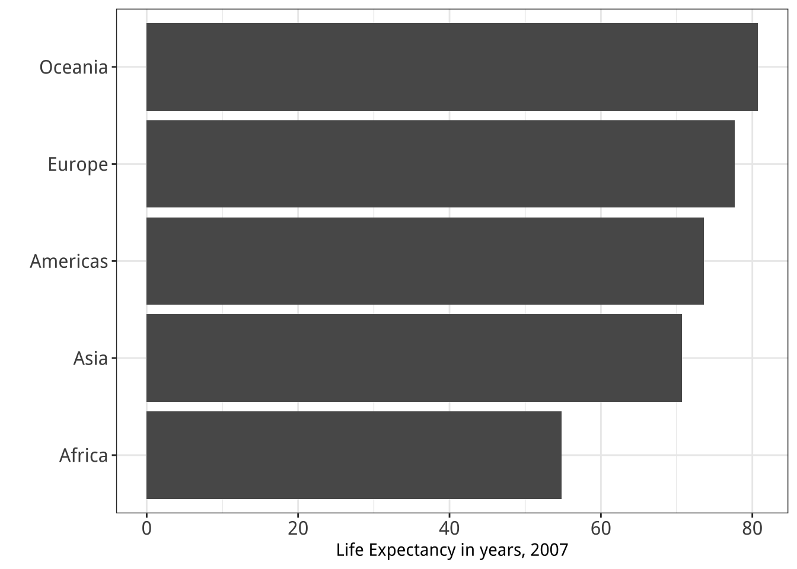

```{r setup, include=FALSE}
library(knitr)
library(tidyverse)
library(here)
library(cowplot)
library(fontawesome)
library(countdown)
library(metathis)
options(
    htmltools.dir.version = FALSE,
    knitr.table.format = "html",
    knitr.kable.NA = '',
    dplyr.width = Inf,
    width = 250
)
knitr::opts_chunk$set(
    warning = FALSE,
    message = FALSE,
    fig.path = "figs/",
    fig.width = 7.252,
    fig.height = 4,
    comment = "#>",
    fig.retina = 3
)
xaringanExtra::use_tile_view()
xaringanExtra::use_panelset()
xaringanExtra::use_clipboard()
xaringanExtra::use_share_again()
xaringanExtra::style_share_again(share_buttons = "none")
xaringanExtra::use_extra_styles(
  hover_code_line = TRUE,
  mute_unhighlighted_code = FALSE
)
# Set up website metadata
meta() %>%
  meta_general(
    description = rmarkdown::metadata$subtitle,
    generator = "xaringan and remark.js"
  ) %>%
  meta_name("github-repo" = "emse-eda-gwu/2022-Fall") %>%
  meta_social(
    title = rmarkdown::metadata$title,
    url = "https://eda.seas.gwu.edu/2022-Fall/",
    og_type = "website",
    og_author = "John Paul Helveston",
    twitter_card_type = "summary_large_image",
    twitter_creator = "@johnhelveston"
  )

# Read in data sets for class
wildlife_impacts <- read_csv(here('data', 'wildlife_impacts.csv'))
gapminder <- read_csv(here('data', 'gapminder.csv'))
```

background-image: url("images/nasa_global_preview.png")
background-size: cover

<br><br><br><br><br><br><br><br>

.rightcol80[.white[

# Week `r rmarkdown::metadata$week`: .fancy[`r rmarkdown::metadata$title`]

### `r fontawesome::fa(name = "building-columns", fill = "white")` `r rmarkdown::metadata$subtitle`
### `r fontawesome::fa(name = "user", fill = "white")` `r rmarkdown::metadata$author`
### `r fontawesome::fa(name = "calendar", fill = "white")` `r rmarkdown::metadata$date`

]]

---

class: middle

.rightcol80[
# References:

# - [Data Viz "Cheat Sheet"](https://github.com/emse-eda-gwu/2022-Fall/raw/main/content/cheatsheet-dataviz.pdf)

# - [Data Viz Reference Page](https://eda.seas.gwu.edu/2022-Fall/help/visualizing-data.html)

]

---

class: middle

.border[

<center>

</center>

]

---

class: middle

<center>

</center>

.left[From [here](https://psyteachr.github.io/msc-data-skills/ggplot.html)]

---

class: inverse, middle

.rightcol80[

# "_Having word processing software<br>doesn't make us great writers._"
## — Stephen Few

]

---

class: center

.leftcol[

# We don't write paragraphs like this

<center>

</center>

.left[.font80[Image from Few (2012, pg. 227)]]

]

--

.rightcol[

# So don't make<br>graphs like this

<center>

</center>

.center[.font80[Image from excelcharts.com]]

]

---

```{r child="topics/0.Rmd"}
```

---

```{r child="topics/1.Rmd"}
```

---

class: inverse, middle, center

# Good visualizations optimize for<br>the human visual-memory system

---

class: center

## A (very) simplified model of the visual-memory system

<center>

</center>

---

class: center

## A (very) simplified model of the visual-memory system

<center>

</center>

---

class: center

## A (very) simplified model of the visual-memory system

<center>

</center>

---

class: center

## A (very) simplified model of the visual-memory system

<center>

</center>

---

class: inverse, middle

# Two objectives of effective charts:

## 1. Grab & direct attention (iconic memory)
## 2. Reduce processing demands (working memory)

---

class: center

# The power of pre-attentive processing

## Count all the "5"'s

--

<center>

</center>

---

class: center

# The power of pre-attentive processing

## Count all the "5"'s

--

<center>

</center>

---

class: center

.leftcol[

<center>

</center>

]

--

.rightcol[

## Pre-attentive attributes
<br>
<center>

</center>

]

---

class: center

.leftcol[

<center>

</center>

]

.rightcol[

## Pre-attentive attributes

### .red[Numerical (ratio) data]

<center>

</center>

]

---

class: center

.leftcol[

<center>

</center>

]

.rightcol[

## Pre-attentive attributes

### .red[Numerical (ratio) data]<br>.blue[Categorical (ordinal) data]

<center>

</center>

]

---

class: inverse, middle, center

# Not all pre-attentive attributes are equal

---

class: center

# Where is the red dot?

--

.cols3[

<center>

</center>

]

--

.cols3[

<center>

</center>

]

--

.cols3[

<center>

</center>

]

---

# .center[For categorical data:]

### 1. Hue (color) > shape
### 2. Less is more (stay in working memory!)

.cols3[

<center>

</center>

]

.cols3[

<center>

</center>

]

.cols3[

<center>

</center>

]

---

class: middle

.leftcol[

<center>
<br>

</center>

]

--

.rightcol[

<center>


</center>

]


---

class: middle

<center>

</center>

---

```{r child="topics/2.Rmd"}
```

---

class: center, middle, inverse

# Much of the content in this section is from<br>John Rauser's [talk](https://www.youtube.com/watch?v=fSgEeI2Xpdc) on YouTube

(Always cite your sources)

---

class: middle

.leftcol60[

<center>

</center>

]

--

.rightcol40[

Cleveland, W. S., & McGill, R. (1985). Graphical perception and graphical methods for analyzing scientific data. Science, New Series, 229(4716), 828-833.

]

---

name: cleveland-perception
class: inverse

# Cleveland's operations of pattern perception:

.leftcol[

# 1. Estimation
# 2. Assembly
# 3. Detection

]

---

class: inverse

# Cleveland's operations of pattern perception:

.leftcol[

# 1. .red[Estimation] -------->
# 2. Assembly
# 3. Detection

]

.rightcol[

- ### **Discrimination** (X equal to Y?)
- ### **Ranking** (X greater than Y?)
- ### **Ratioing** (X double Y?)

]

---

name: cleveland-estimation
class: center, middle

# .red[Estimation]: Hierarchy for _numerical_ data

<center>

</center>

.leftcol[

## .left[More Accurate]

]

.rightcol[

## .right[Less Accurate]

]

---

class: center

# Example: Life expectancy in countries in Asia

.leftcol[

```{r, echo=FALSE}
gapminder %>%
    filter(continent == "Asia") %>%
    filter(year == max(year)) %>%
    # Removing a "middle" country so that it's just 32 countries
    filter(country != "Sri Lanka") %>%
    mutate(country = ifelse(country == "Korea, Rep.", "Korea", country)) %>%
    arrange(lifeExp) %>%
    dplyr::select(country, lifeExp) %>%
    as.data.frame() %>% 
    head(20)
```

]

---

class: middle

.leftcol30[

1. Position on a common scale
2. Position on<br>non-aligned scales
3. Length
4. Angle
5. Area
6. Color saturation
7. **.red[Color hue]**

]

--

.rightcol70[

<center>

</center>

]

---

class: middle

.leftcol30[

1. Position on a common scale
2. Position on<br>non-aligned scales
3. Length
4. Angle
5. Area
6. Color saturation
7. **.red[Color hue]**

<br>

- `r fa("square-check", fill = "green")` / `r fa("xmark", fill = "red")` **Discriminate**
- `r fa("square-check", fill = "green")` / `r fa("xmark", fill = "red")` **Rank**
- `r fa("xmark", fill = "red")` **Ratio**

]

.rightcol70[

<center>

</center>

]

---

class: middle

.leftcol30[

1. Position on a common scale
2. Position on<br>non-aligned scales
3. Length
4. Angle
5. Area
6. Color saturation
7. **.red[Color hue]**

Sorting helps a bit...

- `r fa("square-check", fill = "green")` / `r fa("xmark", fill = "red")` **Discriminate**
- `r fa("square-check", fill = "green")` / `r fa("xmark", fill = "red")` **Rank**
- `r fa("xmark", fill = "red")` **Ratio**

]

.rightcol70[

<center>

</center>

]

---

class: middle

.leftcol30[

1. Position on a common scale
2. Position on<br>non-aligned scales
3. Length
4. Angle
5. Area
6. **.red[Color saturation]**
7. Color hue

<br>

- `r fa("square-check", fill = "green")` / `r fa("xmark", fill = "red")` **Discriminate**
- `r fa("square-check", fill = "green")` / `r fa("xmark", fill = "red")` **Rank**
- `r fa("xmark", fill = "red")` **Ratio**

]

.rightcol70[

<center>

</center>

]

---

class: middle

.leftcol30[

1. Position on a common scale
2. Position on<br>non-aligned scales
3. Length
4. Angle
5. Area
6. **.red[Color saturation]**
7. Color hue

Align to 0 scale:

- `r fa("square-check", fill = "green")` / `r fa("xmark", fill = "red")` **Discriminate**
- `r fa("square-check", fill = "green")` / `r fa("xmark", fill = "red")` **Rank**
- `r fa("square-check", fill = "green")` / `r fa("xmark", fill = "red")` **Ratio**

]

.rightcol70[

<center>

</center>

]

---

class: middle

.leftcol30[

1. Position on a common scale
2. Position on<br>non-aligned scales
3. Length
4. Angle
5. **.red[Area]**
6. Color saturation
7. Color hue

<br>

- `r fa("square-check", fill = "green")` / `r fa("xmark", fill = "red")` **Discriminate**
- `r fa("square-check", fill = "green")` / `r fa("xmark", fill = "red")` **Rank**
- `r fa("square-check", fill = "green")` / `r fa("xmark", fill = "red")` **Ratio**

]

.rightcol70[

<center>

</center>

]

---

class: middle

.leftcol30[

1. Position on a common scale
2. Position on<br>non-aligned scales
3. Length
4. Angle
5. **.red[Area]**
6. Color saturation
7. Color hue

]

.rightcol70[

### .center[Area works okay for "bubble" charts]
<center>

</center>

]

---

class: middle

.leftcol30[

1. Position on a common scale
2. Position on<br>non-aligned scales
3. Length
4. **.red[Angle]**
5. Area
6. Color saturation
7. Color hue

<br>

- `r fa("square-check", fill = "green")` / `r fa("xmark", fill = "red")` **Discriminate**
- `r fa("square-check", fill = "green")` **Rank**
- `r fa("square-check", fill = "green")` / `r fa("xmark", fill = "red")` **Ratio**

]

.rightcol70[

<center>

</center>

]

---

class: middle
background-color: #FFFFFF

.leftcol30[

1. Position on a common scale
2. Position on<br>non-aligned scales
3. Length
4. **.red[Angle]**
5. Area
6. Color saturation
7. Color hue

]

.rightcol70[

<center>

</center>

]

---

class: middle

.leftcol30[

1. Position on a common scale
2. Position on<br>non-aligned scales
3. **.red[Length]**
4. Angle
5. Area
6. Color saturation
7. Color hue

<br>

- `r fa("square-check", fill = "green")` / `r fa("xmark", fill = "red")` **Discriminate**
- `r fa("square-check", fill = "green")` / `r fa("xmark", fill = "red")` **Rank**
- `r fa("square-check", fill = "green")` **Ratio**

]

.rightcol70[

<center>

</center>

]

---

class: middle

.leftcol30[

1. Position on a common scale
2. **.red[Position on<br>non-aligned scales]**
3. Length
4. Angle
5. Area
6. Color saturation
7. Color hue

<br>

- `r fa("square-check", fill = "green")` / `r fa("xmark", fill = "red")` **Discriminate**
- `r fa("square-check", fill = "green")` / `r fa("xmark", fill = "red")` **Rank**
- `r fa("square-check", fill = "green")` **Ratio**

]

.rightcol70[

<center>

</center>

]

---

class: middle

.leftcol30[

1. **.red[Position on a common scale]**
2. Position on<br>non-aligned scales
3. Length
4. Angle
5. Area
6. Color saturation
7. Color hue

<br>

- `r fa("square-check", fill = "green")` **Discriminate**
- `r fa("square-check", fill = "green")` **Rank**
- `r fa("square-check", fill = "green")` **Ratio**

]

.rightcol70[

<center>

</center>

]

---

class: middle

.leftcol30[

1. **.red[Position on a common scale]**
2. Position on<br>non-aligned scales
3. Length
4. Angle
5. Area
6. Color saturation
7. Color hue

.red[

**No need to scale to 0:**
- Lowers resolution
- Isn't needed for accurate ratioing

]]

.rightcol70[

<center>

</center>

]

---

class: middle

.leftcol30[

1. **.red[Position on a common scale]**
2. Position on<br>non-aligned scales
3. Length
4. Angle
5. Area
6. Color saturation
7. Color hue

**.red[Sorting still matters!]**

]

.rightcol70[

<center>

</center>

]

---

template: cleveland-perception

---

class: inverse

# Cleveland's operations of pattern perception:

.leftcol45[
# 1. Estimation
# 2. .red[Assembly] -------->
# 3. Detection

]

<br><br><br>

.rightcol55[

#### The grouping of graphical elements

]

---

class: inverse, middle, center

# .font130[.red[Assembly]: Gestalt Psychology]

<br>

### The whole has a reality that is entirely separate from the parts

---

class: middle
background-color: #FFFFFF

<center>

</center>

---

class: center
background-color: #FFFFFF

# Reification

<br>
<center>

</center>

---

class: center
background-color: #FFFFFF

.leftcol30[

# Emergence

]

.rightcol70[

<center>

</center>

]

---

background-color: #FFFFFF

.leftcol20[

# Law of Closure

Our minds fill in the missing information

]

.rightcol80[


]

---

class: inverse, center

# .font120[Prägnanz]

<br>

### We strongly prefer to interpret stimuli as regular, simple, and orderly

--

.cols3[

<center>

</center>

]

--

.cols3[

<center>

</center>

]

--

.cols3[

<center>

</center>

]

---

class: middle

.leftcol30[

# .font120[Prägnanz]

.font120[This should cause you cognitive pain]


It's the graphical equivalent of this:

<center>

</center>

]

.rightcol70[

<center>

</center>

]

---

class: middle

.leftcol30[

# .font120[Prägnanz]

.font120[This makes our brains happy]

]

.rightcol70[

<center>

</center>

]

---

class: middle

.leftcol30[

# Law of Continuity

.font120[We will group together objects that follow an established direction]

]

.rightcol70[

<center>

</center>

]

---

class: middle

.leftcol30[

# Law of Continuity

.font120[We will group together objects that follow an established direction]

]

.rightcol70[

<center>

</center>

]

---

class: middle

.leftcol30[

# Law of Similarity

.font120[We see elements that are _physically similar_ as part of the same object]

]

.rightcol70[

<center>

</center>

]

---

class: middle

.leftcol30[

# Law of Similarity

.font120[We see elements that are _physically similar_ as part of the same object]

]

.rightcol70[

<center>

</center>

]

---

class: middle

.leftcol30[

# Law of Similarity

.font120[We see elements that are _physically similar_ as part of the same object]

]

.rightcol70[

<center>

</center>

]

---

class: middle

.leftcol30[

# Law of Similarity

.font120[We see elements that are _physically similar_ as part of the same object]

]

.rightcol70[

<center>

</center>

]

---

class: middle

.leftcol30[

# Law of Proximity

.font120[We tend to see elements that are _physically near_ each other as part of the same object]

]

.rightcol70[

<center>

</center>

]

---

class: middle

.leftcol30[

# Law of Proximity

.font120[We tend to see elements that are _physically near_ each other as part of the same object]

]

.rightcol70[

<center>

</center>

]

---

class: middle

.leftcol30[

# Law of Proximity

.font120[We tend to see elements that are _physically near_ each other as part of the same object]

]

.rightcol70[

<center>

</center>

]

---

template: cleveland-perception

---

template: cleveland-estimation

---

name: cleveland-assembly
class: center

# .red[Assembly]: Gestalt Psychology

| Law of Closure | Prägnanz | Law of Continuity | Law of Similarity | Law of Proximity |
|-|-|-|-|-|
| Fill in the missing information | We like regular, simple, and orderly | Group together objects with established direction | Physically _similar_ = same object | Physically _near_ = same object |
| <center></center> | <center></center> | <center></center> | <center></center> | <center></center> |
|  | <center></center> | <center></center> | <center></center> | <center></center> |

---

class: inverse

# Cleveland's operations of pattern perception:

.leftcol45[
# 1. Estimation
# 2. Assembly
# 3. .red[Detection] -------->

]

<br><br><br><br><br>

.rightcol55[
#### Recognizing that a geometric object encodes a physical value

]

---

class: middle

<center>

</center>

---

.leftcol[

# Norman door (n.):

1. A door where the design tells you to do the opposite of what you're actually supposed to do.

2. A door that gives the wrong signal and needs a sign to correct it.

]

.rightcol[

<center>

</center>

]

---

class: center

.leftcol[

# Norman door

<center>


</center>

]

--

.rightcol[

# Non-Norman door

<center>


</center>

]

---

class: middle

.border[

<center>

</center>

]

---

class: middle

.border[

<center>

</center>

]

---

class: middle

.border[

<center>

</center>

]

---

class: middle

.border[

<center>

</center>

]

---

class: middle

.border[

<center>

</center>

]

---

class: middle

.border[

<center>

</center>

]

---

class: middle, center

The white circles you see at the intersections is called the **"Hermann Grid illusion"**

.border[

<center>

</center>

]

---

class: middle

.border[
<center>

</center>

]

---

class: inverse, center

```{r, echo=FALSE}
countdown(
    minutes = 5,
    warn_when = 30,
    update_every = 1,
    left = 0, right = 0, top = 1, bottom = 0,
    margin = "5%",
    font_size = "8em"
)
```

# Break!

## Stand up, Move around, Stretch!

---

```{r child="topics/3.Rmd"}
```

---

```{r child="topics/bp0.Rmd"}
```

---

```{r child="topics/bp1.Rmd"}
```

---

class: inverse, middle

.rightcol80[

# "_Erase non-data ink._"
## — Ed Tufte

]

---

class: center, middle

.leftcol[

<center>


</center>

Figure 1.6: `Monstrous Costs’ by Nigel Holmes, in Healy, 2018

]

--

.rightcol[

<center>


</center>

]

---

class: middle

<center>

</center>

.left[Figure 24.1: From Data Looks Better Naked by Darkhorse Analytics]

---

class: center, middle

.leftcol[

<center>


</center>

]

--

.rightcol[

<center>


</center>

]

---

```{r child="topics/bp2.Rmd"}
```

---

class: center, middle

.leftcol[

## Humans aren't good at distinguishing 3D space

<center>

</center>

[Penrose Stairs](https://en.wikipedia.org/wiki/Penrose_stairs
), made famous by<br>M.C. Escher (1898-1972)

]

--

.rightcol[

## Ink proportions !=<br>true proportions

<center>

</center>

]

---

class: center, middle

# Occlusion: geoms are obscured

<center>

</center>

---

class: center, middle

.leftcol60[

<center>

</center>

]

.rightcol40[

# Multiple interpretations

]

---

class: center, middle

.leftcol40[

<center>


</center>

]

--

.rightcol60[

<center>

.border[]
</center>

]

---

class: center, middle

# The third dimension distracts from the data

## (this is what Tufte calls "chart junk")


<center>

</center>

---

class: center, middle

.leftcol60[

<center>


</center>

]

--

.rightcol40[

<center>

.border[]
</center>

]

---

```{r child="topics/bp3.Rmd"}
```

---

class: center, middle

### "Lie Factor" = $\frac{\text{Size of effect in graphic}}{\text{Size of effect in data}}$

---

class: center, middle

### "Lie Factor" = $\frac{\text{Size of effect in graphic}}{\text{Size of effect in data}} = \frac{\frac{5.3 - 0.6}{0.6}}{\frac{27.5 - 18}{18}} = \frac{7.83}{0.53} = 14.8$

.leftcol60[.border[

<center>

</center>

.font80[.left[Edward Tufte (2001) "The Visual Display of Quantitative Information", 2nd Edition, pg. 57-58.]]

]]

--

.rightcol40[.border[

<center>

</center>

]]

---

class: center, middle

# Bar charts should always start at 0

--

.leftcol60[

<center>


</center>

.font70[.left[Image from http://livingqlikview.com/the-9-worst-data-visualizations-ever-created/
]]

]

--

.rightcol40[

<center>

.border[]
</center>

]

---

class: center, middle

# Don't cherry-pick your data

--

.leftcol60[

<center>


</center>

.font70[.left[Image from https://www.mediamatters.org/fox-news/fox-news-newest-dishonest-chart-immigration-enforcement]]

]

--

.rightcol40[

<center>

.border[]
</center>

]

---

class: center, middle

# Make sure your chart makes sense

<center>

</center>

.font70[.left[Image from Image from http://livingqlikview.com/the-9-worst-data-visualizations-ever-created/
]]

---

```{r child="topics/bp4.Rmd"}
```

---

class: middle, center
background-color: #FFFFFF

.leftcol45[

<center>


</center>

]

--

.rightcol55[

<center>


</center>

]

---

class: middle
background-color: #FFFFFF

.leftcol45[

# Exceptions:

## - Small data
## - Simple fractions
## - If sum of parts matters

]

--

.rightcol55[

<center>

</center>

]

---

class: middle, center
background-color: #FFFFFF

# Best pie chart of all time

<center>

</center>

---

```{r child="topics/bp5.Rmd"}
```

---

class: middle, center

# Stacked bars are rarely a good idea

.border[

<center>

</center>

]

---

class: middle, center

## "Parallel coordinates" plot usually works better

.leftcol[.border[

<center>

</center>

]]

.rightcol[.border[

<center>

</center>

]]

---

class: middle, center

## Exception:<br>When you care about the _total_ more than the categories

.leftcol60[.border[

<center>

</center>

]]

--

.rightcol40[.border[

<center>

</center>

]]

---

```{r child="topics/bp6.Rmd"}
```

---

class: middle, center

## Rotate axes if you can't read them

.leftcol45[

<center>

.border[]
</center>

]

--

.rightcol55[

<center>

.border[]
</center>

]

---

class: middle, center

## Default order is almost always wrong

.leftcol[

<center>

Ordered by alphabet (default)
.border[]
</center>

]

--

.rightcol[

<center>

Ordered by count
.border[]
</center>

]

---

class: center

## Exception: Ordinal variables

<center>
.border[]
</center>

---

```{r child="topics/bp7.Rmd"}
```

---

class: middle, center

## Directly label geoms

.leftcol[

<center>

.border[]
</center>

]

--

.rightcol[

<center>

.border[]
</center>

]

---

class: center

## Exception: When you have repeated categories

<center>
.border[]
</center>

---

```{r child="topics/bp8.Rmd"}
```

---

class: middle
background-color: #f8f8f8

<center>

</center>

---

class: middle, center

.leftcol[

<center>

.border[]
</center>

]

--

.rightcol[

<center>

.border[]
</center>

]

---

```{r child="topics/bp9.Rmd"}
```

---

class: center

# 10% of males and 1% of females are color blind

--

.leftcol[

<center>
.border[]
</center>

]

--

.rightcol[

<center>
.border[]
</center>

]

---

class: middle, center

## Facets can be used to avoid color altogether

.leftcol[

<center>

.border[]
</center>

]

--

.rightcol[

<center>

.border[]
</center>

]

---

```{r child="topics/bp10.Rmd"}
```

---

class: middle
background-color: #FFFFFF

<center>

</center>

---

class: middle
background-color: #FFFFFF

<center>

</center>

---

class: center, middle

## Who do you think did a better job in tonight’s debate?

| | Clinton | Trump |
|-|-|-|
| Among Democrats | 99% | 1% |
| Among Republicans | 53% | 47% |

---

class: middle

.rightcol80[
# References:

# - [Data Viz "Cheat Sheet"](https://github.com/emse-eda-gwu/2022-Fall/raw/main/content/cheatsheet-dataviz.pdf)

# - [Data Viz Reference Page](https://eda.seas.gwu.edu/2022-Fall/help/visualizing-data.html)

]

---

class: inverse

# Your turn - go [here](https://docs.google.com/presentation/d/1dtLEzy9G4VoyOvqhkxHH7j9HrytM8bpvrXbr8Wdd_5I/edit?usp=sharing)

For your "bad" visualization:

1) Identify where the graphic falls on Cleveland's pattern recognition hierarchy

<center>

</center>

2) Any design rules that are broken

3) Suggest at least two improvements

```{r, echo=FALSE}
countdown(
    minutes = 10,
    warn_when = 30,
    update_every = 1,
    top = 0,
    right = 0,
    font_size = '2em'
)
```

---

class: middle

<center>

</center>

---

class: middle

.leftcol40[

<center>

</center>

]

--

.rightcol60[

<center>

</center>

]

---

class: middle

.leftcol40[

<center>

</center>

]

--

.rightcol60[

<center>


</center>

]

---

class: middle

.leftcol45[

<center>

</center>

]

--

.rightcol55[

<center>

</center>

]

---

class: middle

.cols3[

<center>

</center>

]

--

.cols3[

<center>

</center>

]

--

.cols3[

<center>

</center>

]

---

```{r child="topics/4.Rmd"}
```

---

class: center

## Making a (good) ggplot

.leftcol40[

Before:

<center>

</center>

]

.rightcol60[

After:

<center>

</center>

]

---

class: inverse

# .center[Making a (good) ggplot]

.font120[

1. Format data frame
2. Add geoms
3. Flip coordinates?
4. Reorder factors?
5. Adjust scales
6. Adjust theme
7. Annotate

]

---

# 1) Format data frame

```{r}
# Format the data frame
wildlife_impacts %>%
  count(operator) #<<
```

---

# 2) Add geoms

.leftcol[

```{r, eval=FALSE}
# Format the data frame
wildlife_impacts %>%
  count(operator) %>%

# Add geoms
  ggplot() +
  geom_col(
      aes(x = operator, y = n), #<<
      width = 0.7, alpha = 0.8)
```
]

.rightcol[

<center>

</center>

]

---

## 3) Flip coordinates - can you read the labels?

.leftcol[.code70[

```{r, eval=FALSE}
# Format the data frame
wildlife_impacts %>%
  count(operator) %>%

# Add geoms
  ggplot() +
  geom_col(
      aes(x = operator, y = n),
      width = 0.7, alpha = 0.8) +

# Flip coordinates
  coord_flip() #<<
```

]]

.rightcol[

<center>

</center>

]

---

## 3) Flip coordinates - can you read the labels?

.leftcol[.code70[

```{r, eval=FALSE}
# Format the data frame
wildlife_impacts %>%
  count(operator) %>%

# Add geoms
  ggplot() +
  geom_col(
      aes(x = n, y = operator), #<<
      width = 0.7, alpha = 0.8)
```

]]

.rightcol[

<center>

</center>

]

---

## 4) Reorder factors with `reorder()`

.leftcol55[.code70[

```{r, eval=FALSE}
# Format the data frame
wildlife_impacts %>%
  count(operator) %>%

# Add geoms
  ggplot() +
  geom_col(
      aes(x = n, y = reorder(operator, n)), #<<
      width = 0.7, alpha = 0.8)
```

]]

.rightcol45[

<center>

</center>

]

---

## 5) Adjust scales

.leftcol55[.code70[

```{r, eval=FALSE}
# Format the data frame
wildlife_impacts %>%
  count(operator) %>%

# Add geoms
  ggplot() +
  geom_col(
      aes(x = n, y = reorder(operator, n)),
      width = 0.7, alpha = 0.8) +

# Adjust x axis scale
  scale_x_continuous( #<<
    expand = expansion(mult = c(0, 0.05))) #<<
```

]]

.rightcol45[

<center>

</center>

]

---

## 5) Adjust scales - customize break points (if you want)

.leftcol55[.code70[

```{r, eval=FALSE}
# Format the data frame
wildlife_impacts %>%
  count(operator) %>%

# Add geoms
  ggplot() +
  geom_col(
      aes(x = n, y = reorder(operator, n)),
      width = 0.7, alpha = 0.8) +

# Adjust x axis scale
  scale_x_continuous(
    expand = expansion(mult = c(0, 0.05)),
    breaks = c(0, 10000, 20000), #<<
    limits = c(0, 20000)) #<<
```

]]

.rightcol45[

<center>

</center>

]

---

## 6) Adjust theme

### Four `cowplot` themes you should know

<center>

</center>

---

## 6) Adjust theme

.leftcol[.code70[

For horizontal bars, add only vertical grid

```{r, eval=FALSE}
# Format the data frame
wildlife_impacts %>%
  count(operator) %>%

# Add geoms
  ggplot() +
  geom_col(
      aes(x = n, y = reorder(operator, n)),
      width = 0.7, alpha = 0.8) +

# Adjust x axis scale
  scale_x_continuous(
    expand = expansion(mult = c(0, 0.05))) +

# Adjust theme
  theme_minimal_vgrid() #<<
```

]]

.rightcol[

<center>

</center>

]

---

## 7) Annotate

.leftcol[.code70[

```{r, eval=FALSE}
# Format the data frame
wildlife_impacts %>%
  count(operator) %>%
  mutate(operator = str_to_title(operator)) %>% #<<

# Add geoms
  ggplot() +
  geom_col(
      aes(x = n, y = reorder(operator, n)),
      width = 0.7, alpha = 0.8) +

# Adjust x axis scale
  scale_x_continuous(
    expand = expansion(mult = c(0, 0.05))) +

# Adjust theme
  theme_minimal_vgrid() +

# Annotate
  labs( #<<
    x = 'Count', #<<
    y = NULL) #<<
```

]]

.rightcol[

<center>

</center>

]

---

## Finished product

.leftcol55[.code70[

```{r, eval=FALSE}
wildlife_impacts %>%
  count(operator) %>%
  mutate(operator = str_to_title(operator)) %>%
  ggplot() +
  geom_col(
      aes(x = n, y = reorder(operator, n)),
      width = 0.7, alpha = 0.8) +
  scale_x_continuous(
    expand = expansion(mult = c(0, 0.05))) +
  theme_minimal_vgrid() +
  labs(
    x = 'Count',
    y = NULL)
```

]]

.rightcol45[

<center>

</center>

]

---

class: inverse

```{r, echo=FALSE}
countdown(
    minutes = 15,
    warn_when = 30,
    update_every = 1,
    top = 0,
    right = 0,
    font_size = '2em'
)
```

## Your turn

.leftcol35[

Use the `gapminder.csv` data to create the following plot, following these steps:

1. Format data frame
2. Add geoms
3. Flip coordinates?
4. Reorder factors?
5. Adjust scales
6. Adjust theme
7. Annotate

]

.rightcol65[

```{r americasLifeExp, echo=FALSE, fig.width=8, fig.height=7}
gapminder %>%
  filter(year == 2007, continent == "Americas") %>%
  ggplot() +
  geom_col(aes(x = lifeExp, y = reorder(country, lifeExp)),
           width = 0.7, alpha = 0.8) +
  scale_x_continuous(expand = expansion(mult = c(0, 0.05))) +
  theme_minimal_vgrid(font_size = 18) +
  labs(
    title = 'Life expectancy in 2007 for\nCountries in the Americas',
    x = 'Life expectancy (years)',
    y = 'Country')
```

]
