```{r setup, include=FALSE}
library(knitr)
library(tidyverse)
library(cowplot)
library(fontawesome)
library(countdown)
library(metathis)
library(waffle)
options(
    htmltools.dir.version = FALSE,
    knitr.table.format = "html",
    knitr.kable.NA = '',
    dplyr.width = Inf,
    width = 250
)
knitr::opts_chunk$set(
    warning = FALSE,
    message = FALSE,
    fig.path = "figs/",
    fig.width = 7.252,
    fig.height = 4,
    comment = "#>",
    fig.retina = 3
)
xaringanExtra::use_tile_view()
xaringanExtra::use_panelset()
xaringanExtra::use_clipboard()
xaringanExtra::use_share_again()
xaringanExtra::style_share_again(share_buttons = "none")
xaringanExtra::use_extra_styles(
  hover_code_line = TRUE,
  mute_unhighlighted_code = FALSE
)
# Set up website metadata
meta() %>%
  meta_general(
    description = rmarkdown::metadata$subtitle,
    generator = "xaringan and remark.js"
  ) %>%
  meta_name("github-repo" = "emse-eda-gwu/2022-Fall") %>%
  meta_social(
    title = rmarkdown::metadata$title,
    url = "https://eda.seas.gwu.edu/2022-Fall/",
    og_type = "website",
    og_author = "John Paul Helveston",
    twitter_card_type = "summary_large_image",
    twitter_creator = "@johnhelveston"
  )

# Read in data sets for class
avengers         <- read_csv(here::here('data', 'avengers.csv'))
bears            <- read_csv(here::here('data', 'north_america_bear_killings.csv'))
federal_spending <- read_csv(here::here('data', 'fed_spending_long.csv'))
gapminder        <- read_csv(here::here('data', 'gapminder.csv'))
lotr_words       <- read_csv(here::here('data', 'lotr_words.csv'))
milk_production  <- read_csv(here::here('data', 'milk_production.csv'))
wildlife_impacts <- read_csv(here::here('data', 'wildlife_impacts.csv'))
milk_summary_2017 <- milk_production %>%
  filter(year == 2017) %>%
  mutate(state = fct_other(state,
    keep = c('California', 'Wisconsin'))) %>%
  group_by(state) %>%
  summarise(milk_produced = sum(milk_produced)) %>%
  mutate(milk_produced = milk_produced / 10^9)
```

class: middle, inverse

.leftcol30[

<center>

</center>

]

.rightcol70[

# Week `r rmarkdown::metadata$week`: .fancy[`r rmarkdown::metadata$title`]

### `r fontawesome::fa(name = "building-columns", fill = "white")` `r rmarkdown::metadata$subtitle`
### `r fontawesome::fa(name = "user", fill = "white")` `r rmarkdown::metadata$author`
### `r fontawesome::fa(name = "calendar", fill = "white")` `r rmarkdown::metadata$date`

]

---

class: center, middle, inverse

# .fancy[.blue[Tip of the week]]

# The `fcuk` package

---

## The `fcuk` package

.leftcol75[

Error message **without** the `fcuk` package:

```{r eval=FALSE}
maen(c(1, 2, 3, 4, 5))
```

```
Error in maen(c(1, 2, 3, 4, 5)) : could not find function "maen"
```

]

.rightcol25[

<center>

</center>

]

---

## The `fcuk` package

.leftcol75[

Error message **without** the `fcuk` package:

```{r eval=FALSE}
maen(c(1, 2, 3, 4, 5))
```

```
Error in maen(c(1, 2, 3, 4, 5)) : could not find function "maen"
```

Error message **with** the `fcuk` package:

```{r eval=FALSE}
library(fcuk)

maen(c(1, 2, 3, 4, 5))
```

```
Error in maen(c(1, 2, 3, 4, 5)) : could not find function "maen"

Did you mean : mean or rename ?
```

]

.rightcol25[

<center>

</center>

]

---

## The `fcuk` package

.leftcol75[

Install:

```{r, eval=FALSE}
install.packages("fcuk")
```

Automatically load:

```{r eval=FALSE}
fcuk::add_fcuk_to_rprofile()
```

]

.rightcol25[

<center>

</center>

]

---

class: inverse, middle, center

# Tidy data review

---

# Tidy data

Tidy data follows the following three rules:

- Each **variable** has its own **column**
- Each **observation** has its own **row**
- Each **value** has its own **cell**

<center>

</center>

---

class: inverse, middle

# Next projects due:

## - [Mini project 2](Update): Exploring Data (Due 10/11)
## - [Project proposal](Update) (Due 03/12)

---

## Today's data

```{r, eval=FALSE}
avengers         <- read_csv(here('data', 'avengers.csv'))
bears            <- read_csv(here('data', 'north_america_bear_killings.csv'))
federal_spending <- read_csv(here('data', 'fed_spend_long.csv'))
gapminder        <- read_csv(here('data', 'gapminder.csv'))
lotr_words       <- read_csv(here('data', 'lotr_words.csv'))
milk_production  <- read_csv(here('data', 'milk_production.csv'))
wildlife_impacts <- read_csv(here('data', 'wildlife_impacts.csv'))
```

## New packages

```{r, eval=FALSE}
install.packages("waffle")
```

---

```{r child="topics/0.Rmd"}
```

---

```{r child="topics/1.Rmd"}
```

---

class: center

# Sorting in ggplot is done by reordering factors

.leftcol[

<center>

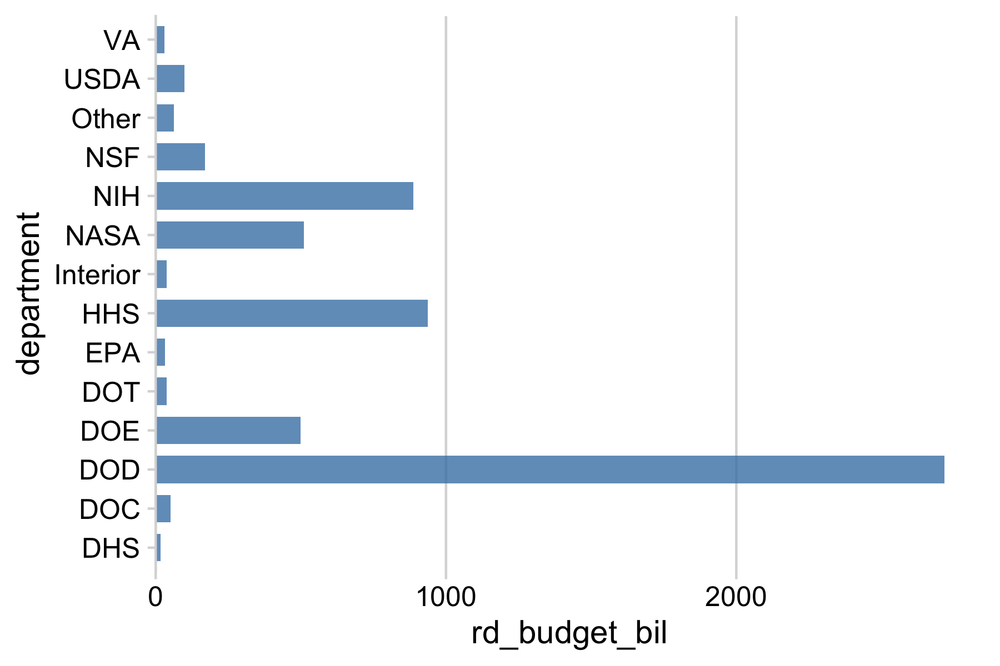
<center>

]

.rightcol[

<center>

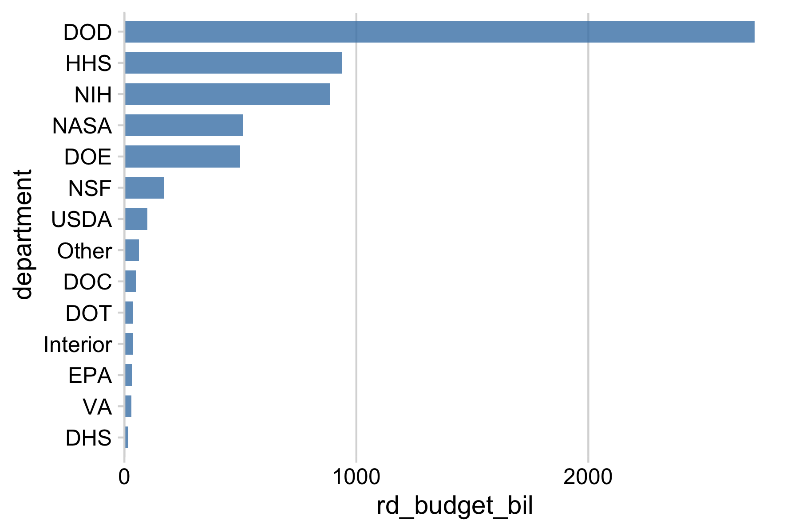
<center>

]

---

## .center[Two ways to sort]

**Method 1**: Use `reorder()` inside aesthetic mapping

.leftcol60[.code70[

```{r, eval=FALSE}
# Format the data frame
federal_spending %>%
  group_by(department) %>%
  summarise(rd_budget_bil = sum(rd_budget_mil) / 10^3) %>%

# Make the chart
  ggplot() +
  geom_col(aes(x = rd_budget_bil,
               y = reorder(department, rd_budget_bil)), #<<
           width = 0.7, alpha = 0.8,
           fill = "steelblue") +
  scale_x_continuous(
    expand = expansion(mult = c(0, 0.05))) +
  theme_minimal_vgrid()
```

]]

.rightcol40[

<center>

<center>

]

---

## .center[Two ways to sort]

**Method 2**: Use `fct_reorder()` when formatting the data frame

.leftcol60[.code70[

```{r fct_reorder, eval=FALSE}
# Format the data frame
federal_spending %>%
  group_by(department) %>%
  summarise(rd_budget_bil = sum(rd_budget_mil) / 10^3) %>%
  mutate(
    department = fct_reorder(department, rd_budget_bil)) %>%  #<<

# Make the chart
  ggplot() +
  geom_col(aes(x = rd_budget_bil,
               y = department),
           width = 0.7, alpha = 0.8,
           fill = "steelblue") +
  scale_x_continuous(
    expand = expansion(mult = c(0, 0.05))) +
  theme_minimal_vgrid()
```

]]

.rightcol40[

<center>

<center>

]

---

class: middle

.leftcol60[

## Reorder & modify factors with<br>the **forcats** library

Loaded with `library(tidyverse)`

]

.rightcol40[

<center>

</center>

]

---

class: inverse, middle

## Common situations for modifying / reording factors:

### 1. Reorder factors based on another numerical variable
### 2. Reorder factors manually
### 3. Modify factors manually
### 4. What if there are too many factor levels?

---

### 1. Reorder factors based on another numerical variable

.leftcol60[.code70[

Use `fct_reorder()`

```{r, ref.label="fct_reorder", fig.show='hide'}
```

]]

.rightcol40[

<br>
<center>

<center>

]

---

### 2. Reorder factors manually

.leftcol[.code70[

```{r lotr_bars, eval=FALSE}
# Format the data frame
lotr_words %>%
  gather(key = 'gender', value = 'wordCount',
         Female:Male) %>%

# Make the chart
  ggplot() +
  geom_col(aes(x = wordCount, y = Film),
           width = 0.7, alpha = 0.8) +
  scale_x_continuous(
    expand = expansion(mult = c(0, 0.05))) +
  theme_minimal_vgrid()
```

]]

.rightcol[

<center>
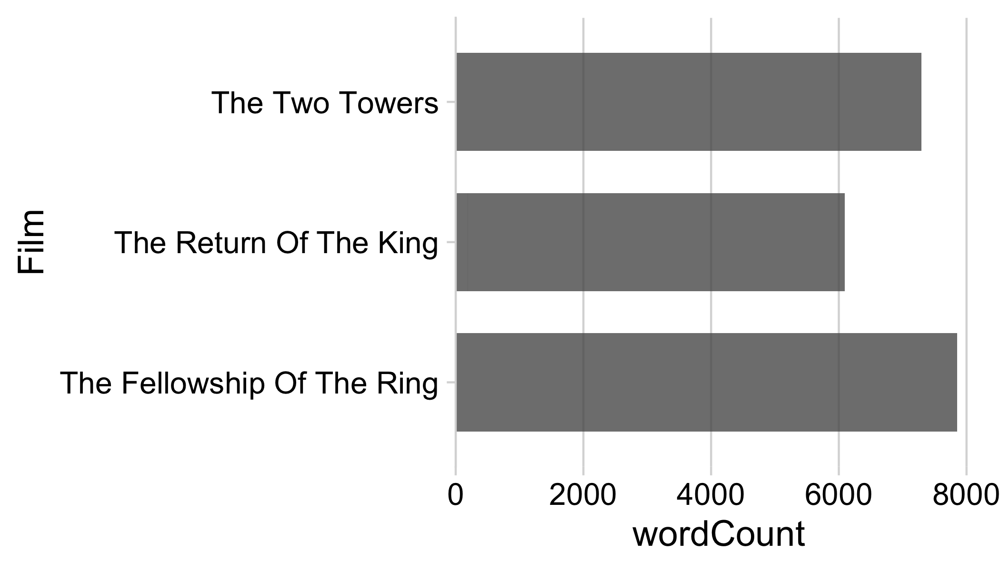
<center>

]

---

### 2. Reorder factors manually with `fct_relevel()`

.leftcol[.code70[

```{r fct_relevel, eval=FALSE}
# Format the data frame
lotr_words %>%
  gather(key = 'gender', value = 'wordCount',
         Female:Male) %>%
  mutate( #<<
    Film = fct_relevel(Film, levels = c( #<<
      'The Fellowship Of The Ring', #<<
      'The Two Towers', #<<
      'The Return Of The King'))) %>% #<<

# Make the chart
  ggplot() +
  geom_col(aes(x = wordCount, y = Film),
           width = 0.7, alpha = 0.8) +
  scale_x_continuous(
    expand = expansion(mult = c(0, 0.05))) +
  theme_minimal_vgrid()
```

]]

.rightcol[

<center>
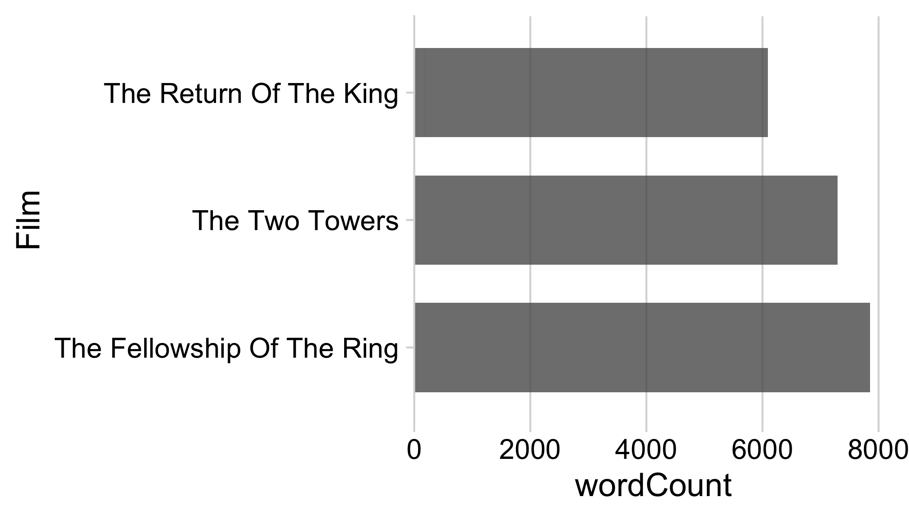
<center>

]

---

### 3. Modify factors manually

.leftcol[.code70[

<br>
```{r, ref.label="lotr_bars", fig.show='hide'}
```

]]

.rightcol[

.center[The film names here are too long]

<center>

<center>

]

---

### 3. Modify factors manually with `fct_recode()`

`"new label" = "old label"`

.leftcol60[.code70[

```{r, eval=FALSE}
# Format the data frame
lotr_words %>%
  gather(key = 'gender', value = 'wordCount',
         Female:Male) %>%
  mutate( #<<
    Film = fct_recode(Film, #<<
      'The Fellowship\nof the Ring' = 'The Fellowship Of The Ring', #<<
      'The Return\nof the King' = 'The Return Of The King')) %>% #<<

# Make the chart
  ggplot() +
  geom_col(aes(x = wordCount, y = Film),
           width = 0.7, alpha = 0.8) +
  scale_x_continuous(
    expand = expansion(mult = c(0, 0.05))) +
  theme_minimal_vgrid()
```

]]

.rightcol40[

<center>
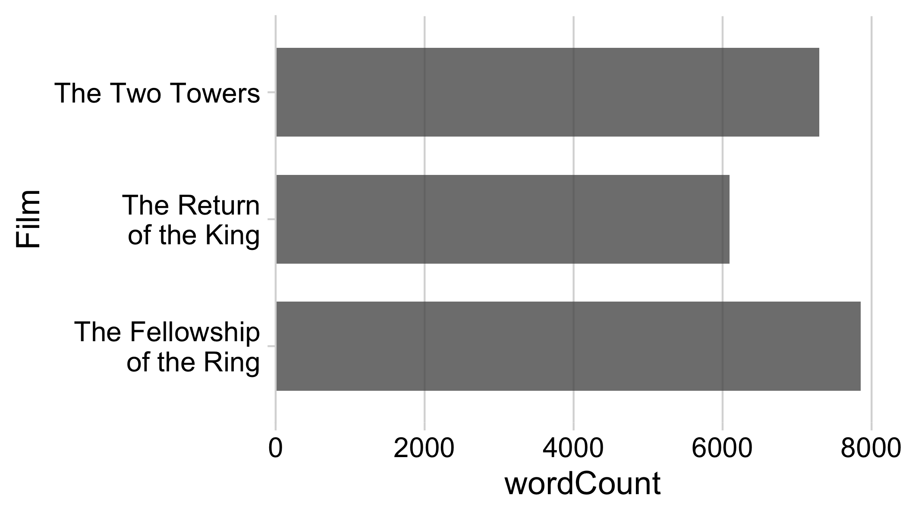
<center>

]

---

### 2 & 3. Modify and reorder factors manually

.leftcol60[.code70[

```{r, eval=FALSE}
# Format the data frame
lotr_words %>%
  gather(key = 'gender', value = 'wordCount',
         Female:Male) %>%
  mutate( #<<
    Film = fct_relevel(Film, levels = c( #<<
      'The Fellowship Of The Ring',  #<<
      'The Two Towers',  #<<
      'The Return Of The King')), #<<
    Film = fct_recode(Film, #<<
      'The Fellowship\nof the Ring' = 'The Fellowship Of The Ring', #<<
      'The Return\nof the King' = 'The Return Of The King')) %>% #<<

# Make the chart
  ggplot() +
  geom_col(aes(x = wordCount, y = Film),
           width = 0.7, alpha = 0.8) +
  scale_x_continuous(
    expand = expansion(mult = c(0, 0.05))) +
  theme_minimal_vgrid()
```

]]

.rightcol40[

<center>
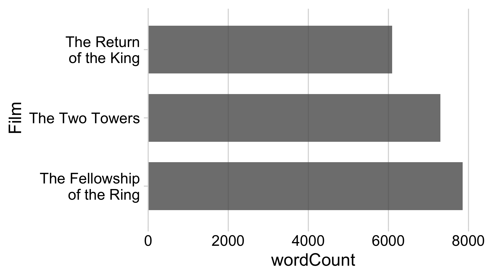
<center>

]

---

### 4. What if there are too many factor levels?

.leftcol[.code70[

```{r, ref.label="fct_reorder", fig.show='hide'}
```

]]

.rightcol[

<center>

<center>

]

---

### 4. What if there are too many factor levels?

**Strategy**: Merge smaller factors into "Other" with `fct_other()`

.leftcol60[.code70[

```{r, eval=FALSE}
# Format the data frame
federal_spending %>%
  mutate( #<<
    department = fct_other(department, #<<
      keep = c('DOD', 'HHS', 'NIH', 'NASA', 'DOE'))) %>% #<<
  group_by(department) %>%
  summarise(rd_budget_bil = sum(rd_budget_mil) / 10^3) %>%
  mutate(department = fct_reorder(department, rd_budget_bil)) %>%

# Make the chart
  ggplot() +
  geom_col(aes(x = rd_budget_bil,
               y = department),
           width = 0.7, alpha = 0.8,
           fill = "steelblue") +
  scale_x_continuous(
    expand = expansion(mult = c(0, 0.05))) +
  theme_minimal_vgrid()
```

]]

.rightcol40[

<center>
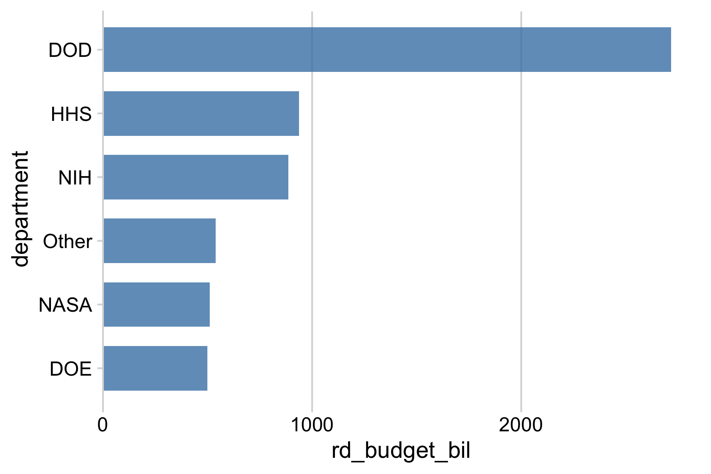
</center>

]

---

### 4. What if there are _really_ too many factor levels?

.leftcol[.code70[

```{r, eval=FALSE}
# Format the data frame
avengers %>%
  mutate(
    name_alias = fct_reorder(name_alias, appearances)) %>% #<<

# Make the chart
  ggplot() +
  geom_col(aes(x = appearances,
               y = name_alias),
           width = 0.7, alpha = 0.8) +
  scale_x_continuous(
    expand = expansion(mult = c(0, 0.05))) +
  theme_minimal_vgrid()
```

]]

.rightcol[

<center>
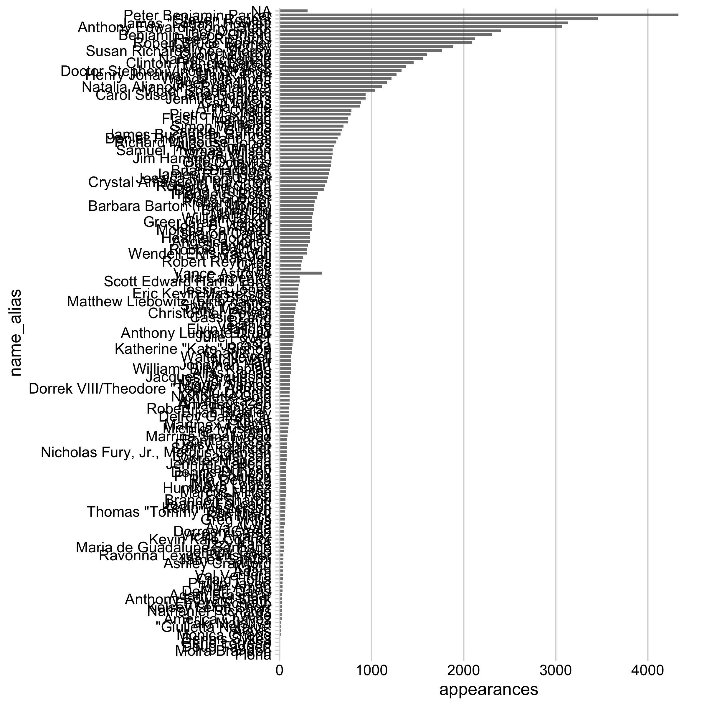
</center>

]

---

### 4. What if there are _really_ too many factor levels?

**Strategy**: Keep top N, drop the rest with `slice()`

.leftcol[.code70[

```{r, eval=FALSE}
# Format the data frame
avengers %>%
  mutate(
    name_alias = fct_reorder(name_alias, appearances)) %>%
  arrange(desc(appearances)) %>% #<<
  slice(1:10) %>% #<<

# Make the chart
  ggplot() +
  geom_col(aes(x = appearances,
               y = name_alias),
           width = 0.7, alpha = 0.8) +
  scale_x_continuous(
    expand = expansion(mult = c(0, 0.05))) +
  theme_minimal_vgrid()
```

]]

.rightcol[

<center>
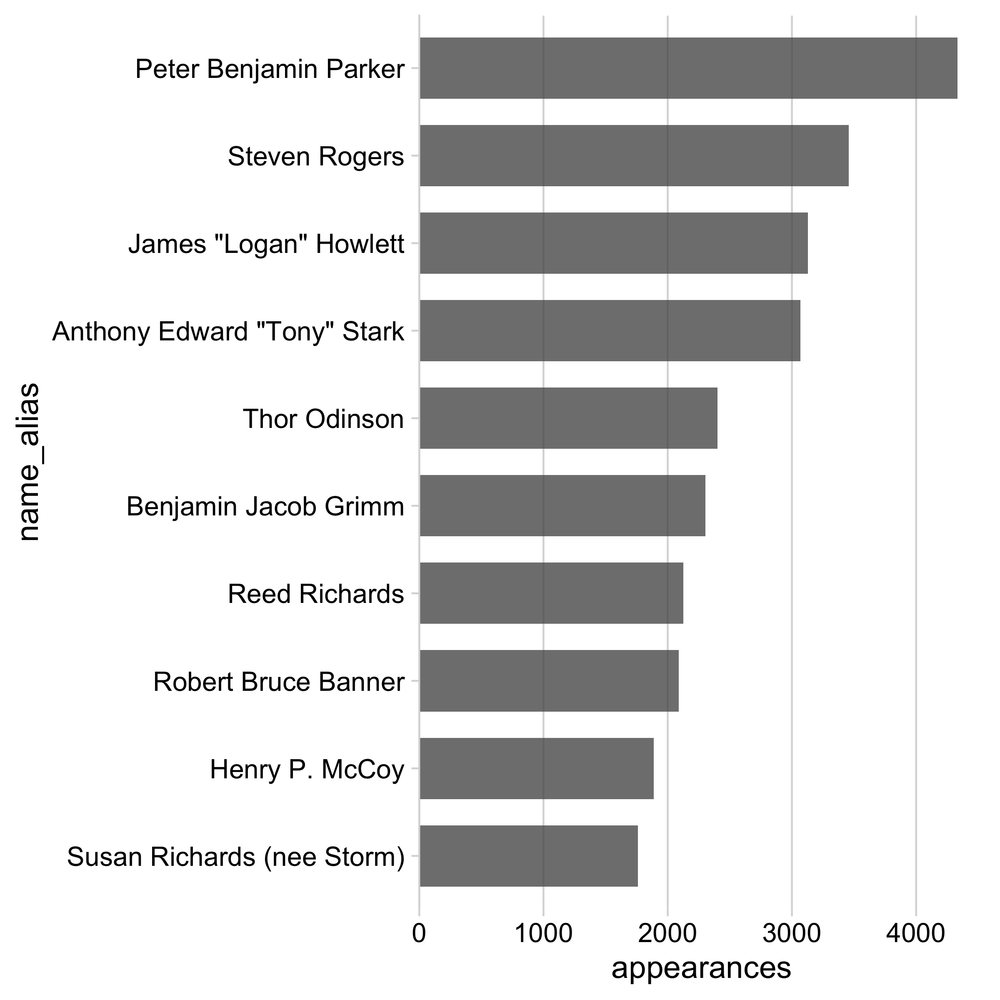
</center>

]

---

### 4. What if there are _really_ too many factor levels?

`slice()` works with grouping too!

.leftcol[.code70[

```{r, eval=FALSE}
# Format the data frame
avengers %>%
  mutate(
    name_alias = fct_reorder(name_alias, appearances)) %>%
  arrange(desc(appearances)) %>% #<<
  group_by(gender) %>% #<<
  slice(1:10) %>% #<<

# Make the chart
  ggplot() +
  geom_col(aes(x = appearances,
               y = name_alias,
               fill = gender),
           width = 0.7, alpha = 0.8) +
  scale_x_continuous(
    expand = expansion(mult = c(0, 0.05))) +
  theme_minimal_vgrid()
```

]]

.rightcol[

<center>
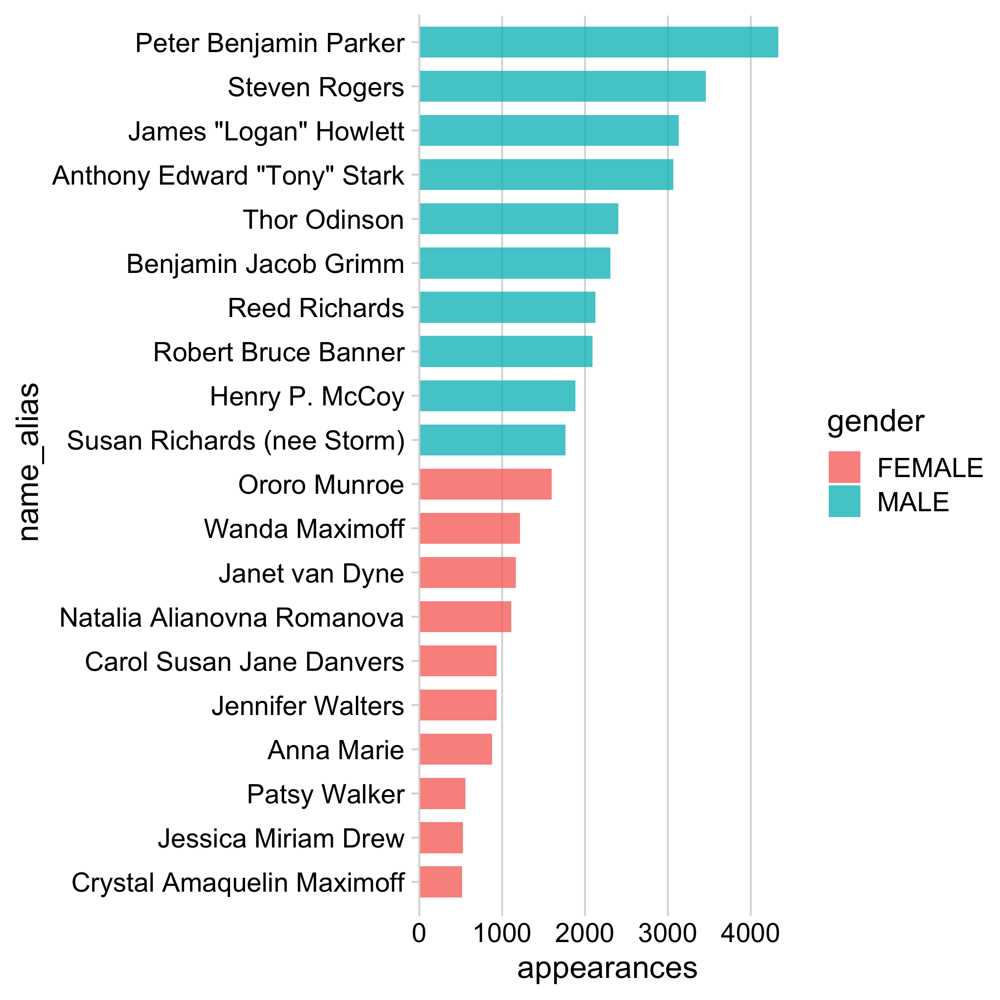
</center>

]

---

class: inverse

## Your turn - practice manipulating factors

Use the `wildlife_impacts` data to create the following plot

<center>
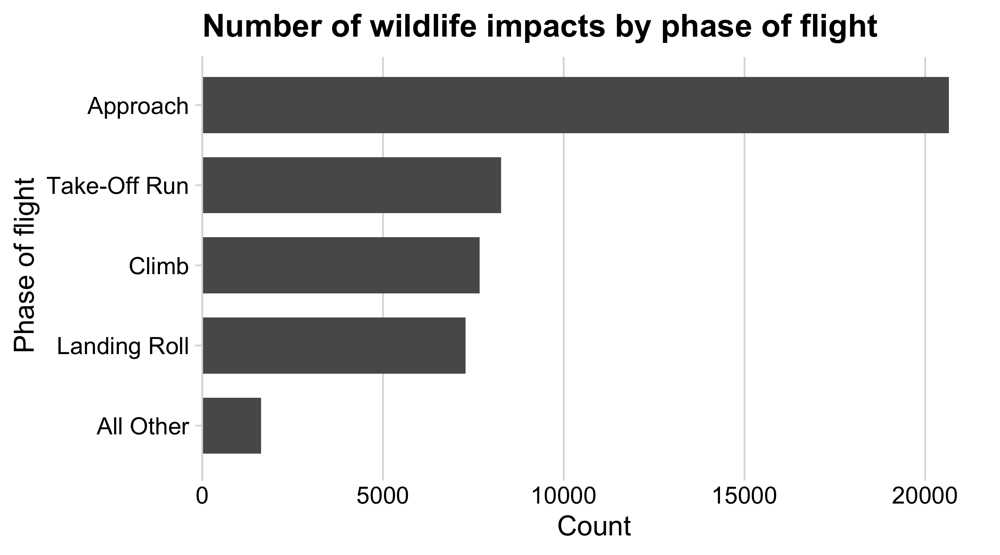
</center>

```{r, echo=FALSE}
countdown(
  minutes = 20,
  warn_when = 30,
  update_every = 1,
  top = 0,
  right = 0,
  font_size = '2em'
)
```

---

```{r child="topics/2.Rmd"}
```

---

class: inverse, middle, center

# Show amounts with:

.cols3[

<br>
<center>

<center>

]

.cols3[

<center>
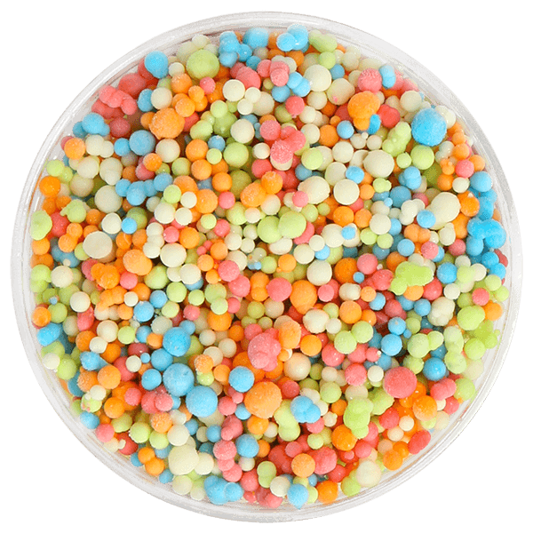
<center>

]

.cols3[

<center>

<center>

]

---

class: center, middle

.cols3[

<center>

<center>

## Bar chart

<center>

<center>

]

.cols3[

<center>

<center>

## Dot chart

<center>
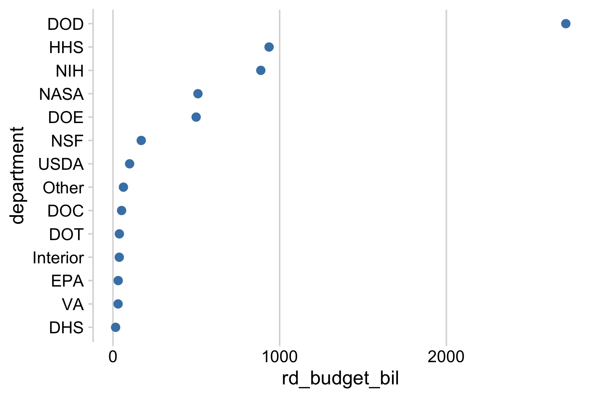
<center>

]

.cols3[

<center>

<center>

## Lollipop chart

<center>
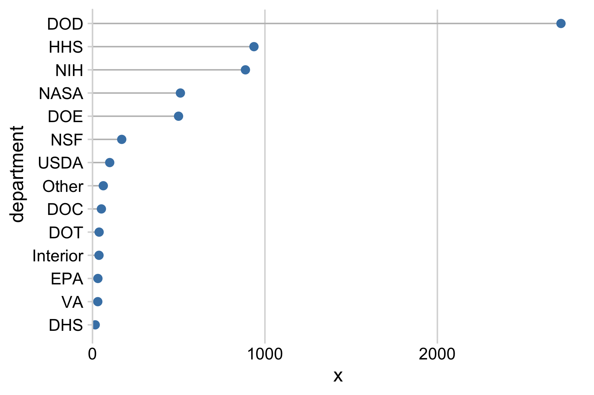
<center>

]

---

class: center

## Bars are good for highlighting specific categories

<center>
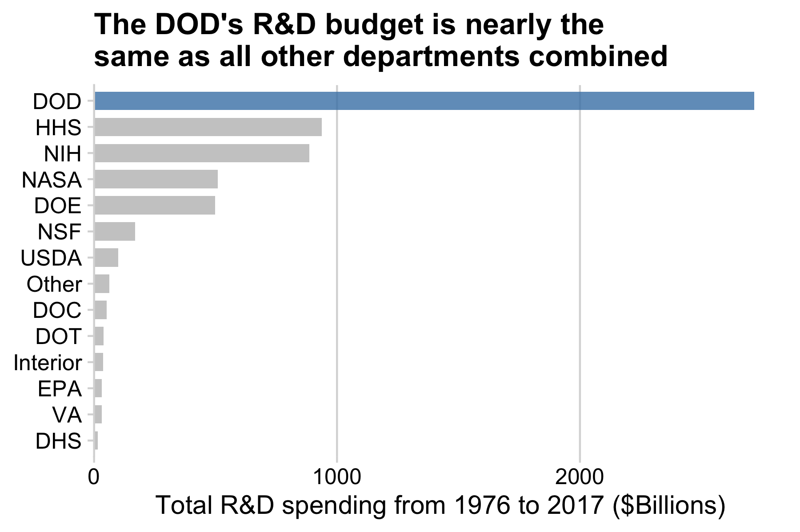
<center>

---

## Use lollipops when:

### - The bars are overwhelming<br> - You're not highlighting categories

<!-- Idea from https://www.data-to-viz.com/graph/lollipop.html -->

.leftcol[

<center>
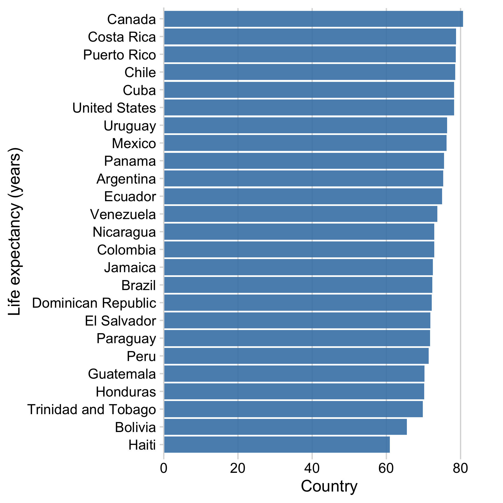
<center>

]

.rightcol[

<center>
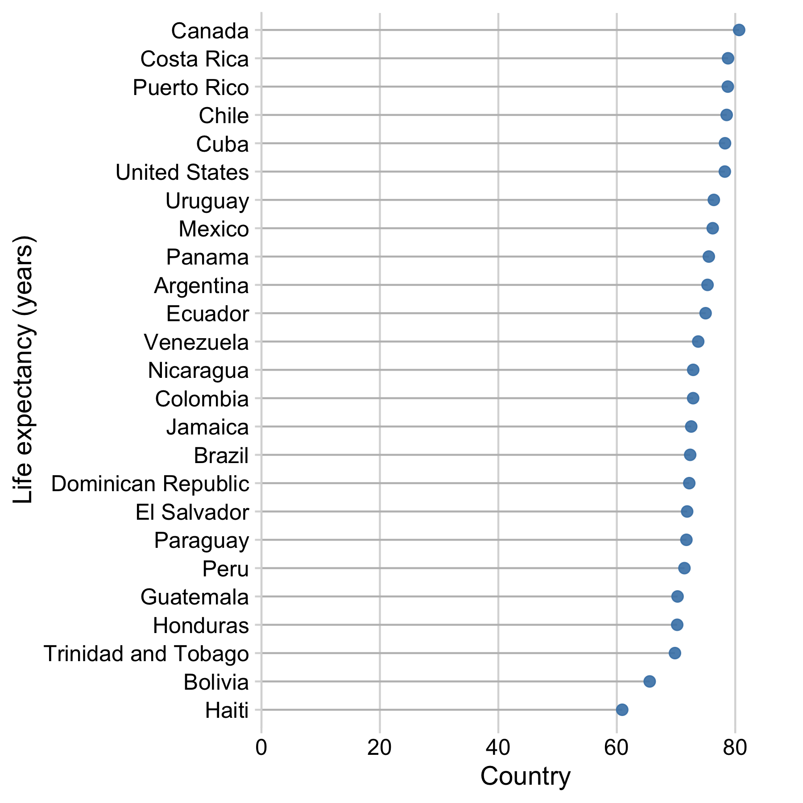
<center>

]

---

class: center

## Or use dots and don't set axis to 0

.leftcol[

<center>

<center>

]

.rightcol[

<center>
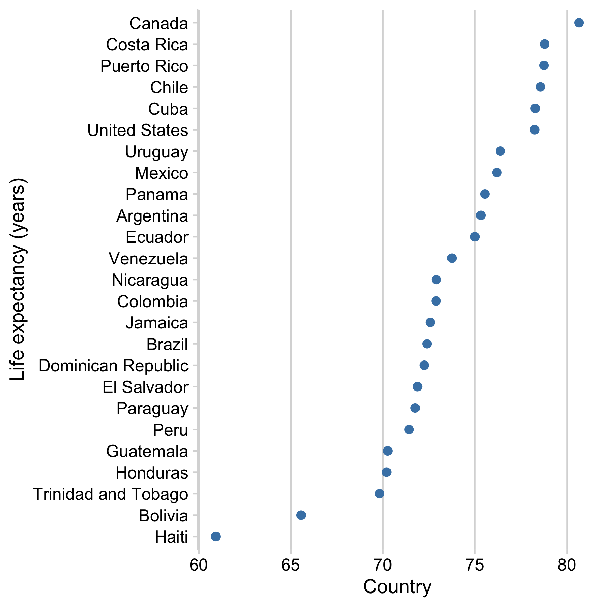
<center>

]

---

## How to make a **Bar chart**

.leftcol60[.code70[

```{r, eval=FALSE}
# Summarize the data
federal_spending %>%
  group_by(department) %>%
  summarise(rd_budget_bil = sum(rd_budget_mil) / 10^3) %>%
  mutate(department = fct_reorder(department, rd_budget_bil)) %>% #<<

# Make chart
  ggplot() +
  geom_col( #<<
    aes(x = rd_budget_bil, y = department), #<<
    width = 0.7, alpha = 0.8,
    fill = 'steelblue') +
  scale_x_continuous(
    expand = expansion(mult = c(0, 0.05))) +
  theme_minimal_vgrid()
```

]]

.rightcol40[

<center>

<center>

]

---

## Filling the bars with color

.leftcol60[.code70[

```{r, eval=FALSE}
# Summarize the data
federal_spending %>%
  group_by(department) %>%
  summarise(rd_budget_bil = sum(rd_budget_mil) / 10^3) %>%
  mutate(
    department = fct_reorder(department, rd_budget_bil),
    is_dod = if_else( #<<
      department == 'DOD', TRUE, FALSE)) %>% #<<

# Make the chart
  ggplot() +
  geom_col(
    aes(x = rd_budget_bil, y = department,
        fill = is_dod), #<<
    width = 0.7, alpha = 0.8) +
  scale_x_continuous(
    expand = expansion(mult = c(0, 0.05))) +
  theme_minimal_vgrid() +
  theme(legend.position = 'none')
```

]]

.rightcol40[.center[

The DOD's R&D budget is nearly the same as all other departments combined

<center>
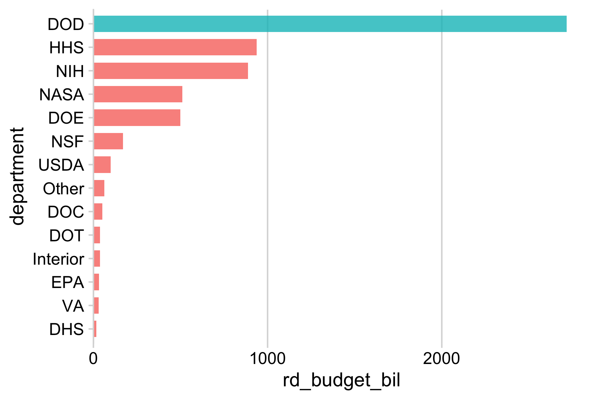
<center>

]]

---

## Filling the bars with color

.leftcol60[.code70[

```{r, eval=FALSE}
# Summarize the data
federal_spending %>%
  group_by(department) %>%
  summarise(rd_budget_bil = sum(rd_budget_mil) / 10^3) %>%
  mutate(
    department = fct_reorder(department, rd_budget_bil),
    is_dod = if_else(
      department == 'DOD', TRUE, FALSE)) %>%

# Make the chart
  ggplot() +
  geom_col(
    aes(x = rd_budget_bil, y = department, 
        fill = is_dod),
    width = 0.7, alpha = 0.8) +
  scale_x_continuous(
    expand = expansion(mult = c(0, 0.05))) +
  scale_fill_manual(values = c('grey', 'steelblue')) + #<<
  theme_minimal_vgrid() +
  theme(legend.position = 'none')
```

]]

.rightcol40[.center[

The DOD's R&D budget is nearly the same as all other departments combined

<center>
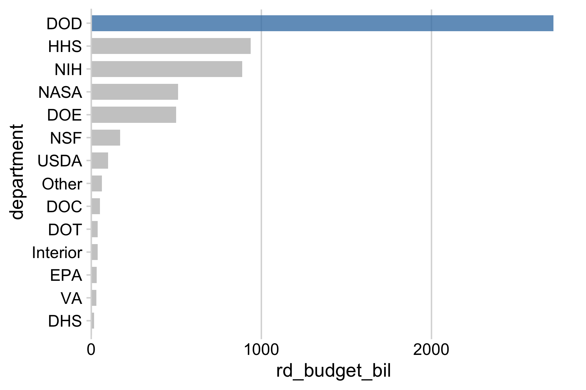
<center>

]]

---

## How to make a **Dot chart**

.leftcol60[.code70[

Summarize data frame:

```{r, eval=FALSE}
# Summarize the data
federal_spending %>%
  group_by(department) %>%
  summarise(rd_budget_bil = sum(rd_budget_mil) / 10^3) %>%
  mutate(department = fct_reorder(department, rd_budget_bil)) %>%

# Make the chart
  ggplot() +
  geom_point(
    aes(x = rd_budget_bil, y = department), #<<
    size = 2.5, color = 'steelblue') +
  theme_minimal_vgrid()
```

]]

.rightcol40[.center[

**Dot chart** of federal R&D spending by department

<center>

<center>

]]

---

## How to make a **Lollipop chart**

.leftcol60[.code70[

Summarize data frame:

```{r, eval=FALSE}
# Summarize the data
federal_spending %>%
  group_by(department) %>%
  summarise(rd_budget_bil = sum(rd_budget_mil) / 10^3) %>%
  mutate(department = fct_reorder(department, rd_budget_bil)) %>%

# Make the chart
  ggplot() +
  geom_segment( #<<
    aes(x = 0, xend = rd_budget_bil, #<<
        y = department, yend = department), #<<
    color = 'grey') +
  geom_point( #<<
    aes(x = rd_budget_bil, y = department), #<<
    size = 2.5, color = 'steelblue') +
  theme_minimal_vgrid()
```

]]

.rightcol40[.center[

**Lollipop chart** of federal R&D spending by department

<center>

<center>

]]

---

class: inverse, middle

```{r, echo=FALSE}
countdown(
  minutes = 20,
  warn_when = 30,
  update_every = 1,
  top = 0,
  right = 0,
  font_size = '2em'
)
```

## Your turn - practice plotting amounts

Create the following charts:

.leftcol[

Data: `bears`
<center>
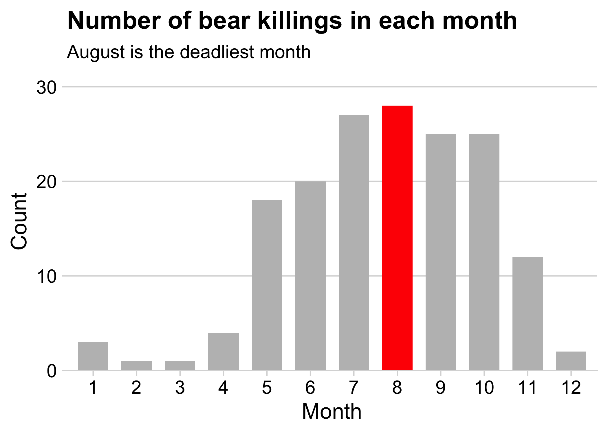
</center>

]

.rightcol[

Data: `milk_production`
<center>
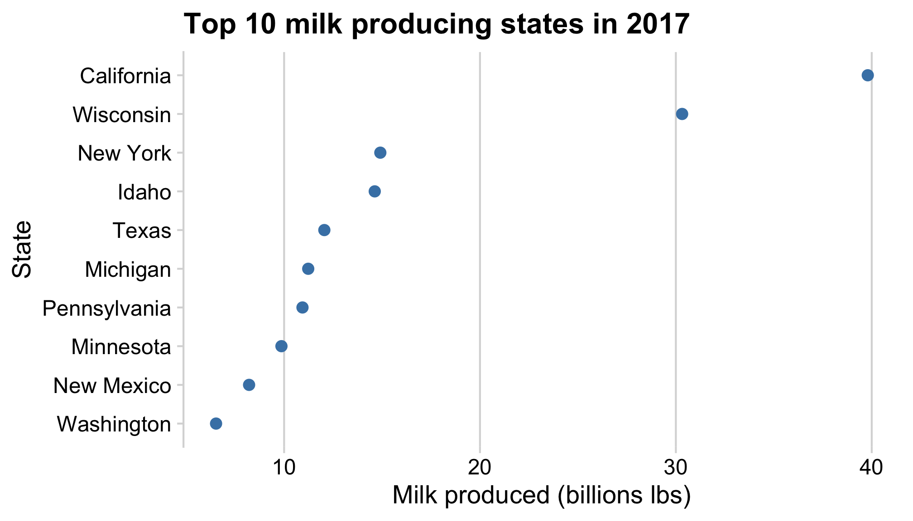
</center>

]

---

class: inverse, center

```{r, echo=FALSE}
countdown(
  minutes = 5,
  warn_when = 30,
  update_every = 1,
  left = 0, right = 0, top = 1, bottom = 0,
  margin = "5%",
  font_size = "8em")
```

# Break!

## Stand up, Move around, Stretch!

---

```{r child="topics/3.Rmd"}
```

---

class: inverse, middle, center

# Show proportions with:

.cols3[

<br>
<center>

<center>

]

.cols3[

<center>

<center>

]

.cols3[

<center>

<center>

]

---

class: center, middle

.cols3[

<center>

<center>

## Bar charts

<center>
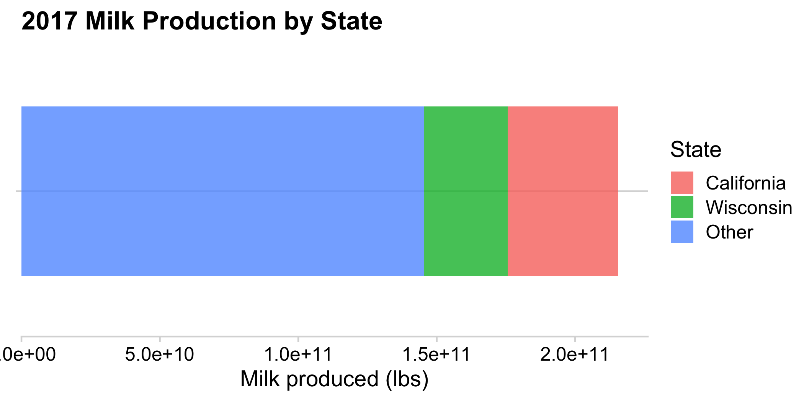
<center>

]

.cols3[

<center>

<center>

## Pie charts

<center>
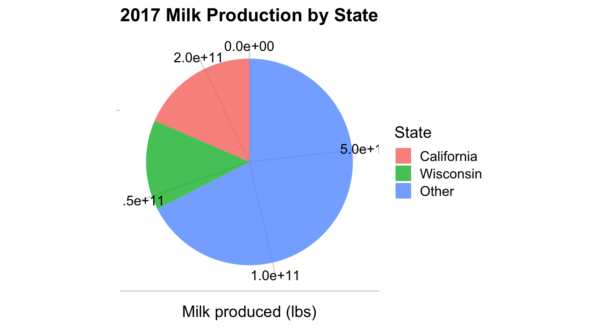
<center>

]

.cols3[

<center>

<center>

## Waffle charts

<center>
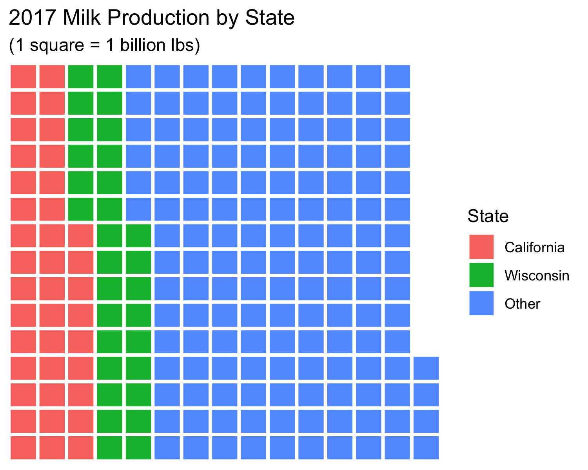
<center>

]

---

## Stacked bars

.leftcol60[.code70[

```{r, eval=FALSE}
# Format the data
milk_production %>%
  filter(year == 2017) %>%
  mutate(state = fct_other(state, 
    keep = c('California', 'Wisconsin'))) %>% 
  group_by(state) %>% 
  summarise(milk_produced = sum(milk_produced)) %>%  

# Make the chart
  ggplot() +
  geom_col( #<<
    aes(x = "", y = milk_produced, fill = state), #<<
    width = 0.7, alpha = 0.8) +
  scale_y_continuous(
    expand = expansion(mult = c(0, 0.05))) +
  theme_minimal_hgrid() +
  labs(x = NULL,
       y = 'Milk produced (lbs)',
       fill = 'State',
       title = '2017 Milk Production\nby State')
```

]]

.rightcol40[

<center>
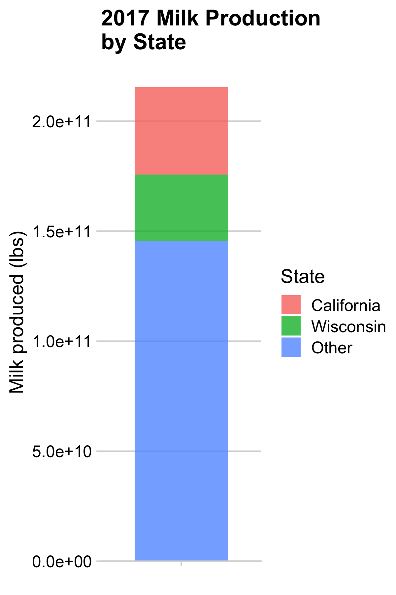
</center>

]

---

## Stacked bars - Rotated also looks good

.leftcol60[.code70[

```{r, eval=FALSE}
# Format the data
milk_production %>%
  filter(year == 2017) %>%
  mutate(state = fct_other(state,
    keep = c('California', 'Wisconsin'))) %>%
  group_by(state) %>% 
  summarise(milk_produced = sum(milk_produced)) %>% 

# Make the chart
  ggplot() +
  geom_col( #<< 
    aes(x = milk_produced, y = "", fill = state), #<<
    width = 0.7, alpha = 0.8) +
  scale_x_continuous(
    expand = expansion(mult = c(0, 0.05))) +
  theme_minimal_hgrid() +
  labs(y = NULL,
       x = 'Milk produced (lbs)',
       fill = 'State',
       title = '2017 Milk Production by State')
```

]]

.rightcol40[

<center>

</center>

]

---

## Stacked bars - not great for more than a few categories

.leftcol60[.code70[

```{r, eval=FALSE}
# Format the data
milk_production %>%
  filter(year == 2017) %>%
  mutate(state = fct_other(state,
    keep = c('California', 'Wisconsin', #<<
             'New York', 'Idaho'))) %>% #<<
  group_by(state) %>%
  summarise(milk_produced = sum(milk_produced))

# Make the chart
  ggplot() +
  geom_col(
    aes(x = "", y = milk_produced, fill = state),
    width = 0.7, alpha = 0.8) +
  scale_y_continuous(
    expand = expansion(mult = c(0, 0.05))) +
  theme_minimal_vgrid() +
  labs(x = NULL,
       y = 'Milk produced (lbs)',
       fill = 'State',
       title = '2017 Milk Production\nby State')
```

]]

.rightcol40[

<center>
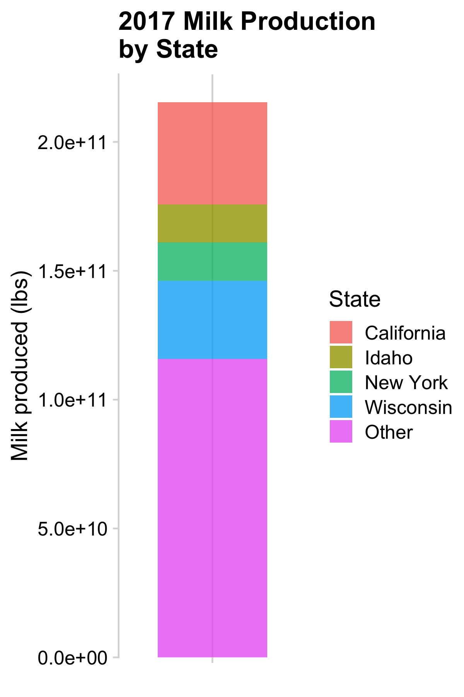
</center>

]

---

.leftcol60[.code70[

## Dodged bars

Better for **part-to-whole comparison**

```{r, eval=FALSE}
# Format the data
milk_production %>%
  filter(year == 2017) %>%
  mutate(state = fct_other(state,
    keep = c('California', 'Wisconsin'))) %>%
  group_by(state) %>%
  summarise(milk_produced = sum(milk_produced)) %>%
  mutate(state = fct_reorder(state, milk_produced)) %>%

# Make the chart
  ggplot() +
  geom_col(
    aes(x = milk_produced, y = state),
    width = 0.7, alpha = 0.8) +
  scale_x_continuous(
    expand = expansion(mult = c(0, 0.05))) +
  theme_minimal_vgrid() +
  labs(x = 'Milk produced (lbs)',
       y = 'State',
       title = '2017 Milk Production by State')
```

]]

.rightcol40[

Okay:
<center>

</center>

Better:
<center>
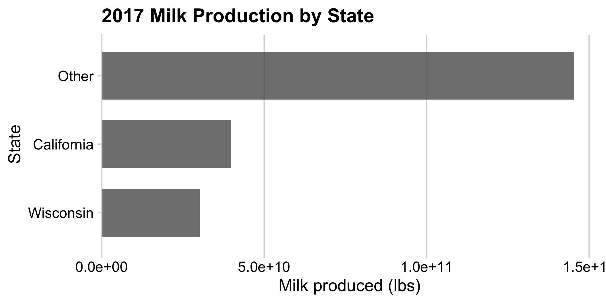
</center>

]

---

.leftcol55[.code70[

## Dodged bars

```{r, eval=FALSE}
milk_production %>%
  filter(year %in% c(1970, 2017)) %>%
  mutate(state = fct_other(state,
    keep = c('California', 'Wisconsin'))) %>%
  group_by(year, state) %>%
  summarise(milk_produced = sum(milk_produced)) %>%

# Make the chart
  ggplot() +
  geom_col(
    aes(x = milk_produced, 
        y = as.factor(year),
        fill = state),
    position = 'dodge', #<<
    width = 0.7, alpha = 0.8) +
  scale_x_continuous(
    expand = expansion(mult = c(0, 0.05))) +
  theme_minimal_vgrid() +
  labs(x = 'Milk produced (lbs)',
       y = 'Year',
       fill = 'State',
       title = '1970 & 2017 Milk Production by State')
```

]]

.rightcol45[

Better for comparing **total**:

<center>
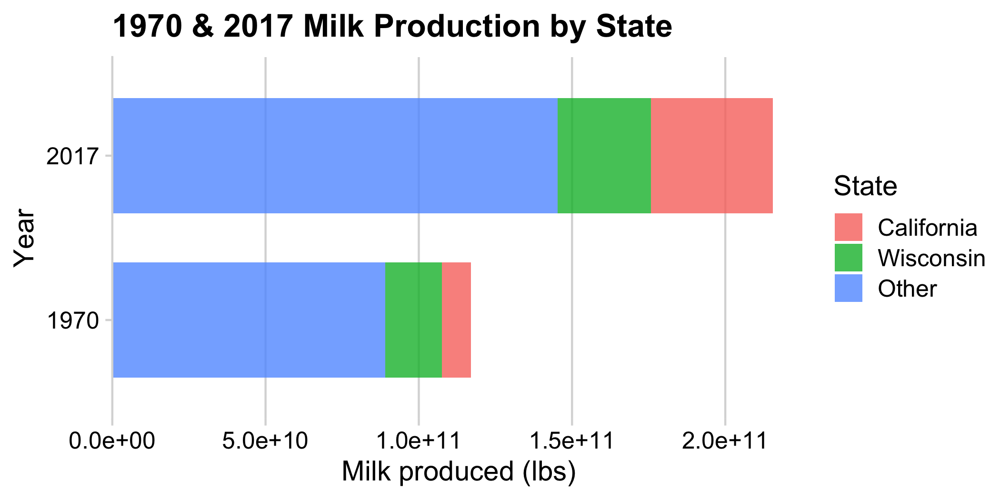
</center>

Better for comparing **parts**:

<center>
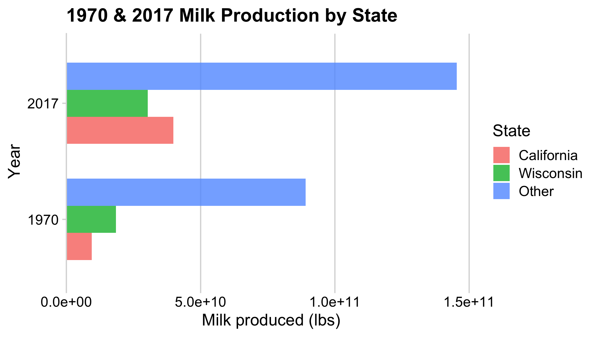
</center>

]

---

## .center[Where stacking is useful]

.leftcol60[

<center>
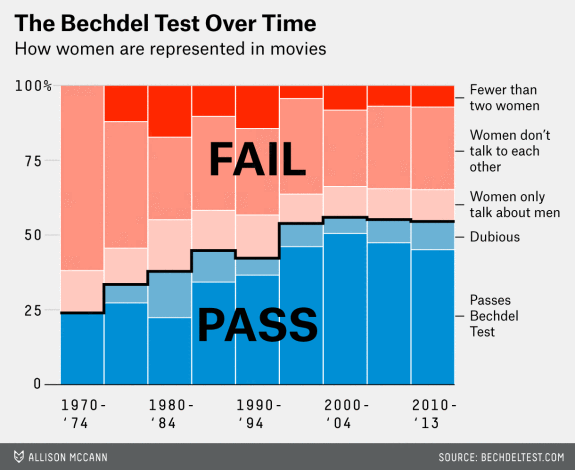
</center>

.font70[https://fivethirtyeight.com/features/the-dollar-and-cents-case-against-hollywoods-exclusion-of-women/]

]

.rightcol40[

### - **2 to 3 groups**
### - Proportions over time

]

---

## .center[Where stacking is useful]

.leftcol60[

<center>
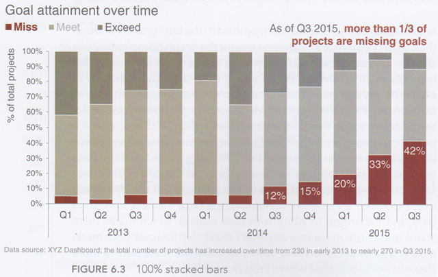
</center>

.font80[https://www.perceptualedge.com/blog/?p=2239]

]

.rightcol40[

### - 2 to 3 groups
### - **Proportions over time**

]

---

## The Notorious P-I-E

Start with a bar chart

.leftcol60[.code70[

```{r milk_2017_bars_simple, fig.show='hide'}
# Format the data
milk_production %>%
  filter(year == 2017) %>%
  mutate(state = fct_other(state,
    keep = c('California', 'Wisconsin'))) %>%
  group_by(state) %>%
  summarise(milk_produced = sum(milk_produced)) %>%

# Make the chart
  ggplot() +
  geom_col( #<<
    aes(x = "", y = milk_produced, fill = state), #<<
    width = 0.7, alpha = 0.8) +
  theme_minimal_hgrid() +
  labs(x = NULL,
       y = 'Milk produced (lbs)',
       fill = 'State',
       title = '2017 Milk Production\nby State')
```

]]

.rightcol40[

```{r ref.label='milk_2017_bars_simple', echo=FALSE, fig.height=6, fig.width=4, fig.align='center'}
```

]

---

## The Notorious P-I-E

Convert bar to pie with `coord_polar()`

.leftcol55[.code70[

```{r milk_2017_pie, fig.show='hide'}
# Format the data
milk_production %>%
  filter(year == 2017) %>%
  mutate(state = fct_other(state,
    keep = c('California', 'Wisconsin'))) %>%
  group_by(state) %>%
  summarise(milk_produced = sum(milk_produced)) %>%

# Make the chart
  ggplot() +
  geom_col(
    aes(x = "", y = milk_produced, fill = state),
    width = 0.7, alpha = 0.8) +
  coord_polar(theta = "y") + #<<
  theme_minimal_hgrid() +
  labs(x = NULL,
       y = 'Milk produced (lbs)',
       fill = 'State',
       title = '2017 Milk Production by State')
```

]]

.rightcol45[

```{r ref.label='milk_2017_pie', echo=FALSE, fig.height=5, fig.width=7, fig.align='center'}
```

]

---

.leftcol55[.code70[

```{r milk_2017_pie_good, fig.show='hide'}
# Format the data
milk_production %>%
  filter(year == 2017) %>%
  mutate(state = fct_other(state,
    keep = c('California', 'Wisconsin'))) %>%
  group_by(state) %>%
  summarise(milk_produced = sum(milk_produced)) %>%
  arrange(desc(state)) %>% #<<
  mutate(p = 100*(milk_produced / sum(milk_produced)), #<<
         label = str_c(round(p), '%')) %>% #<<

# Make the chart
  ggplot() +
  geom_col(
    aes(x = "", y = milk_produced, fill = state),
    width = 0.7, alpha = 0.8) +
  geom_text(
    aes(x = "", y = milk_produced, label = label), #<<
    color = "white", size = 6, #<<
    position = position_stack(vjust = 0.5)) + #<<
  coord_polar(theta = "y") + #<<
  theme_map() + #<<
  labs(x = NULL,
       y = NULL,
       fill = 'State',
       title = '2017 Milk Production by State')
```

]]

.rightcol45[

### The Notorious P-I-E

Final chart with labels & `theme_map()`

```{r ref.label='milk_2017_pie_good', echo=FALSE, fig.height=5, fig.width=7, fig.align='center'}
```

]

---

class: center

## Pies are still useful if the sum of components matters

.cols3[

<center>
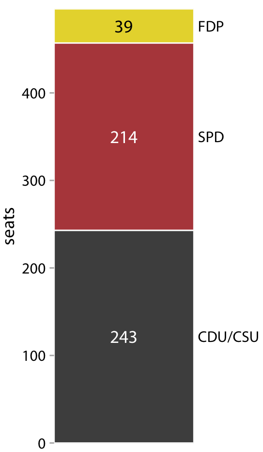
<center>

]

.cols3[

<br>
<center>

<center>

]

.cols3[

<br>
<br>
<center>

<center>

]

---

class: center

## The best pies are **square pies**

<center>

</center>

.font80[https://eagereyes.org/blog/2016/a-reanalysis-of-a-study-about-square-pie-charts-from-2009]

---

.leftcol55[.code70[

### Waffle plots

```{r waffle_2017, fig.show='hide'}
library(waffle) #<<

# Format the data
milk_production %>%
  filter(year == 2017) %>%
  mutate(state = fct_other(state,
    keep = c('California', 'Wisconsin'))) %>%
  group_by(state) %>%
  summarise(milk_produced = sum(milk_produced)) %>%
  mutate(milk_produced = milk_produced / 10^9) %>%

# Make the chart
  ggplot() +
  geom_waffle( #<<
    aes(fill = state, values = milk_produced), #<<
    color = "white", size = 1, n_rows = 15) + #<<
  scale_x_discrete(expand = c(0, 0)) +
  scale_y_discrete(expand = c(0, 0)) +
  theme_minimal() +
  labs(fill = 'State',
       x = NULL, y = NULL,
       title = '2017 Milk Production by State',
       subtitle = '(1 square = 1 billion lbs)')
```

]]

.rightcol45[

Use values between 100 - 1,000

(You don't want 1,000,000,000 boxes!)

```{r, echo=FALSE}
milk_summary_2017
```

```{r ref.label='waffle_2017', echo=FALSE, fig.height=4, fig.width=5, fig.align='center'}
```

]

---

.leftcol55[.code70[

### Waffle plots

```{r waffle_2017_flip, fig.show='hide'}
library(waffle) #<<

# Format the data
milk_production %>%
  filter(year == 2017) %>%
  mutate(state = fct_other(state,
    keep = c('California', 'Wisconsin'))) %>%
  group_by(state) %>%
  summarise(milk_produced = sum(milk_produced)) %>%
  mutate(milk_produced = milk_produced / 10^9) %>%

# Make the chart
  ggplot() +
  geom_waffle(
    aes(fill = state, values = milk_produced),
    color = "white", size = 1, n_rows = 15,
    flip = TRUE) + #<<
  scale_x_discrete(expand = c(0, 0)) +
  scale_y_discrete(expand = c(0, 0)) +
  theme_minimal() +
  labs(fill = 'State',
       x = NULL, y = NULL,
       title = '2017 Milk Production by State',
       subtitle = '(1 square = 1 billion lbs)')
```

]]

.rightcol45[

Use values between 100 - 1,000

(You don't want 1,000,000,000 boxes!)

```{r, echo=FALSE}
milk_summary_2017
```

```{r ref.label='waffle_2017_flip', echo=FALSE, fig.height=4, fig.width=5, fig.align='center'}
```

]

---

.leftcol55[.code70[

```{r waffle_compare, fig.show='hide'}
library(waffle)

# Format the data
milk_production %>%
  filter(year %in% c(1970, 2017)) %>% #<<
  mutate(state = fct_other(state,
    keep = c('California', 'Wisconsin'))) %>%
  group_by(year, state) %>% #<<
  summarise(milk_produced = sum(milk_produced)) %>%
  mutate(milk_produced = milk_produced / 10^9) %>%

# Make the chart
  ggplot() +
  geom_waffle(
    aes(fill = state, values = milk_produced),
    color = "white", size = 1, n_rows = 10,
    flip = TRUE) +
  facet_wrap(vars(year), strip.position = 'bottom') + #<<
  scale_x_discrete(expand = c(0, 0)) +
  scale_y_discrete(expand = c(0, 0)) +
  theme_minimal() +
  labs(fill = 'State',
       x = NULL, y = NULL,
       title = '1970 & 2017 Milk Production by State',
       subtitle = '(1 square = 1 billion lbs)')
```

]]

.rightcol45[

### Waffle comparison

```{r, echo=FALSE}
milk_summary_2017
```

```{r ref.label='waffle_compare', echo=FALSE, fig.height=4.5, fig.width=5, fig.align='center'}
```

]

---

class: center

.leftcol[

Stacked bars

<center>

</center>

Dodged bars

<center>

</center>

]

.rightcol[

Pie chart

```{r milk_compare_pie, echo=FALSE, fig.height=3, fig.width=5, fig.align='center'}
milk_production %>%
  filter(year %in% c(1970, 2017)) %>%
  mutate(state = fct_other(state,
    keep = c('California', 'Wisconsin'))) %>%
  group_by(year, state) %>%
  summarise(milk_produced = sum(milk_produced)) %>%
  mutate(p = 100 * milk_produced / sum(milk_produced)) %>%
  arrange(desc(state), year) %>%
  mutate(
    ppos = p,
    label = str_c(round(p), '%')) %>%
  ggplot() +
  geom_col(aes(x = "", y = p, fill = state),
           width = 0.7, alpha = 0.8) +
  facet_wrap(~year, strip.position = 'bottom') +
  coord_polar(theta = "y") +
  geom_text(aes(x = 1.1, y = ppos, label = label),
            color = "white", size = 5,
            position = position_stack(vjust = 0.5)) +
  theme_map() +
  labs(x = NULL,
       y = NULL,
       fill = 'State',
       title = '1970 & 2017 Milk Production by State')
```

Waffle chart

```{r ref.label='waffle_compare', echo=FALSE, fig.height=4.5, fig.width=5, fig.align='center'}
```

]

---

class: inverse

```{r, echo=FALSE}
countdown(
  minutes = 20,
  warn_when = 30,
  update_every = 1,
  top = 0,
  right = 0,
  font_size = '2em'
)
```

## Your turn

.leftcol[

Using the `wildlife_impacts` data, create plots that shows the proportion of incidents that occur at each different time of day.

For this exercise, you can remove `NA` values.

Try to create the following plots:

- Stacked bars
- Dodged bars
- Pie chart
- Waffle chart

]

.rightcol[

To get started, you'll need to first summarize the data:

```{r}
wildlife_summary <- wildlife_impacts %>%
  filter(!is.na(time_of_day)) %>%
  count(time_of_day)

wildlife_summary
```

]
