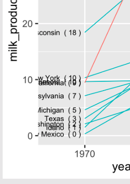

```{r setup, include=FALSE}
library(knitr)
library(tidyverse)
library(here)
library(fontawesome)
library(cowplot)
library(ggrepel)
library(ggridges)
library(countdown)
library(metathis)
options(
    htmltools.dir.version = FALSE,
    knitr.table.format = "html",
    knitr.kable.NA = '',
    dplyr.width = Inf,
    width = 250
)
knitr::opts_chunk$set(
    warning = FALSE,
    message = FALSE,
    fig.path = "figs/",
    fig.width = 7.252,
    fig.height = 4,
    comment = "#>",
    fig.retina = 3
)
xaringanExtra::use_tile_view()
xaringanExtra::use_panelset()
xaringanExtra::use_clipboard()
xaringanExtra::use_share_again()
xaringanExtra::style_share_again(share_buttons = "none")
xaringanExtra::use_extra_styles(
  hover_code_line = TRUE,
  mute_unhighlighted_code = FALSE
)
# Set up website metadata
meta() %>%
  meta_general(
    description = rmarkdown::metadata$subtitle,
    generator = "xaringan and remark.js"
  ) %>%
  meta_name("github-repo" = "emse-eda-gwu/2022-Fall") %>%
  meta_social(
    title = rmarkdown::metadata$title,
    url = "https://eda.seas.gwu.edu/2022-Fall/",
    og_type = "website",
    og_author = "John Paul Helveston",
    twitter_card_type = "summary_large_image",
    twitter_creator = "@johnhelveston"
  )

# Read in data sets for class
college_all_ages <- read_csv(here('data', 'college_all_ages.csv'))
gapminder        <- read_csv(here('data', 'gapminder.csv'))
marathon         <- read_csv(here('data', 'marathon.csv'))
milk_production  <- read_csv(here('data', 'milk_production.csv'))
internet_regions <- read_csv(here('data', 'internet_users_region.csv'))

# Processed data
milk_compare <- milk_production %>%
  filter(year %in% c(1970, 2017)) %>%
  mutate(state = fct_other(state,
    keep = c('California', 'Wisconsin'))) %>%
  group_by(year, state) %>%
  summarise(milk_produced = sum(milk_produced) / 10^9)

# Set plot themes
theme_set(theme_gray(base_size = 18))
```

class: middle, inverse

.leftcol30[

<center>

</center>

]

.rightcol70[

# Week `r rmarkdown::metadata$week`: .fancy[`r rmarkdown::metadata$title`]

### `r fontawesome::fa(name = "building-columns", fill = "white")` `r rmarkdown::metadata$subtitle`
### `r fontawesome::fa(name = "user", fill = "white")` `r rmarkdown::metadata$author`
### `r fontawesome::fa(name = "calendar", fill = "white")` `r rmarkdown::metadata$date`

]

---

class: center, middle, inverse

# .fancy[.blue[Tip of the week]]

# Shortcut keys

---

class: middle, inverse

## 1) Quick shortcuts

.leftcol[

Insert a `<-` operator:

- **Windows**: `ALT` + `-`
- **Mac**: `OPTION` + `-`

]

--

.rightcol[

Insert a `%>%` operator:

- **Windows**: `CTRL` + `SHIFT` + `M`
- **Mac**: `COMMAND` + `SHIFT` + `M`

]

---

class: middle, inverse

## 2) Edit multiple lines of code at once

1. Press and hold `ALT` (Windows) or `OPTION` (Mac)
2. Select multiple lines of code

https://twitter.com/i/status/995394452821721088

---

class: middle, inverse

.rightcol80[

## "At the heart of quantitative reasoning is a single question: Compared to what?"
## -- Edward Tufte

]

---

## Today's data

```{r, eval=FALSE}
college_all_ages <- read_csv(here('data', 'college_all_ages.csv'))
gapminder        <- read_csv(here('data', 'gapminder.csv'))
marathon         <- read_csv(here('data', 'marathon.csv'))
milk_production  <- read_csv(here('data', 'milk_production.csv'))
internet_regions <- read_csv(here('data', 'internet_users_region.csv')) #<<
```

## New packages

```{r, eval=FALSE}
install.packages("ggrepel")
install.packages("ggridges")
```

---

```{r child="topics/0.Rmd"}
```

---

```{r child="topics/1.Rmd"}
```

<!--
Comparing things to a reference line:
- Add a simple line
- diverging bars / lollipops,

- In any of these plots, adding a benchmark can be really useful
- Another way is to compare things to a **computed** benchmark, like the mean - diverging bars / lollipops
-->

---

class: middle

## .center[For this section, we'll be using this data frame:]

.code100[

```{r}
gapminder_americas <- gapminder %>%
  filter(continent == "Americas", year == 2007) %>%
  mutate(country = fct_reorder(country, lifeExp))
```

]

---

class: center

## Use reference lines to add context to chart

.leftcol[

```{r life-exp-dots, echo=FALSE, fig.height=6.5, fig.width=6, fig.align='center'}
life_expectancy_dots <- ggplot(gapminder_americas) +
  geom_point(aes(x = lifeExp, y = country),
             color = 'steelblue', size = 2.5) +
  theme_minimal_vgrid(font_size = 18) +
  labs(x = 'Life expectancy (years)',
       y = 'Country')

life_expectancy_dots
```

]

--

.rightcol[

```{r life-exp-dots-mean, echo=FALSE, fig.height=6.5, fig.width=6, fig.align='center'}
life_expectancy_dots +
  geom_vline(xintercept = mean(gapminder_americas$lifeExp),
             color = 'red', linetype = 'dashed') +
  annotate('text', x = 73.2, y = 'Puerto Rico',
           color = 'red', hjust = 1,
           label = 'Mean Life\nExpectancy')
```

]

---

class: center

## Or make zero the reference line

```{r, echo=FALSE}
gapminder_diverging <- gapminder_americas %>%
    mutate(
        lifeExp = lifeExp - mean(lifeExp),
        color = ifelse(lifeExp > 0, 'Above', 'Below'))
```

.leftcol[

```{r life-exp-dots-diverging, echo=FALSE, fig.height=6.5, fig.width=6, fig.align='center'}
ggplot(gapminder_diverging) +
  geom_segment(
    aes(x = 0, xend = lifeExp,
        y = country, yend = country,
        color = color)) +
  geom_point(
    aes(x = lifeExp, y = country,
        color = color),
    size = 2.5) +
  scale_color_manual(values = c('steelblue', 'red')) +
  theme_minimal_vgrid() +
  theme(legend.position = 'none') +
  labs(x = 'Difference from mean life expectancy (years)',
       y = 'Country')
```

]

.rightcol[

```{r life-exp-bars-diverging, echo=FALSE, fig.height=6.5, fig.width=6, fig.align='center'}
ggplot(gapminder_diverging) +
  geom_col(
    aes(x = lifeExp, y = country,
        fill = color),
    width = 0.7, alpha = 0.8) +
  scale_fill_manual(values = c('steelblue', 'red')) +
  scale_x_continuous(expand = expansion(mult = c(0, 0.05))) +
  theme_minimal_vgrid() +
  theme(legend.position = 'none') +
  labs(x = 'Difference from mean life expectancy (years)',
       y = 'Country')
```

]

---

## How to add a reference line

.leftcol60[.code70[

Add horizontal line with `geom_hline()`

Add vertical line with `geom_vline()`

```{r life-expectancy-dots-line, fig.show='hide'}
ggplot(gapminder_americas) +
  geom_point(
    aes(x = lifeExp, y = country),
    color = 'steelblue', size = 2.5) +
  geom_vline( #<<
    xintercept = mean(gapminder_americas$lifeExp), #<<
    color = 'red', linetype = 'dashed') + #<<
  theme_minimal_vgrid() +
  labs(x = 'Life expectancy (years)',
       y = 'Country')
```

]]

.rightcol40[

```{r, ref.label='life-expectancy-dots-line', echo=FALSE, fig.height=6.5, fig.width=6, fig.align='center'}
```

]

---

## How to add a reference line

.leftcol60[.code70[

Add text with `annotate()`

```{r, eval=FALSE}
ggplot(gapminder_americas) +
  geom_point(
    aes(x = lifeExp, y = country),
    color = 'steelblue', size = 2.5) +
  geom_vline(
    xintercept = mean(gapminder_americas$lifeExp),
    color = 'red', linetype = 'dashed') +
  annotate(
    'text', x = 73.2, y = 'Puerto Rico', #<<
    color = 'red', hjust = 1, #<<
    label = 'Mean\nLife\nExpectancy') + #<<
  theme_minimal_vgrid() +
  labs(x = 'Life expectancy (years)',
       y = 'Country')
```

]]

.rightcol40[.center[

```{r, ref.label='life-exp-dots-mean', echo=FALSE, fig.height=6.5, fig.width=6, fig.align='center'}
```

]]

---

## How to make zero the reference point

.leftcol60[.code70[

```{r, eval=FALSE}
gapminder_diverging <- gapminder_americas %>%
    mutate(
        # Subtract the mean
        lifeExp = lifeExp - mean(lifeExp), #<<
        # Define the fill color
        color = ifelse(lifeExp > 0, 'Above', 'Below')) #<<
```

```{r, eval=FALSE}
ggplot(gapminder_diverging) +
  geom_col(
    aes(x = lifeExp, y = country, fill = color), #<<
    width = 0.7, alpha = 0.8) +
  scale_fill_manual(
    values = c('steelblue', 'red')) + #<<
  theme_minimal_vgrid() +
  theme(legend.position = 'none') +
  labs(
    x = 'Country',
    y = 'Difference from mean life expectancy (years)')
```

]]

.rightcol40[

```{r, ref.label='life-exp-bars-diverging', echo=FALSE, fig.height=6.5, fig.width=6, fig.align='center'}
```

]

---

class: inverse

```{r, echo=FALSE}
countdown(
    minutes = 20,
    warn_when = 30,
    update_every = 1,
    top = 0,
    right = 0,
    font_size = '2em'
)
```

### Your turn - comparing to a reference

Use the `milk_production.csv` data to create the following charts<br>showing differences from the mean state milk production in 2017.

.leftcol[

```{r milk-lollipop-mean, echo=FALSE, fig.height=7, fig.width=5.5, fig.align='center', out.width="60%"}
milk_summary <- milk_production %>%
  filter(year == 2017) %>%
  mutate(
    milk_produced = milk_produced / 10^9,
    state = fct_reorder(state, milk_produced))

ggplot(milk_summary) +
  geom_point(aes(x = milk_produced, y = state),
             size = 2.5, color = 'steelblue') +
  geom_vline(xintercept = mean(milk_summary$milk_produced),
             color = 'red', linetype = 'dashed') +
  annotate('text', x = 5, y = 'Georgia',
           color = 'red', hjust = 0,
           label = 'Mean\nProduction') +
  theme_minimal_vgrid() +
  labs(x = 'Milk produced (billions lbs)',
       y = 'State')
```

]

.rightcol[

```{r milk-bars-diverging, echo=FALSE, fig.height=7, fig.width=6, fig.align='center', out.width="60%"}
milk_summary_diverging <- milk_summary %>%
  mutate(
    milk_produced = milk_produced - mean(milk_produced),
    barColor = ifelse(milk_produced > 0, 'above', 'below'))

ggplot(milk_summary_diverging) +
  geom_col(aes(x = state, y = milk_produced,
               fill = barColor), width = 0.7) +
  scale_fill_manual(values = c('steelblue', 'sienna')) +
  coord_flip() +
  theme_minimal_vgrid() +
  theme(legend.position = 'none') +
  labs(x = 'State',
       y = 'Difference from mean milk produced (billions lbs)')
```

]

---

```{r child="topics/2.Rmd"}
```

<!--
Comparing categories with facets

Comparing two things (dodged bars, slope chart, dumbbell chart)

- dodged comparisons are fine, but really no more than 2 things.
- Finally, overlapping bars are great when you want to show when something exceeds a threshold. E.g. going over your budget.
- Using facets to break up 3-4 groups of 2 is okay.
- A better approach for multiple categories:
    - slope charts
    - dumbbell charts
-->

---

class: center, middle

## Neither of these charts are great

.leftcol[

```{r diamonds_bars_stacked, echo=FALSE, fig.height=6}

ggplot(diamonds, aes(clarity, fill=cut, group=cut)) +
    geom_bar(stat="count", position="stack") +
    scale_y_continuous(expand = expand_scale(mult = c(0, 0.05))) +
    theme_minimal_hgrid()
```

]

.rightcol[

```{r diamonds_bars_dodged, echo=FALSE, fig.height=6}
ggplot(diamonds, aes(clarity, fill=cut, group=cut)) +
    geom_bar(stat="count", position="dodge") +
    scale_y_continuous(expand = expand_scale(mult = c(0, 0.05))) +
    theme_minimal_hgrid()
```

]

---

class: center

## "Parallel Coordinates" plots work well

.leftcol[.left[

```{r diamonds-parallel, fig.show='hide'}
diamonds %>%
  count(clarity, cut) %>%
  ggplot(
    aes(x = clarity, y = n,
        color = cut, group = cut)) + #<<
  geom_line() +
  geom_point() +
  scale_y_continuous(limits = c(0, 5100)) +
  theme_half_open(font_size = 18) +
  labs(y = "Count")
```

]]

.rightcol[

```{r, ref.label="diamonds-parallel", echo=FALSE, fig.height=5, fig.width=7}
```

]

---

## Consider facets for **comparing across categories**

.leftcol60[

```{r diamonds-facet, fig.show='hide'}
diamonds %>%
  count(clarity, cut) %>%
  ggplot() +
  geom_col(aes(x = clarity, y = n),
           width = 0.7) +
  facet_wrap(vars(cut), nrow = 1) + #<<
  scale_y_continuous(
    expand = expansion(mult = c(0, 0.05))) +
  theme_minimal_hgrid(font_size = 16)
```

]

```{r diamonds-facet-2, ref.label='diamonds-facet', echo=FALSE, fig.height=3, fig.width=18}
```

---

.leftcol[.code70[

## Consider facets for **comparing across categories**

```{r diamonds-facet-ncol, fig.show='hide'}
diamonds %>%
  count(clarity, cut) %>%
  mutate(n = n / 1000) %>%
  ggplot() +
  geom_col(aes(x = clarity, y = n),
           width = 0.7) +
  facet_wrap(vars(cut), ncol = 2) + #<<
  coord_flip() + #<<
  scale_y_continuous(
    expand = expansion(mult = c(0, 0.05))) +
  theme_minimal_vgrid(font_size = 16) + #<<
  labs(y = "Count (thousands)")

```

]]

.rightcol[

```{r, ref.label='diamonds-facet-ncol', echo=FALSE, fig.height=8, fig.width=8, fig.align='center'}
```

]

---

background-image: url("images/ft-coronavirus.jpg")
background-size: contain

.right[`r paste0(rep("<br>", 17), collapse = "")` From [Financial Times](https://www.ft.com/coronavirus-latest)]

---

class: inverse, center

## When comparing across multiple categories, consider:

.leftcol[

## Parallel coordinates charts

```{r, ref.label="diamonds-parallel", echo=FALSE, fig.height=5, fig.width=7}
```

]

.rightcol[

## Faceting

```{r, ref.label='diamonds-facet-ncol', echo=FALSE, fig.height=6, fig.width=6, out.width="70%", fig.align='center'}
```

]

---

## .center[When comparing **only 2** things,<br>dodged bars are a good starting point]

.leftcol[.code70[

```{r milk_compare}
milk_compare <- milk_production %>%
  filter(year %in% c(1970, 2017)) %>%
  mutate(state = fct_other(state,
    keep = c('California', 'Wisconsin'))) %>%
  group_by(year, state) %>%
  summarise(
    milk_produced = sum(milk_produced) / 10^9)
```
```{r, echo=FALSE}
milk_compare
```

```{r milk-compare-dodged, fig.show='hide', echo=FALSE}
ggplot(milk_compare) +
  geom_col(
    aes(x = milk_produced, y = state,
        fill = as.factor(year)),
    width = 0.7, alpha = 0.8,
    position = 'dodge') +
  scale_fill_manual(
      values = c('grey', 'steelblue'),
      guide  = guide_legend(reverse = TRUE)) +
  scale_x_continuous(
    expand = expansion(mult = c(0, 0.05))) +
  theme_minimal_vgrid() +
  labs(
    x = 'Milk produced (billion lbs)',
    y = NULL,
    fill = 'Year')
```

]]

.rightcol[

```{r ref.label='milk-compare-dodged', echo=FALSE, fig.height=5, fig.width=7, fig.align='center'}
```

]

---

## .center[When comparing **only 2** things,<br>dodged bars are a good starting point]

.leftcol[.code70[

```{r, eval=FALSE}
ggplot(milk_compare) +
  geom_col(
    aes(x = milk_produced, y = state,
        fill = as.factor(year)),
    width = 0.7, alpha = 0.8,
    position = 'dodge') + #<<
  scale_fill_manual(
      values = c('grey', 'steelblue'),
      guide  = guide_legend(reverse = TRUE)) +
  scale_x_continuous(
    expand = expansion(mult = c(0, 0.05))) +
  theme_minimal_vgrid() +
  labs(
    x = 'Milk produced (billion lbs)',
    y = NULL,
    fill = 'Year')
```

]]

.rightcol[

```{r ref.label='milk-compare-dodged', echo=FALSE, fig.height=5, fig.width=7, fig.align='center'}
```

]

---

class: center

## Avoid putting >2 categories in legend (if possible)

.leftcol[

<center>

</center>

```{r milk-compare-dodged-bad, echo=FALSE, fig.height=5, fig.width=7, fig.align='center'}
ggplot(milk_compare) +
  geom_col(
    aes(x = as.factor(year), y = milk_produced,
        fill = state),
    width = 0.7, alpha = 0.8,
    position = 'dodge') +
  scale_fill_manual(
    values = c('grey', 'steelblue', 'sienna')) +
  scale_y_continuous(
    expand = expansion(mult = c(0, 0.05))) +
  theme_minimal_hgrid(font_size = 16) +
  labs(
    x    = 'Year',
    y    = 'Milk produced (billion lbs)')
```

]

.rightcol[

<center>

</center>

```{r ref.label='milk-compare-dodged', echo=FALSE, fig.height=5, fig.width=7, fig.align='center'}
```

]

---

## .center[Or use facets to get rid of the legend!]

.leftcol[

<center>

</center>

```{r ref.label='milk-compare-dodged-bad', echo=FALSE, fig.height=5, fig.width=7, fig.align='center'}
```

]

.rightcol[

<center>

</center>

```{r milk-compare-dodged-facet, fig.show='hide', echo=FALSE}
ggplot(milk_compare) +
  geom_col(
    aes(x = as.factor(year), y = milk_produced,
        fill = as.factor(year)),
    width = 0.7, alpha = 0.8) +
  scale_fill_manual(values = c('grey', 'steelblue')) +
  facet_wrap(~state) +
  scale_y_continuous(
    expand = expansion(mult = c(0, 0.05))) +
  theme_minimal_hgrid(font_size = 18) +
  panel_border() +
  theme(legend.position = 'none') +
  labs(
    x = 'Year',
    y = 'Milk produced (billion lbs)')
```

```{r ref.label='milk-compare-dodged-facet', echo=FALSE, fig.height=5, fig.width=7, fig.align='center'}
```

]

---

class: center

## "Bullet" charts are also effective for comparing **2** things

```{r milk-compare-bullet, echo=FALSE, fig.height=5.5, fig.width=8, fig.align='center'}
milk_compare %>%
  pivot_wider(
      names_from = year,
      values_from =  milk_produced) %>%
  ggplot() +
  geom_col(
    aes(x = `1970`, y = state, fill = '1970'),
        width = 0.7) +
  geom_col(
    aes(x = `2017`, y = state, fill = '2017'),
        width = 0.3) +
  scale_fill_manual(values = c('grey', 'black')) +
  scale_x_continuous(
      expand = expansion(mult = c(0, 0.05))) +
  theme_minimal_vgrid(font_size = 18) +
  labs(
    x = 'Milk produced (billion lbs)',
    y = NULL,
    fill = "Year")
```

---

## How to make a "bullet" chart

.leftcol[.code70[

```{r, eval=FALSE}
milk_compare %>%
  pivot_wider( #<<
      names_from = year, #<<
      values_from =  milk_produced) #<<
  ggplot() +
  geom_col(
    aes(x = `1970`, y = state, fill = '1970'),
        width = 0.7) + #<<
  geom_col(
    aes(x = `2017`, y = state, fill = '2017'),
        width = 0.3) + #<<
  scale_fill_manual(
    values = c('grey', 'black')) +
  scale_x_continuous(
      expand = expansion(mult = c(0, 0.05))) +
  theme_minimal_vgrid(font_size = 18) +
  labs(
    x = 'Milk produced (billion lbs)',
    y = NULL,
    fill = "Year")
```

]]

.rightcol[.center[

```{r, ref.label='milk-compare-bullet', echo=FALSE, fig.height=5.5, fig.width=8, fig.align='center'}
```

]]

---

class: center

## With **more than 2** things, dodged bars can get confusing

Still comparing 2 time periods, but across **10** categories

```{r milk_compare_toomany, echo=FALSE}
top10states <- milk_production %>%
    filter(year == 2017) %>%
    arrange(desc(milk_produced)) %>%
    slice(1:10)

milk_compare_toomany <- milk_production %>%
  filter(
        year %in% c(1970, 2017),
        state %in% top10states$state) %>%
    mutate(
        milk_produced = milk_produced / 10^9,
        state = fct_reorder(state, milk_produced))
```

```{r milk-compare-dodged-toomany, echo=FALSE, fig.height=6, fig.width=8, fig.align='center'}
ggplot(milk_compare_toomany) +
  geom_col(
    aes(x = milk_produced, y = state,
        fill = as.factor(year)),
    width = 0.7, alpha = 0.8,
    position = 'dodge') +
  scale_fill_manual(
    values = c('grey', 'steelblue'),
    guide  = guide_legend(reverse = TRUE)) +
  scale_x_continuous(
    expand = expansion(mult = c(0, 0.05))) +
  theme_minimal_vgrid(font_size = 18) +
  labs(
    x    = 'Milk produced (billion lbs)',
    y    = 'State',
    fill = 'Year')
```

---

class: center

### Strategies for comparing 2 things across **more than 2 categories**

.leftcol[

**Dodged bars `r emo::ji("sad")`**

```{r, ref.label="milk-compare-dodged-toomany", echo=FALSE, fig.height=5, fig.width=7, fig.align='center'}
```

]

--

.rightcol[

**Dumbbell bars `r emo::ji("smile")`**

```{r milk-summary-dumbbell, echo=FALSE}
top10states <- milk_production %>%
    filter(year == 2017) %>%
    arrange(desc(milk_produced)) %>%
    slice(1:10)

milk_summary_dumbbell <- milk_production %>%
  filter(
    year %in% c(1970, 2017),
    state %in% top10states$state) %>%
  mutate(
    # Reorder state variables
    state = fct_reorder2(state,
      year, desc(milk_produced)),
    # Convert year to discrete variable
    year = as.factor(year),
    # Modify units
    milk_produced = milk_produced / 10^9)
```

```{r milk-dumbbell-chart, echo=FALSE, fig.height=5, fig.width=5.5, fig.align='center'}
ggplot(milk_summary_dumbbell,
       aes(x = milk_produced, y = state)) +
  geom_line(aes(group = state),
            color = 'lightblue', size = 1) +
  geom_point(aes(color = year), size = 2.5) +
  scale_color_manual(values = c('lightblue', 'steelblue')) +
  theme_minimal_vgrid() +
  # Remove y axis line
  theme(
    axis.line.y = element_blank(),
    axis.ticks.y = element_blank()) +
  labs(x = 'Milk produced (billion lbs)',
       y = 'State',
       color = 'Year',
       title = 'Top 10 milk producing states',
       subtitle = "(1970 - 2017)")
```

]

---

class: center

### Strategies for comparing 2 things across **more than 2 categories**

.leftcol[

**Dodged bars `r emo::ji("sad")`**

```{r, ref.label="milk-compare-dodged-toomany", echo=FALSE, fig.height=5, fig.width=7, fig.align='center'}
```

]

--

.rightcol[

**Slope chart `r emo::ji("smile")`**

```{r milk-summary-slope, echo=FALSE}
top10states <- milk_production %>%
    filter(year == 2017) %>%
    arrange(desc(milk_produced)) %>%
    slice(1:10)

milk_summary_slope <- milk_production %>%
  filter(
    year %in% c(1970, 2017),
    state %in% top10states$state) %>%
  mutate(
    # Reorder state variables
    state = fct_reorder2(state,
      year, desc(milk_produced)),
    # Convert year to discrete variable
    year = as.factor(year),
    # Modify units
    milk_produced = milk_produced / 10^9,
    # Define line color
    lineColor = if_else(
      state == 'California', 'CA', 'other'),
    # Make labels
    label = paste(state, ' (',
                  round(milk_produced), ')'),
    label_left = ifelse(year == 1970, label, NA),
    label_right = ifelse(year == 2017, label, NA))
```

```{r milk-slope-chart, echo=FALSE, fig.height=6, fig.width=6, fig.align='center'}
ggplot(milk_summary_slope,
       aes(x = as.factor(year), y = milk_produced,
           group = state)) +
    geom_line(aes(color = lineColor), size = 1) +
    # Add 1970 labels (left side)
    geom_text_repel(aes(label = label_left),
                    hjust = 1, nudge_x = -0.05,
                    direction = 'y',
                    segment.color = 'grey') +
    # Add 2017 labels (right side)
    geom_text_repel(aes(label = label_right),
                    hjust = 0, nudge_x = 0.05,
                    direction = 'y',
                    segment.color = 'grey') +
    # Move year labels to top, modify line colors
    scale_x_discrete(position = 'top') +
    scale_color_manual(values = c('red', 'black')) +
    # Annotate & adjust theme
    labs(x = NULL,
         y = 'Milk produced (billion lbs)',
         title = 'Top 10 milk producing states (1970 - 2017)') +
    theme_minimal_grid() +
    theme(panel.grid  = element_blank(),
          axis.text.y = element_blank(),
          axis.ticks = element_blank(),
          legend.position = 'none')
```

]

---

.leftcol[

Dumbbell charts highlight:

- Compare **magnitudes** across two periods / groups

```{r ref.label='milk-dumbbell-chart', echo=FALSE, fig.height=6, fig.width=6, fig.align='center'}
```

]

--

.rightcol[

Slope charts highlight:

- _Change_ in **rankings**
- Highlight individual categories

```{r ref.label='milk-slope-chart', echo=FALSE, fig.height=6, fig.width=6, fig.align='center'}
```

]

---

## How to make a **Dumbbell chart**

.leftcol[.code70[

Create data frame for plotting

```{r, eval=FALSE}
top10states <- milk_production %>%
    filter(year == 2017) %>%
    arrange(desc(milk_produced)) %>%
    slice(1:10)

milk_summary_dumbbell <- milk_production %>%
  filter(
    year %in% c(1970, 2017),
    state %in% top10states$state) %>%
  mutate(
    # Reorder state variables
    state = fct_reorder2(state,
      year, desc(milk_produced)),
    # Convert year to discrete variable
    year = as.factor(year),
    # Modify units
    milk_produced = milk_produced / 10^9)
```

]]

.rightcol[.code70[


```{r ref.label='milk-dumbbell-chart', echo=FALSE, fig.height=6, fig.width=6, fig.align='center'}
```

]]

---

## How to make a **Dumbbell chart**

.leftcol[.code70[

Make lines (note the `group` variable)

```{r milk_dumbbell_chart1, fig.show='hide'}
ggplot(milk_summary_dumbbell,
       aes(x = milk_produced, y = state)) + #<<
  geom_line(aes(group = state), #<<
            color = 'lightblue', size = 1)
```

]]

.rightcol[.code70[

```{r ref.label='milk_dumbbell_chart1', echo=FALSE, fig.height=6, fig.width=6, fig.align='center'}
```

]]

---

## How to make a **Dumbbell chart**

.leftcol[.code70[

Add points (note the `color` variable)
```{r milk_dumbbell_chart2, fig.show='hide'}
ggplot(milk_summary_dumbbell,
       aes(x = milk_produced, y = state)) +
  geom_line(aes(group = state),
            color = 'lightblue', size = 1) +
  geom_point(aes(color = year), size = 2.5) #<<
```

]]

.rightcol[.code70[

```{r ref.label='milk_dumbbell_chart2', echo=FALSE, fig.height=6, fig.width=6, fig.align='center'}
```

]]

---

## How to make a **Dumbbell chart**

.leftcol[.code70[

Change the colors:
```{r milk_dumbbell_chart3, fig.show='hide'}
ggplot(milk_summary_dumbbell,
       aes(x = milk_produced, y = state)) +
  geom_line(aes(group = state),
            color = 'lightblue', size = 1) +
  geom_point(aes(color = year), size = 2.5) +
  scale_color_manual( #<<
      values = c('lightblue', 'steelblue')) #<<
```

]]

.rightcol[.code70[

```{r ref.label='milk_dumbbell_chart3', echo=FALSE, fig.height=6, fig.width=6, fig.align='center'}
```

]]

---

## How to make a **Dumbbell chart**

.leftcol[.code70[

Adjust the theme and annotate
```{r, eval=FALSE}
ggplot(milk_summary_dumbbell,
       aes(x = milk_produced, y = state)) +
  geom_line(aes(group = state),
            color = 'lightblue', size = 1) +
  geom_point(aes(color = year), size = 2.5) +
  scale_color_manual(
      values = c('lightblue', 'steelblue')) +
  theme_minimal_vgrid() + #<<
  # Remove y axis line and tick marks
  theme(
    axis.line.y = element_blank(),
    axis.ticks.y = element_blank()) + #<<
  labs(x = 'Milk produced (billion lbs)', #<<
       y = 'State', #<<
       color = 'Year', #<<
       title = 'Top 10 milk producing states', #<<
       subtitle = '(1970 - 2017)') #<<
```

]]

.rightcol[.code70[

```{r ref.label='milk-dumbbell-chart', echo=FALSE, fig.height=6, fig.width=6, fig.align='center'}
```

]]

---

.leftcol[.code60[

Create data frame for plotting

```{r, eval=FALSE}
top10states <- milk_production %>%
    filter(year == 2017) %>%
    arrange(desc(milk_produced)) %>%
    slice(1:10)

milk_summary_slope <- milk_production %>%
  filter(
    year %in% c(1970, 2017),
    state %in% top10states$state) %>%
  mutate(
    # Reorder state variables
    state = fct_reorder2(state,
      year, desc(milk_produced)),
    # Convert year to discrete variable
    year = as.factor(year),
    # Modify units
    milk_produced = milk_produced / 10^9,
    # Define line color  #<<
    lineColor = if_else( #<<
      state == 'California', 'CA', 'other'), #<<
    # Make labels #<<
    label = paste(state, ' (', #<<
                  round(milk_produced), ')'), #<<
    label_left = ifelse(year == 1970, label, NA), #<<
    label_right = ifelse(year == 2017, label, NA)) #<<
```

]]

.rightcol[.code50[

## .center[How to make a<br>**Slope chart**]

```{r ref.label='milk-slope-chart', echo=FALSE, fig.height=6, fig.width=6, fig.align='center'}
```

]]

---

.leftcol[.code60[

Create data frame for plotting

```{r, eval=FALSE}
top10states <- milk_production %>%
    filter(year == 2017) %>%
    arrange(desc(milk_produced)) %>%
    slice(1:10)

milk_summary_slope <- milk_production %>%
  filter(
    year %in% c(1970, 2017),
    state %in% top10states$state) %>%
  mutate(
    # Reorder state variables
    state = fct_reorder2(state,
      year, desc(milk_produced)),
    # Convert year to discrete variable
    year = as.factor(year),
    # Modify units
    milk_produced = milk_produced / 10^9,
    # Define line color  #<<
    lineColor = if_else( #<<
      state == 'California', 'CA', 'other'), #<<
    # Make labels #<<
    label = paste(state, ' (', #<<
                  round(milk_produced), ')'), #<<
    label_left = ifelse(year == 1970, label, NA), #<<
    label_right = ifelse(year == 2017, label, NA)) #<<
```

]]

.rightcol[.code50[

## .center[How to make a<br>**Slope chart**]

```{r}
milk_summary_slope %>%
    select(state, year, milk_produced, label, lineColor)
```

]]

---

## How to make a **Slope chart**

.leftcol[.code70[

Start with a line plot - note the `group` variable:

```{r milk-slope-chart-1, fig.show='hide'}
ggplot(milk_summary_slope,
       aes(x = year, y = milk_produced, #<<
           group = state)) + #<<
    geom_line(aes(color = lineColor)) #<<
```

]]

.rightcol[.code70[

```{r ref.label='milk-slope-chart-1', echo=FALSE, fig.height=6, fig.width=6, fig.align='center'}
```

]]

---

## How to make a **Slope chart**

.leftcol[.code70[

Add labels:

```{r milk-slope-chart-2, fig.show='hide'}
ggplot(milk_summary_slope,
       aes(x = year, y = milk_produced,
           group = state)) +
    geom_line(aes(color = lineColor)) +
    # Add 1970 labels (left side)
    geom_text(aes(label = label_left), #<<
              hjust = 1, nudge_x = -0.05) + #<<
    # Add 2017 labels (right side)
    geom_text(aes(label = label_right), #<<
              hjust = 0, nudge_x = 0.05) #<<
```

Justification | `hjust`
--------------|-------
Left          | 0
Center        | 0.5
Right         | 1


]]

.rightcol[.code70[

```{r ref.label='milk-slope-chart-2', echo=FALSE, fig.height=6, fig.width=6, fig.align='center'}
```

]]

---

class: center, middle

## Overlapping labels?

.leftcol30[.border[

<center>

</center>

]]

---

class: center, middle

## Overlapping labels?<br>**ggrepel** library to the rescue!

.leftcol30[.border[

<center>

</center>

]]

.rightcol70[

<center>

</center>

]

.left[Artwork by [@allison_horst](https://twitter.com/allison_horst)]

---

## How to make a **Slope chart**

.leftcol[.code70[

Align labels so they don't overlap:

```{r milk-slope-chart-3, fig.show='hide'}
library(ggrepel) #<<

ggplot(milk_summary_slope,
       aes(x = year, y = milk_produced,
           group = state)) +
    geom_line(aes(color = lineColor)) +
    # Add 1970 labels (left side)
    geom_text_repel( #<<
      aes(label = label_left),
      hjust = 1, nudge_x = -0.05,
      direction = 'y', segment.color = 'grey') + #<<
    # Add 2017 labels (right side)
    geom_text_repel( #<<
      aes(label = label_right),
      hjust = 0, nudge_x = 0.05,
      direction = 'y', segment.color = 'grey') #<<
```

]]

.rightcol[.code70[

```{r ref.label='milk-slope-chart-3', echo=FALSE, fig.height=6, fig.width=7, fig.align='center'}
```

]]

---

## How to make a **Slope chart**

.leftcol[.code70[

Adjust colors:
```{r milk-slope-chart-4, fig.show='hide'}
ggplot(milk_summary_slope,
       aes(x = year, y = milk_produced,
           group = state)) +
    geom_line(aes(color = lineColor)) +
    geom_text_repel(
      aes(label = label_left),
      hjust = 1, nudge_x = -0.05,
      direction = 'y', segment.color = 'grey') +
    geom_text_repel(
      aes(label = label_right),
      hjust = 0, nudge_x = 0.05,
      direction = 'y', segment.color = 'grey') +
    # Move year labels to top, modify line colors
    scale_x_discrete(position = 'top') + #<<
    scale_color_manual(values = c('red', 'black')) #<<
```

]]

.rightcol[.code70[

```{r ref.label='milk-slope-chart-4', echo=FALSE, fig.height=6, fig.width=7, fig.align='center'}
```

]]

---

.leftcol[.code60[

Adjust the theme and annotate

```{r, eval=FALSE}
ggplot(milk_summary_slope,
       aes(x = year, y = milk_produced,
           group = state)) +
    geom_line(aes(color = lineColor)) +
    # Add 1970 labels (left side)
    geom_text_repel(
      aes(label = label_left),
      hjust = 1, nudge_x = -0.05,
      direction = 'y', segment.color = 'grey') +
    # Add 2017 labels (right side)
    geom_text_repel(aes(label = label_right),
      hjust = 0, nudge_x = 0.05,
      direction = 'y', segment.color = 'grey') +
    # Move year labels to top, modify line colors
    scale_x_discrete(position = 'top') +
    scale_color_manual(values = c('red', 'black')) +
    # Annotate & adjust theme
    labs(x = NULL,
         y = 'Milk produced (billion lbs)',
         title = 'Top 10 milk producing states (1970 - 2017)') +
    theme_minimal_grid() + #<<
    theme(panel.grid  = element_blank(), #<<
          axis.text.y = element_blank(), #<<
          axis.ticks = element_blank(), #<<
          legend.position = 'none') #<<
```

]]

.rightcol[.code70[

## .center[How to make a<br>**Slope chart**]

```{r ref.label='milk-slope-chart', echo=FALSE, fig.height=6, fig.width=6, fig.align='center'}
```

]]

---

class: inverse

```{r, echo=FALSE}
countdown(
    minutes = 20,
    warn_when = 30,
    update_every = 1,
    top = 0,
    right = 0,
    font_size = '2em'
)
```

## Your turn - comparing multiple categories

Using the `internet_regions` data frame, pick a strategy and create an improved version of this chart.

.leftcol30[

Strategies:

- Dodged bars
- Facets
- Bullet chart
- Dumbell chart
- Slope chart

]

.rightcol70[

```{r internet-usage-bars, echo=FALSE, fig.height=6, fig.width=10, out.width="80%"}
internet_regions %>%
  filter(year %in% c(2000, 2015)) %>%
  mutate(
    numUsers = numUsers / 10^6,
    year = as.factor(year)) %>%
  ggplot() +
  geom_col(
    aes(x = year, y = numUsers, fill = region),
    position = "dodge") +
  labs(y = "Millions of internet users")
```

]

---

```{r child="topics/3.Rmd"}
```

<!-- Comparing distributions

- Box plots
- Transparent histograms & densities (good for maybe 2 categories)
- Ridgeline plots (good for lots of categories)

Ridgeline plots: https://wilkelab.org/ggridges/ -->

<!-- Helpful:
https://datavizf17.classes.andrewheiss.com/files/example_2017-09-19.Rmd -->

---

class: center

## Overlapping histograms have issues

.leftcol[

### Bad

```{r marathon_histogram_overlap, echo=FALSE, fig.height=5, fig.width=7, fig.align='center'}
ggplot(marathon) +
  geom_histogram(aes(x = Age, fill = `M/F`),
                 alpha = 0.7, color = 'white',
                 position = 'identity') +
  scale_fill_manual(values = c('sienna', 'steelblue')) +
  scale_y_continuous(expand = expansion(mult = c(0, 0.05))) +
  theme_minimal_hgrid()
```

]

--

.rightcol[

### Slightly better

```{r marathon_density_overlap, echo=FALSE, fig.height=5, fig.width=7, fig.align='center'}
ggplot(marathon, aes(x = Age, y = ..count..)) +
  geom_density(aes(fill = `M/F`), alpha = 0.7) +
  scale_fill_manual(values = c('sienna', 'steelblue')) +
  scale_y_continuous(expand = expansion(mult = c(0, 0.05))) +
  theme_minimal_hgrid()
```

]

---

class: center

## Good when number of categories is **small**

.leftcol[

### Density facets

```{r marathon_density_facet, echo=FALSE, fig.height=3, fig.width=7, fig.align='center'}
base <- ggplot(marathon, aes(x = Age, y = ..count..)) +
  geom_density(fill = 'grey', alpha = 0.7) +
  scale_y_continuous(expand = expansion(mult = c(0, 0.05))) +
  theme_minimal_hgrid()

male <- base +
  geom_density(data = marathon %>% filter(`M/F` == 'M'),
               aes(fill = `M/F`), alpha = 0.7) +
  scale_fill_manual(values = 'steelblue') +
  theme(legend.position = 'none')

female <- base +
  geom_density(data = marathon %>% filter(`M/F` == 'F'),
               aes(fill = `M/F`), alpha = 0.7) +
  scale_fill_manual(values = 'sienna') +
  theme(legend.position = 'none')

plot_grid(male, female, labels = c('Male', 'Female'))
```

]

--

.rightcol[

### Diverging histograms

```{r marathon_diverging_histograms, echo=FALSE, fig.height=5, fig.width=7, fig.align='center'}
ggplot(marathon, aes(x = Age)) +
    # Add histogram for Female runners:
    geom_histogram(data = marathon %>%
                       filter(`M/F` == 'F'),
                   aes(fill = `M/F`, y=..count..),
                   alpha = 0.7, color = 'white') +
    # Add negative histogram for Male runners:
    geom_histogram(data = marathon %>%
                       filter(`M/F` == 'M'),
                   aes(fill = `M/F`, y=..count..*(-1)),
                   alpha = 0.7, color = 'white') +
    scale_fill_manual(values = c('sienna', 'steelblue')) +
    coord_flip() +
    theme_minimal_hgrid() +
    labs(fill = 'Gender',
         y = 'Count')
```

]

---

class: center

## Good when number of categories is **large**

.leftcol[

### Boxplot
```{r college_boxplot, echo=FALSE, fig.height=5, fig.width=7, fig.align='center'}
college_summary <- college_all_ages %>%
    mutate(
        major_category = fct_reorder(major_category, median))

ggplot(college_summary) +
    geom_boxplot(aes(x = major_category, y = median)) +
    coord_flip() +
    theme_minimal_vgrid() +
    labs(x = 'Major category',
         y = 'Median income ($)')
```

]

--

.rightcol[

### Ridgeplot

```{r college_ridgeplot, echo=FALSE, fig.height=5, fig.width=7, fig.align='center'}
ggplot(college_summary) +
  geom_density_ridges(aes(x = median, y = major_category),
                      scale = 4, alpha = 0.7) +
  scale_y_discrete(expand = c(0, 0)) +
  scale_x_continuous(expand = c(0, 0)) +
  coord_cartesian(clip = "off") +
  theme_ridges() +
  labs(x = 'Median income ($)',
       y = 'Major category')
```

]

---

.leftcol[.code70[

## How to make density facets

You can use `facet_wrap()`, but<br>you won't get the full density overlay

```{r density_facet_nofull, fig.show='hide'}
ggplot(marathon,
       aes(x = Age, y = ..count..,
           fill = `M/F`)) +
    geom_density(alpha = 0.7) + #<<
    facet_wrap(vars(`M/F`)) + #<<
    scale_fill_manual(
        values = c('sienna', 'steelblue')) +
    scale_y_continuous(
        expand = expansion(mult = c(0, 0.05))) +
    theme_minimal_hgrid()
```

]]

.rightcol[

```{r ref.label='density_facet_nofull', echo=FALSE, fig.height=3, fig.width=7, fig.align='center'}
```

]

--

.rightcol[

.center[If you want the full density overlay,<br>you have to hand-make the facets]

```{r ref.label='marathon_density_facet', echo=FALSE, fig.height=3, fig.width=7, fig.align='center'}
```

]

---

## How to make density facets

.leftcol[.code70[

Make the full density plot first

```{r}
base <- ggplot(marathon,
               aes(x = Age, y = ..count..)) + #<<
    geom_density(fill = 'grey', alpha = 0.7) + #<<
    scale_y_continuous(
        expand = expansion(mult = c(0, 0.05))) +
    theme_minimal_hgrid()
```

]]

.rightcol[

```{r density_facet_base, echo=FALSE, fig.height=5, fig.width=7, fig.align='center'}
base
```

]

---

## How to make density facets

.leftcol[.code70[

Separately create each sub-plot

```{r}
male <- base +
  geom_density(
    data = marathon %>% #<<
      filter(`M/F` == 'M'), #<<
    fill = 'steelblue', alpha = 0.7) +
  theme(legend.position = 'none')
```

```{r}
female <- base +
  geom_density(
    data = marathon %>% #<<
      filter(`M/F` == 'F'), #<<
    fill = 'sienna', alpha = 0.7) +
  theme(legend.position = 'none')
```

]]

.rightcol[

```{r density_facet_male, echo=FALSE, fig.height=3, fig.width=4, fig.align='center'}
male
```

```{r density_facet_female, echo=FALSE, fig.height=3, fig.width=4, fig.align='center'}
female
```

]

---

## How to make density facets

.code70[
Combine into single plot

```{r, eval=FALSE}
plot_grid(male, female,
          labels = c('Male', 'Female'))
```

]

```{r ref.label='marathon_density_facet', echo=FALSE, fig.height=4, fig.width=11, fig.align='center'}
```

---

## How to make diverging histograms

.leftcol[.code70[

Make the histograms by filtering the data

```{r marathon_diverging_histograms1, fig.show='hide'}
ggplot(marathon, aes(x = Age)) +
    # Add histogram for Female runners:
    geom_histogram(
      data = marathon %>% #<<
        filter(`M/F` == 'F'), #<<
      aes(fill = `M/F`, y=..count..),
      alpha = 0.7, color = 'white') +
    # Add negative histogram for Male runners:
    geom_histogram(
      data = marathon %>% #<<
        filter(`M/F` == 'M'), #<<
      aes(fill = `M/F`, y=..count..*(-1)),
      alpha = 0.7, color = 'white')
```

]]

.rightcol[

```{r ref.label='marathon_diverging_histograms1', echo=FALSE, fig.height=5, fig.width=7, fig.align='center'}
```

]

---

## How to make diverging histograms

.leftcol[.code70[

Make the histograms by filtering the data

```{r, fig.show='hide'}
ggplot(marathon, aes(x = Age)) +
    # Add histogram for Female runners:
    geom_histogram(
      data = marathon %>%
        filter(`M/F` == 'F'),
      aes(fill = `M/F`, y=..count..), #<<
      alpha = 0.7, color = 'white') +
    # Add negative histogram for Male runners:
    geom_histogram(
      data = marathon %>%
        filter(`M/F` == 'M'),
      aes(fill = `M/F`, y=..count..*(-1)), #<<
      alpha = 0.7, color = 'white')
```

]]

.rightcol[

```{r ref.label='marathon_diverging_histograms1', echo=FALSE, fig.height=5, fig.width=7, fig.align='center'}
```

]

---

## How to make diverging histograms

.leftcol[.code70[
Rotate, adjust colors, theme, annotate

```{r, eval=FALSE}
ggplot(marathon, aes(x = Age)) +
    # Add histogram for Female runners:
    geom_histogram(
      data = marathon %>%
        filter(`M/F` == 'F'),
      aes(fill = `M/F`, y=..count..),
      alpha = 0.7, color = 'white') +
    # Add negative histogram for Male runners:
    geom_histogram(
      data = marathon %>%
        filter(`M/F` == 'M'),
      aes(fill = `M/F`, y=..count..*(-1)),
      alpha = 0.7, color = 'white')
    scale_fill_manual( #<<
        values = c('sienna', 'steelblue')) +
    coord_flip() + #<<
    theme_minimal_hgrid() + #<<
    labs(fill = 'Gender', #<<
         y    = 'Count') #<<
```

]]

.rightcol[

```{r ref.label='marathon_diverging_histograms', echo=FALSE, fig.height=5, fig.width=7, fig.align='center'}
```

]

---

## How to make ridgeplots

.leftcol[.code70[

Make a ridgeplot with **ggridges** library

```{r, eval=FALSE}
library(ggridges) #<<

college_all_ages %>%
  mutate(
    major_category = fct_reorder(
      major_category, median)) %>%
  ggplot() +
  geom_density_ridges( #<<
    aes(x = median, y = major_category), #<<
    scale = 4, alpha = 0.7) + #<<
  scale_y_discrete(expand = c(0, 0)) +
  scale_x_continuous(expand = c(0, 0)) +
  coord_cartesian(clip = "off") +  #<<
  theme_ridges() +  #<<
  labs(x = 'Median income ($)',
       y = 'Major category')
```

]]

.rightcol[

```{r ref.label='college_ridgeplot', echo=FALSE, fig.height=5, fig.width=7, fig.align='center'}
```

]

---

class: inverse

```{r, echo=FALSE}
countdown(
  minutes = 15,
  warn_when = 30,
  update_every = 1,
  top = 0,
  right = 0,
  font_size = '2em'
)
```

## Your turn - comparing distributions

Use the `gapminder.csv` data to create the following charts comparing the distribution of life expectancy across countries in continents in 2007.

.leftcol[

```{r, echo=FALSE}
gapminder_2007 <- gapminder %>%
  filter(year == 2007) %>%
  mutate(continent = fct_reorder(continent, lifeExp))
```

```{r gapminder_densities, echo=FALSE, fig.height=4.5, fig.width=6.5, fig.align='center'}
ggplot(gapminder_2007) +
  geom_density(
    aes(x = lifeExp, y = ..count.., fill = continent),
    alpha = 0.7) +
  scale_y_continuous(
    expand = expansion(mult = c(0, 0.05))) +
  scale_fill_brewer(palette = 'Accent') +
  theme_minimal_hgrid() +
  labs(
    x = 'Life expectancy (years)',
    y = 'Count',
    fill = 'Continent',
    title = 'Distribution of life expectancy across\ncountries in continent in 2007')
```

]

.rightcol[

```{r gapminder_ridges, echo=FALSE, fig.height=4.5, fig.width=6.5, fig.align='center'}
gapminder_2007 %>%
    filter(continent != 'Oceania') %>%
    ggplot() +
    geom_density_ridges(
      aes(x = lifeExp, y = continent),
      scale = 1.5, alpha = 0.7) +
    scale_y_discrete(expand = c(0, 0)) +
    scale_x_continuous(expand = c(0, 0)) +
    coord_cartesian(clip = "off") +
    theme_ridges() +
    labs(x = 'Life expectancy (years)',
         y = 'Continent',
         title = 'Distribution of life expectancy across\ncountries in continent in 2007')
```

]
