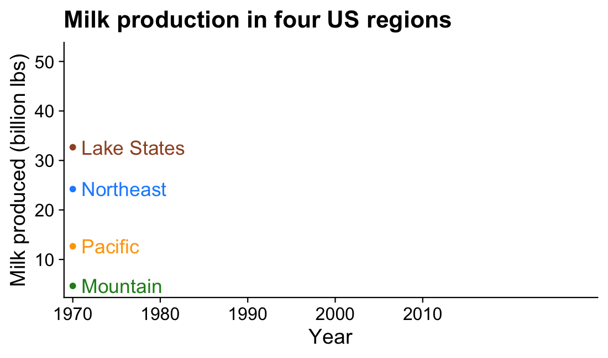
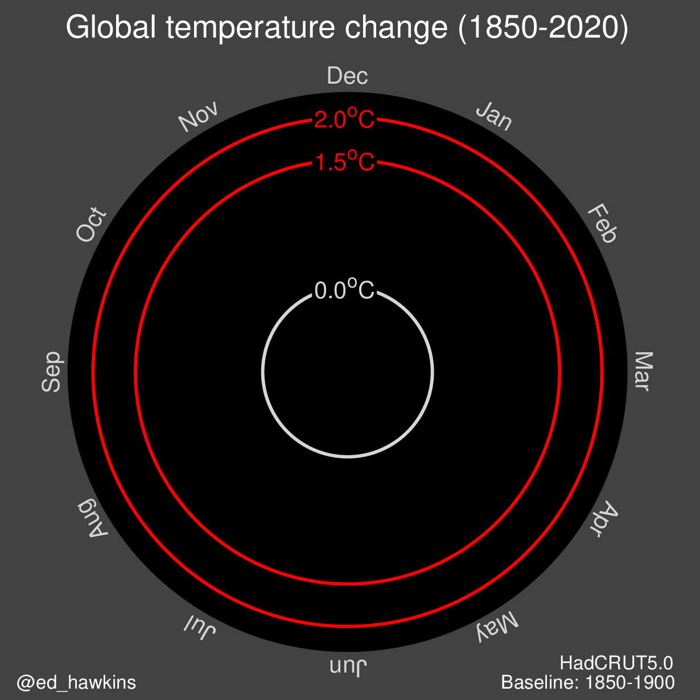
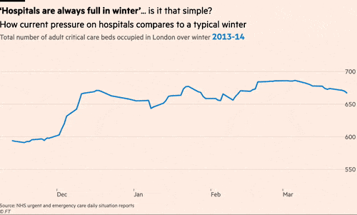
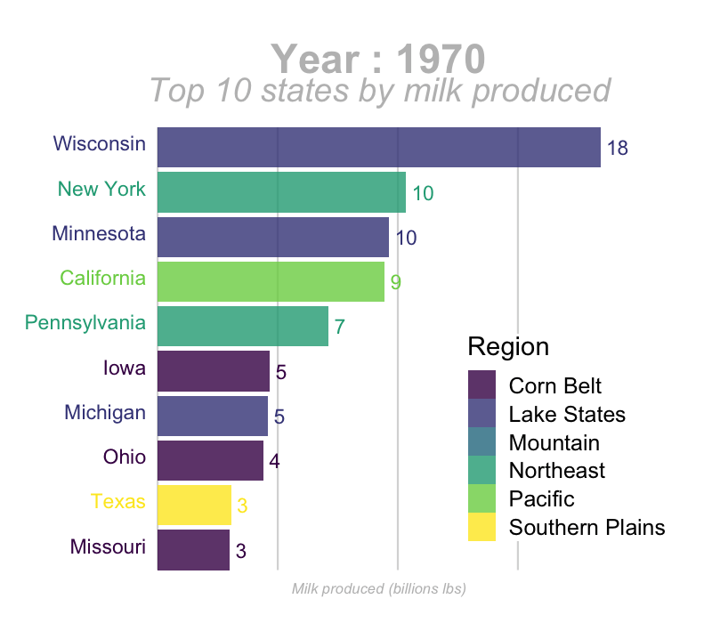
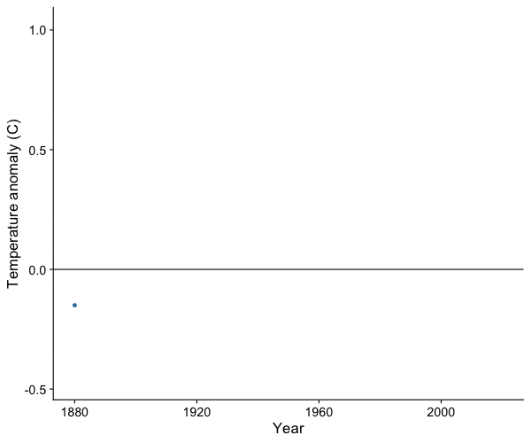
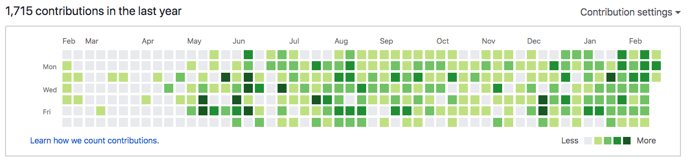
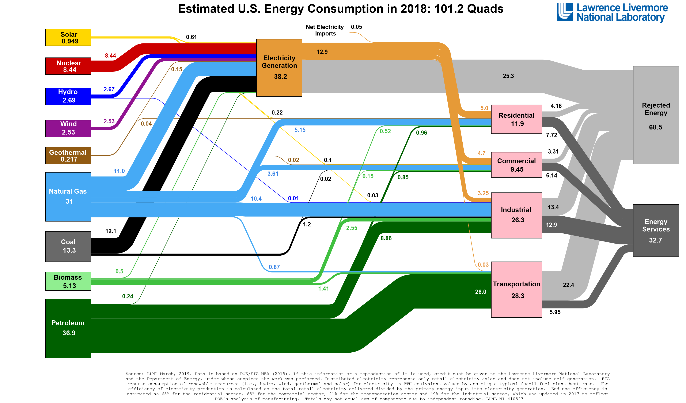
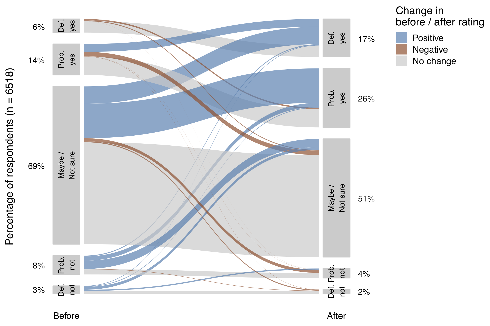

class: middle, inverse

```{r setup, echo=FALSE, message=FALSE, warning=FALSE}
library(knitr)
library(cowplot)
library(tidyverse)
library(viridis)
library(gganimate)
library(ggrepel)
library(here)
library(countdown)
library(metathis)

options(
    htmltools.dir.version = FALSE,
    knitr.table.format = "html",
    knitr.kable.NA = '',
    dplyr.width = Inf,
    width = 250
)

knitr::opts_chunk$set(
    cache = FALSE,
    warning = FALSE,
    message = FALSE,
    fig.path = "figs/",
    fig.width = 7.252,
    fig.height = 4,
    comment = "#>",
    fig.retina = 3
)

# Setup xaringanExtra options
xaringanExtra::use_tile_view()
xaringanExtra::use_panelset()
xaringanExtra::use_clipboard()
xaringanExtra::use_share_again()
xaringanExtra::style_share_again(share_buttons = "none")
xaringanExtra::use_extra_styles(
  hover_code_line = TRUE,
  mute_unhighlighted_code = FALSE
)

# Set up website metadata
meta() %>%
  meta_general(
    description = rmarkdown::metadata$subtitle,
    generator = "xaringan and remark.js"
  ) %>%
  meta_name("github-repo" = "emse-eda-gwu/2022-Fall") %>%
  meta_social(
    title = rmarkdown::metadata$title,
    url = "https://eda.seas.gwu.edu/2022-Fall/",
    og_type = "website",
    og_author = "John Paul Helveston",
    twitter_card_type = "summary_large_image",
    twitter_creator = "@johnhelveston"
  )

# Set main plot theme
theme_set(theme_cowplot(font_size = 20))

# Read in data
gapminder        <- read_csv(here::here('data', 'gapminder.csv'))
milk_production  <- read_csv(here::here('data', 'milk_production.csv'))
global_temps     <- read_csv(here::here('data', 'nasa_global_temps.csv'))
hotdogs          <- read_csv(here::here('data', 'hot_dog_winners.csv'))
internet_country <- read_csv(here::here('data', 'internet_users_country.csv'))
internet_region  <- read_csv(here::here('data', 'internet_users_region.csv'))
us_diseases      <- read_csv(here::here('data', 'us_contagious_diseases.csv'))
us_covid         <- read_csv(here::here('data', 'us_covid.csv'))

# Modify data
milk_production <- milk_production %>%
    mutate(
        milk_produced = milk_produced / 10^9,
        state = fct_reorder(state, milk_produced))

gapminder <- gapminder %>%
    mutate(year = as.integer(year))

# Make data subsets
milk_ca <- milk_production %>%
    filter(state == 'California')

milk_ca_sparse <- milk_ca %>%
    mutate(yearColor = ifelse(year %in% seq(1970, 2020, 10), 'one', 'two'))

milk_region <- milk_production %>%
    filter(region %in% c(
        'Pacific', 'Northeast', 'Lake States', 'Mountain')) %>%
    group_by(year, region) %>%
    summarise(milk_produced = sum(milk_produced)) %>%
    ungroup() %>%
    mutate(label = ifelse(year == max(year), region, NA))

milk_race <- milk_production %>%
    group_by(year) %>%
    mutate(
        rank = rank(-milk_produced),
        Value_rel = milk_produced / milk_produced[rank==1],
        Value_lbl = paste0(' ', round(milk_produced))) %>%
    group_by(state) %>%
    filter(rank <= 10) %>%
    ungroup() %>%
    mutate(year = as.integer(year))

hotdogs_mens <- hotdogs %>%
    filter(Competition == 'Mens') %>%
    rename(dogs = `Dogs eaten`,
           record = `New record`) %>%
    mutate(
        record = if_else(record == 1, 'Yes', 'No'),
        Winner = fct_other(Winner,
            keep = c('Joey Chestnut', 'Takeru Kobayashi')))

internet_country_summary <- internet_country %>%
    filter(country %in% c(
        'United States', 'China',
        'Singapore', 'Cuba')) %>%
    mutate(
        label = ifelse(year == max(year), country, NA))

internet_region_summary <- internet_region %>%
    mutate(
        numUsers = numUsers / 10^9,
        label    = ifelse(year == max(year), region, NA))

measles <- us_diseases %>%
  filter(
    disease == 'Measles',
    !state %in% c("Hawaii", "Alaska")) %>%
  mutate(
    rate = (count / population) * 10000,
    state = fct_reorder(state, rate)) %>%
  # Compute annual mean rate across all states
  group_by(year) %>% #<<
  mutate( #<<
    mean_rate = sum(count) / sum(population) * 10000) #<<

measles_ca <- measles %>%
    filter(state == "California")

measles_us <- measles %>%
    group_by(year) %>%
    summarize(rate = sum(count) / sum(population) * 10000)
```

.leftcol30[

<center>

</center>

]

.rightcol70[

# Week `r rmarkdown::metadata$week`: .fancy[`r rmarkdown::metadata$title`]

### `r fontawesome::fa(name = "building-columns", fill = "white")` `r rmarkdown::metadata$subtitle`
### `r fontawesome::fa(name = "user", fill = "white")` `r rmarkdown::metadata$author`
### `r fontawesome::fa(name = "calendar", fill = "white")` `r rmarkdown::metadata$date`

]

---

class: center, middle, inverse

# .fancy[.blue[Tip of the week]]

## Code outline in RStudio

---

## Today's data

Old:

```{r, eval=FALSE}
gapminder        <- read_csv(here::here('data', 'gapminder.csv'))
milk_production  <- read_csv(here::here('data', 'milk_production.csv'))
global_temps     <- read_csv(here::here('data', 'nasa_global_temps.csv'))
internet_region  <- read_csv(here::here('data', 'internet_users_region.csv'))
```

New:

```{r, eval=FALSE}
us_covid         <- read_csv(here::here('data', 'us_covid.csv'))
internet_country <- read_csv(here::here('data', 'internet_users_country.csv'))
hotdogs          <- read_csv(here::here('data', 'hot_dog_winners.csv'))
us_diseases      <- read_csv(here::here('data', 'us_contagious_diseases.csv'))
```

---

## New packages:

```{r, eval=FALSE}
install.packages('viridis')
install.packages('gganimate')
install.packages('magick')
```

---

```{r child="topics/0.Rmd"}
```

---

```{r child="topics/1.Rmd"}
```

---

.leftcol[

## Points

Plotting the data points is a good starting point for viewing trends

```{r milk_ca_point, echo=FALSE, fig.height=5, fig.width=6, fig.align='center'}
ggplot(milk_ca,
    aes(x = year, y = milk_produced)) +
    geom_point(color = 'steelblue', size = 2) +
    theme_half_open(font_size = 18) +
    labs(x = 'Year',
         y = 'Milk produced (billion lbs)',
         title = 'Milk production in California')
```

]

--

.rightcol[

## Points + line

Adding lines between the points helps<br>see the overall trend

```{r milk_ca_point_line, echo=FALSE, fig.height=5, fig.width=6, fig.align='center'}
ggplot(milk_ca,
    aes(x = year, y = milk_produced)) +
    geom_line(color = 'steelblue', size = 0.5) +
    geom_point(color = 'steelblue', size = 2) +
    theme_half_open(font_size = 18) +
    labs(x = 'Year',
         y = 'Milk produced (billion lbs)',
         title = 'Milk production in California')
```

]

---

.leftcol[

## Line

Omitting the points emphasizes the overall trend<br><br><br>

```{r milk_ca_line, echo=FALSE, fig.height=5, fig.width=6, fig.align='center'}
ggplot(milk_ca,
    aes(x = year, y = milk_produced)) +
    geom_line(color = 'steelblue', size = 1) +
    theme_half_open(font_size = 18) +
    labs(x = 'Year',
         y = 'Milk produced (billion lbs)',
         title = 'Milk production in California')
```

]

--

.rightcol[

## Line + area

Filling area below line emphasizes cumulative over time

(y-axis should start at 0)

```{r milk_ca_line_area, echo=FALSE, fig.height=5, fig.width=6, fig.align='center'}
ggplot(milk_ca,
    aes(x = year, y = milk_produced)) +
    geom_area(fill = 'steelblue', alpha = 0.5) +
    geom_line(color = 'steelblue', size = 1) +
    scale_y_continuous(
      expand = expansion(mult = c(0, 0.05))) +
    theme_half_open(font_size = 18) +
    labs(x = 'Year',
         y = 'Milk produced (billion lbs)',
         title = 'Milk production in California')
```

]

---

class: center, middle

### If points are too sparse, a line can be misleading

.leftcol[

```{r milk_ca_point_line_sparse1, echo=FALSE, fig.height=5, fig.width=6, fig.align='center'}
ggplot(milk_ca_sparse,
       aes(x = year, y = milk_produced)) +
    geom_line(color = 'steelblue', size = 0.5) +
    geom_point(aes(color = yearColor), size = 2) +
    scale_color_manual(values = c('red', 'steelblue')) +
    theme_half_open(font_size = 18) +
    theme(legend.position = 'none') +
    labs(x = 'Year',
         y = 'Milk produced (billion lbs)',
         title = 'Milk production in California')
```

]

.rightcol[

```{r milk_ca_point_line_sparse2, echo=FALSE, fig.height=5, fig.width=6, fig.align='center'}
milk_ca_sparse %>%
    filter(yearColor == 'one') %>%
    ggplot(aes(x = year, y = milk_produced)) +
    geom_line(color = 'steelblue', size = 0.5) +
    geom_point(color = 'red', size = 2) +
    theme_half_open(font_size = 18) +
    labs(x = 'Year',
         y = 'Milk produced (billion lbs)',
         title = 'Milk production in California')
```

]

---

.leftcol[

## Smoothed line

Adding a "smoothed" line shows a modeled representation of the overall trend

```{r milk_ca_smooth, echo=FALSE, fig.height=5, fig.width=6, fig.align='center'}
ggplot(milk_ca,
    aes(x = year, y = milk_produced)) +
    geom_smooth(color = 'steelblue', size = 1, se = FALSE) +
    theme_half_open(font_size = 18) +
    labs(x = 'Year',
         y = 'Milk produced (billion lbs)',
         title = 'Milk production in California')
```

]

--

.rightcol[

## Smoothed line + points

Putting the smoothed line over the data points helps show whether **outliers** are driving the trend line

```{r milk_ca_smooth_points, echo=FALSE, fig.height=5, fig.width=6, fig.align='center'}
ggplot(milk_ca,
    aes(x = year, y = milk_produced)) +
    geom_point(color = 'grey', size = 2, alpha = 0.9) +
    geom_smooth(color = 'steelblue', size = 1, se = FALSE) +
    theme_half_open(font_size = 18) +
    labs(x = 'Year',
         y = 'Milk produced (billion lbs)',
         title = 'Milk production in California')
```

]

---

class: center, middle

### Bars are useful when emphasizing the **data points**<br>rather than the **slope between them**

.leftcol[

```{r hotdog_bar_record, echo=FALSE, fig.height=5.5, fig.width=6.5, fig.align='center'}
ggplot(hotdogs_mens) +
    geom_col(
      aes(x = Year, y = dogs, fill = record),
      width = 0.8, alpha = 0.9) +
    scale_fill_manual(values = c("grey", "sienna")) +
    scale_y_continuous(
      expand = expansion(mult = c(0, 0.05))) +
    theme_minimal_hgrid() +
    theme(legend.position = c(0.1, 0.65)) +
    labs(x = 'Year',
         y = 'Number of hot dogs & buns\nin 10 minutes',
         fill = 'Record\nbroken?',
         title = "Record-breaking wins in Nathan's hot dog\neating competition, men's division")
```

]

--

.rightcol[

```{r hotdog_bar_winner, echo=FALSE, fig.height=5.5, fig.width=6.5, fig.align='center'}
ggplot(hotdogs_mens) +
    geom_col(
      aes(x = Year, y = dogs, fill = Winner),
      width = 0.8, alpha = 0.9) +
    scale_y_continuous(
      expand = expansion(mult = c(0, 0.05))) +
    theme_minimal_hgrid() +
    theme(legend.position = c(0.1, 0.65)) +
    labs(x = 'Year',
         y = 'Number of hot dogs & buns\nin 10 minutes',
         fill = 'Winner',
         title = "Winner of Nathan's hot dog eating competition,\nmen's division")
```

]

---

## How to: **Points + line**

.leftcol55[.code70[

Be sure to draw the line first,<br>then overlay the points
```{r, eval=FALSE}
ggplot(milk_ca,
    aes(x = year, y = milk_produced)) + #<<
    geom_line(color = 'steelblue', size = 0.5) + #<<
    geom_point(color = 'steelblue', size = 2) + #<<
    theme_half_open(font_size = 18) +
    labs(x = 'Year',
         y = 'Milk produced (billion lbs)',
         title = 'Milk production in California')
```

]]

.rightcol45[

```{r ref.label='milk_ca_point_line', echo=FALSE, fig.height=5, fig.width=6, fig.align='center'}
```

]

---

## How to: **Line + area**

.leftcol55[.code70[

Likewise, draw the area first then overlay the line
```{r, eval=FALSE}
ggplot(milk_ca,
    aes(x = year, y = milk_produced)) +
    geom_area(fill = 'steelblue', alpha = 0.5) + #<<
    geom_line(color = 'steelblue', size = 1) + #<<
    scale_y_continuous(
        expand = expansion(mult = c(0, 0.05))) +
    theme_half_open(font_size = 18) +
    labs(x = 'Year',
         y = 'Milk produced (billion lbs)',
         title = 'Milk production in California')
```

]]

.rightcol45[

```{r ref.label='milk_ca_line_area', echo=FALSE, fig.height=5, fig.width=6, fig.align='center'}
```

]

---

## How to: **Smoothed line + points**

.leftcol[.code70[

Use `alpha` to make points slightly transparent
```{r, eval=FALSE}
ggplot(milk_ca,
    aes(x = year, y = milk_produced)) +
    geom_point(color = 'grey', #<<
      size = 2, alpha = 0.9) + #<<
    geom_smooth(color = 'steelblue', #<<
      size = 1, se = FALSE) + #<<
    theme_half_open(font_size = 18) +
    labs(
      x = 'Year',
      y = 'Milk produced (billion lbs)',
      title = 'Milk production in California')
```

]]

.rightcol[

```{r ref.label='milk_ca_smooth_points', echo=FALSE, fig.height=5, fig.width=6, fig.align='center'}
```

]

---

class: inverse

```{r, echo=FALSE}
countdown(
  minutes = 20,
  warn_when = 30,
  update_every = 1,
  top = 0,
  right = 0,
  font_size = '2em'
)
```

## Your turn

.leftcol[

Use the `global_temps` data frame to explore ways to visualize the change in average global temperatures.

Consider using:

- points
- lines
- areas
- smoothed lines

]

.rightcol[

```{r}
global_temps <- read_csv(here::here(
  'data', 'nasa_global_temps.csv'))

head(global_temps)
```
]


---

```{r child="topics/2.Rmd"}
```

---

class: center, middle

### Animation adds emphasis to the **change over time**

--

### ...plus it's fun!

---

class: center

# Static chart

```{r ref.label='milk_region_line_label', echo=FALSE, fig.height=5, fig.width=7.5, fig.align='center', out.width="60%"}
```

---

class: center

# Animated chart

<center>

</center>

---

class: center

### Animation is particularly helpful for the **time dimension**

<center>

</center>

.left["Gapminder" visualization by Hans Rosling]

---

class: center

### Animation is particularly helpful for the **time dimension**

<center>

</center>

.left[Source: https://www.climate-lab-book.ac.uk/spirals/]

---

class: center

### Animation is particularly helpful for the **time dimension**

<center>

</center>

.left[Financial Times comparison of Flu seasons to COVID-19]

---

class: center

### Animation is particularly helpful for the **time dimension**

<center>

</center>

.left["Bar chart race" of top 10 milk producing states]

---

## How to: **Animate a line plot**

.leftcol[.code60[

Make a static plot w/labels for each year

```{r milk_region_anim_plot, fig.show='hide'}
milk_region_anim_plot <- milk_region %>%
  ggplot(
    aes(x = year, y = milk_produced,
        color = region)) +
  geom_line(size = 1) + #<<
  geom_point(size = 2) + #<<
  geom_text_repel( #<<
    aes(label = region), #<<
    hjust = 0, nudge_x = 1, direction = "y", #<<
    size = 6, segment.color = NA) + #<<
  scale_x_continuous(
    breaks = seq(1970, 2010, 10),
    expand = expansion(add = c(1, 13))) +
  scale_color_manual(values = c(
      'sienna', 'forestgreen', 'dodgerblue', 'orange')) +
  theme_half_open(font_size = 18) +
  theme(legend.position = 'none') +
  labs(x = 'Year',
       y = 'Milk produced (billion lbs)',
       title = 'Milk production in four US regions')

milk_region_anim_plot
```

]]

.rightcol[

```{r ref.label='milk_region_anim_plot', echo=FALSE, fig.height=4, fig.width=7, fig.align='center'}
```

]

---

## How to: **Animate a line plot**

.leftcol[.code60[

Now animate it

**Note the pause at the end!**

```{r, eval=FALSE}
library(gganimate) #<<

milk_region_anim <- milk_region_anim_plot +
    transition_reveal(year) #<<

# Render the animation
animate(milk_region_anim,  #<<
        end_pause = 15,  #<<
        duration = 10, #<<
        width = 1100, height = 650, res = 150, #<<
        renderer = magick_renderer()) #<<

# Save last animation
anim_save(here::here(
  'figs', 'milk_region_animation.gif'))
```

]]

.rightcol[

<center>

</center>

]

---

## How to: **Change label based on year**

.leftcol55[.code80[

First make a static plot

```{r gapminder_anim_plot, fig.show='hide'}
gapminder_anim_plot <- ggplot(gapminder,
  aes(x = gdpPercap, y = lifeExp, #<<
      size = pop, color = continent)) + #<<
  geom_point(alpha = 0.7) +
  scale_size_area( #<<
    guide = FALSE, max_size = 15) + #<<
  scale_color_brewer(palette = 'Set2') +
  scale_x_log10() +
  theme_bw(base_size = 18) +
  theme(legend.position = c(0.85, 0.3)) +
  labs(x = 'GDP per capita',
       y = 'Life expectancy',
       color = 'Continent')

gapminder_anim_plot
```

]]

.rightcol45[

```{r ref.label='gapminder_anim_plot', echo=FALSE, fig.height=6, fig.width=7, fig.align='center'}
```

]

---

## How to: **Change label based on year**

.leftcol[.code80[

Now animate it

**Note**: Year must be an integer!

```{r, eval=FALSE}
gapminder_anim <- gapminder_anim_plot +
  transition_time(year) + #<<
  labs(title = "Year: {frame_time}") #<<

# Render the animation
animate(gapminder_anim, end_pause = 10,
        width = 800, height = 600,
        res = 150,
        renderer = magick_renderer())
```

]]

.rightcol[

<center>

</center>

]

---

.leftcol[.code40[

```{r, eval=FALSE}
milk_race_anim <- milk_production %>%
    group_by(year) %>%
    mutate(
        rank = rank(-milk_produced),
        Value_rel = milk_produced / milk_produced[rank==1],
        Value_lbl = paste0(' ', round(milk_produced))) %>%
    group_by(state) %>%
    filter(rank <= 10) %>%
    ungroup() %>%
    mutate(year = as.integer(year)) %>%
    ggplot(aes(x = rank, group = state,
               fill = region, color = region)) +
    geom_tile(aes(y = milk_produced / 2, #<<
                  height = milk_produced), #<<
              width = 0.9, alpha = 0.8, color = NA) + #<<
    geom_text(aes(y = 0, label = paste(state, " ")),
              vjust = 0.2, hjust = 1) +
    geom_text(aes(y = milk_produced, label = Value_lbl),
              hjust = 0) +
    coord_flip(clip = 'off', expand = FALSE) +
    scale_y_continuous(labels = scales::comma) +
    scale_fill_viridis(discrete = TRUE) +
    scale_color_viridis(discrete = TRUE) +
    scale_x_reverse() +
    guides(color = FALSE) +
    theme_minimal_vgrid() +
    theme(
        axis.line = element_blank(),
        axis.text = element_blank(),
        axis.ticks = element_blank(),
        axis.title = element_blank(),
        legend.position = c(0.7, 0.3),
        legend.background = element_rect(fill = 'white'),
        plot.title = element_text(
          size = 22, hjust = 0.5, face = 'bold',
          colour = 'grey', vjust = -1),
        plot.subtitle = element_text(
          size = 18, hjust = 0.5,
          face = 'italic', color = 'grey'),
        plot.caption = element_text(
          size = 8, hjust = 0.5,
          face = 'italic', color = 'grey'),
          plot.margin = margin(0.5, 2, 0.5, 3, 'cm')) +
    transition_time(year) + #<<
    view_follow(fixed_x = TRUE) + #<<
    labs(title    = 'Year : {frame_time}',
         subtitle = 'Top 10 states by milk produced',
         fill     = 'Region',
         caption  = 'Milk produced (billions lbs)')
```

]]

.rightcol[

### .center[Making a bar chart race <br>[(tutorial here)](https://www.emilykuehler.com/portfolio/barchart-race/)]

.code60[
```{r, eval=FALSE}
animate(milk_race_anim, duration = 17, end_pause = 15,
        width = 800, height = 700, res = 150,
        renderer = magick_renderer())
```

]

<center>

</center>

]

---

# Resources

### More animation options:

- [More on gapminder + line charts](https://www.datanovia.com/en/blog/gganimate-how-to-create-plots-with-beautiful-animation-in-r/)
- [Customizing the animation](https://github.com/ropenscilabs/learngganimate/blob/2872425f08392f9f647005eb19a9d4afacd1ab44/animate.md)

---

class: inverse

```{r, echo=FALSE}
countdown(
  minutes = 20,
  warn_when = 30,
  update_every = 1,
  top = 0,
  right = 0,
  font_size = '2em'
)
```

## Your turn

.leftcol[

Use the `global_temps` data frame to explore ways to _animate_ the change in average global temperatures.

Consider using:

- points
- lines
- areas

]

.rightcol[

<center>

</center>

]

---

class: inverse, center

```{r, echo=FALSE}
countdown(
  minutes = 5,
  warn_when = 30,
  update_every = 1,
  left = 0, right = 0, top = 1, bottom = 0,
  margin = "5%",
  font_size = "8em"
)
```

# Break!

## Stand up, Move around, Stretch!

---

```{r child="topics/3.Rmd"}
```

---

class: center, middle

## With multiple categories,<br>points & lines can get messy

--

.leftcol[

```{r milk_region_dot, echo=FALSE, fig.height=5, fig.width=7.5, fig.align='center'}
ggplot(milk_region,
    aes(x = year, y = milk_produced,
        color = region)) +
    geom_point() +
    scale_color_manual(values = c(
        'sienna', 'forestgreen', 'dodgerblue', 'orange')) +
    theme_half_open(font_size = 18) +
    labs(x = 'Year',
         y = 'Milk produced (billion lbs)',
         color = 'Region',
         title = 'Milk production in four US regions')
```

]

--

.rightcol[

```{r milk_region_dot_line, echo=FALSE, fig.height=5, fig.width=7.5, fig.align='center'}
ggplot(milk_region,
    aes(x = year, y = milk_produced,
        color = region)) +
    geom_point() +
    geom_line() +
    scale_color_manual(values = c(
        'sienna', 'forestgreen', 'dodgerblue', 'orange')) +
    theme_half_open(font_size = 18) +
    labs(x = 'Year',
         y = 'Milk produced (billion lbs)',
         color = 'Region',
         title = 'Milk production in four US regions')
```

]

---

class: center, middle

.leftcol[

### **Better**: Lines alone makes distinguishing trends easier

```{r milk_region_line, echo=FALSE, fig.height=5, fig.width=7.5, fig.align='center'}
ggplot(milk_region,
    aes(x = year, y = milk_produced,
        color = region)) +
    geom_line(size = 1) +
    scale_color_manual(values = c(
        'sienna', 'forestgreen', 'dodgerblue', 'orange')) +
    theme_half_open(font_size = 18) +
    labs(x = 'Year',
         y = 'Milk produced (billion lbs)',
         color = 'Region',
         title = 'Milk production in four US regions')
```

]

--

.rightcol[

### **Even better**: Directly label<br>lines to remove legend

```{r milk_region_line_label, echo=FALSE, fig.height=5, fig.width=7.5, fig.align='center'}
ggplot(milk_region,
    aes(x = year, y = milk_produced,
        color = region)) +
    geom_line(size = 1) +
    geom_text_repel(
      data = milk_region %>%
        filter(year == max(year)),
      aes(label = region),
         hjust = 0, nudge_x = 1, direction = "y",
         size = 6, segment.color = NA) +
    scale_x_continuous(
      breaks = seq(1970, 2010, 10),
      expand = expansion(add = c(1, 13))) +
    scale_color_manual(values = c(
        'sienna', 'forestgreen', 'dodgerblue', 'orange')) +
    theme_half_open(font_size = 18) +
    theme(legend.position = 'none') +
    labs(x = 'Year',
         y = 'Milk produced (billion lbs)',
         title = 'Milk production in four US regions')
```

]

---

class: center, middle

### If goal is to communicate the **overall / total** trend,<br>consider a stacked area chart

--

.leftcol[

### Highlights **regional** trends

```{r internet_region_line_label, echo=FALSE, fig.height=5, fig.width=7.5, fig.align='center'}
ggplot(internet_region_summary,
    aes(x = year, y = numUsers,
        color = region)) +
    geom_line(size = 1) +
    geom_text_repel(
      data = internet_region_summary %>%
        filter(year == max(year)),
      aes(label = region),
         hjust = "outward", direction = "y",
         nudge_x = 0.3, size = 4.5) +
    scale_x_continuous(
      breaks = seq(1990, 2015, 5),
      expand = expansion(add = c(1, 14))) +
    theme_half_open(font_size = 18) +
    theme(legend.position = 'none') +
    labs(x = 'Year', y = NULL,
         title = 'Number of internet users (billions)')
```

]

--

.rightcol[

### Highlights **overall / total** trend

```{r internet_region_area, echo=FALSE, fig.height=5, fig.width=8, fig.align='center'}
internet_region %>%
  mutate(numUsers = numUsers / 10^9) %>%
  ggplot() +
  geom_area(aes(x = year, y = numUsers, #<<
        fill = region)) + #<<
  # Nice colors from "viridis" library:
  scale_fill_viridis(discrete = TRUE) +
  # Sort the legend into 3 rows
  guides(fill = guide_legend( #<<
    nrow = 3, byrow = FALSE)) + #<<
  theme_minimal_grid(font_size = 15) +
  theme(legend.position = 'bottom') +
  labs(x = 'Year', y = NULL, fill = 'Region',
       title = 'Number of internet users (billions)')
```

]

---

### If you have **lots** of categories:<br>**1) Plot all the data with the average highlighted**

--

.leftcol[

.center[Measles in **California**]

```{r measles_line_ca, echo=FALSE, fig.height=5, fig.width=6, fig.align='center'}
ggplot(measles_ca) +
    geom_line(aes(x = year, y = rate)) +
    geom_vline(
        xintercept = 1963, col = 'blue',
        linetype = 'dashed') +
    annotate(
        'text', x = 1964, y = 70, hjust = 0,
        label = 'Vaccine introduced in 1964',
        color = 'blue') +
    labs(y = 'Cases per 10,000 people') +
    theme_bw()
```

]

--

.rightcol[

.center[Measles in **all 50 states**]

```{r measles_line_us, echo=FALSE, fig.height=5, fig.width=6, fig.align='center'}
ggplot(measles) +
    geom_line(
        aes(x = year, y = rate, group = state),
        color = 'grey', alpha = 0.3) +
    geom_line(
        data = measles_us,
        aes(x = year, y = rate),
        size = 0.8) +
    geom_vline(
        xintercept = 1963, col = 'blue',
        linetype = 'dashed') +
    annotate(
        'text', x = 1945, y = 55, hjust = 0,
        label = 'US Mean') +
    annotate(
        'text', x = 1964, y = 150, hjust = 0,
        label = 'Vaccine introduced in 1964',
        color = 'blue') +
    labs(y = 'Cases per 10,000 people') +
    theme_bw()
```

]

---

### If you have **lots** of categories:<br>1) Plot all the data with the average highlighted<br>**2) Plot all the data with a heat map**

```{r measles_heat_map, echo=FALSE, fig.height=6, fig.width=8, out.width="55%", fig.align='center'}
ggplot(measles) +
    geom_tile(aes(x = year, y = state, fill = rate),
              color = 'grey80') +
    geom_vline(xintercept = 1963, col = 'blue') +
    annotate('text', x = 1964, y = 51, hjust = 0,
             label = 'Vaccine introduced in 1964',
             color = 'blue') +
    scale_x_continuous(expand = c(0, 0)) +
    scale_fill_viridis(option = 'inferno', direction = -1,
                       trans = 'sqrt') +
    guides(fill = guide_colorbar(title.position = 'top',
                                 reverse = TRUE)) +
    coord_cartesian(clip = 'off') +
    theme_minimal() +
    theme(panel.grid = element_blank(),
          legend.position = 'bottom',
          text = element_text(size = 10)) +
    labs(x = '', y = '',
         fill = 'Cases per 10,000 people',
         title = 'Measles in the U.S.')
```

---

## Heatmaps are great for multiple divisions of time

### My activity on Github:

<center>

</center>
<br>

--

###Check out this heat map on [Traffic fatalities](https://flowingdata.com/2017/04/27/traffic-fatalities-when-and-where/)

---

.leftcol55[.code60[

Make the basic line chart first

```{r, eval=FALSE}
# Format the data
milk_region <- milk_production %>%
  filter(region %in% c(
    'Pacific', 'Northeast', 'Lake States', 'Mountain')) %>%
  group_by(year, region) %>%
  summarise(milk_produced = sum(milk_produced)) %>%
  ungroup()

# Make the line chart
ggplot(milk_region,
  aes(x = year, y = milk_produced, #<<
      color = region)) + #<<
  geom_line(size = 1) + #<<
  scale_color_manual(values = c(
    'sienna', 'forestgreen', 'dodgerblue', 'orange')) +
  theme_half_open(font_size = 18) +
  labs(
    x     = 'Year',
    y     = 'Milk produced (billion lbs)',
    color = 'Region',
    title = 'Milk production in four US regions')
```

]]

.rightcol45[

## .center[How to:<br>**Directly label lines**]

<br>

```{r ref.label='milk_region_line', echo=FALSE, fig.height=5, fig.width=7, fig.align='center'}
```

]

---

.leftcol55[.code60[

```{r, eval=FALSE}
# Format the data
milk_region <- milk_production %>%
  filter(region %in% c(
    'Pacific', 'Northeast', 'Lake States', 'Mountain')) %>%
  group_by(year, region) %>%
  summarise(milk_produced = sum(milk_produced)) %>%
  ungroup()

# Make the line plot
ggplot(milk_region,
  aes(x = year, y = milk_produced,
      color = region)) +
  geom_line(size = 1) +
  # Add labels
  geom_text_repel( #<<
    data = milk_region %>%  #<<
      filter(year == max(year)), #<<
    aes(label = region), #<<
      hjust = 0, nudge_x = 1, direction = "y", #<<
      size = 6, segment.color = NA) + #<<
  # Create space for labels on right side
  scale_x_continuous( #<<
    breaks = seq(1970, 2010, 10), #<<
    expand = expansion(add = c(1, 13))) + #<<
  scale_color_manual(values = c(
    'sienna', 'forestgreen', 'dodgerblue', 'orange')) +
  theme_half_open(font_size = 18) +
  # Remove legend
  theme(legend.position = 'none') + #<<
  labs(x = 'Year',
       y = 'Milk produced (billion lbs)',
       title = 'Milk production in four US regions')
```

]]

.rightcol45[

## .center[How to:<br>**Directly label lines**]

<br>

```{r ref.label='milk_region_line_label', echo=FALSE, fig.height=5, fig.width=7.5, fig.align='center'}
```

]

---

## How to: **Stacked area**

.leftcol55[.code70[

```{r, eval=FALSE}
internet_region %>%
  mutate(numUsers = numUsers / 10^9) %>%
  ggplot() +
  geom_area(aes(x = year, y = numUsers, #<<
        fill = region)) + #<<
  # Nice colors from "viridis" library:
  scale_fill_viridis(discrete = TRUE) + #<<
  # Sort the legend into 3 rows
  guides(fill = guide_legend( #<<
    nrow = 3, byrow = FALSE)) + #<<
  theme_minimal_grid(font_size = 15) +
  theme(legend.position = 'bottom') +
  labs(
    x = 'Year',
    y = NULL,
    fill = 'Region',
    title = 'Number of internet users (billions)')
```

]]

.rightcol45[

```{r ref.label='internet_region_area', echo=FALSE, fig.height=5, fig.width=8, fig.align='center'}
```

]

---

.leftcol[.code60[

Format the data

```{r}
# Format the data
measles <- us_diseases %>%
  filter(
    disease == 'Measles',
    !state %in% c("Hawaii", "Alaska")) %>%
  mutate(
    rate = (count / population) * 10000,
    state = fct_reorder(state, rate)) %>%
  # Compute annual mean rate across all states
  group_by(year) %>% #<<
  mutate( #<<
    mean_rate = sum(count) / sum(population) * 10000) #<<
```

Make all the state lines in light grey color

```{r measles_states, fig.show='hide'}
ggplot(measles) +
    geom_line(aes(x = year, y = rate, group = state), #<<
              color = 'grey', alpha = 0.3) + #<<
    # Add reference line & label:
    geom_vline(xintercept = 1963, col = 'blue',
               linetype = 'dashed') +
    annotate('text', x = 1964, y = 150, hjust = 0,
             label = 'Vaccine introduced in 1964',
             color = 'blue') +
    theme_minimal_grid(font_size = 18) +
    labs(y = 'Cases per 10,000 people')
```

]]

.rightcol[

## How to:<br>**Average line overlay**

```{r ref.label='measles_states', echo=FALSE, fig.height=5, fig.width=6, fig.align='center'}
```

]

---

.leftcol55[.code70[

Now overlay the annual mean line

```{r, eval=FALSE}
ggplot(measles) +
  geom_line(
    aes(x = year, y = rate, group = state),
    color = 'grey', alpha = 0.3) +
  geom_line( #<<
    aes(x = year, y = mean_rate), size = 0.8) + #<<
  # Add US mean label
  annotate( #<<
    'text', x = 1945, y = 55, hjust = 0, #<<
    label = 'US Mean') + #<<
  # Add reference line & label
  geom_vline(xintercept = 1963, col = 'blue',
             linetype = 'dashed') +
  annotate('text', x = 1964, y = 150, hjust = 0,
           label = 'Vaccine introduced in 1964',
           color = 'blue') +
  theme_minimal_grid(font_size = 18) +
  labs(y = 'Cases per 10,000 people')
```

]]

.rightcol45[

## How to:<br>**Average line overlay**

```{r ref.label='measles_line_us', echo=FALSE, fig.height=5, fig.width=6, fig.align='center'}
```

]

---

.leftcol[.code70[

Create main grid with `geom_tile()`

```{r measles_grid, fig.show='hide'}
ggplot(measles) +
  geom_tile( #<<
    aes(x = year, y = state, fill = rate), #<<
    color = 'grey80') + #<<
  # Add reference line & label
  geom_vline(
    xintercept = 1963, col = 'blue') +
  annotate(
    'text', x = 1964, y = 50.5, hjust = 0,
    label = 'Vaccine introduced in 1964',
    color = 'blue')
```

]]

.rightcol[

## How to: **Heat map**

```{r ref.label='measles_grid', echo=FALSE, fig.height=8, fig.width=8, fig.align='center'}
```

]

---

.leftcol[.code60[

Adjust scales and adjust theme

```{r measles_heat_map_linear, fig.show='hide'}
ggplot(measles) +
  geom_tile(aes(x = year, y = state, fill = rate),
    color = 'grey80') +
  # Add reference line & label
  geom_vline(xintercept = 1963, col = 'blue') +
  annotate(
    'text', x = 1964, y = 50.5, hjust = 0,
    label = 'Vaccine introduced in 1964',
    color = 'blue') +
  # Adjust scales
  scale_x_continuous(expand = c(0, 0)) + #<<
  scale_fill_viridis( #<<
    option = 'inferno', direction = -1) + #<<
  # Adjust theme
  theme_minimal() + #<<
  theme( #<<
    panel.grid = element_blank(), #<<
    legend.position = 'bottom', #<<
    text = element_text(size = 10)) + #<<
  coord_cartesian(clip = 'off') + #<<
  labs(
    x = NULL, y = NULL,
    fill = 'Cases per 10,000 people',
    title = 'Measles')
```

]]

.rightcol[

#### .center[Color scale is linear in this chart]

```{r ref.label='measles_heat_map_linear', echo=FALSE, fig.height=7, fig.width=8, fig.align='center'}
```

]

---

.leftcol[.code60[

Adjust scales and adjust theme

```{r, eval=FALSE}
ggplot(measles) +
  geom_tile(aes(x = year, y = state, fill = rate),
    color = 'grey80') +
  # Add reference line & label
  geom_vline(xintercept = 1963, col = 'blue') +
  annotate(
    'text', x = 1964, y = 50.5, hjust = 0,
    label = 'Vaccine introduced in 1964',
    color = 'blue') +
  # Adjust scales
  scale_x_continuous(expand = c(0, 0)) +
  scale_fill_viridis(
    option = 'inferno', direction = -1,
    trans = 'sqrt') + #<<
  # Modify legend color bar
  guides(fill = guide_colorbar( #<<
      title.position = 'top', reverse = TRUE)) + #<<
  # Adjust theme
  theme_minimal() +
  theme(
    panel.grid = element_blank(),
    legend.position = 'bottom',
    text = element_text(size = 10)) +
  coord_cartesian(clip = 'off') +
  labs(
    x = NULL, y = NULL,
    fill = 'Cases per 10,000 people',
    title = 'Measles')
```

]]

.rightcol[

#### .center[Non-linear color scale<br>helps with large variations]

```{r ref.label='measles_heat_map', echo=FALSE, fig.height=7, fig.width=8, fig.align='center'}
```

]

---

class: inverse

```{r, echo=FALSE}
countdown(
  minutes = 20,
  warn_when = 30,
  update_every = 1,
  top = 0,
  right = 0,
  font_size = '2em'
)
```

## Your turn

.leftcol[

Use the `us_covid` data frame to explore ways to visualize the number of daily cases using:

1. A labeled line chart
2. A stacked area chart
3. A heat map

]

.rightcol[

```{r}
us_covid <- read_csv(here::here(
  'data', 'us_covid.csv'))

head(us_covid)
```

]

---

class: center, middle, inverse

# Two other examples for showing<br>change across mutliple categories

---

class: center

# Seasonal chart

<center>

</center>

.left[Source: http://r-statistics.co/Top50-Ggplot2-Visualizations-MasterList-R-Code.html#Seasonal%20Plot]

---

class: center

## Sankey chart

<center>

</center>

Source: https://flowcharts.llnl.gov/

---

class: middle

.center[Would you consider purchasing an electric car?]

<center>

</center>

.leftcol70[.font70[

Roberson, Laura A.  & Helveston, J.P. (2020) "Electric vehicle adoption: can short experiences lead to big change?," Environmental Research Letters. 15(0940c3).<br>Made using the [ggforce](https://www.data-imaginist.com/2019/the-ggforce-awakens-again/) package

]]
