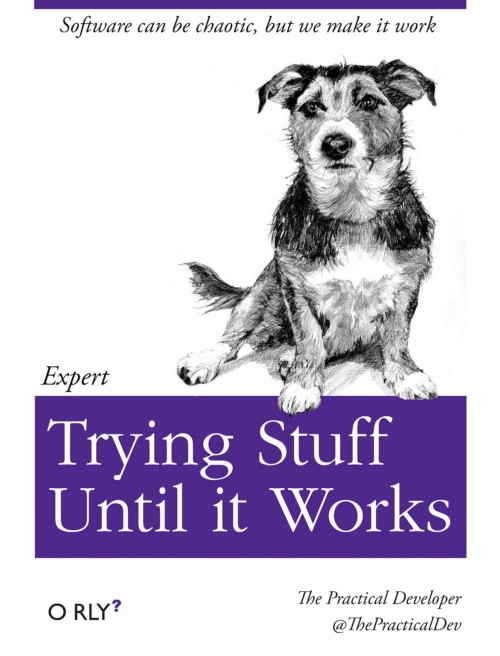
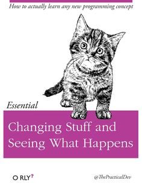

```{r child = "knitr_setup.Rmd"}
```

# Helpful Tutorials

- [RStudio Primers](https://rstudio.cloud/learn/primers)
- [Tidyverse in R](https://www.datacamp.com/community/tutorials/tidyverse-tutorial-r)
- [Transitioning from Excel to R](https://trendct.org/2015/06/12/r-for-beginners-how-to-transition-from-excel-to-r/)

# Inspiration

- [An Incomplete List of Females in Data Visualization](https://stephanieevergreen.com/females-in-dataviz/), by Stephanie Evergreen
- [The Links Between Open Science and Star Wars](https://medium.com/read-write-participate/open-science-and-star-wars-2577b8081e8f)

# Giving talks

You will all have to give a presentation at some point - make sure you start it right: ["How to start a speech"](https://www.youtube.com/watch?v=w82a1FT5o88)

# When all else fails...

You will inevitably run into problems; things won't work the way you expect, and you'll get lots of confusing error messages. When this happens, many turn to the following tried and true problem-solving approaches:

{ width=250 }
{ width=250 }
{ width=250 }
